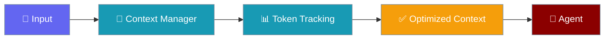

Context observability provides optimization history tracking, event logging, and debugging tools.




## Quick Start

<Steps>
<Step title="Basic Usage">
```python
from praisonaiagents import ContextManager

manager = ContextManager(model="gpt-4o-mini")

# Process messages (generates events)
result = manager.process(messages=messages)

# Get optimization history
history = manager.get_history()
for event in history:
    print(f"{event['event_type']}: {event['tokens_saved']} saved")
```
</Step>
</Steps>


## Optimization Events

| Event Type | Description |
|------------|-------------|
| `overflow_detected` | Context exceeded threshold |
| `auto_compact` | Auto-compaction triggered |
| `benefit_check` | Compression benefit evaluated |
| `revert` | Compression reverted (not beneficial) |
| `cap_outputs` | Tool outputs capped |
| `prune_tools` | Old tool outputs pruned |
| `sliding_window` | Sliding window applied |
| `summarize` | Messages summarized |
| `snapshot` | Context snapshot taken |

## OptimizationEvent

```python
@dataclass
class OptimizationEvent:
    timestamp: str              # ISO timestamp
    event_type: str             # Event type
    strategy: str               # Strategy used
    tokens_before: int          # Tokens before
    tokens_after: int           # Tokens after
    tokens_saved: int           # Tokens saved
    messages_affected: int      # Messages changed
    details: Dict[str, Any]     # Additional info
```

## History Tracking

```python
# Get all history
history = manager.get_history()

# Filter by event type
compactions = [e for e in history if e['event_type'] == 'auto_compact']

# Get total tokens saved
total_saved = sum(e['tokens_saved'] for e in history)
```

## CLI Commands

```bash
# Show optimization history
praisonai chat
> /context history

# Output:
# Time                     Event                Tokens       Saved
# ----------------------------------------------------------------------
# 2024-01-01T12:00:00      overflow_detected       45,000          -
# 2024-01-01T12:00:01      auto_compact           45,000     -15,000
# 2024-01-01T12:00:01      benefit_check          30,000          -
```

## Context Stats

```python
stats = manager.get_stats()

print(f"Model: {stats['model']}")
print(f"Utilization: {stats['utilization']*100:.1f}%")
print(f"History events: {stats['history_events']}")
print(f"Warnings: {stats['warnings']}")
```

## CLI Stats Commands

```bash
# Show summary
> /context show

# Show token ledger
> /context stats

# Show budget allocation
> /context budget
```

## Monitoring Integration

Events are included in monitor snapshots:

```python
config = ManagerConfig(
    monitor_enabled=True,
    monitor_format="json",
)

# JSON snapshots include:
# - optimization_history
# - estimation_metrics
# - warnings
```

## Debugging Tips

1. **Check history after issues** - See what optimizations ran
2. **Look for reverts** - Compression not beneficial
3. **Monitor utilization** - Track context growth
4. **Review warnings** - Early overflow indicators
## Best Practices

<AccordionGroup>
<Accordion title="Set budgets before overflowing">
Configure context budgets proactively — waiting until the context window fills causes silent truncation or errors.
</Accordion>
<Accordion title="Use compression for long sessions">
Enable context compression for conversations expected to exceed 50% of the model's context window.
</Accordion>
<Accordion title="Monitor token counts">
Use the context monitor during development to understand real usage before deploying to production.
</Accordion>
</AccordionGroup>

## Related

<CardGroup cols={2}>
<Card title="Context Monitor" icon="chart-line" href="/docs/features/context-monitor">
  Monitor context
</Card>
<Card title="Context Ledger" icon="book" href="/docs/features/context-ledger">
  Track context history
</Card>
</CardGroup>
