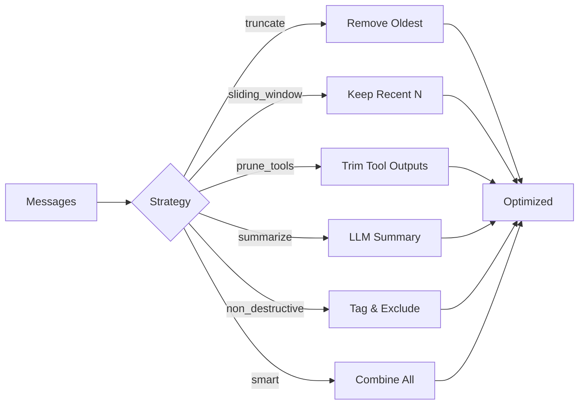

# Context Optimizer

The Context Optimizer provides multiple strategies for reducing context size when approaching model limits, preventing overflow errors and reducing costs.

## Optimization Strategies



## Quick Start

```python
from praisonaiagents.context import get_optimizer, OptimizerStrategy

# Get an optimizer
optimizer = get_optimizer(OptimizerStrategy.SMART)

# Optimize messages to target token count
messages = [...]  # Your conversation history
optimized, stats = optimizer.optimize(messages, target_tokens=50000)

print(f"Reduced from {len(messages)} to {len(optimized)} messages")
print(f"Saved {stats.tokens_saved} tokens")
```

## Strategy Reference

### Truncate

Removes oldest messages first, preserving system prompt and recent context.

```python
from praisonaiagents.context import TruncateOptimizer

optimizer = TruncateOptimizer()
result, stats = optimizer.optimize(messages, target_tokens=10000)
```

**Best for**: Simple cases where old context is not important.

### Sliding Window

Keeps the N most recent messages within a token window.

```python
from praisonaiagents.context import SlidingWindowOptimizer

optimizer = SlidingWindowOptimizer()
result, stats = optimizer.optimize(messages, target_tokens=10000)
```

**Best for**: Conversations where recent context matters most.

### Prune Tools

Truncates old tool outputs while preserving recent ones.

```python
from praisonaiagents.context import PruneToolsOptimizer

optimizer = PruneToolsOptimizer(
    protect_recent=5,  # Keep last 5 tool outputs intact
    max_output_tokens=500,  # Truncate older outputs to 500 tokens
)
result, stats = optimizer.optimize(messages, target_tokens=10000)
```

**Best for**: Tool-heavy conversations with large outputs.

### Summarize

Uses LLM to create a summary of older conversation.

```python
from praisonaiagents.context import SummarizeOptimizer

optimizer = SummarizeOptimizer(
    keep_recent=4,  # Keep last 4 turns intact
    model="gpt-4o-mini",
)
result, stats = optimizer.optimize(messages, target_tokens=10000)
```

**Best for**: Long conversations where context continuity matters.

### Non-Destructive

Tags messages for exclusion without deleting them (enables undo).

```python
from praisonaiagents.context import NonDestructiveOptimizer

optimizer = NonDestructiveOptimizer()
result, stats = optimizer.optimize(messages, target_tokens=10000)

# Messages are tagged with 'excluded': True
# Use get_effective_history() to filter
```

**Best for**: When you need to preserve full history for audit/undo.

### Smart (Recommended)

Combines all strategies intelligently based on content analysis.

```python
from praisonaiagents.context import SmartOptimizer

optimizer = SmartOptimizer()
result, stats = optimizer.optimize(messages, target_tokens=10000)
```

**Order of operations**:
1. Prune old tool outputs
2. Apply sliding window
3. Summarize if still over limit

## Factory Function

```python
from praisonaiagents.context import get_optimizer, OptimizerStrategy

# Available strategies
strategies = [
    OptimizerStrategy.TRUNCATE,
    OptimizerStrategy.SLIDING_WINDOW,
    OptimizerStrategy.PRUNE_TOOLS,
    OptimizerStrategy.SUMMARIZE,
    OptimizerStrategy.NON_DESTRUCTIVE,
    OptimizerStrategy.SMART,
]

for strategy in strategies:
    optimizer = get_optimizer(strategy)
    result, stats = optimizer.optimize(messages, target_tokens=10000)
    print(f"{strategy.value}: {len(result)} messages")
```

## Optimization Result

```python
from praisonaiagents.context import OptimizationResult

# stats returned from optimize()
stats: OptimizationResult
print(f"Original tokens: {stats.original_tokens}")
print(f"Optimized tokens: {stats.optimized_tokens}")
print(f"Tokens saved: {stats.tokens_saved}")
print(f"Strategy used: {stats.strategy_used}")
print(f"Messages removed: {stats.messages_removed}")
print(f"Tool outputs pruned: {stats.tool_outputs_pruned}")
```

## Tool Call Preservation

The optimizer preserves tool_call/tool_result pairs to maintain API validity:

```python
# These pairs are kept together or removed together
{"role": "assistant", "tool_calls": [{"id": "call_123", ...}]}
{"role": "tool", "tool_call_id": "call_123", "content": "..."}
```

## CLI Usage

```bash
# Set optimization strategy
praisonai chat --context-strategy smart

# Set trigger threshold
praisonai chat --context-threshold 0.8

# Manual optimization in session
/context compact
```

## Configuration

```yaml
# config.yaml
context:
  auto_compact: true
  compact_threshold: 0.8
  strategy: smart
```

## Next Steps

- [Context Monitor](/docs/features/context-monitor) - Watch optimization in action
- [Context Budgeter](/docs/features/context-budgeter) - Set up budgets
