# Context Management Overview

This page provides a comprehensive visual guide to how context management works in PraisonAI Agents.

## What Makes PraisonAI Context Management Best-in-Class

<CardGroup cols={3}>
  <Card title="Smart Defaults" icon="wand-magic-sparkles">
    Auto-enables when agents have tools. Zero overhead when not needed.
  </Card>
  <Card title="Lazy Loading" icon="feather">
    No performance impact until actually used. 0ms creation overhead.
  </Card>
  <Card title="Session Deduplication" icon="clone">
    Cross-agent duplicate detection in multi-agent workflows.
  </Card>
  <Card title="LLM Summarization" icon="brain">
    Intelligent compression using agent's own LLM for quality preservation.
  </Card>
  <Card title="Per-Tool Limits" icon="sliders">
    Fine-grained control over individual tool output sizes.
  </Card>
  <Card title="6 Strategies" icon="gears">
    Truncate, Sliding Window, Prune Tools, Summarize, Smart, Non-Destructive.
  </Card>
  <Card title="Comprehensive Monitoring" icon="chart-line">
    Snapshots, analytics dashboard, and replay capabilities.
  </Card>
</CardGroup>

<Tip>
**Zero Performance Impact**: Context management uses lazy loading throughout. Setting `context=True` adds only 1 boolean assignment at creation time (0ms). The ContextManager is only instantiated when `.context_manager` is first accessed.
</Tip>

### Feature Comparison

| Feature | PraisonAI | LangChain | CrewAI | Agno |
|---------|:---------:|:---------:|:------:|:----:|
| Smart Defaults | ✅ | ❌ | ❌ | ❌ |
| Lazy Loading (0ms overhead) | ✅ | ❌ | ❌ | ❌ |
| Session Deduplication | ✅ | ❌ | ❌ | ⚠️ |
| LLM Summarization | ✅ | ⚠️ | ❌ | ❌ |
| Per-Tool Limits | ✅ | ❌ | ❌ | ❌ |
| 6 Compaction Strategies | ✅ | ❌ | ❌ | ❌ |
| Benefit Checking | ✅ | ❌ | ❌ | ❌ |
| Auto-Compaction | ✅ | ❌ | ❌ | ❌ |
| Snapshot Replay | ✅ | ❌ | ❌ | ❌ |
| Multi-Memory Aggregation | ✅ | ❌ | ✅ | ❌ |

---

## Architecture


## Multi-Agent Context Flow


## Terminology Reference

### Core Concepts

| Term | Definition | Default |
|------|------------|---------|
| **Context Window** | Maximum tokens an LLM can process in one request | Model-specific (128K for GPT-4o) |
| **Token Budget** | Allocated tokens for each context segment | Auto-calculated |
| **Compact Threshold** | Usage % that triggers optimization | 80% |
| **Output Reserve** | Tokens reserved for LLM response | 8000-16000 |

### Optimization Strategies

| Strategy | How It Works | Best For |
|----------|--------------|----------|
| **Truncate** | Removes oldest messages first | Simple chatbots |
| **Sliding Window** | Keeps N most recent messages | Long conversations |
| **Prune Tools** | Truncates old tool outputs | Tool-heavy agents |
| **Summarize** | Replaces old messages with summary | Critical context |
| **Smart** | Combines all strategies intelligently | Production use |

### Token Segments


## Defaults Reference

### ContextConfig Defaults

```python
ContextConfig(
    auto_compact=True,           # Auto-optimize when threshold reached
    compact_threshold=0.8,       # Trigger at 80% usage
    strategy="smart",            # Use smart optimization
    output_reserve=8000,         # Reserve for LLM response
    history_ratio=0.6,           # 60% of usable for history
    tool_output_max=10000,       # Max tokens per tool output
    prune_after_tokens=40000,    # Start pruning after 40K
    keep_recent_turns=5,         # Keep last 5 turns intact
    tool_limits={},              # Per-tool output limits
)
```

### Per-Tool Limits

Configure different limits for different tools:

```yaml
context:
  auto_compact: true
  tool_limits:
    tavily_search: 2000      # Search results: 2000 chars
    tavily_extract: 5000     # Full page: 5000 chars
    code_executor: 10000     # Code output: 10000 chars
```

## Overflow Handling


| Level | Usage | Action |
|-------|-------|--------|
| Normal | < 70% | No action |
| Warning | 70-80% | Monitor |
| Critical | 80-90% | Auto-compact triggers |
| Emergency | 90-95% | Aggressive optimization |
| Overflow | > 95% | Emergency truncation |

## Session Deduplication

Prevents duplicate content across agents in multi-agent workflows:

```mermaid
flowchart LR
    subgraph Agent1["Agent 1"]
        C1["Content A"]
    end
    
    subgraph Cache["Session Cache"]
        H1["Hash A ✓"]
        H2["Hash B ✓"]
    end
    
    subgraph Agent2["Agent 2"]
        C2["Content A (skip)"]
        C3["Content B"]
    end
    
    subgraph Agent3["Agent 3"]
        C4["Content A (skip)"]
        C5["Content B (skip)"]
        C6["Content C"]
    end
    
    C1 --> H1
    C3 --> H2
    C2 -.->|"Duplicate"| H1
    C4 -.->|"Duplicate"| H1
    C5 -.->|"Duplicate"| H2
```



## CLI Commands

### Analytics Dashboard

```bash
# View analytics for recent sessions
praisonai replay dashboard

# Analyze specific session
praisonai replay dashboard <session_id>

# JSON output
praisonai replay dashboard --json
```

### Session Statistics

```bash
# View session stats
praisonai replay context <session_id> --stats
```

Output:
```
TOKEN USAGE BY AGENT:
  deep_researcher      ██████████████████████████████    956,146 (75.5%)
  content_writer       ███                               113,023 (8.9%)

CONTEXT EFFICIENCY:
  ⚠️  Duplicates Found:  236
  ⚠️  Wasted Tokens:     135,279 (10.7%)
```

## Smart Default Context

**New in v1.0**: Context management is now **automatically enabled** when your agent has tools:

```python
from praisonaiagents import Agent

# Context auto-enabled because tools are present
agent = Agent(
    instructions="You are helpful",
    tools=[my_search_tool]  # context=True automatically
)

# No tools = no context overhead
simple_agent = Agent(
    instructions="You are helpful"
    # context=None (disabled, zero overhead)
)

# Explicitly disable even with tools
agent = Agent(
    instructions="You are helpful",
    tools=[my_search_tool],
    context=False  # Override smart default
)
```

## Quick Start Examples

<CodeGroup>
```python Enable Context
from praisonaiagents import Agent

agent = Agent(
    instructions="You are helpful",
    context=True  # Enable with defaults (or auto-enabled with tools)
)
```

```python Custom Config
from praisonaiagents import Agent, ManagerConfig

agent = Agent(
    instructions="You are helpful",
    context=ManagerConfig(
        auto_compact=True,
        compact_threshold=0.7,
        strategy="smart",
        tool_limits={"tavily_search": 2000}
    )
)
```

```yaml YAML Config
context:
  auto_compact: true
  compact_threshold: 0.7
  strategy: smart
  tool_limits:
    tavily_search: 2000
    tavily_extract: 5000
```
</CodeGroup>

## Process Flow Diagrams

### Sequential Process Flow

How context flows through agents in sequential execution:


### Hierarchical Process Flow

How context flows in manager-worker hierarchies:


### Workflow Process Flow

How context flows through workflow steps:


## Optimization Strategy Diagrams

### Truncate Strategy


### Sliding Window Strategy


### Prune Tools Strategy

```mermaid
flowchart TB
    subgraph Before["Before Pruning"]
        T1["Tool Output 1<br/>50K tokens"] 
        T2["Tool Output 2<br/>30K tokens"]
        T3["Tool Output 3<br/>20K tokens"]
    end
    
    Before --> PRUNE[Truncate to Limit]
    
    subgraph After["After Pruning"]
        T1A["Tool Output 1<br/>10K tokens ✂️"]
        T2A["Tool Output 2<br/>10K tokens ✂️"]
        T3A["Tool Output 3<br/>10K tokens ✂️"]
    end
    
    PRUNE --> After
    
    style T1 fill:#ff6b6b
    style T2 fill:#ffa94d
    style T3 fill:#51cf66
    style T1A fill:#51cf66
    style T2A fill:#51cf66
    style T3A fill:#51cf66
```



### Summarize Strategy


### Smart Strategy (Combined)


## Context Overflow Handling

### What Happens When Context Exceeds Limits


### Tool Output Overflow Handling


## LLM Summarization

Enable intelligent summarization using the agent's LLM:

```python
from praisonaiagents import Agent, ContextConfig

agent = Agent(
    instructions="You are helpful",
    context=ContextConfig(
        auto_compact=True,
        llm_summarize=True,  # Enable LLM-powered summarization
        strategy="smart"
    )
)
```

When `llm_summarize=True`:
- Old messages are summarized by the LLM instead of truncated
- Key facts, decisions, and context are preserved
- More intelligent compression than simple truncation

## Related Pages

- [Context Strategies](/features/context-strategies) - Detailed strategy reference
- [Context Budgeter](/features/context-budgeter) - Token budgeting
- [Context Optimizer](/features/context-optimizer) - Optimization details
- [Context Replay](/features/replay) - Debugging and analysis
