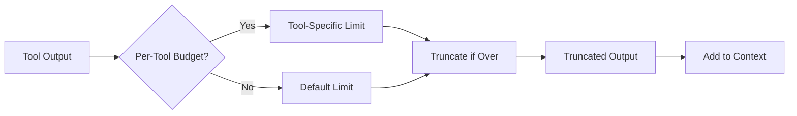
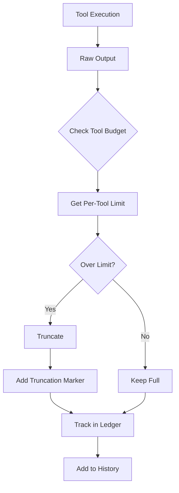

Per-tool budgets allow setting different token limits for each tool, enabling fine-grained control over tool output sizes.

## Quick Start

```python
from praisonaiagents import ContextManager

manager = ContextManager(model="gpt-4o-mini")

# Set per-tool budgets
manager.set_tool_budget("file_read", max_tokens=5000, protected=True)
manager.set_tool_budget("web_search", max_tokens=2000)
manager.set_tool_budget("code_execute", max_tokens=10000)

# Truncate output according to budget
output = manager.truncate_tool_output("file_read", large_file_content)
```

## Architecture



## Configuration

### Via ManagerConfig

```python
from praisonaiagents import ManagerConfig, PerToolBudget

config = ManagerConfig(
    default_tool_output_max=10000,  # Default for all tools
    tool_budgets={
        "file_read": PerToolBudget(
            tool_name="file_read",
            max_output_tokens=5000,
            protected=True,
        ),
        "web_search": PerToolBudget(
            tool_name="web_search",
            max_output_tokens=2000,
            protected=False,
        ),
    },
    protected_tools=["file_read"],  # Won't be pruned
)
```

### Via Environment

```bash
export PRAISONAI_CONTEXT_TOOL_OUTPUT_MAX=10000
```

## PerToolBudget

```python
@dataclass
class PerToolBudget:
    tool_name: str           # Tool identifier
    max_output_tokens: int   # Token limit for output
    protected: bool          # If True, won't be pruned
```

## Methods

### set_tool_budget()

```python
manager.set_tool_budget(
    tool_name="file_read",
    max_tokens=5000,
    protected=True,  # Won't be pruned during optimization
)
```

### get_tool_budget()

```python
budget = manager.get_tool_budget("file_read")  # 5000
budget = manager.get_tool_budget("unknown")    # default_tool_output_max
```

### truncate_tool_output()

```python
# Automatically truncates to tool's budget
truncated = manager.truncate_tool_output("file_read", large_output)

# Adds truncation marker
# "...[output truncated]..."
```

## Protected Tools

Protected tools are not pruned during optimization:

```python
# Set as protected
manager.set_tool_budget("critical_tool", max_tokens=5000, protected=True)

# Or via config
config = ManagerConfig(
    protected_tools=["critical_tool", "another_tool"],
)
```

## Integration with Composer

The composer uses per-tool budgets during context composition:

```python
from praisonaiagents import ContextComposer

composer = ContextComposer(
    budget=budget_allocation,
    tool_budgets={
        "file_read": 5000,
        "web_search": 2000,
    },
)

result = composer.compose(
    system_prompt=system,
    history=messages,
    tools=tool_schemas,
)
```

## Tool Output Pipeline



## CLI Usage

```bash
# View tool budgets in config
praisonai chat
> /context config

# Shows:
# Budget:
#   default_tool_max:       10,000
#   tool_budgets:
#     file_read: 5,000 (protected)
#     web_search: 2,000
```

## Best Practices

1. **Set lower limits for verbose tools** - Web search, file reads
2. **Higher limits for code execution** - Need full output
3. **Protect critical tools** - Don't prune important outputs
4. **Monitor tool output usage** - Check ledger stats
