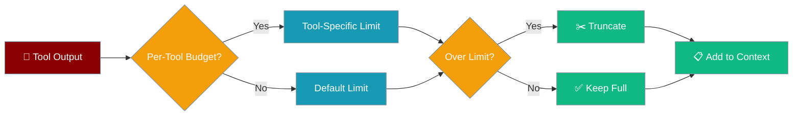
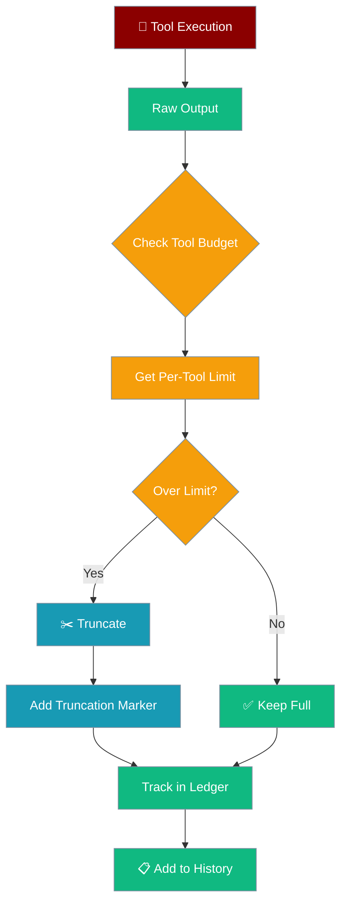

Per-tool budgets let you set different token limits for each tool, giving you fine-grained control over how much output each tool contributes to context.


```mermaid
graph LR
    A[🔧 Tool Output] --> B{Per-Tool Budget?}
    B -->|Yes| C[Tool-Specific Limit]
    B -->|No| D[Default Limit]
    C --> E{Over Limit?}
    D --> E
    E -->|Yes| F[✂️ Truncate]
    E -->|No| G[✅ Keep Full]
    F --> H[📋 Add to Context]
    G --> H

    classDef tool fill:#8B0000,stroke:#7C90A0,color:#fff
    classDef check fill:#F59E0B,stroke:#7C90A0,color:#fff
    classDef limit fill:#189AB4,stroke:#7C90A0,color:#fff
    classDef ok fill:#10B981,stroke:#7C90A0,color:#fff

    class A tool
    class B,E check
    class C,D limit
    class F,G,H ok
```

## Quick Start

<Steps>
<Step title="Set per-tool budgets">

```python
from praisonaiagents import ContextManager

manager = ContextManager(model="gpt-4o-mini")

manager.set_tool_budget("file_read", max_tokens=5000, protected=True)
manager.set_tool_budget("web_search", max_tokens=2000)
manager.set_tool_budget("code_execute", max_tokens=10000)

output = manager.truncate_tool_output("file_read", large_file_content)
```

</Step>

<Step title="With ManagerConfig">

```python
from praisonaiagents import ManagerConfig, PerToolBudget

config = ManagerConfig(
    default_tool_output_max=10000,
    tool_budgets={
        "file_read": PerToolBudget(
            tool_name="file_read",
            max_output_tokens=5000,
            protected=True,
        ),
        "web_search": PerToolBudget(
            tool_name="web_search",
            max_output_tokens=2000,
            protected=False,
        ),
    },
    protected_tools=["file_read"],
)
```

</Step>

<Step title="Via environment variable">

```bash
export PRAISONAI_CONTEXT_TOOL_OUTPUT_MAX=10000
```

</Step>
</Steps>

---

## How It Works


```mermaid
graph TD
    A[🔧 Tool Execution] --> B[Raw Output]
    B --> C{Check Tool Budget}
    C --> D[Get Per-Tool Limit]
    D --> E{Over Limit?}
    E -->|Yes| F[✂️ Truncate]
    E -->|No| G[✅ Keep Full]
    F --> H[Add Truncation Marker]
    H --> I[Track in Ledger]
    G --> I
    I --> J[📋 Add to History]

    classDef tool fill:#8B0000,stroke:#7C90A0,color:#fff
    classDef check fill:#F59E0B,stroke:#7C90A0,color:#fff
    classDef action fill:#189AB4,stroke:#7C90A0,color:#fff
    classDef ok fill:#10B981,stroke:#7C90A0,color:#fff

    class A tool
    class C,D,E check
    class F,H action
    class B,G,I,J ok
```

---

## Configuration

### PerToolBudget

```python
@dataclass
class PerToolBudget:
    tool_name: str           # Tool identifier
    max_output_tokens: int   # Token limit for output
    protected: bool          # If True, won't be pruned
```

| Option | Type | Default | Description |
|---|---|---|---|
| `tool_name` | `str` | required | Tool identifier |
| `max_output_tokens` | `int` | required | Max tokens for this tool's output |
| `protected` | `bool` | `False` | If True, won't be pruned during optimization |
| `default_tool_output_max` | `int` | `10000` | Fallback limit for unlisted tools |

---

## Common Patterns

**Set lower limits for verbose tools** — web search and file reads can be noisy; cap them at 2,000–5,000 tokens.

**Protect critical tools** — mark `protected=True` on tools whose output must never be dropped.

**Pair with Tool Output Store** — truncated outputs are automatically persisted to disk so the agent can retrieve them later.

<Note>
Truncated outputs are also persisted to disk so the agent can retrieve them — see [Tool Output Store](/docs/features/tool-output-store).
</Note>

---

## Methods

### set_tool_budget()

```python
manager.set_tool_budget(
    tool_name="file_read",
    max_tokens=5000,
    protected=True,
)
```

### get_tool_budget()

```python
budget = manager.get_tool_budget("file_read")  # 5000
budget = manager.get_tool_budget("unknown")    # default_tool_output_max
```

### truncate_tool_output()

```python
truncated = manager.truncate_tool_output("file_read", large_output)
```

---

## Integration with Composer

```python
from praisonaiagents import ContextComposer

composer = ContextComposer(
    budget=budget_allocation,
    tool_budgets={
        "file_read": 5000,
        "web_search": 2000,
    },
)

result = composer.compose(
    system_prompt=system,
    history=messages,
    tools=tool_schemas,
)
```

---

## Best Practices

<AccordionGroup>
<Accordion title="Set lower limits for verbose tools">
Web search and file reads produce large outputs. Cap them at 2,000–5,000 tokens to avoid consuming the entire context budget.
</Accordion>

<Accordion title="Use higher limits for code execution">
Code execution output often needs to be read in full to debug errors. Set limits of 10,000+ tokens for these tools.
</Accordion>

<Accordion title="Protect critical tools">
Mark tools as `protected=True` so their outputs are never pruned during context optimization, even under memory pressure.
</Accordion>

<Accordion title="Monitor tool output usage">
Check the context ledger stats to see which tools are consuming the most tokens and adjust budgets accordingly.
</Accordion>
</AccordionGroup>

---

## Related

<CardGroup cols={2}>
<Card title="Tool Output Store" icon="database" href="/docs/features/tool-output-store">
  Persist truncated tool outputs to disk for later retrieval
</Card>
<Card title="Context Window Management" icon="window-maximize" href="/docs/features/context-window-management">
  Overflow and compaction strategies
</Card>
<Card title="Context Management" icon="layer-group" href="/docs/features/context-management">
  Agent context lifecycle
</Card>
</CardGroup>
