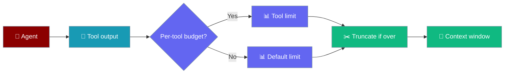
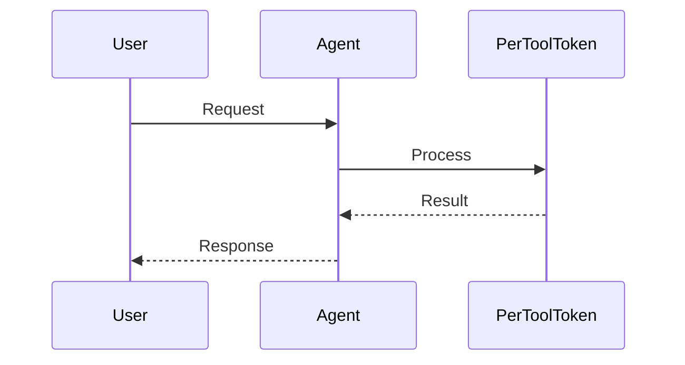
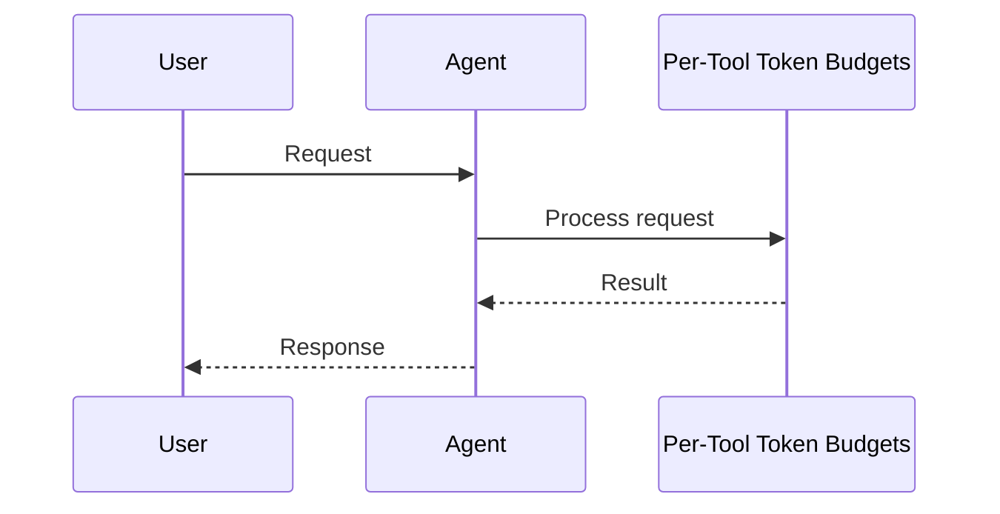
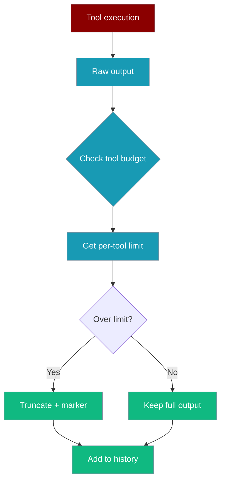

```python
from praisonaiagents import Agent

agent = Agent(
    name="budgeted-agent",
    instructions="Use tools without flooding context.",
)
agent.start("Search the web and keep only the most relevant snippets.")
```

Per-tool budgets cap how much of each tool's output enters agent context — noisy tools get tighter limits, critical tools stay protected.

The user caps noisy tool output; per-tool budgets truncate oversized results before they fill the context window.



```mermaid
graph LR
    Agent[🤖 Agent] --> Tool[🔧 Tool output]
    Tool --> Budget{Per-tool budget?}
    Budget -->|Yes| Limit[📊 Tool limit]
    Budget -->|No| Default[📊 Default limit]
    Limit --> Trunc[✂️ Truncate if over]
    Default --> Trunc
    Trunc --> Context[💬 Context window]

    classDef agent fill:#8B0000,stroke:#7C90A0,color:#fff
    classDef tool fill:#189AB4,stroke:#7C90A0,color:#fff
    classDef config fill:#6366F1,stroke:#7C90A0,color:#fff
    classDef ok fill:#10B981,stroke:#7C90A0,color:#fff

    classDef agent fill:#8B0000,color:#fff
    classDef tool fill:#189AB4,color:#fff
    class Agent agent
    class Tool tool
    class Budget,Limit,Default config
    class Trunc,Context ok
```

## How It Works


```mermaid
sequenceDiagram
    participant User
    participant Agent
    participant PerToolToken

    User->>Agent: Request
    Agent->>PerToolToken: Process
    PerToolToken-->>Agent: Result
    Agent-->>User: Response
```


## Quick Start

<Steps>
  <Step title="Enable context on the agent">
    ```python
    from praisonaiagents import Agent, ManagerConfig

    agent = Agent(
        name="researcher",
        instructions="Research topics efficiently",
        context=ManagerConfig(default_tool_output_max=10000),
    )
    ```
  </Step>
  <Step title="Set per-tool budgets">
    ```python
    agent.context_manager.set_tool_budget("web_search", max_tokens=2000)
    agent.context_manager.set_tool_budget("file_read", max_tokens=5000, protected=True)
    agent.context_manager.set_tool_budget("code_execute", max_tokens=10000)

    agent.start("Summarise the latest WebAssembly news")
    ```
  </Step>
  <Step title="Truncate output manually">
    ```python
    truncated = agent.context_manager.truncate_tool_output(
        "file_read", large_file_content
    )
    # Appends "...[output truncated]..." when over budget
    ```
  </Step>
</Steps>

## How It Works


```mermaid
sequenceDiagram
    participant User
    participant Agent
    participant Feature as Per-Tool Token Budgets

    User->>Agent: Request
    Agent->>Feature: Process request
    Feature-->>Agent: Result
    Agent-->>User: Response
```



```mermaid
graph TD
    A[Tool execution] --> B[Raw output]
    B --> C{Check tool budget}
    C --> D[Get per-tool limit]
    D --> E{Over limit?}
    E -->|Yes| F[Truncate + marker]
    E -->|No| G[Keep full output]
    F --> H[Add to history]
    G --> H

    classDef agent fill:#8B0000,stroke:#7C90A0,color:#fff
    classDef tool fill:#189AB4,stroke:#7C90A0,color:#fff
    classDef ok fill:#10B981,stroke:#7C90A0,color:#fff

    class A agent
    class B,C,D tool
    class F,G,H ok
```

Each tool call checks `get_tool_budget(tool_name)` — falling back to `default_tool_output_max` when no per-tool rule exists. Protected tools skip pruning during context optimisation.

## Configuration

### Via ManagerConfig

```python
from praisonaiagents import Agent, ManagerConfig

agent = Agent(
    name="researcher",
    context=ManagerConfig(
        default_tool_output_max=10000,
        protected_tools=["file_read"],
    ),
)
agent.context_manager.set_tool_budget("web_search", max_tokens=2000)
```

### Via environment

```bash
export PRAISONAI_CONTEXT_TOOL_OUTPUT_MAX=10000
```

## Methods

| Method | Purpose |
|--------|---------|
| `set_tool_budget(name, max_tokens, protected=False)` | Set limit for one tool |
| `get_tool_budget(name)` | Read limit (falls back to default) |
| `truncate_tool_output(name, output)` | Truncate to the tool's budget |

<Note>
Truncated outputs are persisted to disk so the agent can retrieve them — see [Tool Output Store](/docs/features/tool-output-store).
</Note>

## CLI Usage

```bash
praisonai chat
> /context config

# Shows:
#   default_tool_max:       10,000
#   tool_budgets:
#     file_read: 5,000 (protected)
#     web_search: 2,000
```

## Best Practices

<AccordionGroup>
  <Accordion title="Set lower limits for verbose tools">
    Web search and file reads return large payloads — cap them at 2,000–5,000 tokens so they do not crowd out conversation history.
  </Accordion>

  <Accordion title="Give code execution higher limits">
    Code tools often need full stack traces or build logs — 10,000+ tokens prevents losing error context mid-debug.
  </Accordion>

  <Accordion title="Mark critical tools as protected">
    `protected=True` keeps a tool's output from being pruned during context optimisation, even when the window is tight.
  </Accordion>

  <Accordion title="Monitor usage via the ledger">
    Run `/context` in chat or call `get_stats()` on the context manager to see which tools consume the most tokens.
  </Accordion>
</AccordionGroup>

## Related

<CardGroup cols={2}>
  <Card icon="layer-group" href="/docs/features/context-manager-module" title="Context Manager">
    Unified facade for budgeting, compaction, and monitoring.
  </Card>
  <Card icon="database" href="/docs/features/tool-output-store" title="Tool Output Store">
    Retrieve full outputs after truncation.
  </Card>
</CardGroup>
