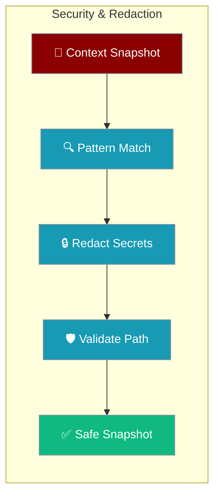

Context security features automatically redact sensitive data from monitoring snapshots and validate file paths to prevent traversal attacks.



## Quick Start

<Steps>
<Step title="Enable redaction and path validation">
```python
from praisonaiagents import ContextManager, ManagerConfig

config = ManagerConfig(
    redact_sensitive=True,
    allow_absolute_paths=False,
    monitor_path="./context.txt",
)

manager = ContextManager(config=config)
```
</Step>

<Step title="Manually redact text">
```python
from praisonaiagents import redact_sensitive

text = "My API key is sk-abc123def456ghi789"
safe = redact_sensitive(text)
```
</Step>
</Steps>

## Redaction Patterns

Automatically redacted:

| Pattern | Example |
|---------|---------|
| OpenAI keys | `sk-abc123...` |
| Anthropic keys | `sk-ant-...` |
| Google API keys | `AIzaSy...` |
| Google OAuth | `ya29....` |
| AWS access keys | `AKIA...` |
| Bearer tokens | `Bearer ...` |
| Passwords | `password = "..."` |
| API keys | `api_key: "..."` |

## Using Redaction

```python
from praisonaiagents import redact_sensitive

text = "My API key is sk-abc123def456ghi789"
safe = redact_sensitive(text)
# "My API key is [REDACTED]"
```

## Path Validation

```python
from praisonaiagents import validate_monitor_path

# Valid paths
is_valid, error = validate_monitor_path("./context.txt")
# (True, "")

# Path traversal blocked
is_valid, error = validate_monitor_path("../../../etc/passwd")
# (False, "Path traversal (..) not allowed")

# Absolute paths blocked by default
is_valid, error = validate_monitor_path("/tmp/context.txt")
# (False, "Absolute paths not allowed...")

# Allow absolute explicitly
is_valid, error = validate_monitor_path(
    "/tmp/context.txt",
    allow_absolute=True,
)
# (True, "")
```

## Ignore/Include Patterns

Respect `.praisonignore` and `.praisoninclude` files:

```python
from praisonaiagents import (
    should_include_content,
    load_ignore_patterns,
)

# Load patterns from files
ignore, include = load_ignore_patterns(".")

# Check if file should be included
if should_include_content("secret.key", ignore, include):
    # Include in snapshot
    pass
```

### .praisonignore

```
# Ignore patterns (glob)
*.key
*.pem
*.env
secrets/
node_modules/
```

### .praisoninclude

```
# Include patterns (whitelist)
*.py
*.js
*.md
```

## Configuration

```python
config = ManagerConfig(
    redact_sensitive=True,       # Enable redaction
    allow_absolute_paths=False,  # Block absolute paths
    monitor_path="./context.txt",
)
```

### Environment Variables

```bash
export PRAISONAI_CONTEXT_REDACT=true
```

## Redaction in Snapshots

All snapshot outputs are redacted:

```python
# Human format
# API key: [REDACTED]

# JSON format
# {"content": "API key: [REDACTED]"}
```

## Adding Custom Patterns

```python
from praisonaiagents.context.monitor import SENSITIVE_PATTERNS

# Add custom pattern
SENSITIVE_PATTERNS.append(r'my-custom-token-[a-z0-9]+')
```

## Best Practices

<AccordionGroup>
<Accordion title="Keep redaction enabled at all times">
Redaction is on by default. Only disable in fully isolated development environments where no real secrets are present.
</Accordion>

<Accordion title="Use relative paths for monitor output">
Relative paths like `./context.txt` prevent directory traversal attacks. Absolute paths are blocked by default.
</Accordion>

<Accordion title="Review .praisonignore for sensitive files">
Add patterns for secret files to `.praisonignore` to exclude them from snapshots.

```
*.key
*.pem
*.env
secrets/
```
</Accordion>

<Accordion title="Add custom redaction patterns for proprietary tokens">
Extend `SENSITIVE_PATTERNS` with regex patterns for your organization's custom token formats.

```python
from praisonaiagents.context.monitor import SENSITIVE_PATTERNS
SENSITIVE_PATTERNS.append(r'my-token-[a-z0-9]+')
```
</Accordion>
</AccordionGroup>

---

## Related

<CardGroup cols={2}>
<Card title="Context Monitor" icon="eye" href="/features/context-monitor">
  Real-time context snapshot monitoring
</Card>
<Card title="Context Monitor CLI" icon="terminal" href="/features/context-monitor-cli">
  CLI flags for monitoring configuration
</Card>
</CardGroup>
