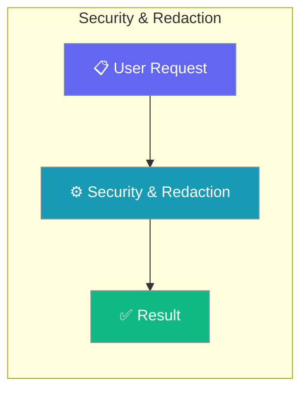
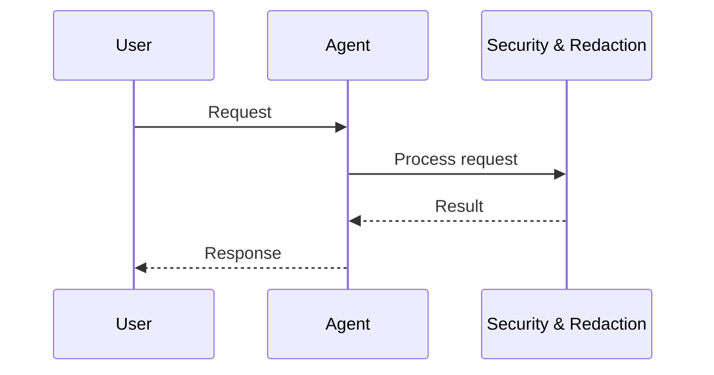
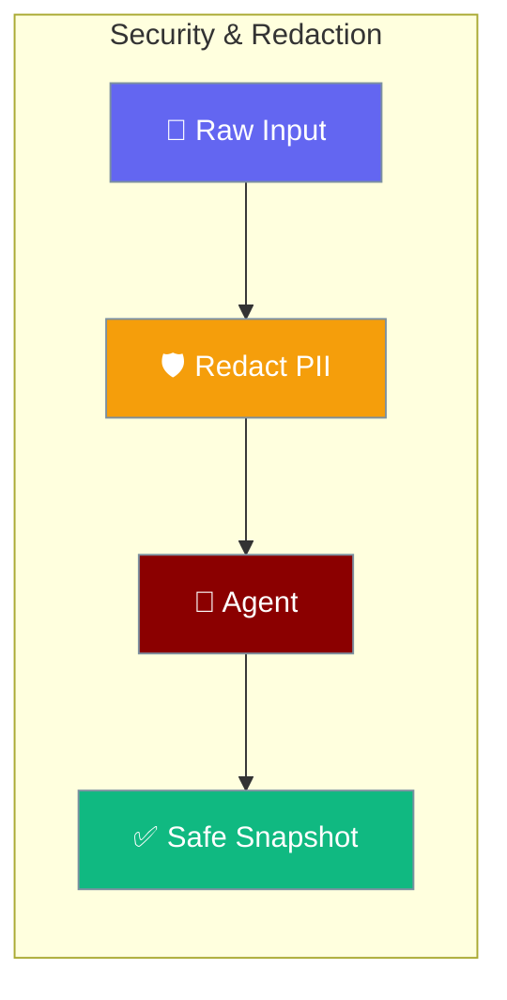
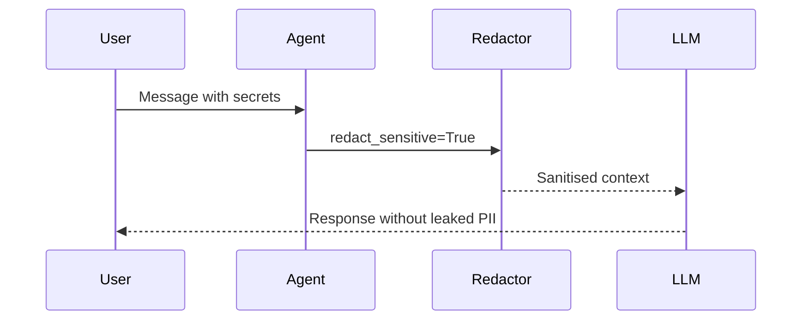

```python
from praisonaiagents import Agent

agent = Agent(
    name="secure-agent",
    instructions="Redact sensitive data from context before processing.",
)
agent.start("Process this document and redact all PII.")
```


Context security features protect sensitive data in snapshots and validate output paths.


The user sends messages containing secrets; redaction strips sensitive fields before context reaches the LLM.




## How It Works



## Quick Start

<Steps>
<Step title="Enable redaction in config">

```python
from praisonaiagents import ContextManager, ManagerConfig

config = ManagerConfig(
    redact_sensitive=True,
    allow_absolute_paths=False,
    monitor_path="./context.txt",
)
manager = ContextManager(config=config)
```

</Step>

<Step title="Redact text directly">

```python
from praisonaiagents.context import redact_sensitive

safe = redact_sensitive("My API key is sk-abc123def456ghi789")
# "My API key is [REDACTED]"
```

</Step>
</Steps>

## Redaction Patterns

Automatically redacted:

| Pattern | Example |
|---------|---------|
| OpenAI keys | `sk-abc123...` |
| Anthropic keys | `sk-ant-...` |
| Google API keys | `AIzaSy...` |
| Google OAuth | `ya29....` |
| AWS access keys | `AKIA...` |
| Bearer tokens | `Bearer ...` |
| Passwords | `password = "..."` |
| API keys | `api_key: "..."` |

## Using Redaction

```python
from praisonaiagents.context import redact_sensitive

text = "My API key is sk-abc123def456ghi789"
safe = redact_sensitive(text)
# "My API key is [REDACTED]"
```

## Path Validation

```python
from praisonaiagents import validate_monitor_path

# Valid paths
is_valid, error = validate_monitor_path("./context.txt")
# (True, "")

# Path traversal blocked
is_valid, error = validate_monitor_path("../../../etc/passwd")
# (False, "Path traversal (..) not allowed")

# Absolute paths blocked by default
is_valid, error = validate_monitor_path("/tmp/context.txt")
# (False, "Absolute paths not allowed...")

# Allow absolute explicitly
is_valid, error = validate_monitor_path(
    "/tmp/context.txt",
    allow_absolute=True,
)
# (True, "")
```

## Ignore/Include Patterns

Respect `.praisonignore` and `.praisoninclude` files:

```python
from praisonaiagents import (
    should_include_content,
    load_ignore_patterns,
)

# Load patterns from files
ignore, include = load_ignore_patterns(".")

# Check if file should be included
if should_include_content("secret.key", ignore, include):
    # Include in snapshot
    pass
```

### .praisonignore

```
# Ignore patterns (glob)
*.key
*.pem
*.env
secrets/
node_modules/
```

### .praisoninclude

```
# Include patterns (whitelist)
*.py
*.js
*.md
```

## Configuration

```python
config = ManagerConfig(
    redact_sensitive=True,       # Enable redaction
    allow_absolute_paths=False,  # Block absolute paths
    monitor_path="./context.txt",
)
```

### Environment Variables

```bash
export PRAISONAI_CONTEXT_REDACT=true
```

## Redaction in Snapshots

All snapshot outputs are redacted:

```python
# Human format
# API key: [REDACTED]

# JSON format
# {"content": "API key: [REDACTED]"}
```

## Adding Custom Patterns

```python
from praisonaiagents.context.monitor import SENSITIVE_PATTERNS

# Add custom pattern
SENSITIVE_PATTERNS.append(r'my-custom-token-[a-z0-9]+')
```

## Best Practices

<AccordionGroup>
  <Accordion title="Keep redaction enabled">
    Default redaction is on for a reason — do not disable it in shared or production environments.
  </Accordion>
  <Accordion title="Prefer relative paths in snapshots">
    Absolute paths can leak usernames and directory layout to logs or support tickets.
  </Accordion>
  <Accordion title="Maintain .praisonignore">
    Exclude secrets, credentials, and env files from context indexing and snapshots.
  </Accordion>
  <Accordion title="Rotate keys if exposed">
    If a snapshot ever captured a live secret, rotate the credential immediately — redaction is not retroactive.
  </Accordion>
</AccordionGroup>

## Related

<CardGroup cols={2}>
<Card title="Context Monitor" icon="eye" href="/docs/features/context-monitor">
  Snapshot output and formats
</Card>
<Card title="Protected Paths" icon="shield" href="/docs/features/protected-paths">
  Restrict file access in agents
</Card>
</CardGroup>
