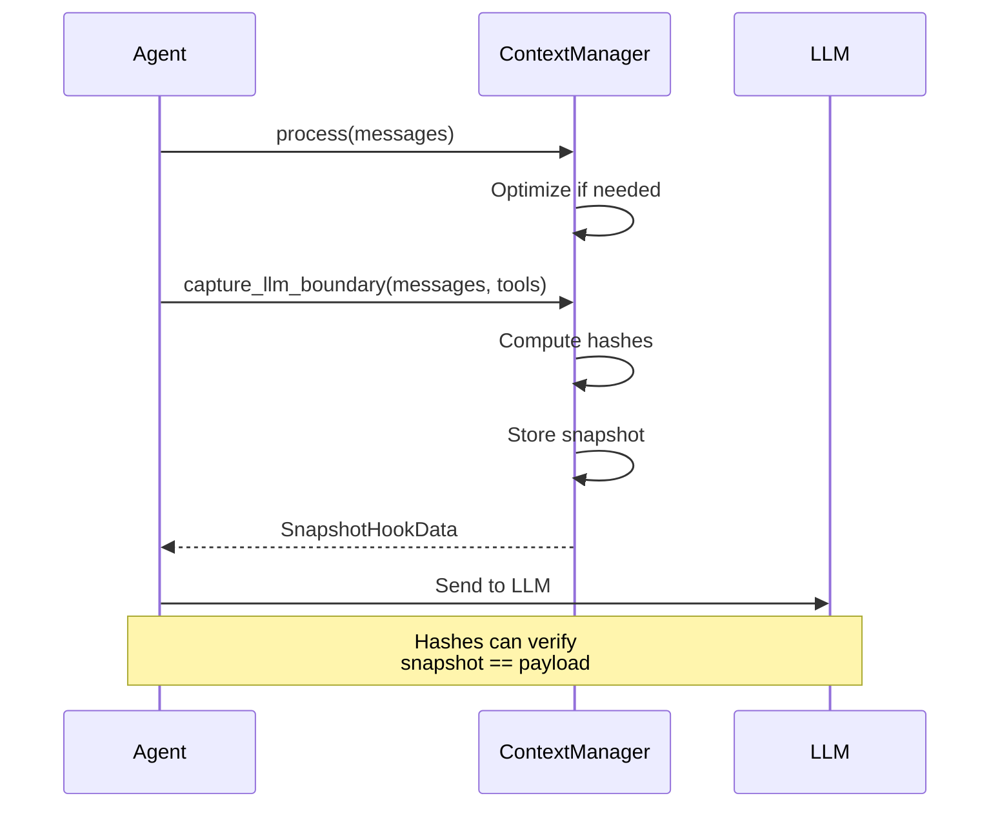

Snapshot hooks capture the exact state of messages and tools at the LLM call boundary, enabling verification that snapshots match actual payloads.

## Quick Start

```python
from praisonaiagents.context import ContextManager

manager = ContextManager(model="gpt-4o-mini")

# Capture at LLM boundary
hook_data = manager.capture_llm_boundary(messages, tools)

# Verify hashes
print(f"Message hash: {hook_data.message_hash}")
print(f"Tools hash: {hook_data.tools_hash}")
```

## Architecture



## SnapshotHookData

```python
@dataclass
class SnapshotHookData:
    timestamp: str           # ISO timestamp
    messages: List[Dict]     # Exact messages
    tools: List[Dict]        # Exact tool schemas
    message_hash: str        # SHA256 hash (16 chars)
    tools_hash: str          # SHA256 hash (16 chars)
    ledger: ContextLedger    # Token accounting
    budget: BudgetAllocation # Budget info
```

## Snapshot Callbacks

Register callbacks to be notified at every LLM boundary:

```python
def on_llm_call(hook_data):
    """Called before each LLM request."""
    print(f"Sending {len(hook_data.messages)} messages")
    print(f"Hash: {hook_data.message_hash}")
    
    # Log for debugging
    with open("llm_calls.log", "a") as f:
        f.write(f"{hook_data.timestamp}: {hook_data.message_hash}\n")

manager.register_snapshot_callback(on_llm_call)
```

## Hash Verification

Verify snapshot matches actual payload:

```python
import hashlib
import json

# Capture snapshot
hook_data = manager.capture_llm_boundary(messages, tools)

# Later, verify payload matches
def verify_payload(actual_messages, expected_hash):
    actual_json = json.dumps(actual_messages, sort_keys=True, default=str)
    actual_hash = hashlib.sha256(actual_json.encode()).hexdigest()[:16]
    return actual_hash == expected_hash

# Before sending to LLM
assert verify_payload(messages, hook_data.message_hash)
```

## Snapshot Timing

Configure when snapshots are taken:

```python
from praisonaiagents.context import ManagerConfig

config = ManagerConfig(
    snapshot_timing="both",  # pre_optimization, post_optimization, or both
)
```

| Timing | Description |
|--------|-------------|
| `pre_optimization` | Before any optimization |
| `post_optimization` | After optimization (default) |
| `both` | Capture both states |

## Drift Detection

Detect if context drifted between snapshot and LLM call:

```python
# Take snapshot
hook1 = manager.capture_llm_boundary(messages, tools)

# ... some operations ...

# Take another snapshot
hook2 = manager.capture_llm_boundary(messages, tools)

# Check for drift
if hook1.message_hash != hook2.message_hash:
    print("Warning: Context changed between snapshots")
```

## Integration with Monitor

Snapshots are automatically included in monitor output:

```python
config = ManagerConfig(
    monitor_enabled=True,
    monitor_format="json",
)
manager = ContextManager(config=config)

# Snapshots include hash metadata
# {
#   "timestamp": "...",
#   "message_hash": "abc123...",
#   "tools_hash": "def456...",
#   ...
# }
```

## CLI Usage

```bash
# Enable monitoring to capture snapshots
praisonai chat --context-monitor

# Snapshots written to context.txt
# Include message/tool hashes for verification
```

## Use Cases

1. **Debugging** - Verify exact state sent to LLM
2. **Auditing** - Log all LLM calls with hashes
3. **Testing** - Assert snapshot == expected payload
4. **Replay** - Reproduce exact LLM calls
