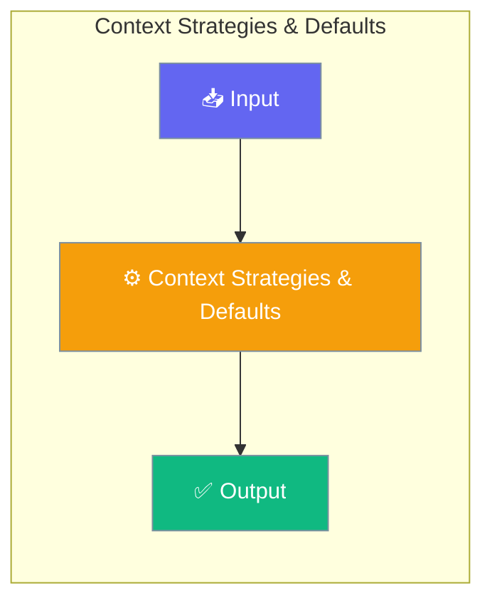

# Context Strategies & Defaults

This is the master reference for context management in PraisonAI Agents. It covers all strategies, default behaviors, and how to customize them.

<Note>
Context management is **opt-in** via the `context=` parameter. When disabled (default), there is zero performance overhead.
</Note>




## Quick Start


<Steps>
<Step title="Quick Start">
```python
from praisonaiagents import Agent
from praisonaiagents import ManagerConfig

# Simple: Enable with defaults
agent = Agent(
    instructions="You are helpful.",
    context=True,  # Enable context management
)

# Custom: Fine-tune behavior
agent = Agent(
    instructions="You are a code assistant.",
    context=ManagerConfig(
        auto_compact=True,
        compact_threshold=0.8,
        strategy="smart",
        output_reserve=16384,
    ),
)
```
</Step>
</Steps>


## Best Practices

<AccordionGroup>
  <Accordion title="Start simple">
    Enable the feature with a single parameter before adding configuration. Verify it works, then layer in options.
  </Accordion>
  <Accordion title="Use environment variables for secrets">
    Never hardcode API keys or tokens. Use `os.getenv("KEY_NAME")` to read from environment variables.
  </Accordion>
  <Accordion title="Test with minimal examples first">
    Copy the Quick Start example, run it, then extend it. This confirms your environment is set up correctly.
  </Accordion>
  <Accordion title="Check the logs">
    Set `verbose=True` on your agent to see detailed execution logs when debugging unexpected behavior.
  </Accordion>
</AccordionGroup>

## Related

<CardGroup cols={2}>
  <Card title="Features Overview" icon="grid-2" href="/docs/features">
    Browse all PraisonAI features
  </Card>
  <Card title="Quick Start" icon="rocket" href="/docs/introduction">
    Get started with PraisonAI agents
  </Card>
</CardGroup>
