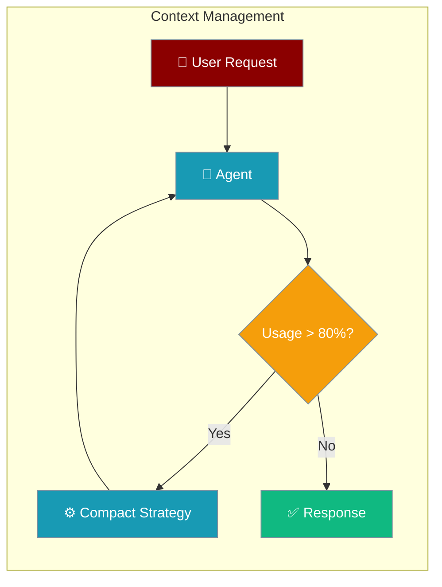
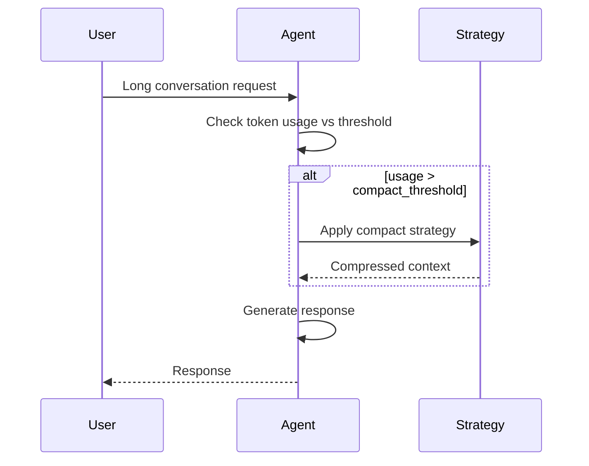

Context strategies decide how an agent compacts history — truncate, prune, or summarise — when the conversation nears the model's limit.

```python
from praisonaiagents import Agent

agent = Agent(
    name="strategy-agent",
    instructions="Apply the right context strategy when history grows.",
)
agent.start("Continue this long task without losing important details.")
```

<Note>
Context management is **opt-in** via the `context=` parameter. When disabled (default), there is zero performance overhead.
</Note>


The user picks a compaction strategy; the agent applies truncation, chunking, or summarisation when context nears the limit.




## Quick Start

<Steps>
<Step title="Enable with defaults">

```python
from praisonaiagents import Agent

agent = Agent(
    instructions="You are helpful.",
    context=True,
)
```

</Step>

<Step title="Fine-tune strategy and threshold">

```python
from praisonaiagents import Agent, ManagerConfig

agent = Agent(
    instructions="You are a code assistant.",
    context=ManagerConfig(
        auto_compact=True,
        compact_threshold=0.8,
        strategy="smart",
        output_reserve=16384,
    ),
)
```

</Step>
</Steps>

## Default Behavior

### Interactive Mode (`praisonai chat`)

| Setting | Default | Reason |
|---------|---------|--------|
| `context=` | `False` | Zero overhead for simple chats |
| When enabled: | | |
| - `auto_compact` | `True` | Prevent overflow automatically |
| - `compact_threshold` | `0.8` | Trigger at 80% usage |
| - `strategy` | `smart` | Best balance of preservation |
| - `output_reserve` | Model-specific | 8K-16K tokens |

**To enable in CLI:**
```bash
praisonai chat --context  # Enable with defaults
```

### Auto-Agents Mode (`Agents`)

| Setting | Default | Reason |
|---------|---------|--------|
| `context=` | `False` | Zero overhead for simple tasks |
| When enabled: | | |
| - `auto_compact` | `True` | Handle long multi-agent tasks |
| - `compact_threshold` | `0.8` | Trigger at 80% usage |
| - `strategy` | `smart` | Preserve important context |

**To enable:**
```python
from praisonaiagents import AgentTeam

agents = AgentTeam(
    agents=[...],
    context=True,  # Enable for all agents
)
```

## Optimization Strategies

### Strategy Overview

| Strategy | Description | Pros | Cons |
|----------|-------------|------|------|
| `truncate` | Remove oldest messages first | Fast, simple | Loses early context |
| `sliding_window` | Keep N most recent messages | Preserves recent | Loses early context |
| `prune_tools` | Truncate old tool outputs | Keeps messages | May lose tool details |
| `summarize` | Replace old messages with summary | Preserves meaning | Slower, uses API |
| `conversation` | Structured summaries with topic/goal tracking | Preserves narrative | Requires analysis |
| `smart` | Combine strategies intelligently | Best balance | More complex |

### When to Use Each

- **`truncate`**: Simple chatbots, Q&A agents
- **`sliding_window`**: Long conversations where recent context matters most
- **`prune_tools`**: Tool-heavy agents with large outputs
- **`summarize`**: When historical context is critical
- **`conversation`**: Multi-hour planning sessions, iterative development — automatically falls back to `smart` when compaction ratio isn't meaningful, making it safe as a default for long-running agents
- **`smart`** (recommended): Production use, balances all concerns

## Overflow Handling

### Threshold Playbook

| Usage | Level | Action |
|-------|-------|--------|
| 70% | INFO | Monitor usage, no action needed |
| 80% | NOTICE | Consider optimization soon |
| 90% | WARNING | Trigger auto-compact if enabled |
| 95% | CRITICAL | Aggressive optimization required |
| 100% | OVERFLOW | Immediate truncation to prevent API error |

### Automatic Handling

When `auto_compact=True`, the system automatically:

1. Monitors token usage before each API call
2. Triggers optimization when threshold is reached
3. Applies the configured strategy
4. Logs the optimization event

```python
# Example: Custom threshold
agent = Agent(
    instructions="...",
    context=ManagerConfig(
        auto_compact=True,
        compact_threshold=0.7,  # Earlier trigger
        strategy="smart",
    ),
)
```

## Budgeting

### Token Allocation

The context budget is divided into segments:

| Segment | Default | Description |
|---------|---------|-------------|
| System Prompt | 2,000 | Agent instructions |
| Rules | 500 | Behavioral rules |
| Skills | 500 | Skill definitions |
| Memory | 1,000 | Long-term memory |
| Tools Schema | 2,000 | Tool definitions |
| Tool Outputs | 20,000 | Tool call results |
| History | Remaining | Conversation history |
| Buffer | 1,000 | Safety margin |

### Custom Budgets

```python
from praisonaiagents.context import ContextBudgeter

budgeter = ContextBudgeter(
    model="gpt-4o",
    system_prompt_budget=3000,
    tools_schema_budget=5000,
    memory_budget=2000,
)
budget = budgeter.allocate()
print(f"Usable: {budget.usable:,} tokens")
```

## Monitoring

### Enable Context Monitoring

```python
agent = Agent(
    instructions="...",
    context=ManagerConfig(
        monitor_enabled=True,
        monitor_path="./context_debug.txt",
        monitor_format="human",  # or "json"
    ),
)
```

### Snapshot Output Example

```
================================================================================
PRAISONAI CONTEXT SNAPSHOT
================================================================================
Timestamp: 2026-01-08T12:00:00Z
Model: gpt-4o-mini
Model Limit: 128,000 tokens
Output Reserve: 16,384 tokens
Usable Budget: 111,616 tokens

--------------------------------------------------------------------------------
TOKEN LEDGER
--------------------------------------------------------------------------------
Segment              |     Tokens |     Budget |    Usage
--------------------------------------------------------------------------------
System Prompt        |        150 |      2,000 |    7.5%
History              |      5,230 |     84,616 |    6.2%
Tool Outputs         |      1,200 |     20,000 |    6.0%
--------------------------------------------------------------------------------
TOTAL                |      6,580 |    111,616 |    5.9%
```

### Percentage Display

Context utilization is displayed with smart formatting:
- Values `< 0.1%`: Shows `<0.1%`
- Values `< 1%`: Shows 2 decimal places (e.g., `0.02%`)
- Values `>= 1%`: Shows 1 decimal place (e.g., `5.3%`)

## Multi-Agent Policies

### Isolated (Default)

Each agent has its own context ledger:

```python
from praisonaiagents import ManagerConfig

agent1 = Agent(
    instructions="Researcher",
    context=ManagerConfig(policy="isolated"),
)
agent2 = Agent(
    instructions="Writer", 
    context=ManagerConfig(policy="isolated"),
)
```

### Shared

Agents share a common context ledger:

```python
from praisonaiagents import AgentTeam

agents = AgentTeam(
    agents=[agent1, agent2],
    context=ManagerConfig(policy="shared"),
)
```

## Redaction & Security

Sensitive data is automatically redacted in snapshots:

- API keys (OpenAI, Anthropic, Google, AWS, etc.)
- Passwords and secrets
- Email addresses (optional)
- Custom patterns

```python
agent = Agent(
    instructions="...",
    context=ManagerConfig(
        monitor_enabled=True,
        redact_sensitive=True,
    ),
)
```

## Configuration Reference

### ManagerConfig Options

| Option | Type | Default | Description |
|--------|------|---------|-------------|
| `auto_compact` | bool | `True` | Auto-optimize on threshold |
| `compact_threshold` | float | `0.8` | Trigger at this usage % |
| `strategy` | str | `"smart"` | Optimization strategy |
| `conversation_compaction` | bool | `False` | Enable intelligent conversation compaction |
| `conversation_analyzer_strategy` | str | `"hybrid"` | Strategy: hybrid, rule_based, llm_only |
| `conversation_min_compaction_ratio` | float | `0.3` | Minimum compression ratio for conversation compaction |
| `output_reserve` | int | Model-specific | Reserved for output |
| `monitor_enabled` | bool | `False` | Enable snapshots |
| `monitor_path` | str | `None` | Snapshot file path |
| `monitor_format` | str | `"human"` | `"human"` or `"json"` |
| `redact_sensitive` | bool | `True` | Redact secrets |
| `policy` | str | `"isolated"` | Multi-agent policy |

## How It Works



---

## Best Practices

<AccordionGroup>
  <Accordion title="Pick strategy by session length">
    Short chats can use `truncate`; long support threads benefit from `smart` or LLM summarisation.
  </Accordion>
  <Accordion title="Isolate multi-agent context">
    Use `policy="isolated"` unless agents explicitly share a workspace.
  </Accordion>
  <Accordion title="Leave redaction on">
    `redact_sensitive=True` protects API keys in tool results from appearing in logs.
  </Accordion>
  <Accordion title="Revisit strategy after model changes">
    A larger context window may let you switch to lighter strategies and save latency.
  </Accordion>
</AccordionGroup>

## Related

<CardGroup cols={2}>
<Card title="Context Budgeter" icon="coins" href="/docs/features/context-budgeter">
  Token budget allocation
</Card>
<Card title="Context Monitor" icon="eye" href="/docs/features/context-monitor">
  Real-time context snapshots
</Card>
<Card title="Context Optimizer" icon="compress" href="/docs/features/optimizer">
  Reduce context when over budget
</Card>
<Card title="Fast Context" icon="bolt" href="/docs/features/fast-context">
  High-performance context handling
</Card>
</CardGroup>
