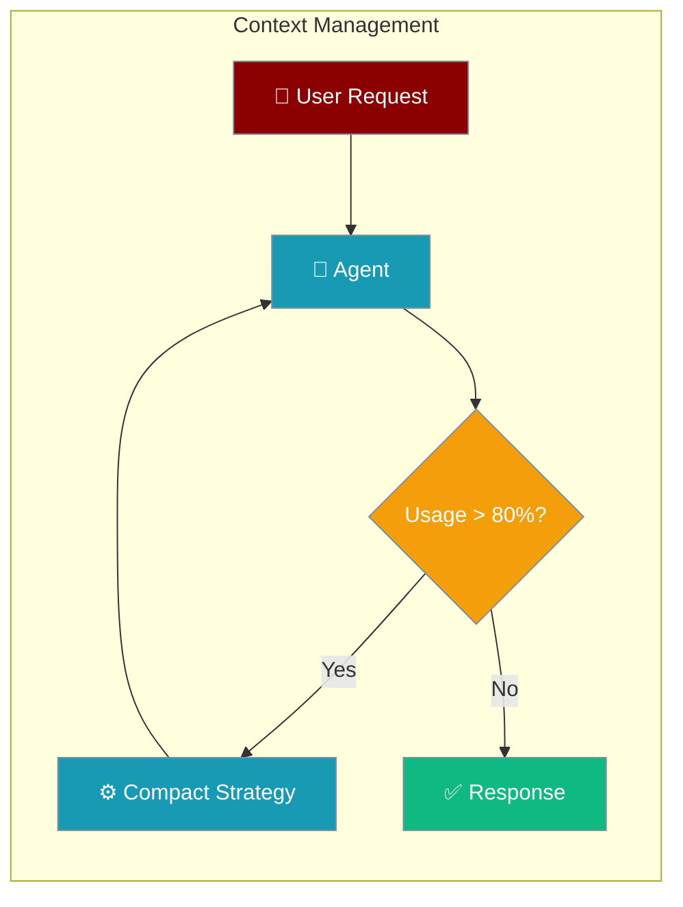
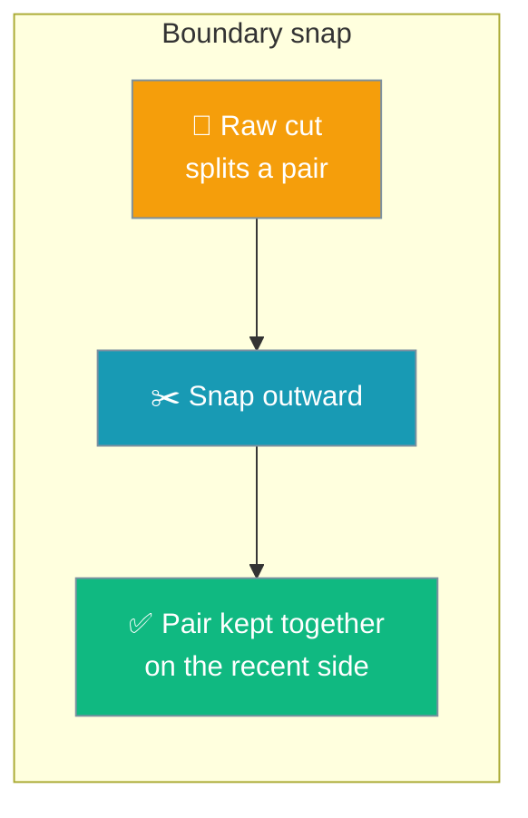
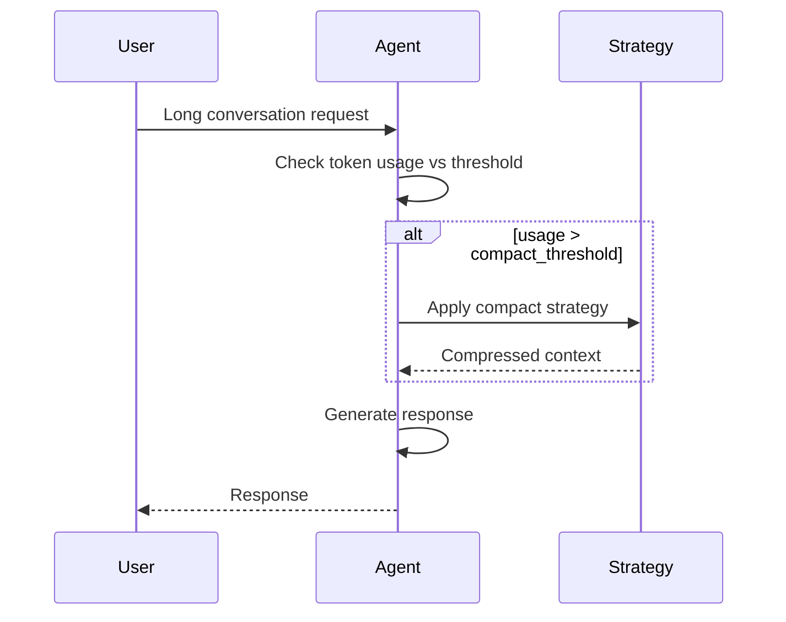

Context strategies decide how an agent compacts history — truncate, prune, or summarise — when the conversation nears the model's limit.

<Note>
The string form of `context=` must name a valid preset (`summarize`, `sliding_window`, …). A typo raises `ValueError` at construction time with a "Did you mean ...?" suggestion — see [Fail-Loud Defaults](/features/fail-loud-defaults). Matching is case-insensitive, whitespace-tolerant, and treats `-`/`_` interchangeably.
</Note>

```python
from praisonaiagents import Agent

# All four spellings enable the sliding_window strategy:
Agent(instructions="t", context="sliding_window")
Agent(instructions="t", context="sliding-window")
Agent(instructions="t", context="SLIDING_WINDOW")
Agent(instructions="t", context=" sliding_window ")

# The context_manager is actually built — previously the last three silently returned None:
assert Agent(instructions="t", context="sliding-window").context_manager is not None
```

| Call (Python) | Before PR #4186 | After PR #4186 |
|---|---|---|
| `Agent(context="sliding_window")` | ✅ context_manager set | ✅ context_manager set |
| `Agent(context="sliding-window")` | ⚠ validated → **`context_manager=None`** | ✅ context_manager set |
| `Agent(context="SLIDING_WINDOW")` | ⚠ validated → **`context_manager=None`** | ✅ context_manager set |
| `Agent(context=" sliding_window ")` | ⚠ validated → **`context_manager=None`** | ✅ context_manager set |

<Note>
Before PraisonAI PR #4186, hyphen / uppercase / padded variants were accepted by the validator but silently left `context_manager=None`. Upgrade to a build that includes PR #4186 to get the behaviour shown above.
</Note>

```python
from praisonaiagents import Agent

agent = Agent(
    name="strategy-agent",
    instructions="Apply the right context strategy when history grows.",
)
agent.start("Continue this long task without losing important details.")
```

<Note>
Context management is **opt-in** via the `context=` parameter. When disabled (default), there is zero performance overhead.
</Note>


The user picks a compaction strategy; the agent applies truncation, chunking, or summarisation when context nears the limit.



```mermaid
graph LR
    subgraph "Context Management"
        In[💬 User Request] --> Agent[🤖 Agent]
        Agent --> Check{"Usage > 80%?"}
        Check -->|Yes| Compact[⚙️ Compact Strategy]
        Compact --> Agent
        Check -->|No| Out[✅ Response]
    end

    classDef agent fill:#8B0000,stroke:#7C90A0,color:#fff
    classDef decision fill:#F59E0B,stroke:#7C90A0,color:#fff
    classDef process fill:#189AB4,stroke:#7C90A0,color:#fff
    classDef output fill:#10B981,stroke:#7C90A0,color:#fff

    class In agent
    class Agent process
    class Check decision
    class Compact process
    class Out output
```

## Quick Start

<Steps>
<Step title="Enable with defaults">

```python
from praisonaiagents import Agent

agent = Agent(
    instructions="You are helpful.",
    context=True,
)
```

</Step>

<Step title="Fine-tune strategy and threshold">

```python
from praisonaiagents import Agent, ManagerConfig

agent = Agent(
    instructions="You are a code assistant.",
    context=ManagerConfig(
        auto_compact=True,
        compact_threshold=0.8,
        strategy="smart",
        output_reserve=16384,
    ),
)
```

</Step>
</Steps>

## Default Behavior

### Interactive Mode (`praisonai chat`)

| Setting | Default | Reason |
|---------|---------|--------|
| `context=` | `False` | Zero overhead for simple chats |
| When enabled: | | |
| - `auto_compact` | `True` | Prevent overflow automatically |
| - `compact_threshold` | `0.8` | Trigger at 80% usage |
| - `strategy` | `smart` | Best balance of preservation |
| - `output_reserve` | Model-specific | 8K-16K tokens |

**To enable in CLI:**
```bash
praisonai chat --context  # Enable with defaults
```

### Auto-Agents Mode (`Agents`)

| Setting | Default | Reason |
|---------|---------|--------|
| `context=` | `False` | Zero overhead for simple tasks |
| When enabled: | | |
| - `auto_compact` | `True` | Handle long multi-agent tasks |
| - `compact_threshold` | `0.8` | Trigger at 80% usage |
| - `strategy` | `smart` | Preserve important context |

**To enable:**
```python
from praisonaiagents import AgentTeam

agents = AgentTeam(
    agents=[...],
    context=True,  # Enable for all agents
)
```

## Optimization Strategies

### Strategy Overview

| Strategy | Description | Pros | Cons |
|----------|-------------|------|------|
| `truncate` | Remove oldest messages first | Fast, simple; keeps tool pairs intact | Loses early context |
| `sliding_window` | Keep N most recent messages | Preserves recent; keeps tool pairs intact | Loses early context |
| `prune_tools` | Truncate old tool outputs | Keeps messages | May lose tool details |
| `non_destructive` | Compact only messages marked non-critical; preserves everything else | Best when tool outputs are heavy but must not be summarised | Tagged messages still occupy storage |
| `summarize` | Replace old messages with summary | Preserves meaning | Slower, uses API |
| `conversation` | Structured summaries with topic/goal tracking | Preserves narrative | Requires analysis |
| `smart` | Combine strategies intelligently | Best balance | More complex |

<Note>
**Requires PraisonAI PR #4242 (merged Aug 2026).** Before this fix, only `smart` actually ran end-to-end. Setting `strategy` to any of `truncate`, `sliding_window`, `summarize`, `prune_tools`, `non_destructive`, or `conversation` raised `TypeError` inside `ContextManager` and was silently swallowed — the history was returned unchanged and the hard-limit emergency truncation never fired. Upgrade to a build that includes PR #4242 to get the strategy you configured.
</Note>

<Note>
**Tool-call/tool-result pairs stay intact.** Every strategy — including the default `truncate` — snaps its compaction boundary so an assistant `tool_calls` message and its matching `tool` result are never separated. Long-running sessions on OpenAI, Anthropic, and Azure OpenAI keep working after compaction; you do not need a workaround for the `messages with role 'tool' must be a response to a preceding message with 'tool_calls'` 400.
</Note>

### When to Use Each

- **`truncate`**: Simple chatbots, Q&A agents
- **`sliding_window`**: Long conversations where recent context matters most
- **`prune_tools`**: Tool-heavy agents with large outputs
- **`non_destructive`**: Heavy tool outputs you must keep — tags old messages out of the effective window instead of deleting them
- **`summarize`**: When historical context is critical
- **`conversation`**: Multi-hour planning sessions, iterative development — automatically falls back to `smart` when compaction ratio isn't meaningful, making it safe as a default for long-running agents
- **`smart`** (recommended): Production use, balances all concerns

### Tool-call safety

Every strategy keeps assistant `tool_calls` messages and their matching `tool` results on the same side of the compaction boundary. If the raw token/message cut lands between a pair, the boundary is snapped outward so the pair is preserved together.


```mermaid
graph LR
    subgraph "Boundary snap"
        Before[🧾 Raw cut<br/>splits a pair] --> Snap[✂️ Snap outward]
        Snap --> After[✅ Pair kept together<br/>on the recent side]
    end

    classDef bad fill:#F59E0B,stroke:#7C90A0,color:#fff
    classDef fix fill:#189AB4,stroke:#7C90A0,color:#fff
    classDef ok  fill:#10B981,stroke:#7C90A0,color:#fff

    class Before bad
    class Snap fix
    class After ok
```

For `truncate`, the token-budget loop additionally drops a leading assistant `tool_calls` message together with all of its `tool` results in a single step. No configuration required — this behaviour is on by default for every strategy.

## Overflow Handling

### Threshold Playbook

| Usage | Level | Action |
|-------|-------|--------|
| 70% | INFO | Monitor usage, no action needed |
| 80% | NOTICE | Consider optimization soon |
| 90% | WARNING | Trigger auto-compact if enabled |
| 95% | CRITICAL | Aggressive optimization required |
| 100% | OVERFLOW | Immediate truncation to prevent API error |

"Immediate truncation" at 100% now counts the system prompt and tool schemas in the overhead, not just history tokens. An agent whose system prompt or tool block grew large will trip emergency truncation earlier than before — this is intentional and keeps the request inside the model window.

### Automatic Handling

When `auto_compact=True`, the system automatically:

1. Monitors token usage before each API call
2. Triggers optimization when threshold is reached
3. Applies the configured strategy
4. Logs the optimization event
5. If the configured strategy fails, falls back to emergency truncation targeting ~80% of the model window (result payload includes `emergency_truncated: True`)

### Failure Fallback

If the configured strategy raises, `_apply_context_management` no longer returns the history unchanged. It:

1. Logs the failure at `error` level (was `warning`).
2. Recomputes the model limit via `get_model_limit`.
3. Adds the system prompt and tool-schema token cost as overhead.
4. If `history + overhead > 95%` of the window, calls `emergency_truncate` targeting `max(1, int(model_limit * 0.8) - overhead)`.
5. Returns `{"emergency_truncated": True}` so observability sinks can see the fallback fired.

A misconfigured strategy therefore never sends an over-budget request — the hard limit stays in place.

```python
from praisonaiagents import Agent, ManagerConfig

agent = Agent(
    instructions="You are a support assistant.",
    context=ManagerConfig(
        strategy="truncate",  # Any of the seven strategies is now reliable
        auto_compact=True,
        compact_threshold=0.8,
    ),
)

# When the configured strategy fails, the fallback still keeps the request
# inside the model window and marks the result.
result = agent.chat("Long conversation continues here...")
# result.metadata may include:
#   {"emergency_truncated": True}
```

<Note>
Compaction never emits an orphaned `tool` message. The recent-window boundary and any per-message drop pass keep the assistant `tool_calls` message and its matching `tool` result together — so strict providers (OpenAI, Anthropic, Azure OpenAI) never receive a partial pair.
</Note>

```python
# Example: Custom threshold
agent = Agent(
    instructions="...",
    context=ManagerConfig(
        auto_compact=True,
        compact_threshold=0.7,  # Earlier trigger
        strategy="smart",
    ),
)
```

## Budgeting

### Token Allocation

The context budget is divided into segments:

| Segment | Default | Description |
|---------|---------|-------------|
| System Prompt | 2,000 | Agent instructions |
| Rules | 500 | Behavioral rules |
| Skills | 500 | Skill definitions |
| Memory | 1,000 | Long-term memory |
| Tools Schema | 2,000 | Tool definitions |
| Tool Outputs | 20,000 | Tool call results |
| History | Remaining | Conversation history |
| Buffer | 1,000 | Safety margin |

### Custom Budgets

```python
from praisonaiagents.context import ContextBudgeter

budgeter = ContextBudgeter(
    model="gpt-4o",
    system_prompt_budget=3000,
    tools_schema_budget=5000,
    memory_budget=2000,
)
budget = budgeter.allocate()
print(f"Usable: {budget.usable:,} tokens")
```

## Monitoring

### Enable Context Monitoring

```python
agent = Agent(
    instructions="...",
    context=ManagerConfig(
        monitor_enabled=True,
        monitor_path="./context_debug.txt",
        monitor_format="human",  # or "json"
    ),
)
```

### Snapshot Output Example

```
================================================================================
PRAISONAI CONTEXT SNAPSHOT
================================================================================
Timestamp: 2026-01-08T12:00:00Z
Model: gpt-4o-mini
Model Limit: 128,000 tokens
Output Reserve: 16,384 tokens
Usable Budget: 111,616 tokens

--------------------------------------------------------------------------------
TOKEN LEDGER
--------------------------------------------------------------------------------
Segment              |     Tokens |     Budget |    Usage
--------------------------------------------------------------------------------
System Prompt        |        150 |      2,000 |    7.5%
History              |      5,230 |     84,616 |    6.2%
Tool Outputs         |      1,200 |     20,000 |    6.0%
--------------------------------------------------------------------------------
TOTAL                |      6,580 |    111,616 |    5.9%
```

### Percentage Display

Context utilization is displayed with smart formatting:
- Values `< 0.1%`: Shows `<0.1%`
- Values `< 1%`: Shows 2 decimal places (e.g., `0.02%`)
- Values `>= 1%`: Shows 1 decimal place (e.g., `5.3%`)

## Multi-Agent Policies

### Isolated (Default)

Each agent has its own context ledger:

```python
from praisonaiagents import ManagerConfig

agent1 = Agent(
    instructions="Researcher",
    context=ManagerConfig(policy="isolated"),
)
agent2 = Agent(
    instructions="Writer", 
    context=ManagerConfig(policy="isolated"),
)
```

### Shared

Agents share a common context ledger:

```python
from praisonaiagents import AgentTeam

agents = AgentTeam(
    agents=[agent1, agent2],
    context=ManagerConfig(policy="shared"),
)
```

## Redaction & Security

Sensitive data is automatically redacted in snapshots:

- API keys (OpenAI, Anthropic, Google, AWS, etc.)
- Passwords and secrets
- Email addresses (optional)
- Custom patterns

```python
agent = Agent(
    instructions="...",
    context=ManagerConfig(
        monitor_enabled=True,
        redact_sensitive=True,
    ),
)
```

## Configuration Reference

### ManagerConfig Options

| Option | Type | Default | Description |
|--------|------|---------|-------------|
| `auto_compact` | bool | `True` | Auto-optimize on threshold |
| `compact_threshold` | float | `0.8` | Trigger at this usage % |
| `strategy` | str | `"smart"` | Optimization strategy |
| `conversation_compaction` | bool | `False` | Enable intelligent conversation compaction |
| `conversation_analyzer_strategy` | str | `"hybrid"` | Strategy: hybrid, rule_based, llm_only |
| `conversation_min_compaction_ratio` | float | `0.3` | Minimum compression ratio for conversation compaction |
| `output_reserve` | int | Model-specific | Reserved for output |
| `monitor_enabled` | bool | `False` | Enable snapshots |
| `monitor_path` | str | `None` | Snapshot file path |
| `monitor_format` | str | `"human"` | `"human"` or `"json"` |
| `redact_sensitive` | bool | `True` | Redact secrets |
| `policy` | str | `"isolated"` | Multi-agent policy |

## How It Works


```mermaid
sequenceDiagram
    participant User
    participant Agent
    participant Strategy

    User->>Agent: Long conversation request
    Agent->>Agent: Check token usage vs threshold
    alt usage > compact_threshold
        Agent->>Strategy: Apply compact strategy
        Strategy-->>Agent: Compressed context
    end
    Agent->>Agent: Generate response
    Agent-->>User: Response
```

---

## Best Practices

<AccordionGroup>
  <Accordion title="Pick strategy by session length">
    Short chats can use `truncate`; long support threads benefit from `smart` or LLM summarisation.
  </Accordion>
  <Accordion title="Isolate multi-agent context">
    Use `policy="isolated"` unless agents explicitly share a workspace.
  </Accordion>
  <Accordion title="Leave redaction on">
    `redact_sensitive=True` protects API keys in tool results from appearing in logs.
  </Accordion>
  <Accordion title="Revisit strategy after model changes">
    A larger context window may let you switch to lighter strategies and save latency.
  </Accordion>
  <Accordion title="Verify your build includes PR #4242 before non-smart strategies">
    If you pinned PraisonAI at a build before PR #4242, only `strategy="smart"` actually compacted. All other values raised `TypeError` inside `ContextManager` and were silently swallowed — including the emergency truncation. Verify your build includes PR #4242 (merged Aug 2026) before shipping a non-smart strategy to production.
  </Accordion>
  <Accordion title="Tool-using bots stay valid across compaction">
    When your agent calls tools inside a long conversation, compaction never separates an assistant `tool_calls` message from its `tool` result. This holds for every strategy — `truncate`, `sliding_window`, `prune_tools`, `summarize`, `conversation`, and `smart`. Long-lived Telegram/Slack/gateway bots on strict providers keep working across weeks of history without provider `400`s.
  </Accordion>
</AccordionGroup>

## Related

<CardGroup cols={2}>
<Card title="Context Budgeter" icon="coins" href="/features/context-budgeter">
  Token budget allocation
</Card>
<Card title="Context Monitor" icon="eye" href="/features/context-monitor">
  Real-time context snapshots
</Card>
<Card title="Context Optimizer" icon="compress" href="/features/optimizer">
  Reduce context when over budget
</Card>
<Card title="Fast Context" icon="bolt" href="/features/fast-context">
  High-performance context handling
</Card>
</CardGroup>
