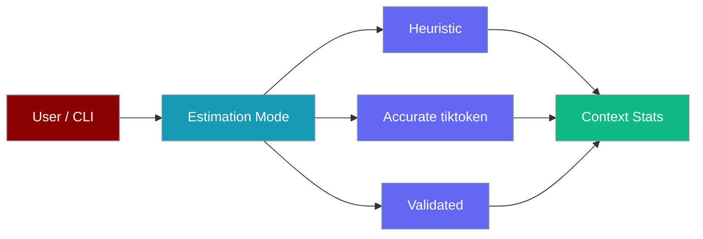

Control token estimation mode from the CLI — choose fast heuristics or accurate tiktoken counts when debugging context usage.



## Quick Start

<Steps>
<Step title="Run an agent with accurate token counts">

```python
from praisonaiagents import Agent

agent = Agent(
    name="Assistant",
    instructions="Answer questions concisely.",
)

agent.start("Explain token estimation in one paragraph")
```

Then check counts from the CLI:

```bash
praisonai chat --context-estimation-mode accurate
# In session: /context stats
```

</Step>

<Step title="Enable mismatch logging for debugging">

```bash
praisonai chat \
  --context-estimation-mode validated \
  --context-log-mismatch
```

Validated mode compares heuristic vs accurate estimates and logs when they diverge by more than 15%.

</Step>
</Steps>

## CLI Flags

| Flag | Values | Default | Description |
|------|--------|---------|-------------|
| `--context-estimation-mode` | `heuristic`, `accurate`, `validated` | `heuristic` | How tokens are counted |
| `--context-log-mismatch` | flag | off | Log when heuristic differs from accurate |

```bash
# Fast heuristic (default)
praisonai chat --context-estimation-mode heuristic

# Accurate with tiktoken
praisonai chat --context-estimation-mode accurate
```

## Interactive Commands

```bash
> /context config   # View estimation mode
> /context stats    # Token counts per segment
```

## config.yaml

```yaml
context:
  estimation:
    mode: heuristic
    log_mismatch: false
    mismatch_threshold_pct: 15.0
```

Environment variables: `PRAISONAI_CONTEXT_ESTIMATION_MODE`, `PRAISONAI_CONTEXT_LOG_MISMATCH`.

## Best Practices

<AccordionGroup>
<Accordion title="Use heuristic in production">
Heuristic mode is fastest and sufficient for compaction triggers in normal use.
</Accordion>

<Accordion title="Switch to accurate when counts look wrong">
If compaction fires too early or too late, run with `--context-estimation-mode accurate` and check `/context stats`.
</Accordion>

<Accordion title="Use validated mode briefly when tuning">
Enable validated + log-mismatch for a short session to calibrate heuristic accuracy for your model and prompt style.
</Accordion>
</AccordionGroup>

## Related

<CardGroup cols={2}>
  <Card title="Context Budgeter CLI" icon="gauge" href="/docs/features/context-budgeter-cli">
    Allocate token budgets per segment
  </Card>
  <Card title="Context Management" icon="layer-group" href="/docs/features/context-management">
    Full context system overview
  </Card>
</CardGroup>
