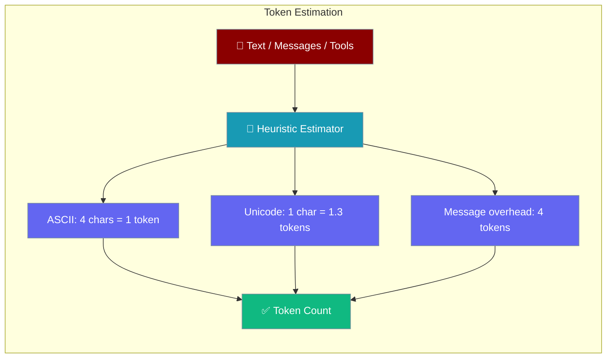

PraisonAI provides fast, offline token estimation — no API calls needed, under 1ms for 100K characters.



## Quick Start

<Steps>
<Step title="Estimate tokens for text and messages">
```python
from praisonaiagents import (
    estimate_tokens_heuristic,
    estimate_messages_tokens,
    estimate_tool_schema_tokens,
)

tokens = estimate_tokens_heuristic("Hello, how are you today?")
print(f"Estimated: {tokens} tokens")

messages = [
    {"role": "system", "content": "You are helpful."},
    {"role": "user", "content": "What is Python?"},
]
tokens = estimate_messages_tokens(messages)
print(f"Messages: {tokens} tokens")
```
</Step>

<Step title="Check budget before sending">
```python
from praisonaiagents import ContextBudgeter, estimate_messages_tokens

budgeter = ContextBudgeter(model="gpt-4o-mini")
budget = budgeter.allocate()

tokens = estimate_messages_tokens(messages)
if tokens > budget.usable * 0.8:
    print("Warning: Approaching context limit!")
```
</Step>
</Steps>

## Estimation Algorithm

The heuristic estimator uses character-based rules optimized for typical LLM tokenization:

| Character Type | Tokens per Character |
|----------------|---------------------|
| ASCII text | ~0.25 (4 chars = 1 token) |
| Non-ASCII (Unicode) | ~1.3 tokens per char |
| Whitespace | Counted normally |

### Message Overhead

Each message includes overhead for role markers and formatting:

- **Base overhead**: 4 tokens per message
- **Role tokens**: ~2 tokens
- **Content**: Estimated via heuristic

## API Reference

### `estimate_tokens_heuristic(text: str) -> int`

Estimate tokens for a string using character-based heuristics.

```python
tokens = estimate_tokens_heuristic("Hello world!")
# Returns: ~3 tokens
```

### `estimate_messages_tokens(messages: List[Dict]) -> int`

Estimate total tokens for a list of chat messages.

```python
messages = [
    {"role": "user", "content": "Hello"},
    {"role": "assistant", "content": "Hi there!"},
]
tokens = estimate_messages_tokens(messages)
```

### `estimate_tool_schema_tokens(tools: List[Dict]) -> int`

Estimate tokens for tool/function schemas.

```python
tools = [{"name": "search", "description": "Search the web"}]
tokens = estimate_tool_schema_tokens(tools)
```

### `TokenEstimatorImpl`

Class-based estimator with caching:

```python
from praisonaiagents import TokenEstimatorImpl

estimator = TokenEstimatorImpl()
tokens = estimator.estimate("Some text")
```

### `get_estimator() -> TokenEstimatorImpl`

Get a singleton estimator instance:

```python
from praisonaiagents import get_estimator

estimator = get_estimator()
tokens = estimator.estimate("Text to estimate")
```

## Accuracy Considerations

The heuristic estimator is designed for speed over perfect accuracy:

| Scenario | Accuracy |
|----------|----------|
| English text | ~90-95% |
| Code | ~85-90% |
| Mixed content | ~85-90% |
| Non-ASCII heavy | ~80-85% |

For budget decisions, the estimator adds a small safety margin to prevent underestimation.

## Performance

- **Speed**: < 1ms for 100K characters
- **Memory**: O(1) - no caching required
- **No API calls**: Works completely offline

## Integration with Budgeter

```python
from praisonaiagents import (
    ContextBudgeter,
    estimate_messages_tokens,
)

budgeter = ContextBudgeter(model="gpt-4o-mini")
budget = budgeter.allocate()

# Check if messages fit in budget
messages = [...]  # Your conversation
tokens = estimate_messages_tokens(messages)

if tokens > budget.usable * 0.8:
    print("Warning: Approaching context limit!")
```

## Best Practices

<AccordionGroup>
<Accordion title="Use heuristic estimation in production">
Heuristic estimation is 90-95% accurate for English text and runs in under 1ms. Accurate enough for budget decisions.
</Accordion>

<Accordion title="Use the singleton estimator for efficiency">
The `get_estimator()` singleton reuses the same instance, avoiding repeated initialization overhead.

```python
from praisonaiagents import get_estimator
estimator = get_estimator()
```
</Accordion>

<Accordion title="Account for tool schema tokens">
Tool definitions can consume thousands of tokens. Always estimate them separately with `estimate_tool_schema_tokens()`.
</Accordion>

<Accordion title="Add a safety margin for optimization triggers">
Trigger context optimization at 80% of budget, not 100%, to leave room for estimation inaccuracies.

```python
if tokens > budget.usable * 0.8:
    pass
```
</Accordion>
</AccordionGroup>

---

## Related

<CardGroup cols={2}>
<Card title="Context Ledger" icon="book" href="/features/context-ledger">
  Per-segment token usage tracking
</Card>
<Card title="Context Budgeter" icon="coins" href="/features/context-budgeter">
  Allocate token budgets per model
</Card>
</CardGroup>
