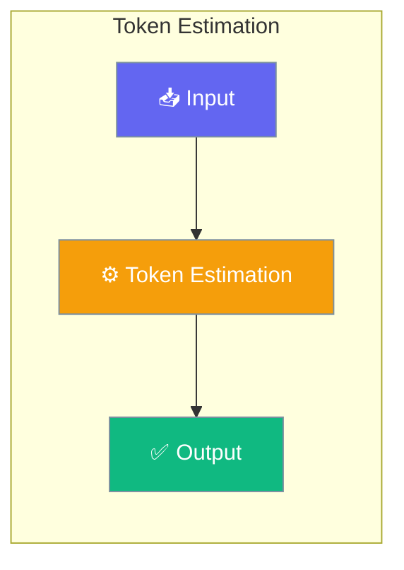

# Token Estimation

PraisonAI provides fast, offline token estimation that works without API calls. This enables real-time context budget tracking and optimization decisions.




## Quick Start


<Steps>
<Step title="Quick Start">
```python
from praisonaiagents import (
    estimate_tokens_heuristic,
    estimate_messages_tokens,
    estimate_tool_schema_tokens,
)

# Estimate tokens for text
text = "Hello, how are you today?"
tokens = estimate_tokens_heuristic(text)
print(f"Estimated: {tokens} tokens")

# Estimate tokens for messages
messages = [
    {"role": "system", "content": "You are helpful."},
    {"role": "user", "content": "What is Python?"},
]
tokens = estimate_messages_tokens(messages)
print(f"Messages: {tokens} tokens")

# Estimate tool schema tokens
tools = [
    {"name": "read_file", "description": "Read a file"},
    {"name": "write_file", "description": "Write to a file"},
]
tokens = estimate_tool_schema_tokens(tools)
print(f"Tools: {tokens} tokens")
```
</Step>
</Steps>


## Best Practices

<AccordionGroup>
  <Accordion title="Start simple">
    Enable the feature with a single parameter before adding configuration. Verify it works, then layer in options.
  </Accordion>
  <Accordion title="Use environment variables for secrets">
    Never hardcode API keys or tokens. Use `os.getenv("KEY_NAME")` to read from environment variables.
  </Accordion>
  <Accordion title="Test with minimal examples first">
    Copy the Quick Start example, run it, then extend it. This confirms your environment is set up correctly.
  </Accordion>
  <Accordion title="Check the logs">
    Set `verbose=True` on your agent to see detailed execution logs when debugging unexpected behavior.
  </Accordion>
</AccordionGroup>

## Related

<CardGroup cols={2}>
  <Card title="Features Overview" icon="grid-2" href="/docs/features">
    Browse all PraisonAI features
  </Card>
  <Card title="Quick Start" icon="rocket" href="/docs/introduction">
    Get started with PraisonAI agents
  </Card>
</CardGroup>
