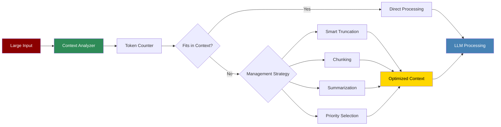

Context Window Management automatically handles token limits across different models, ensuring optimal use of available context while preserving important information.

## Quick Start

<Steps>
    <Step title="Install Package">
        Install PraisonAI Agents:
        ```bash
        pip install praisonaiagents
        ```
    </Step>

    <Step title="Import Context Manager">
        Import context management utilities:
        ```python
        from praisonaiagents import (
            ContextManager,
            TokenCounter,
            ContextOptimizer
        )
        ```
    </Step>

    <Step title="Create Example">
        Create `context_management.py`:
        ```python
        from praisonaiagents import Agent, Task, AgentTeam
        from praisonaiagents import ContextManager

        # Initialize context manager
        context_manager = ContextManager(
            model="gpt-4",
            max_tokens=8192,  # Model's context limit
            reserve_tokens=1000,  # Reserve for response
            optimization_strategy="smart"
        )

        # Create agent with context management
        smart_agent = Agent(
            name="Context-Aware Agent",
            role="Document Processor",
            goal="Process large documents efficiently",
            context_manager=context_manager,
            instructions="Analyze documents while managing context limits"
        )

        # Create task with large context
        large_document = "..." * 10000  # Very long document

        analysis_task = Task(
            description="Analyze this extensive document",
            expected_output="Comprehensive analysis",
            agent=smart_agent,
            context={
                "document": large_document,
                "additional_context": "Focus on key findings"
            }
        )

        # The context manager automatically handles the large input
        workflow = AgentTeam(
            agents=[smart_agent],
            tasks=[analysis_task],
            context_management=True
        )

        results = workflow.start()

        # Check context usage
        usage = context_manager.get_usage_stats()
        print(f"Tokens used: {usage['tokens_used']}/{usage['max_tokens']}")
        print(f"Optimization applied: {usage['optimization_method']}")
        ```
    </Step>

    <Step title="Run Example">
        Execute the context management example:
        ```bash
        python context_management.py
        ```
    </Step>
</Steps>

## Core Features

### Token Counting

```python
from praisonaiagents import TokenCounter

# Initialize token counter for specific model
counter = TokenCounter(model="gpt-4")

# Count tokens in text
text = "This is a sample text for token counting."
token_count = counter.count_tokens(text)
print(f"Token count: {token_count}")

# Count tokens with special formatting
messages = [
    {"role": "system", "content": "You are a helpful assistant."},
    {"role": "user", "content": "Hello, how are you?"}
]
message_tokens = counter.count_message_tokens(messages)
print(f"Message tokens: {message_tokens}")

# Estimate tokens before encoding
estimated_tokens = counter.estimate_tokens(text)
print(f"Estimated tokens: {estimated_tokens}")
```

### Context Optimization

```python
from praisonaiagents import ContextOptimizer

# Initialize optimizer
optimizer = ContextOptimizer(
    max_tokens=4096,
    preserve_ratio=0.8,  # Keep 80% of important content
    strategy="intelligent"
)

# Optimize large context
large_context = {
    "background": "Long background information...",
    "data": "Extensive data points...",
    "instructions": "Detailed instructions...",
    "examples": "Multiple examples..."
}

# Optimize with priorities
optimized = optimizer.optimize_context(
    context=large_context,
    priorities={
        "instructions": 1.0,  # Highest priority
        "data": 0.8,
        "examples": 0.6,
        "background": 0.4     # Lowest priority
    }
)

print(f"Original tokens: {optimizer.count_tokens(large_context)}")
print(f"Optimized tokens: {optimizer.count_tokens(optimized)}")
```

### Smart Truncation

```python
from praisonaiagents import SmartTruncator

# Initialize smart truncator
truncator = SmartTruncator(
    max_tokens=2048,
    preserve_structure=True,
    keep_boundaries=True
)

# Truncate while preserving meaning
long_text = """
Introduction: This document discusses...
[5000 words of content]
Conclusion: In summary...
"""

truncated = truncator.truncate_smart(
    text=long_text,
    keep_sections=["Introduction", "Conclusion"],
    summarize_middle=True
)

# Truncate with different strategies
strategies = {
    "head": truncator.truncate_head,      # Keep beginning
    "tail": truncator.truncate_tail,      # Keep end
    "middle": truncator.truncate_middle,  # Keep middle
    "smart": truncator.truncate_smart     # Intelligent truncation
}

for name, strategy in strategies.items():
    result = strategy(long_text, max_tokens=1000)
    print(f"{name}: {len(result)} chars")
```

## Advanced Context Management

### Dynamic Context Allocation

```python
from praisonaiagents import DynamicContextManager

# Create dynamic context manager
dynamic_manager = DynamicContextManager(
    base_model="gpt-4",
    fallback_models=["gpt-3.5-turbo-16k", "claude-2"],
    auto_switch=True
)

# Process with dynamic allocation
class ContextAwareAgent(Agent):
    def __init__(self, **kwargs):
        super().__init__(**kwargs)
        self.context_manager = dynamic_manager
    
    def process_task(self, task):
        # Automatically selects appropriate model based on context size
        context_size = self.context_manager.calculate_context_size(task)
        
        if context_size > 8192:
            # Automatically switches to model with larger context
            self.context_manager.switch_to_larger_context()
        
        # Process with optimized context
        optimized_task = self.context_manager.optimize_task(task)
        return super().process_task(optimized_task)
```

### Context Windowing

```python
from praisonaiagents import ContextWindow

# Sliding window for continuous conversations
window = ContextWindow(
    max_size=4096,
    overlap=512,
    compression_ratio=0.7
)

# Process long conversation
conversation_history = []

for user_input in user_inputs:
    # Add new input to window
    window.add_message({
        "role": "user",
        "content": user_input
    })
    
    # Get optimized context for current turn
    current_context = window.get_current_context()
    
    # Process with agent
    response = agent.process(current_context)
    
    # Add response to window
    window.add_message({
        "role": "assistant",
        "content": response
    })
    
    # Window automatically manages size and removes old messages
    stats = window.get_stats()
    print(f"Window usage: {stats['current_tokens']}/{stats['max_tokens']}")
```

### Hierarchical Context Management

```python
from praisonaiagents import HierarchicalContextManager

# Manage context at multiple levels
hierarchy_manager = HierarchicalContextManager(
    levels={
        "global": 1024,      # Global context
        "session": 2048,     # Session context
        "task": 4096,        # Task-specific context
        "immediate": 8192    # Immediate context
    }
)

# Add context at different levels
hierarchy_manager.add_context(
    level="global",
    content="System instructions and global rules",
    priority=1.0
)

hierarchy_manager.add_context(
    level="session",
    content="User preferences and session data",
    priority=0.8
)

hierarchy_manager.add_context(
    level="task",
    content="Current task details and requirements",
    priority=0.9
)

# Get optimized context for processing
processing_context = hierarchy_manager.get_optimized_context(
    available_tokens=6000,
    required_levels=["global", "task", "immediate"]
)
```

## Context Strategies

### Summarization Strategy

```python
from praisonaiagents import SummarizationStrategy

# Use summarization for large contexts
summarizer = SummarizationStrategy(
    summary_model="gpt-3.5-turbo",
    summary_ratio=0.2,  # Reduce to 20% of original
    preserve_key_points=True
)

# Summarize large document sections
document_sections = {
    "introduction": "Long introduction text...",
    "methodology": "Detailed methodology...",
    "results": "Extensive results...",
    "conclusion": "Detailed conclusion..."
}

summarized = summarizer.summarize_sections(
    sections=document_sections,
    importance_weights={
        "results": 1.0,
        "conclusion": 0.9,
        "methodology": 0.7,
        "introduction": 0.5
    }
)

# Adaptive summarization based on available space
available_tokens = 2000
adaptive_summary = summarizer.summarize_adaptive(
    content=large_document,
    target_tokens=available_tokens,
    preserve_structure=True
)
```

### Chunking Strategy

```python
from praisonaiagents import ChunkingStrategy

# Process large documents in chunks
chunker = ChunkingStrategy(
    chunk_size=2048,
    overlap=256,
    maintain_coherence=True
)

# Process document in chunks
chunks = chunker.create_chunks(large_document)

results = []
for i, chunk in enumerate(chunks):
    # Process each chunk with context from previous chunks
    chunk_context = chunker.get_chunk_context(
        current_chunk=i,
        previous_results=results[-3:] if results else []
    )
    
    result = agent.process(chunk_context)
    results.append(result)

# Combine results
final_result = chunker.combine_results(results)
```

### Priority-Based Selection

```python
from praisonaiagents import PriorityContextSelector

# Select context based on priorities
selector = PriorityContextSelector(
    max_tokens=4096,
    selection_strategy="weighted"
)

# Define context items with priorities
context_items = [
    {
        "content": "Critical instructions",
        "priority": 1.0,
        "category": "instructions"
    },
    {
        "content": "Recent conversation history",
        "priority": 0.9,
        "category": "history"
    },
    {
        "content": "Background information",
        "priority": 0.5,
        "category": "background"
    },
    {
        "content": "Examples and samples",
        "priority": 0.3,
        "category": "examples"
    }
]

# Select context within token limit
selected_context = selector.select_context(
    items=context_items,
    required_categories=["instructions"],
    preferred_categories=["history"]
)
```

## Model-Specific Management

```python
from praisonaiagents import ModelContextManager

# Configure for different models
model_configs = {
    "gpt-4": {
        "max_tokens": 8192,
        "encoding": "cl100k_base",
        "reserve_tokens": 1000
    },
    "gpt-3.5-turbo": {
        "max_tokens": 4096,
        "encoding": "cl100k_base",
        "reserve_tokens": 500
    },
    "claude-2": {
        "max_tokens": 100000,
        "encoding": "claude",
        "reserve_tokens": 2000
    },
    "llama-2": {
        "max_tokens": 4096,
        "encoding": "llama",
        "reserve_tokens": 500
    }
}

# Automatic model-specific handling
manager = ModelContextManager(model_configs)

# Process with automatic model detection
def process_with_model(content, model_name):
    context = manager.prepare_context(
        content=content,
        model=model_name
    )
    
    if context.requires_optimization:
        context = manager.optimize_for_model(context, model_name)
    
    return context
```

## Monitoring and Analytics

```python
from praisonaiagents import ContextAnalytics

# Monitor context usage
analytics = ContextAnalytics()

# Track usage across multiple interactions
@analytics.track_context_usage
def process_request(request):
    # Your processing logic
    return response

# Get analytics
stats = analytics.get_statistics()
print(f"Average context usage: {stats['avg_usage']}%")
print(f"Peak usage: {stats['peak_usage']} tokens")
print(f"Optimization rate: {stats['optimization_rate']}%")

# Visualize usage patterns
analytics.plot_usage_over_time()
analytics.generate_optimization_report()
```

## Best Practices

<AccordionGroup>
  <Accordion title="Reserve Tokens">
    Always reserve tokens for model responses:
    ```python
    context_config = {
        "max_input_tokens": 3000,    # 75% of 4096
        "reserved_output": 1000,      # 25% for response
        "safety_margin": 96           # Extra buffer
    }
    ```
  </Accordion>

  <Accordion title="Context Prioritization">
    Prioritize context elements:
    ```python
    priority_order = [
        "current_task",        # Highest
        "recent_history",
        "user_preferences",
        "system_instructions",
        "examples",           # Lowest
    ]
    ```
  </Accordion>

  <Accordion title="Optimization Strategies">
    Choose appropriate optimization:
    ```python
    optimization_matrix = {
        "small_overflow": "truncation",
        "medium_overflow": "summarization",
        "large_overflow": "chunking",
        "critical_content": "priority_selection"
    }
    ```
  </Accordion>
</AccordionGroup>

## Troubleshooting

<CardGroup cols={2}>
  <Card title="Token Limit Exceeded" icon="triangle-exclamation">
    If hitting token limits:
    - Enable aggressive optimization
    - Reduce context items
    - Use summarization
    - Switch to larger context model
  </Card>

  <Card title="Context Loss" icon="window-minimize">
    If losing important context:
    - Adjust priority weights
    - Increase overlap in chunking
    - Use hierarchical management
    - Enable context compression
  </Card>
</CardGroup>

## Next Steps

<CardGroup cols={2}>
  <Card title="Model Capabilities" icon="star" href="./model-capabilities">
    Learn about model-specific context limits
  </Card>
  <Card title="Memory Systems" icon="brain" href="./advanced-memory">
    Explore long-term context preservation
  </Card>
</CardGroup>

<Note>
  Effective context window management is crucial for handling large documents, maintaining conversation history, and optimizing token usage. The system automatically adapts to different models and use cases while preserving the most important information.
</Note>