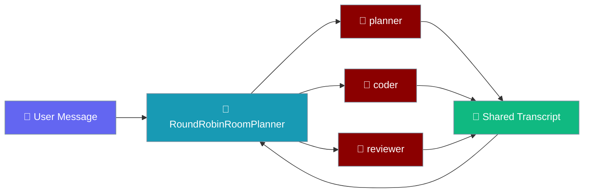
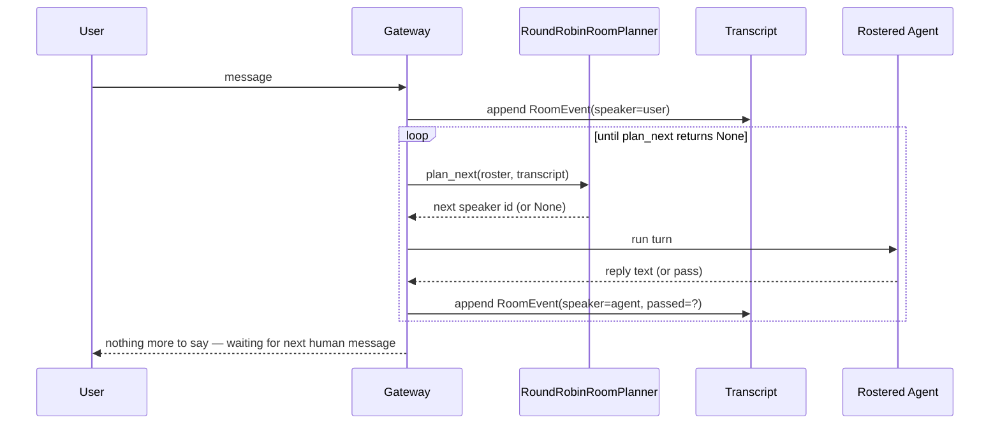
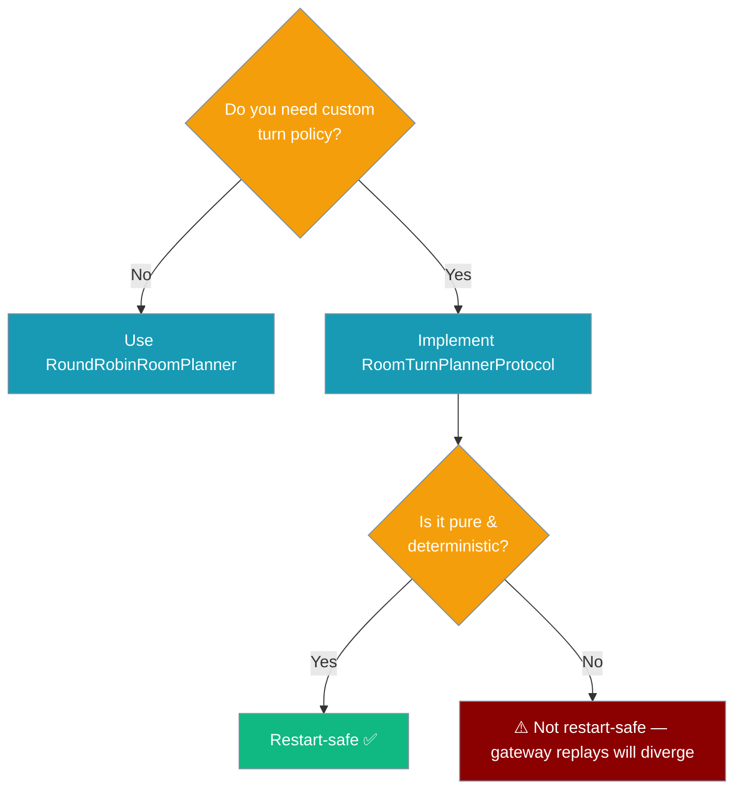

A conversation room lets a roster of agents share one chat, taking turns in a deterministic, bounded, restart-safe order.



## Quick Start

The planner names the next speaker from an immutable `(roster, transcript)` snapshot. You append each reply and ask again.

<Steps>

<Step title="Schedule the opening round">

Round 0 lets every rostered agent speak once, in roster order, after a human message.

```python
from praisonaiagents.rooms import RoomEvent, RoundRobinRoomPlanner

roster = ["planner", "coder", "reviewer"]
transcript = [RoomEvent(speaker="user", content="build a login form", round=0)]

planner = RoundRobinRoomPlanner()

while (next_speaker := planner.plan_next(roster, transcript)) is not None:
    print("next up:", next_speaker)
    # In a real gateway: run the named agent, append its reply below.
    transcript.append(RoomEvent(speaker=next_speaker, content="...", round=0))
```

</Step>

<Step title="Hand off with @-mentions">

An agent addresses a teammate with `@name` to admit them into the next round. Admitted agents speak in roster order.

```python
from praisonaiagents.rooms import RoomEvent, RoundRobinRoomPlanner

roster = ["planner", "coder", "reviewer"]
planner = RoundRobinRoomPlanner(max_rounds=3, max_messages=10)

transcript = [
    RoomEvent(speaker="user",     content="build a login form",            round=0),
    RoomEvent(speaker="planner",  content="step 1: form. @coder please.",  round=0),
    RoomEvent(speaker="coder",    content="done — @reviewer take a look",  round=0),
    RoomEvent(speaker="reviewer", content="looks good",                    round=0),
]

# Round 0 is filled. planner @-mentioned coder, coder @-mentioned reviewer,
# so round 1 admits coder then reviewer (in roster order):
assert planner.plan_next(roster, transcript) == "coder"
```

</Step>

</Steps>

---

## How It Works

The gateway persists the transcript and replays the planner; the planner never touches a clock, RNG, or external state.



`plan_next` returns `None` when the current activity is settled, signalling the room to wait for the next human message.

---

## Configuration Options

`RoundRobinRoomPlanner` is a dataclass with two hard caps.

| Option | Type | Default | Description |
|--------|------|---------|-------------|
| `max_rounds` | `int` | `3` | Hard cap. No turns are scheduled at or beyond this round. Must be `>= 1` (else `ValueError`). |
| `max_messages` | `int` | `20` | Hard cap on the current activity. No turns once the activity reaches this many events (human + agent, counting passes). Must be `>= 1`. |

`RoomEvent` is a frozen dataclass — immutable, hashable, and safe to persist or replay.

| Field | Type | Default | Description |
|--------|------|---------|-------------|
| `speaker` | `str` | — | Agent id from the roster, or any non-roster id (e.g. a human participant). |
| `content` | `str` | `""` | Message text. Scanned for `@name` addressing. |
| `round` | `int` | `0` | Turn-taking round this event belongs to. |
| `passed` | `bool` | `False` | `True` means the speaker was scheduled but passed. Still consumes the turn. |

---

## Turn-Taking Rules

<AccordionGroup>

<Accordion title="Round 0 — opening fan-out">

After a human message, every rostered agent speaks once in roster order. This is the "everyone on round 0" default.

</Accordion>

<Accordion title="Later rounds — @-mention admission">

A round *N+1* admits only the agents that were `@`-mentioned by an agent during round *N*, and only agents actually on the roster. Mentions are honoured in **roster order** (not mention order). An agent speaks at most once per round.

</Accordion>

<Accordion title="Bounded — hard stops">

`max_rounds` and `max_messages` are hard stops; a room can never loop unbounded.

</Accordion>

<Accordion title="Restart-safe — pure replay">

The plan is a pure function of `(roster, transcript)`. Replaying a persisted transcript yields the identical next speaker — no double-execution, no lost turn.

</Accordion>

</AccordionGroup>

---

## Current Activity Semantics

The planner scopes accounting to the slice of the transcript from the last human (non-roster) message onward.

- A room only starts once a human (non-roster) message has been seen. Before that, `plan_next` returns `None`.
- `max_messages` is **per activity, not lifetime**. A settled room reliably restarts on the next human message, no matter how long the historical transcript is.
- `@`-mention admission is also scoped to the current activity — stale mentions from a prior settled activity do not leak into a new activity's later rounds.

---

## Mention Parsing

`extract_mentions(text)` returns the ordered, de-duplicated list of `@name` mentions found in `text`.

```python
from praisonaiagents.rooms import extract_mentions

extract_mentions("@coder and @reviewer, then @coder again")
# ['coder', 'reviewer']  — first-seen order, de-duplicated

extract_mentions("email me at foo@bar.com")
# []  — a @ glued to a word character is not a mention

extract_mentions("")
# []
```

- First-seen order is preserved so addressing is deterministic.
- Case is preserved; matching against roster ids is case-sensitive.
- Name grammar: `@` followed by `[A-Za-z0-9][\w\-.]*` — letters, digits, underscore, dash, dot; a name may not start with `_`, `-`, or `.`.
- Email-safe: a `@` glued to a preceding word character does not match, so scanning human text is safe.

---

## Common Patterns

Pick a planner based on whether the default round-robin policy fits your room.



1. **Round 0 fan-out** — every rostered agent speaks once, in roster order.
2. **`@`-mention hand-off** — an agent addresses a teammate to admit them to the next round.
3. **Explicit pass** — an agent has nothing to add; emit `RoomEvent(speaker=..., passed=True)` to advance without a reply.
4. **Restart-safe replay** — persist the transcript; on restart, re-run `plan_next(roster, transcript)` for the identical next speaker.
5. **Custom planner** — implement `RoomTurnPlannerProtocol.plan_next` for a domain-specific policy. Keep it pure and I/O-free.

A custom planner satisfies `RoomTurnPlannerProtocol` because the protocol is `@runtime_checkable`:

```python
from typing import Optional, Sequence
from praisonaiagents.rooms import RoomEvent, RoomTurnPlannerProtocol

class FirstAgentPlanner:
    def plan_next(
        self,
        roster: Sequence[str],
        transcript: Sequence[RoomEvent],
    ) -> Optional[str]:
        return roster[0] if roster else None

assert isinstance(FirstAgentPlanner(), RoomTurnPlannerProtocol)
```

---

## Best Practices

<AccordionGroup>

<Accordion title="Keep custom planners pure">

No clock, no RNG, no I/O. Purity is the whole property that makes a room restart-safe.

</Accordion>

<Accordion title="Roster order is your tie-breaker">

When multiple agents are admitted (round 0, or several `@`-mentions in one round), they speak in roster order, not mention order. Design roster order intentionally.

</Accordion>

<Accordion title="Set caps conservatively">

`max_rounds` and `max_messages` are the guardrails against runaway loops. `RoundRobinRoomPlanner()` defaults to `3` rounds and `20` messages per activity.

</Accordion>

<Accordion title="Prefer passed=True over an empty reply">

A pass consumes the turn and advances the planner while reading as an intentional silence in the transcript.

</Accordion>

<Accordion title="Don't rely on lifetime transcript length">

Message caps are per activity (per human message), by design. A long historical transcript never permanently disables a room.

</Accordion>

</AccordionGroup>

---

## Related

<CardGroup cols={2}>

<Card title="Bot Gateway" icon="plug" href="/features/bot-gateway">
  The gateway that drives the planner in a live chat.
</Card>

<Card title="AgentTeam" icon="users" href="/concepts/agentteam">
  The in-process, run-to-completion counterpart to a live conversation room.
</Card>

<Card title="Gateway Turn Lock" icon="lock" href="/features/gateway-turn-lock">
  Serialise per-session turns across replicas.
</Card>

<Card title="Gateway Turn Executor" icon="play" href="/features/gateway-turn-executor">
  Runs a scheduled turn against an agent.
</Card>

</CardGroup>
