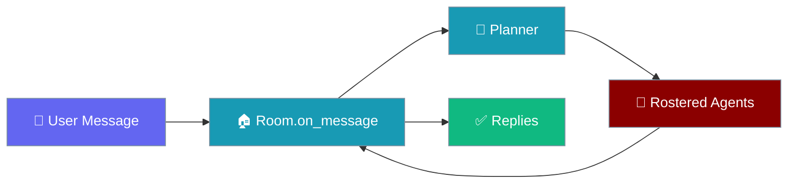
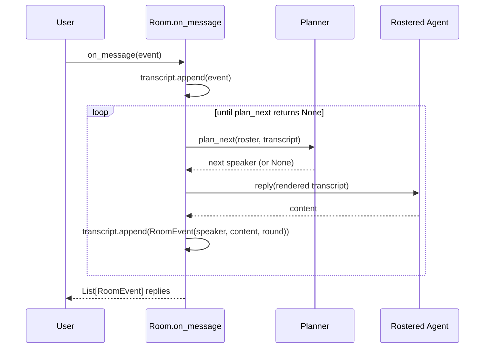

A conversation room lets a roster of agents share one chat and reply on their own — you send a message, the room runs the scheduled turns in a deterministic, bounded, restart-safe order and hands you the replies.


```mermaid
graph LR
    User[👤 User Message] --> Room[🏠 Room.on_message]
    Room --> Planner[🧠 Planner]
    Planner --> Agents[🤖 Rostered Agents]
    Agents --> Room
    Room --> Replies[✅ Replies]

    classDef user fill:#6366F1,stroke:#7C90A0,color:#fff
    classDef process fill:#189AB4,stroke:#7C90A0,color:#fff
    classDef agent fill:#8B0000,stroke:#7C90A0,color:#fff
    classDef result fill:#10B981,stroke:#7C90A0,color:#fff

    class User user
    class Room,Planner process
    class Agents agent
    class Replies result
```

## Quick Start

Build a team of agents, name the roster, and send one message — the room runs every scheduled turn and returns the replies.

<Steps>

<Step title="Simple room">

Three agents share one chat. `on_message` fans out to the whole roster and returns their replies.

```python
from praisonaiagents import Agent
from praisonaiagents.rooms import Room, RoomConfig, RoomEvent

researcher = Agent(name="researcher", instructions="Research the topic.")
critic     = Agent(name="critic",     instructions="Critique proposals.")
writer     = Agent(name="writer",     instructions="Write the final draft.")

cfg = RoomConfig(name="standup", roster=["researcher", "critic", "writer"])
room = Room(cfg, agents={
    "researcher": researcher.achat,
    "critic":     critic.achat,
    "writer":     writer.achat,
})

replies = await room.on_message(RoomEvent(speaker="user", content="plan the sprint @critic"))
for turn in replies:
    print(f"{turn.speaker}: {turn.content}")
```

</Step>

<Step title="Configure caps">

Bound the conversation with `max_rounds` and `max_messages` so a room can never loop unbounded.

```python
from praisonaiagents.rooms import RoomConfig

cfg = RoomConfig(
    name="standup",
    roster=["researcher", "critic", "writer"],
    max_rounds=2,
    max_messages=10,
)
```

</Step>

<Step title="Load from YAML / dict">

Build the config from a parsed mapping. Either `roster:` or `agents:` names the roster.

```python
from praisonaiagents.rooms import RoomConfig

cfg = RoomConfig.from_dict("standup", {
    "agents": ["researcher", "critic", "writer"],
    "max_rounds": 2,
})
```

</Step>

<Step title="Advanced: drive the planner yourself">

If you're building a wrapper that persists its own transcript, drive `plan_next` directly instead of using `Room`.

```python
from praisonaiagents.rooms import RoomEvent, RoundRobinRoomPlanner

roster = ["planner", "coder", "reviewer"]
transcript = [RoomEvent(speaker="user", content="build a login form", round=0)]

planner = RoundRobinRoomPlanner()

while (next_speaker := planner.plan_next(roster, transcript)) is not None:
    print("next up:", next_speaker)
    # Run the named agent, then append its reply below.
    transcript.append(RoomEvent(speaker=next_speaker, content="...", round=0))
```

</Step>

</Steps>

---

## User Interaction Flow

A real user builds a team and asks the room a question — no manual loop, no reset.

1. Create `Agent` objects.
2. Declare a `RoomConfig` naming the roster.
3. Build a `Room(cfg, agents=...)`.
4. `await room.on_message(RoomEvent(speaker="user", content="..."))`.
5. The room fans out to round 0, honours any `@`-mentions for later rounds, and returns the replies.
6. The next user message reopens a fresh activity automatically.

---

## How a Room Runs

`Room.on_message` appends your event, drains the planner, runs each scheduled agent, and returns the replies.


```mermaid
sequenceDiagram
    participant User
    participant Room as Room.on_message
    participant Planner
    participant Agent as Rostered Agent

    User->>Room: on_message(event)
    Room->>Room: transcript.append(event)
    loop until plan_next returns None
        Room->>Planner: plan_next(roster, transcript)
        Planner-->>Room: next speaker (or None)
        Room->>Agent: reply(rendered transcript)
        Agent-->>Room: content
        Room->>Room: transcript.append(RoomEvent(speaker, content, round))
    end
    Room-->>User: List[RoomEvent] replies
```

The planner is pure, so persisting `room.transcript` and rebuilding the room is enough to resume — replaying a settled transcript returns no next speaker, so there is no double-execution.

<Note>
The transcript is **in-memory only**. `Room` holds no durable state — a wrapper (`praisonai-bot`) persists `room.transcript` and handles platform delivery.
</Note>

---

## Choosing a Configuration Surface

Pick where your room config lives.


```mermaid
graph TB
    Q{Where does your<br/>room config live?} -->|In code| Direct[RoomConfig&#40;name=..., roster=...&#41;]
    Q -->|YAML / dict| FromDict[RoomConfig.from_dict&#40;name, data&#41;]
    Q -->|You're building a wrapper<br/>with durable storage| Raw[Drive RoundRobinRoomPlanner<br/>and persist transcript yourself]

    classDef q fill:#F59E0B,stroke:#7C90A0,color:#fff
    classDef code fill:#189AB4,stroke:#7C90A0,color:#fff
    classDef advanced fill:#8B0000,stroke:#7C90A0,color:#fff

    class Q q
    class Direct,FromDict code
    class Raw advanced
```

---

## Configuration Options

`RoomConfig` is a dataclass describing the roster and planner caps.

| Option | Type | Default | Description |
|--------|------|---------|-------------|
| `name` | `str` | — (required) | Room identifier (e.g. `room:standup`). Must be non-empty, else `ValueError`. |
| `roster` | `List[str]` | `[]` | Ordered agent ids that take turns. |
| `planner` | `str` | `"round_robin"` | Planner selector. Only `"round_robin"` is valid; any other value raises `ValueError`. |
| `max_rounds` | `int` | `3` | Hard cap on turn-taking rounds. Must be `>= 1`. |
| `max_messages` | `int` | `20` | Hard cap on messages per human-initiated activity. Must be `>= 1`. |

`RoomConfig` methods:

- `build_planner()` — constructs `RoundRobinRoomPlanner(max_rounds=..., max_messages=...)`.
- `to_dict()` — plain dict for YAML round-tripping or diagnostics.
- `RoomConfig.from_dict(name, data)` — builds from a parsed mapping; accepts `roster:` or `agents:`. Rejects scalar values (bare string, bytes, mapping) with an actionable `ValueError`.

`RoundRobinRoomPlanner` is a dataclass with two hard caps.

| Option | Type | Default | Description |
|--------|------|---------|-------------|
| `max_rounds` | `int` | `3` | No turns are scheduled at or beyond this round. Must be `>= 1`. |
| `max_messages` | `int` | `20` | No turns once the activity reaches this many events (human + agent, counting passes). Must be `>= 1`. |

`RoomEvent` is a frozen dataclass — immutable, hashable, and safe to persist or replay.

| Field | Type | Default | Description |
|--------|------|---------|-------------|
| `speaker` | `str` | — | Agent id from the roster, or any non-roster id (e.g. a human participant). |
| `content` | `str` | `""` | Message text. Scanned for `@name` addressing. |
| `round` | `int` | `0` | Turn-taking round this event belongs to. |
| `passed` | `bool` | `False` | `True` means the speaker was scheduled but passed. Still consumes the turn. |

For the full `Room` and `RoomConfig` API surface, see the auto-generated SDK reference.

<Card title="Rooms SDK Reference" icon="code" href="/docs/sdk/reference/praisonaiagents/modules/rooms">
  Every `Room` and `RoomConfig` parameter, method, and default.
</Card>

---

## Turn-Taking Rules

<AccordionGroup>

<Accordion title="Round 0 — opening fan-out">

After a human message, every rostered agent speaks once in roster order. This is the "everyone on round 0" default.

</Accordion>

<Accordion title="Later rounds — @-mention admission">

A round *N+1* admits only the agents that were `@`-mentioned by an agent during round *N*, and only agents actually on the roster. Mentions are honoured in **roster order** (not mention order). An agent speaks at most once per round.

</Accordion>

<Accordion title="Bounded — hard stops">

`max_rounds` and `max_messages` are hard stops; a room can never loop unbounded.

</Accordion>

<Accordion title="Restart-safe — pure replay">

The plan is a pure function of `(roster, transcript)`. Rebuild a `Room` from a persisted transcript and `plan_next` returns the identical next speaker — no double-execution, no lost turn.

</Accordion>

</AccordionGroup>

---

## Current Activity Semantics

The planner scopes accounting to the slice of the transcript from the last human (non-roster) message onward.

- A room only starts once a human (non-roster) message has been seen. Before that, `plan_next` returns `None`.
- `max_messages` is **per activity, not lifetime**. A settled room reliably restarts on the next human message, no matter how long the historical transcript is.
- `@`-mention admission is also scoped to the current activity — stale mentions from a prior settled activity do not leak into a new activity's later rounds.

---

## Mention Parsing

`extract_mentions(text)` returns the ordered, de-duplicated list of `@name` mentions found in `text`.

```python
from praisonaiagents.rooms import extract_mentions

extract_mentions("@coder and @reviewer, then @coder again")
# ['coder', 'reviewer']  — first-seen order, de-duplicated

extract_mentions("email me at foo@bar.com")
# []  — a @ glued to a word character is not a mention

extract_mentions("")
# []
```

- First-seen order is preserved so addressing is deterministic.
- Case is preserved; matching against roster ids is case-sensitive.
- Name grammar: `@` followed by `[A-Za-z0-9][\w\-.]*` — letters, digits, underscore, dash, dot; a name may not start with `_`, `-`, or `.`.
- Email-safe: a `@` glued to a preceding word character does not match, so scanning human text is safe.

---

## Common Patterns

<AccordionGroup>

<Accordion title="Concurrent messages are safe">

Two overlapping `on_message` calls do not interleave — each is serialised through an internal `asyncio.Lock`, so every human message opens exactly one round-0 activity and no agent double-executes for one activity.

</Accordion>

<Accordion title="Unknown roster id passes automatically">

An id in `roster` with no matching `agents` entry records a `passed=True` turn so the planner advances instead of looping forever on a missing agent.

```python
from praisonaiagents.rooms import Room, RoomConfig, RoomEvent

async def reply(prompt: str) -> str:
    return "on it"

cfg = RoomConfig(name="r", roster=["ghost", "real"])
room = Room(cfg, agents={"real": reply})  # "ghost" has no callable

replies = await room.on_message(RoomEvent(speaker="user", content="hi"))
# "ghost" records passed=True; "real" replies.
```

</Accordion>

<Accordion title="Custom render">

Pass `render=lambda transcript: ...` to control the prompt handed to each agent. The default joins `speaker: content` lines.

```python
from praisonaiagents.rooms import Room, RoomConfig

cfg = RoomConfig(name="r", roster=["a", "b"])
room = Room(
    cfg,
    agents={"a": a.achat, "b": b.achat},
    render=lambda transcript: "\n".join(f"[{e.speaker}] {e.content}" for e in transcript),
)
```

</Accordion>

<Accordion title="Custom planner">

Pass `planner=MyPlanner()` for a domain-specific policy. The runtime tags each turn with the activity's current round rather than inventing round-robin admission, so custom planners are never fed misleading round labels.

```python
from typing import Optional, Sequence
from praisonaiagents.rooms import Room, RoomConfig, RoomEvent, RoomTurnPlannerProtocol

class FirstAgentPlanner:
    def plan_next(
        self,
        roster: Sequence[str],
        transcript: Sequence[RoomEvent],
    ) -> Optional[str]:
        return roster[0] if roster else None

assert isinstance(FirstAgentPlanner(), RoomTurnPlannerProtocol)

cfg = RoomConfig(name="r", roster=["a", "b"])
room = Room(cfg, agents={"a": a.achat, "b": b.achat}, planner=FirstAgentPlanner())
```

</Accordion>

<Accordion title="Explicit pass">

An agent with nothing to add returns an empty reply, recorded as a turn that advances the planner without adding content.

</Accordion>

</AccordionGroup>

---

## Best Practices

<AccordionGroup>

<Accordion title="Keep custom planners pure">

No clock, no RNG, no I/O. Purity is the whole property that makes a room restart-safe.

</Accordion>

<Accordion title="Roster order is your tie-breaker">

When multiple agents are admitted (round 0, or several `@`-mentions in one round), they speak in roster order, not mention order. Design roster order intentionally.

</Accordion>

<Accordion title="Set caps conservatively">

`max_rounds` and `max_messages` are the guardrails against runaway loops. `RoomConfig()` defaults to `3` rounds and `20` messages per activity.

</Accordion>

<Accordion title="Persist the transcript for durability">

`Room` keeps the transcript in memory only. To survive a restart, persist `room.transcript` in your wrapper and rebuild the room from it — the pure planner resumes the identical schedule.

</Accordion>

<Accordion title="Don't rely on lifetime transcript length">

Message caps are per activity (per human message), by design. A long historical transcript never permanently disables a room.

</Accordion>

</AccordionGroup>

---

## Related

<CardGroup cols={2}>

<Card title="Rooms SDK Reference" icon="code" href="/docs/sdk/reference/praisonaiagents/modules/rooms">
  Full `Room` and `RoomConfig` API surface.
</Card>

<Card title="Bot Gateway" icon="plug" href="/features/bot-gateway">
  The `praisonai-bot` wrapper adds durable persistence and platform delivery.
</Card>

<Card title="AgentTeam" icon="users" href="/concepts/agentteam">
  The in-process, run-to-completion counterpart to a live conversation room.
</Card>

<Card title="Gateway Turn Lock" icon="lock" href="/features/gateway-turn-lock">
  Serialise per-session turns across replicas.
</Card>

</CardGroup>
