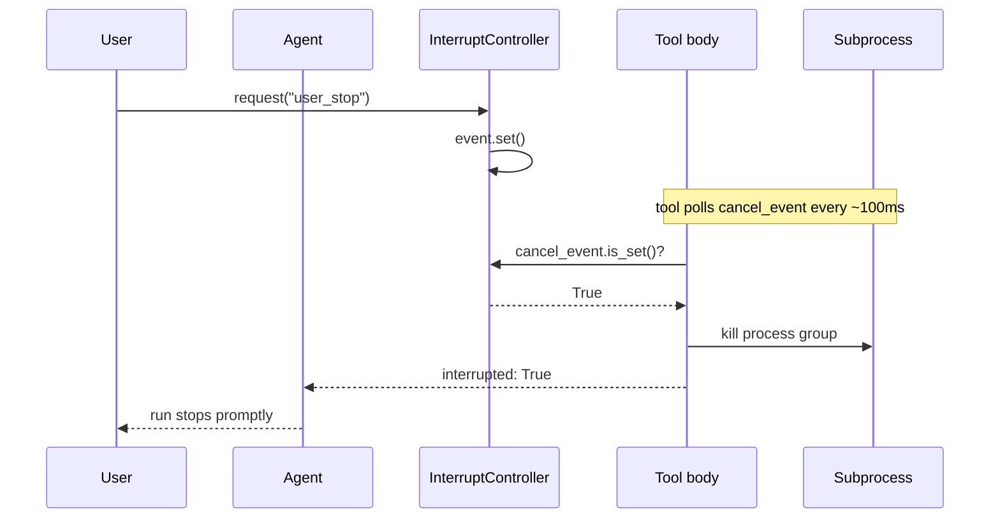
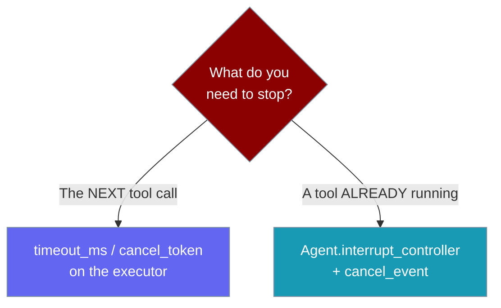

Cancellation now reaches the tool body that is *already running*, so a `/stop` or Ctrl-C aborts a live subprocess within ~100ms instead of waiting for its own timeout.


<Note>
**This is in-flight cancellation.** It stops a tool that is *already running*. To stop the *next* tool call (deadline or token), see [Tool Timeouts & Cancellation](/features/tool-timeout).
</Note>

## Quick Start

<Steps>
<Step title="Just works from an agent">

Give the agent an `InterruptController`, then request a stop from another thread — a running `shell` tool body is aborted within ~100ms and its result carries `interrupted: True`.

```python
from praisonaiagents import Agent
from praisonaiagents.agent import InterruptController

controller = InterruptController()

agent = Agent(
    name="Runner",
    instructions="Run shell commands when asked.",
    tools=["shell"],
    interrupt_controller=controller,
)

# From another thread / the CLI /stop / Ctrl-C handler:
controller.request("user_stop")
# A running `shell` tool body is aborted within ~100ms and the
# tool result carries `interrupted: True`.
```

</Step>

<Step title="Custom tool opts into cooperative abort">

Read the event inside a custom tool via `Injected[AgentState]`, then poll or wait on it to bail out promptly.

```python
from praisonaiagents import Agent
from praisonaiagents.tools import tool, AgentState, Injected

@tool
def slow_download(url: str, state: Injected[AgentState]) -> str:
    cancel = state.cancel_event
    for chunk in stream(url):                 # your streaming source
        if cancel is not None and cancel.is_set():
            return "interrupted"
        process(chunk)                          # your per-chunk work
    return "done"

agent = Agent(name="Downloader", tools=[slow_download])
```

</Step>
</Steps>

---

## How It Works

The controller exposes its underlying `Event`; the tool-execution loop threads it into `AgentState.cancel_event`, and the running tool polls it every ~100ms.



The event is scoped to the current turn: the controller clears its flag when an interrupted turn ends, so a stale request cannot abort tools launched by the next turn.

---

## Reading the outcome

The built-in `shell` tool returns a discriminated `interrupted` payload — distinct from a `timeout`.

| Field | Value | Meaning |
|-------|-------|---------|
| `stdout` | `''` | No output captured on abort |
| `stderr` | `'Command interrupted by user'` | Human-readable reason |
| `exit_code` | `-1` | Process did not exit normally |
| `success` | `False` | The call did not complete |
| `interrupted` | `True` | Aborted by cooperative interrupt (not a timeout) |
| `execution_time` | `<float>` | Seconds until the abort |

A wall-clock timeout instead returns `stderr='Command timed out after N seconds'` with **no** `interrupted` key — check `result.get('interrupted')` to tell them apart.

---

## Choose your cancellation surface

Pick the surface by *what* you need to stop.



- **Stop the *next* tool** → `cancel_token` / `timeout_ms` on the executor. See [Tool Timeouts & Cancellation](/features/tool-timeout).
- **Stop the tool that is *already running*** → `Agent.interrupt_controller` + `cancel_event` (this page).

---

## Custom `InterruptController` implementations

Exposing the `event` is optional — a controller without it keeps working, giving loop-level cancellation only.

```python
import threading
from praisonaiagents import Agent

class MyController:
    def __init__(self):
        self._flag = threading.Event()

    def request(self, reason: str = "user") -> None:
        self._flag.set()

    def clear(self) -> None:
        self._flag.clear()

    def is_set(self) -> bool:
        return self._flag.is_set()

    @property
    def reason(self):
        return "user" if self._flag.is_set() else None

    def check(self) -> None:
        if self._flag.is_set():
            raise InterruptedError("cancelled")

    @property
    def event(self) -> threading.Event:   # opt in to in-flight abort
        return self._flag

agent = Agent(name="Runner", tools=["shell"], interrupt_controller=MyController())
```

The runtime probes with `getattr(controller, 'event', None)`, so a controller that omits `event` is fully backward compatible — it just skips in-flight abort and cancels at the loop boundary.

---

## Best Practices

<AccordionGroup>
<Accordion title="Check the event exists before using it">
A tool may run standalone with no injected state. Guard with `if state.cancel_event is not None:` before calling `.is_set()` or `.wait()`.
</Accordion>

<Accordion title="Prefer wait over busy-polling">
Use `state.cancel_event.wait(timeout=0.1)` for idle waits instead of a tight `is_set()` loop, so you don't burn CPU while waiting for work or the signal.
</Accordion>

<Accordion title="Keep the poll window short">
Poll roughly every ~100ms — the same cadence the built-in `shell` tool uses — so `/stop` feels instant to the user.
</Accordion>

<Accordion title="Do not persist the event across turns">
The event is scoped to the current turn and cleared when an interrupted turn ends. Read it fresh from `state.cancel_event` each call; never cache it on a module or instance.
</Accordion>
</AccordionGroup>

---

## Related

<CardGroup cols={2}>
  <Card title="Tool Timeouts" icon="stopwatch" href="/features/tool-timeout">
    Deadlines and the executor-level cancel token
  </Card>
  <Card title="Tool Progress" icon="wave-pulse" href="/features/tool-progress-streaming">
    Surface progress from the same slow tools
  </Card>
  <Card title="Gateway Abort & Timeout" icon="server" href="/features/gateway-abort-and-timeout">
    HTTP-facing abort and deadlines
  </Card>
  <Card title="Run Outcome" icon="flag-checkered" href="/features/run-outcome">
    Read the discriminated outcome from a run
  </Card>
</CardGroup>
