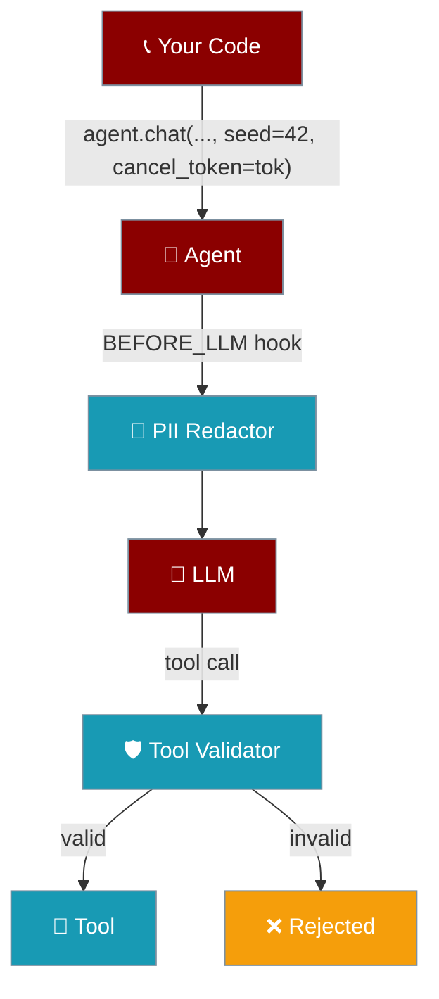

Four small switches that make a PraisonAI agent **safer, more deterministic, and easier to interrupt** in production.

<Note>
All four are **opt-in and zero-overhead when unused**. No existing code changes behaviour unless you actively enable a feature.
</Note>



## Quick reference

<CardGroup cols={2}>
  <Card title="seed" icon="dice">
    Per-call determinism. Pass `seed=42` to `Agent.chat()` and the LLM receives the same seed — same prompt, same output.
  </Card>
  <Card title="cancel_token" icon="ban">
    Cooperative cancellation. Pass an `InterruptController` to `Agent.chat()` and trip it from another thread to abort cleanly.
  </Card>
  <Card title="Tool validator" icon="shield-check">
    Attach any `ToolValidatorProtocol` to reject bad tool-call arguments before the tool function runs.
  </Card>
  <Card title="PII redaction" icon="eye-slash">
    One call — `enable_pii_redaction()` — scrubs API keys, SSNs, credit cards, and emails from every message sent to the LLM.
  </Card>
</CardGroup>

## Deterministic seed

<Tip>Use this for snapshot tests, replayable demos, and reproducible evals.</Tip>

<CodeGroup>
```python Python
from praisonaiagents import Agent

agent = Agent(
    name="helper",
    instructions="You are a concise assistant.",
    llm={"model": "gpt-4o-mini"},
)

# Same seed → same model output (provider-permitting)
print(agent.chat("Pick a number 1-100", seed=42))
print(agent.chat("Pick a number 1-100", seed=42))
```
</CodeGroup>

<ParamField path="seed" type="int | None" default="None">
Per-call random seed. Overrides any `seed` set on the underlying `LLM` instance for this call only.
</ParamField>

## Cooperative cancellation

<Callout type="info">
`cancel_token` is checked **at agent start** and **right before the LLM call** — no hard kills, no partial writes.
</Callout>

<CodeGroup>
```python Python
import threading
from praisonaiagents import Agent
from praisonaiagents.agent.interrupt import InterruptController

agent = Agent(name="worker", instructions="…", llm={"model": "gpt-4o-mini"})
tok = InterruptController()

def do_work():
    try:
        print(agent.chat("Write a long essay about Rome.", cancel_token=tok))
    except InterruptedError as e:
        print(f"Aborted cleanly: {e}")

threading.Thread(target=do_work).start()
# … later, from any thread:
tok.request("user pressed stop")
```
</CodeGroup>

<ParamField path="cancel_token" type="InterruptController | None" default="None">
A cooperative cancellation token. When tripped (via `tok.request(reason)`), the next checkpoint raises `InterruptedError`.
</ParamField>

## Tool argument validation

<Warning>
This runs **after** the `BEFORE_TOOL` hook and **before** the tool function. Rejections return a string error to the LLM instead of executing the tool.
</Warning>

<CodeGroup>
```python Python
from praisonaiagents import Agent
from praisonaiagents.tools.validators import ValidationResult

class RangeValidator:
    def validate_args(self, tool_name, args, context=None):
        if tool_name == "set_temperature" and not 0 <= args.get("value", 0) <= 100:
            return ValidationResult(
                valid=False,
                errors=["temperature must be between 0 and 100"],
                remediation="Use a value in the 0-100 range.",
            )
        return ValidationResult(valid=True)

    def validate_result(self, tool_name, result, context=None):
        return ValidationResult(valid=True)

def set_temperature(value: float) -> str:
    return f"set to {value}"

agent = Agent(name="thermostat", tools=[set_temperature], llm={"model": "gpt-4o-mini"})
agent._tool_validator = RangeValidator()

print(agent.chat("Set the temperature to 500"))  # validator rejects, tool never runs
```
</CodeGroup>

<Accordion title="Why attach via attribute instead of __init__?">
`Agent.__init__` already has many parameters; adding a validator slot would grow the public surface.
Attribute-assignment keeps the feature **fully opt-in with zero surface impact** on simple agents.
</Accordion>

## PII redaction

<Check>Scrubs **egress to the LLM** — the raw prompt still sits in your local chat history for audit.</Check>

<Steps>
  <Step title="Enable once at startup">
    ```python
    from praisonaiagents.trace import enable_pii_redaction
    enable_pii_redaction()  # idempotent — safe to call many times
    ```
  </Step>
  <Step title="Use agents normally">
    Every `BEFORE_LLM` event now passes messages through the scrubber.
  </Step>
  <Step title="Disable in tests if needed">
    ```python
    from praisonaiagents.trace import disable_pii_redaction
    disable_pii_redaction()
    ```
  </Step>
</Steps>

### What gets scrubbed

<Tabs>
  <Tab title="Key=value pairs">
    `api_key=sk-…`, `password: hunter2`, `token=…`, `secret_key=…` → `[REDACTED]`
  </Tab>
  <Tab title="Naked tokens">
    OpenAI-style `sk-ABCDEF…` keys → `[REDACTED]`
  </Tab>
  <Tab title="Identifiers">
    US SSNs `123-45-6789` → `[REDACTED-SSN]`, credit cards → `[REDACTED-CC]`, emails → `[REDACTED-EMAIL]`
  </Tab>
</Tabs>

<Accordion title="Can I customise the rules?">
Yes — import `scrub_pii_text` and use it inside your own `BEFORE_LLM` hook, or extend `REDACT_KEYS` / `_VALUE_PATTERNS` before calling `enable_pii_redaction()`.
</Accordion>

## Combined example

```python
from praisonaiagents import Agent
from praisonaiagents.agent.interrupt import InterruptController
from praisonaiagents.tools.validators import ValidationResult
from praisonaiagents.trace import enable_pii_redaction

enable_pii_redaction()

class AllowAll:
    def validate_args(self, n, a, context=None):  return ValidationResult(valid=True)
    def validate_result(self, n, r, context=None): return ValidationResult(valid=True)

agent = Agent(name="all-four", instructions="…", llm={"model": "gpt-4o-mini"})
agent._tool_validator = AllowAll()

tok = InterruptController()
reply = agent.chat(
    "My api_key=sk-XYZ — what is 2+2?",
    seed=42,
    cancel_token=tok,
)
print(reply)
```

## Performance

<Info>
Every feature short-circuits to a single attribute-read when inactive. No background threads, no module-level side-effects, no added imports in the hot path.
</Info>
