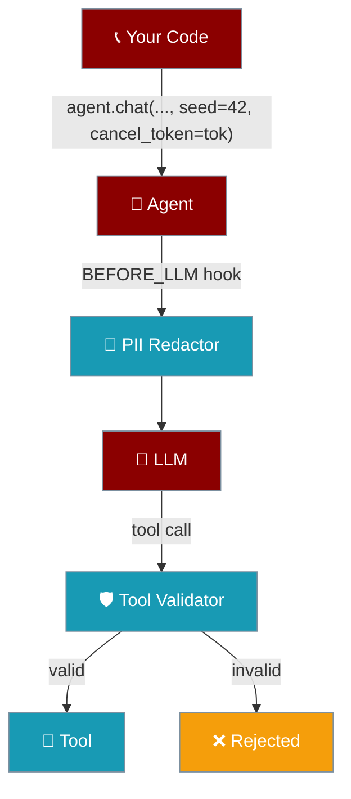
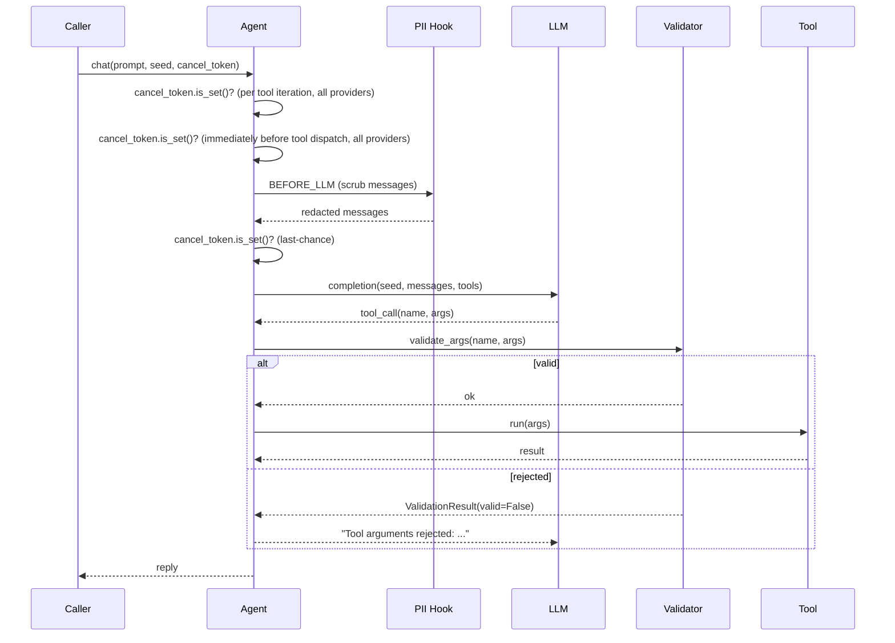
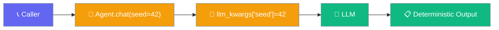
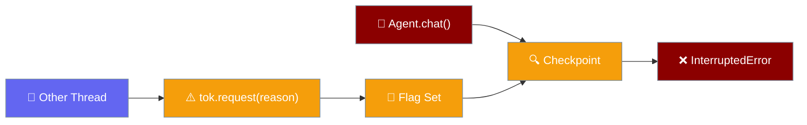
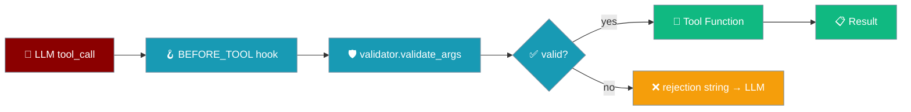
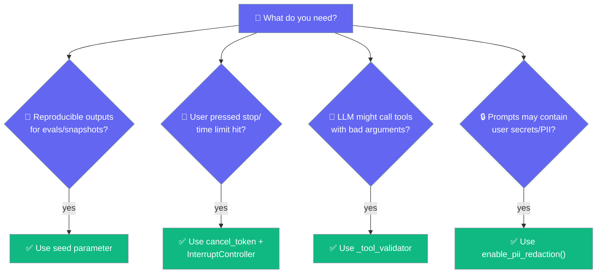

Four small switches that make a PraisonAI agent **safer, more deterministic, and easier to interrupt** in production.

The user starts a run; core controls enforce safety policies during execution.

```python
from praisonaiagents import Agent

agent = Agent(
    name="assistant",
    instructions="Run with guardrails, interrupts, and validation enabled",
)

agent.start("Execute this task safely")
```



## Quick Start

<Steps>
  <Step title="PII Redaction">
    ```python
    from praisonaiagents import Agent
    from praisonaiagents.trace import enable_pii_redaction

    enable_pii_redaction()  # idempotent; safe to call multiple times

    agent = Agent(
        name="helper",
        instructions="You are a concise assistant.",
        llm={"model": "gpt-4o-mini"},
    )
    print(agent.chat("My api_key=sk-XYZ — what is 2+2?"))
    ```
  </Step>
  <Step title="Deterministic Seed & Cancellation">
    ```python
    from praisonaiagents import Agent
    from praisonaiagents.agent.interrupt import InterruptController

    agent = Agent(name="helper", instructions="You are a concise assistant.", llm={"model": "gpt-4o-mini"})
    tok = InterruptController()

    reply = agent.chat("Pick a number 1-100.", seed=42, cancel_token=tok)
    ```
  </Step>
  <Step title="Tool Validation">
    ```python
    from praisonaiagents import Agent
    from praisonaiagents.tools.validators import ValidationResult

    class RangeValidator:
        def validate_args(self, tool_name, args, context=None):
            if tool_name == "set_temperature" and not 0 <= args.get("value", 0) <= 100:
                return ValidationResult(valid=False, errors=["temperature 0-100"])
            return ValidationResult(valid=True)
        def validate_result(self, tool_name, result, context=None):
            return ValidationResult(valid=True)

    def set_temperature(value: float) -> str:
        return f"set to {value}"

    agent = Agent(name="thermostat", tools=[set_temperature], llm={"model": "gpt-4o-mini"})
    agent._tool_validator = RangeValidator()
    print(agent.chat("Set the temperature to 500"))
    ```
  </Step>
</Steps>

---

## How It Works



---

## Configuration Options

| Option | Type | Default | Description |
|--------|------|---------|-------------|
| `seed` | `int \| None` | `None` | Per-call random seed forwarded to the LLM. Overrides any `seed` set on the `LLM` instance for this call only. |
| `cancel_token` | `InterruptController \| None` | `None` | Cooperative cancellation token. When `is_set()` returns true at a checkpoint, raises `InterruptedError(reason)`. Falls back to `agent.interrupt_controller` if not provided. |

---

## Deterministic seed

Per-call determinism for reproducible outputs.



```python
from praisonaiagents import Agent

agent = Agent(
    name="helper",
    instructions="You are a concise assistant.",
    llm={"model": "gpt-4o-mini"},
)

# Same seed → same model output (provider-permitting)
print(agent.chat("Pick a number 1-100", seed=42))
print(agent.chat("Pick a number 1-100", seed=42))
```

---

## Cooperative cancellation

Thread-safe cancellation without hard kills.

<Note>
Fixed in [PR #2751](https://github.com/MervinPraison/PraisonAI/pull/2751) (release after 2026-07-07): earlier releases only checked `cancel_token` on the OpenAI completion path in `chat_mixin`. The litellm-backed tool loop in `llm/llm.py` (used for Anthropic, Gemini, Groq, local models, and any non-OpenAI provider) took no cancel token and performed no checkpoint, so `/stop` and `InterruptController.request()` were silently no-ops on those providers. Upgrade to get uniform cancellation across every provider.
</Note>

<Note>
Tightened in [PR #2997](https://github.com/MervinPraison/PraisonAI/pull/2997) (release after 2026-07-14): every tool-loop iteration now checks `cancel_token.is_set()` **twice** — at the top of the iteration and again immediately before dispatching tool calls — in both LiteLLM (`llm/llm.py`) and OpenAI-native (`llm/openai_client.py`) paths, sync and async. This closes a window where a `/stop` arriving between the model returning tool calls and the tools starting could still execute one round of tools before honouring the cancel.
</Note>



```python
import threading
from praisonaiagents import Agent
from praisonaiagents.agent.interrupt import InterruptController

agent = Agent(name="worker", instructions="You are a helpful assistant.", llm={"model": "gpt-4o-mini"})
tok = InterruptController()

def do_work():
    try:
        print(agent.chat("Write a long essay about Rome.", cancel_token=tok))
    except InterruptedError as e:
        print(f"Aborted cleanly: {e}")

threading.Thread(target=do_work).start()
# … later, from any thread:
tok.request("user pressed stop")
```

---

## Tool argument validation

Validate tool arguments before execution.



```python
from praisonaiagents import Agent
from praisonaiagents.tools.validators import ValidationResult

class RangeValidator:
    def validate_args(self, tool_name, args, context=None):
        if tool_name == "set_temperature" and not 0 <= args.get("value", 0) <= 100:
            return ValidationResult(
                valid=False,
                errors=["temperature must be between 0 and 100"],
                remediation="Use a value in the 0-100 range.",
            )
        return ValidationResult(valid=True)

    def validate_result(self, tool_name, result, context=None):
        return ValidationResult(valid=True)

def set_temperature(value: float) -> str:
    return f"set to {value}"

agent = Agent(name="thermostat", tools=[set_temperature], llm={"model": "gpt-4o-mini"})
agent._tool_validator = RangeValidator()

print(agent.chat("Set the temperature to 500"))  # validator rejects, tool never runs
```

**ValidationResult fields:**

| Field | Type | Description |
|-------|------|-------------|
| `valid` | `bool` | Whether validation passed |
| `errors` | `List[str]` | List of error messages |
| `warnings` | `List[str]` | List of warning messages |
| `remediation` | `Optional[str]` | Suggested fix for validation errors |

---

## PII redaction

Scrub sensitive data from LLM requests.


<Steps>
  <Step title="Enable once at startup">
    ```python
    from praisonaiagents.trace import enable_pii_redaction
    enable_pii_redaction()  # idempotent — safe to call many times
    ```
  </Step>
  <Step title="Use agents normally">
    Every `BEFORE_LLM` event now passes messages through the scrubber.
  </Step>
  <Step title="Disable in tests if needed">
    ```python
    from praisonaiagents.trace import disable_pii_redaction
    disable_pii_redaction()
    ```
  </Step>
</Steps>

**What gets scrubbed:**
- Key=value pairs: `api_key=sk-…`, `password: hunter2`, `token=…` → `[REDACTED]`
- Naked tokens: OpenAI-style `sk-ABCDEF…` keys → `[REDACTED]`
- Identifiers: US SSNs `123-45-6789` → `[REDACTED-SSN]`, credit cards → `[REDACTED-CC]`, emails → `[REDACTED-EMAIL]`

---

## Which one do I use?



---

## Common Patterns

### Reproducible eval

```python
from praisonaiagents import Agent

agent = Agent(name="eval", instructions="Pick a random number 1-100", llm={"model": "gpt-4o-mini"})

# Same seed should give same output
response1 = agent.chat("Pick a number", seed=42)
response2 = agent.chat("Pick a number", seed=42)
assert response1 == response2  # Should pass with most providers
```

### Cancel from Ctrl+C handler

```python
import signal
from praisonaiagents import Agent
from praisonaiagents.agent.interrupt import InterruptController

agent = Agent(name="worker", instructions="You are helpful", llm={"model": "gpt-4o-mini"})
tok = InterruptController()

def signal_handler(signum, frame):
    tok.request("sigint")

signal.signal(signal.SIGINT, signal_handler)

try:
    result = agent.chat("Write a very long essay", cancel_token=tok)
    print(result)
except InterruptedError as e:
    print(f"Cancelled: {e}")
```

### Disable redaction in tests

```python
import pytest
from praisonaiagents.trace import enable_pii_redaction, disable_pii_redaction

@pytest.fixture(autouse=True)
def test_redaction():
    # Enable for production-like behavior
    enable_pii_redaction()
    yield
    # Clean up after test
    disable_pii_redaction()
```

---

## Best Practices

<AccordionGroup>
  <Accordion title="Seed reliability">
    Some providers ignore `seed` or treat it as best-effort. Don't rely on it for production routing decisions.
  </Accordion>
  <Accordion title="Thread-safe cancellation">
    `InterruptController.request(...)` is thread-safe. Trip it from a signal handler, an HTTP cancel endpoint, or a parent supervisor.
  </Accordion>
  <Accordion title="Fast validators">
    Validators run on every tool invocation. Avoid network calls or heavy work — return fast `ValidationResult` objects.
  </Accordion>
  <Accordion title="Local audit trail">
    `enable_pii_redaction()` only scrubs messages going to the LLM. Your local chat history still has the raw prompt — keep it secure or scrub it separately.
  </Accordion>
</AccordionGroup>

---

## Related

<CardGroup cols={2}>
  <Card title="Approval" icon="user-check" href="/docs/features/approval">
    Human-in-the-loop approvals for sensitive operations
  </Card>
  <Card title="Guardrails" icon="shield" href="/docs/features/guardrails">
    Input and output validation with custom rules
  </Card>
  <Card title="Security Environment Variables" icon="key" href="/docs/features/security-environment-variables">
    Secure handling of API keys and secrets
  </Card>
  <Card title="Hooks" icon="webhook" href="/docs/features/hooks">
    Event system for BEFORE_LLM and BEFORE_TOOL hooks
  </Card>
</CardGroup>