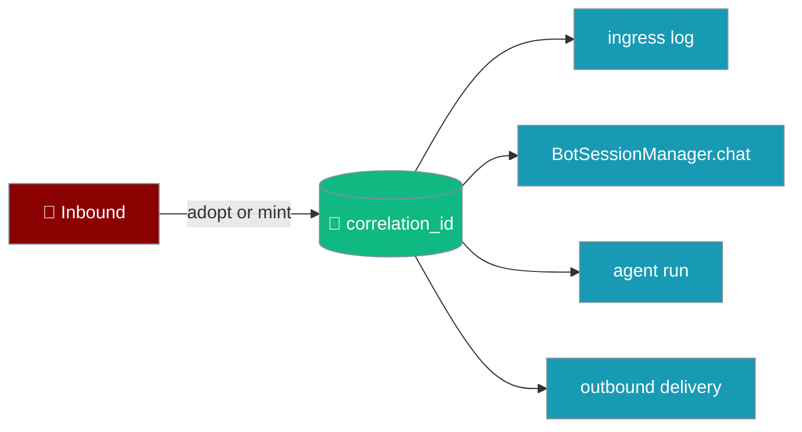
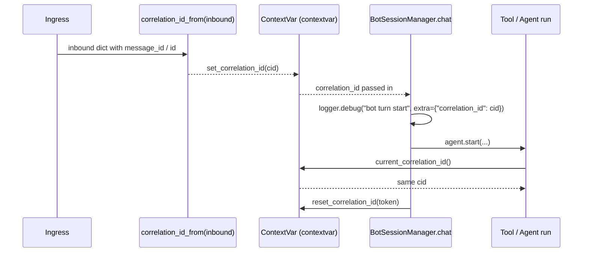

```python
from praisonaiagents import Agent, tool

@tool
def log_correlation() -> str:
    from praisonai.bots import current_correlation_id
    return f"correlation_id={current_correlation_id()}"

agent = Agent(name="ops", instructions="Be helpful.", tools=[log_correlation])
agent.start("Who am I in the logs?")
```

One id per message — read it inside any tool, log it on any hop, and `grep` your logs to follow a single request end to end.

The user sends a message; the same correlation id appears in bot logs, agent tools, and delivery traces for end-to-end debugging.




## Quick Start

<Steps>
  <Step title="Read the correlation id inside a tool">
    ```python
    from praisonai.bots import current_correlation_id
    from praisonaiagents import Agent

    def whoami() -> str:
        cid = current_correlation_id()
        return f"correlation_id={cid}"

    agent = Agent(name="ops", instructions="Be helpful.", tools=[whoami])
    agent.start("who am I?")
    ```
  </Step>

  <Step title="Wrap a turn with a known id">
    ```python
    from praisonai.bots import use_correlation_id
    from praisonaiagents import Agent

    agent = Agent(name="ops", instructions="Be helpful.")

    with use_correlation_id("my-turn-id"):
        agent.start("hello")
    ```
  </Step>

  <Step title="Include the id in every log line">
    ```python
    from praisonai.bots import correlation_log_fields
    import logging

    logger = logging.getLogger("ops")

    logger.info("dispatch", extra=correlation_log_fields({"channel": "telegram"}))
    # Produces: {"correlation_id": "tg-9182", "channel": "telegram", ...}
    ```
  </Step>
</Steps>

---

## How It Works



The id travels through Python's `contextvars` — no thread-locals, no globals. Every async task or thread that inherits the context gets the same id automatically.

---

## Configuration Options

### Adopt-key precedence

When `correlation_id_from(inbound)` is called on a dict or object, it checks keys in order:

| Priority | Key | Example |
|----------|-----|---------|
| 1 | `correlation_id` | `{"correlation_id": "abc123"}` |
| 2 | `message_id` | `{"message_id": "tg-9182"}` |
| 3 | `id` | `{"id": "msg-001"}` |
| — | _(none found)_ | mints a new id |

### ID format

A freshly minted id is the first 8 hex characters of a `uuid4`: e.g. `a3f1c9de`. Short enough to type, unique enough for log correlation.

### Public API

| Symbol | Signature | Behaviour |
|--------|-----------|-----------|
| `new_correlation_id` | `() -> str` | Mint a fresh short correlation id. |
| `correlation_id_from` | `(inbound: Any = None) -> str` | Adopt from dict/attr-bag, else mint. |
| `current_correlation_id` | `() -> Optional[str]` | Read the contextvar. |
| `ensure_correlation_id` | `() -> str` | Return current, minting + setting if absent. |
| `set_correlation_id` | `(cid: Optional[str]) -> contextvars.Token` | Bind on the contextvar. |
| `reset_correlation_id` | `(token) -> None` | Restore previous value. |
| `use_correlation_id` | `(cid: Optional[str] = None) -> Iterator[str]` | Context manager: `with use_correlation_id(cid):` |
| `correlation_log_fields` | `(extra: Optional[Dict[str, Any]] = None) -> Dict[str, Any]` | Merge `{"correlation_id": <current>}` into logging `extra`. |

Import all helpers from the friendly path:

```python
from praisonai.bots import (
    correlation_id_from,
    use_correlation_id,
    current_correlation_id,
    new_correlation_id,
    ensure_correlation_id,
    set_correlation_id,
    reset_correlation_id,
    correlation_log_fields,
)
```

---

## Common Patterns

### Full turn with structured logging

```python
from praisonai.bots import (
    correlation_id_from,
    use_correlation_id,
    current_correlation_id,
    correlation_log_fields,
)
from praisonaiagents import Agent
import logging

logger = logging.getLogger("ops")

def whoami() -> str:
    cid = current_correlation_id()
    logger.info("tool ran", extra=correlation_log_fields({"tool": "whoami"}))
    return f"correlation_id={cid}"

agent = Agent(name="ops", instructions="Be helpful.", tools=[whoami])

inbound = {"message_id": "tg-9182", "text": "who am I?"}
cid = correlation_id_from(inbound)

with use_correlation_id(cid):
    logger.info("turn start", extra=correlation_log_fields())
    agent.start(inbound["text"])
    logger.info("turn end", extra=correlation_log_fields())
```

Every log line carries `correlation_id=tg-9182` — the tool, the session manager's `bot turn start` debug line, and every other hop.

### Forwarding an upstream id from a webhook

```python
from praisonai.bots import correlation_id_from, use_correlation_id
from praisonaiagents import Agent

agent = Agent(name="support", instructions="Help users.")

def handle_webhook(payload: dict):
    cid = correlation_id_from(payload)
    with use_correlation_id(cid):
        agent.start(payload["text"])
```

### Passing through to downstream HTTP calls

```python
import httpx
from praisonai.bots import current_correlation_id

def call_downstream(url: str, body: dict):
    cid = current_correlation_id()
    headers = {}
    if cid:
        headers["X-Correlation-Id"] = cid
    return httpx.post(url, json=body, headers=headers)
```

### Manual token management (advanced)

```python
from praisonai.bots import set_correlation_id, reset_correlation_id

token = set_correlation_id("replay-001")
try:
    pass
finally:
    reset_correlation_id(token)
```

<Tip>
Prefer `use_correlation_id(cid)` as a context manager — it handles the reset automatically.
</Tip>

---

## Best Practices

<AccordionGroup>
  <Accordion title="Always read via current_correlation_id() — never store globally">
    The id lives in a `ContextVar`. Reading it with `current_correlation_id()` is safe across async tasks and threads. Storing it in a module-level variable breaks concurrent request isolation.
  </Accordion>

  <Accordion title="Use correlation_log_fields() to avoid log-field drift">
    Calling `correlation_log_fields({"channel": "telegram"})` merges the current id into your `extra` dict in one call. This prevents typos like `"correlaton_id"` from silently breaking your log queries.
  </Accordion>

  <Accordion title="Forward the id to downstream HTTP calls as X-Correlation-Id">
    Downstream services can adopt the same id, extending your log trail across service boundaries without any shared state.
  </Accordion>

  <Accordion title="Always reset tokens via the context manager">
    Calling `set_correlation_id` without a paired `reset_correlation_id` leaks the id into the parent context. Use `with use_correlation_id(cid):` — the reset happens automatically on block exit, even on exceptions.
  </Accordion>
</AccordionGroup>

---

<Note>
The `correlation_id` is also the join key for spans emitted through [Gateway Tracing Hook](/docs/features/gateway-tracing-hook).
</Note>

## Related

<CardGroup cols={2}>
  <Card icon="chart-line" href="/docs/features/gateway-metrics" title="Gateway Metrics">
    Prometheus counters and gauges for every hop of the message flow.
  </Card>
  <Card icon="server" href="/docs/features/bot-gateway" title="Gateway Server">
    The gateway wires `set_correlation_id` on every turn automatically.
  </Card>
</CardGroup>
