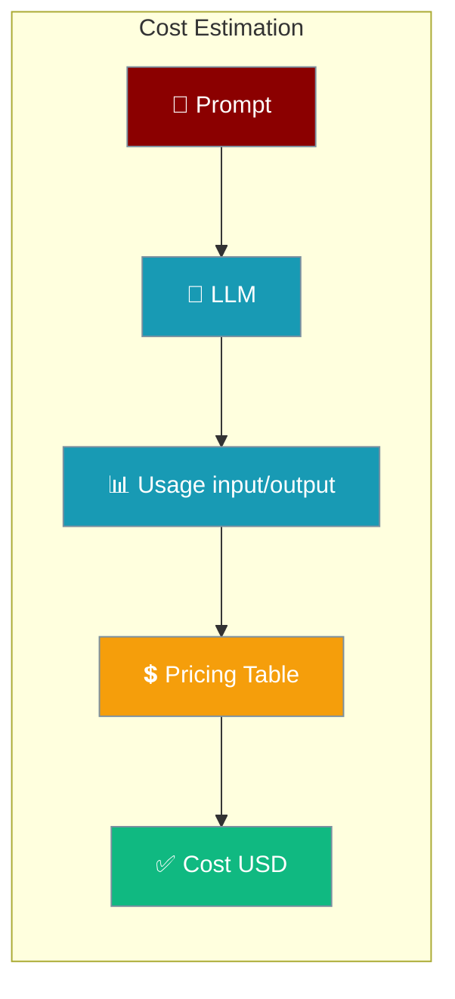
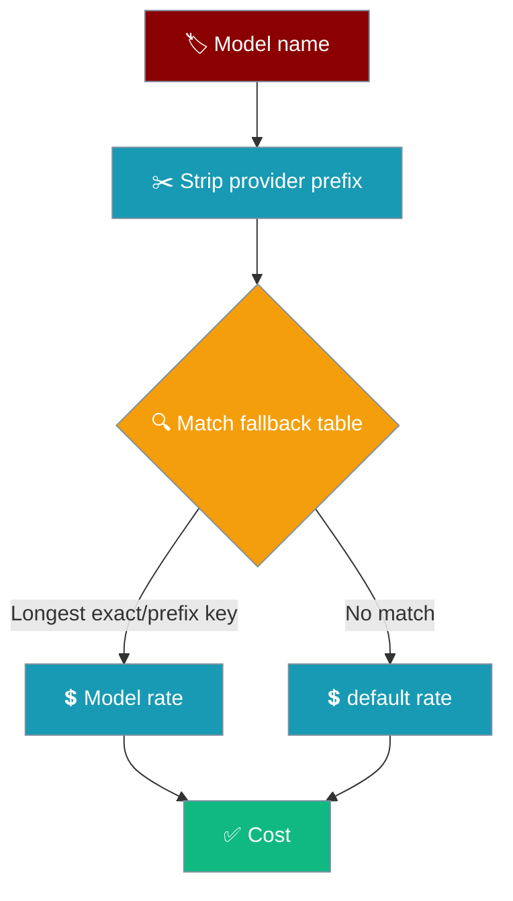

Every completion carries a cost estimate — PraisonAI derives it from the token counts your provider reports.



Cost is computed from the `input_tokens` and `output_tokens` your provider returns, multiplied by a per-model rate. When [litellm](https://github.com/BerriAI/litellm) is installed it covers 1000+ models; otherwise a built-in fallback table prices the most common models.

## Quick Start

<Steps>
<Step title="Run an agent and read its token counts">
A bare `Agent(llm="gpt-4o-mini")` records usage automatically. Read the counts back with the global collector:

```python
from praisonaiagents import Agent
from praisonaiagents.telemetry.token_collector import get_token_collector

agent = Agent(llm="gpt-4o-mini")
agent.start("Summarise the theory of relativity in one paragraph")

summary = get_token_collector().get_session_summary()
print(summary["total_metrics"]["input_tokens"], summary["total_metrics"]["output_tokens"])
# cost is derived from these counts via calculate_llm_cost()
```
</Step>

<Step title="Estimate the cost from those counts">
Pass the counts and the model name to `calculate_llm_cost()`:

```python
from praisonaiagents.utils.cost_utils import calculate_llm_cost

cost = calculate_llm_cost(
    prompt_tokens=1000,
    completion_tokens=500,
    model="gpt-4o-mini",
)
print(f"${cost}")  # $0.00045  →  (1000/1M × $0.15) + (500/1M × $0.60)
```
</Step>
</Steps>

---

## How It Works

Cost is `input_tokens × input_rate + output_tokens × output_rate`. The only question is which rate applies to a given model name.



---

## How Pricing Is Resolved

The fallback matcher resolves a model name to a rate in three steps:

1. **Strip the provider prefix.** `openai/gpt-4o-mini` becomes `gpt-4o-mini`, so provider-qualified names resolve the same as bare names.
2. **Match longest-key-first, on exact match or prefix boundary.** The table is searched from the longest key down, and a key only matches when the model name is exactly that key or starts with `<key>-…`. So `gpt-4o-mini` is billed at `$0.15/1M`, not `gpt-4o`'s `$2.50/1M`, and `o1-mini` no longer matches `o1`.
3. **Fall back to `default`.** If no key matches, the `default` rate applies. `default` is never matched by name — it is only the last resort.

<Warning>
**Corrected in PraisonAI [PR #4200](https://github.com/MervinPraison/PraisonAI/pull/4200).** Prior to this release the fallback matcher used a substring search where the first hit won, which billed `gpt-4o-mini` at `gpt-4o` rates — a **16.7×** overcharge in the estimate — and let `o1-mini` match `o1`. Existing dashboards will show a step-change downward; the new numbers are the accurate ones.
</Warning>

---

## Fallback Pricing Table

These are the built-in rates the SDK ships in `_FALLBACK_PRICING` (USD per 1M tokens). They apply when litellm is not installed.

| Model | Input ($/1M) | Output ($/1M) |
|-------|-------------|---------------|
| `gpt-4o` | 2.50 | 10.00 |
| `gpt-4o-mini` | 0.15 | 0.60 |
| `gpt-4-turbo` | 10.00 | 30.00 |
| `gpt-4` | 30.00 | 60.00 |
| `gpt-3.5-turbo` | 0.50 | 1.50 |
| `o1` | 15.00 | 60.00 |
| `o1-mini` | 1.10 | 4.40 |
| `o1-preview` | 15.00 | 60.00 |
| `o3-mini` | 1.10 | 4.40 |
| `claude-3-5-sonnet` | 3.00 | 15.00 |
| `claude-3-5-haiku` | 0.80 | 4.00 |
| `claude-3-opus` | 15.00 | 75.00 |
| `claude-3-sonnet` | 3.00 | 15.00 |
| `claude-3-haiku` | 0.25 | 1.25 |
| `gemini-1.5-pro` | 1.25 | 5.00 |
| `gemini-1.5-flash` | 0.075 | 0.30 |
| `gemini-2.0-flash` | 0.10 | 0.40 |
| `gemini-2.0-flash-exp` | 0.10 | 0.40 |
| `gemini-pro` | 0.50 | 1.50 |
| `deepseek-chat` | 0.14 | 0.28 |
| `deepseek-reasoner` | 0.55 | 2.19 |
| `default` | 1.00 | 3.00 |

<Note>
Install litellm for accurate pricing across 1000+ models. Pass `use_litellm=True` to `calculate_llm_cost()` to prefer it; without it, the fallback table above is used for speed.
</Note>

---

## Common Patterns

<AccordionGroup>
<Accordion title="Price a whole session">
Read the session totals, then price them once:

```python
from praisonaiagents import Agent
from praisonaiagents.telemetry.token_collector import get_token_collector
from praisonaiagents.utils.cost_utils import calculate_llm_cost

agent = Agent(llm="gpt-4o-mini")
agent.start("Draft a product announcement")

totals = get_token_collector().get_session_summary()["total_metrics"]
cost = calculate_llm_cost(totals["input_tokens"], totals["output_tokens"], model="gpt-4o-mini")
print(f"${cost}")
```
</Accordion>

<Accordion title="Provider-prefixed model names resolve correctly">
`openai/gpt-4o-mini` is stripped to `gpt-4o-mini` before matching, so it prices at the mini rate:

```python
from praisonaiagents.utils.cost_utils import calculate_llm_cost

print(calculate_llm_cost(1000, 500, model="openai/gpt-4o-mini"))  # 0.00045
print(calculate_llm_cost(1000, 500, model="gpt-4o-mini"))         # 0.00045 — same
```
</Accordion>
</AccordionGroup>

---

## Best Practices

<AccordionGroup>
<Accordion title="Use realistic model names">
Pass the exact model string you run with (e.g. `gpt-4o-mini`, `claude-3-5-sonnet`). The longest-key-first matcher relies on the full name to avoid billing a `-mini` model at its larger sibling's rate.
</Accordion>

<Accordion title="Install litellm for uncommon models">
The fallback table covers common models only. For anything outside it, install litellm and call `calculate_llm_cost(..., use_litellm=True)` for accurate, up-to-date pricing.
</Accordion>

<Accordion title="Cost is an estimate, not a bill">
These numbers estimate spend from token counts and published rates. Use your provider's dashboard for authoritative billing.
</Accordion>
</AccordionGroup>

---

## Related

<CardGroup cols={2}>
<Card title="Token Tracking" icon="chart-line" href="/features/token-tracking">
Read real token spend from any agent.
</Card>
<Card title="Telemetry" icon="chart-line" href="/features/telemetry">
Anonymous usage metrics for agent runs.
</Card>
</CardGroup>
