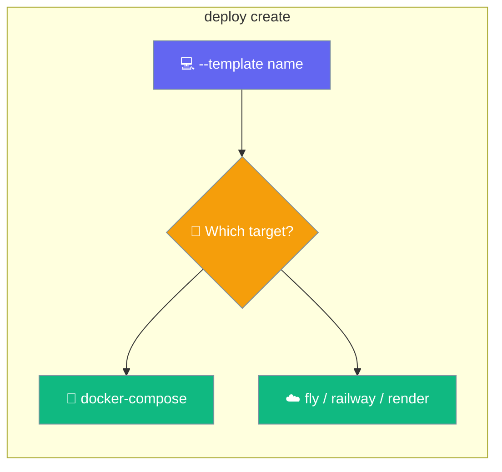
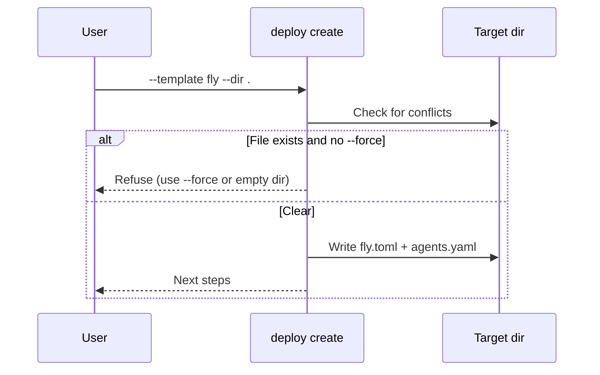
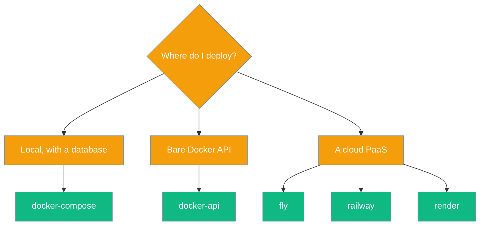

Scaffold a ready-to-edit deployment project — provider config plus `agents.yaml` — with one command.



<Warning>
Starter templates ship in the git checkout, **not** in the PyPI wheel (`MANIFEST.in` excludes `infra/`). Run from a monorepo checkout, or set `PRAISONAI_STARTERS_ROOT` / `PRAISONAI_INFRA_ROOT`.
</Warning>

## Quick Start

<Steps>
<Step title="Scaffold a project">
Pick a template and drop its files into the current directory.

```bash
praisonai deploy create --template fly
```
</Step>

<Step title="Edit and deploy">
Adjust the generated config, then deploy with the matching command.

```bash
praisonai deploy fly
```
</Step>
</Steps>

---

## How It Works

`create` copies the named template's files into your target directory, refusing to clobber existing files unless you pass `--force`.



---

## Choosing a Template

Match the template to where you want to run.



---

## Templates

Five templates ship today.

| `--template` | Files shipped | Purpose |
|--------------|---------------|---------|
| `docker-api` | `agents.yaml` | Bare Docker API scaffold. |
| `docker-compose` | `agents.yaml` | For the `deploy compose` stack (API + Postgres). |
| `fly` | `fly.toml` + `agents.yaml` | Fly.io — pins the image, `internal_port=8005`, `PRAISONAI_API_AUTH=enabled`, HTTP `/health` check. |
| `railway` | `railway.json` + `agents.yaml` | Railway — `healthcheckPath: /health`, `restartPolicyType: ON_FAILURE`. |
| `render` | `render.yaml` + `agents.yaml` | Render — `runtime: image`, `healthCheckPath: /health`, requires `OPENAI_API_KEY` (`sync: false`), sets `PRAISONAI_API_AUTH=enabled`. |

---

## Command Options

| Flag | Default | Description |
|------|---------|-------------|
| `--template` / `-t` | *(required)* | Starter template name. |
| `--dir` / `-d` | `.` | Target directory (created if missing). |
| `--force` | `False` | Overwrite conflicting files instead of refusing. |
| `--json` | `False` | Machine-readable output. |

The starters directory can be overridden with `PRAISONAI_STARTERS_ROOT`.

---

## Best Practices

<AccordionGroup>
<Accordion title="Scaffold into an empty directory">
Without `--force`, `create` refuses to overwrite an existing `agents.yaml` — protecting hand-edited files. Use a fresh directory, or pass `--force` when you intend to replace.
</Accordion>

<Accordion title="Chain create with the deploy command">
The fastest path to a running deployment is a one-liner:

```bash
praisonai deploy create --template fly && praisonai deploy fly
```
</Accordion>

<Accordion title="Pin the image tag in the generated config">
Starters use `latest`. Swap in a released tag before deploying to production.
</Accordion>
</AccordionGroup>

---

## Related

<CardGroup cols={2}>
<Card title="Docker Compose Stack" icon="docker" href="/docs/features/compose-stack">
  Run the docker-compose template locally.
</Card>
<Card title="Deploy to Fly.io" icon="plane" href="/docs/features/fly">
  Deploy the fly template in one command.
</Card>
</CardGroup>
