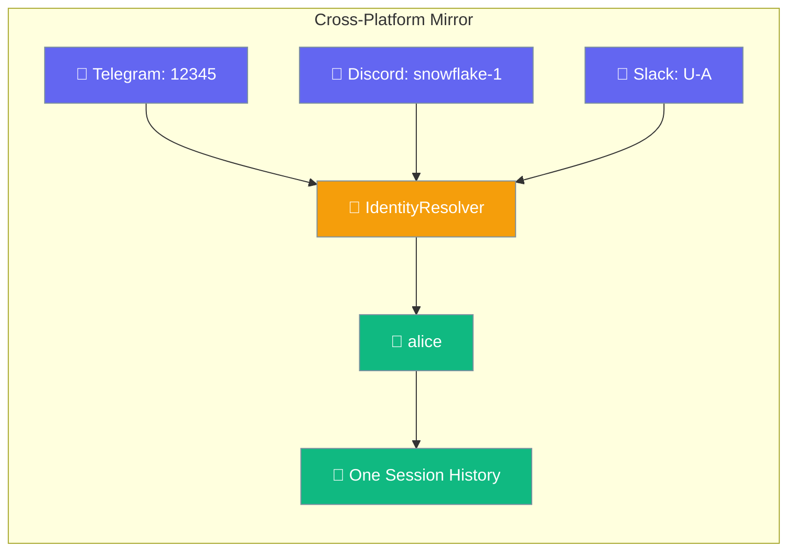
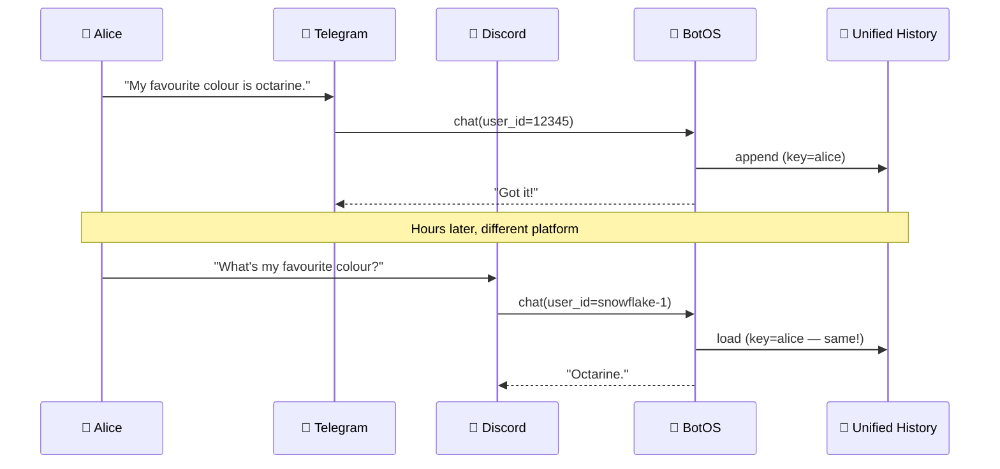
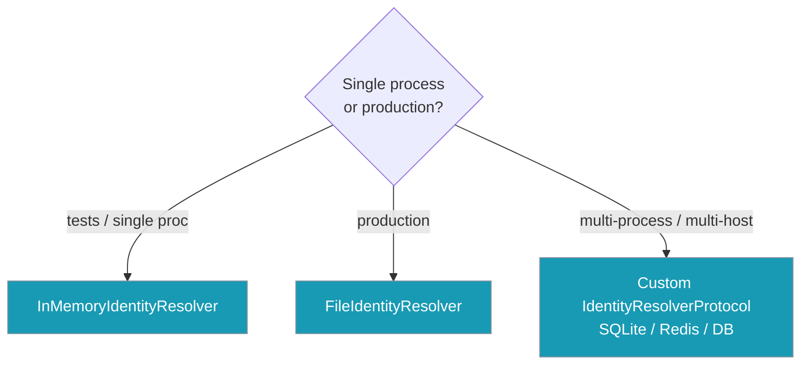

Cross-platform sessions let one user keep a single conversation across every messaging platform.

```python
from praisonai.bots import BotOS
from praisonaiagents import Agent
from praisonaiagents.session import FileIdentityResolver

agent = Agent(name="assistant", instructions="Be helpful.")

resolver = FileIdentityResolver()                        # ~/.praisonai/identity.json
resolver.link("telegram", "12345",       "alice")
resolver.link("discord",  "snowflake-1", "alice")

BotOS(
    agent=agent,
    platforms=["telegram", "discord"],
    identity_resolver=resolver,
).run()
```



## How It Works



## Quick Start

<Steps>
<Step title="One platform, one user">
```python
from praisonai.bots import Bot
from praisonaiagents import Agent

agent = Agent(name="assistant", instructions="Be helpful.")
bot = Bot("telegram", agent=agent)
await bot.start()
```
</Step>

<Step title="Two platforms, one user">
```python
from praisonai.bots import BotOS
from praisonaiagents import Agent
from praisonaiagents.session import FileIdentityResolver

agent = Agent(name="assistant", instructions="Be helpful.")

resolver = FileIdentityResolver()
resolver.link("telegram", "12345", "alice")
resolver.link("discord", "snowflake-1", "alice")

botos = BotOS(
    agent=agent,
    platforms=["telegram", "discord"],
    identity_resolver=resolver,
)
await botos.start()
```
</Step>

<Step title="In-process testing / ephemeral">
```python
from praisonai.bots import BotOS
from praisonaiagents import Agent
from praisonaiagents.session import InMemoryIdentityResolver

agent = Agent(name="assistant", instructions="Be helpful.")

resolver = InMemoryIdentityResolver()  # Ephemeral for tests
resolver.link("telegram", "12345", "alice")
resolver.link("discord", "snowflake-1", "alice")

botos = BotOS(
    agent=agent,
    platforms=["telegram", "discord"],
    identity_resolver=resolver,
)
```
</Step>
</Steps>

---

## Choosing Your Resolver



## SessionContext for Tools

Any tool the agent calls can read who is messaging:

```python
from praisonaiagents import Agent
from praisonaiagents.session import get_session_context

def whoami() -> str:
    ctx = get_session_context()
    return f"You are {ctx.user_name or ctx.user_id} on {ctx.platform}"

agent = Agent(name="assistant", instructions="Use whoami when asked.", tools=[whoami])
```

### SessionContext Fields

| Field | Type | Description |
|---|---|---|
| `platform` | `str` | `"telegram"`, `"discord"`, `"slack"`, … |
| `chat_id` | `str` | Platform chat / channel id |
| `chat_name` | `str` | Human-readable channel name |
| `thread_id` | `str` | Thread / topic id (Slack threads, Telegram topics) |
| `user_id` | `str` | Raw platform user id |
| `user_name` | `str` | Display name |
| `unified_user_id` | `str` | Result of `IdentityResolver.resolve()` |
| `origin` | `Optional[Origin]` | `None` | Platform-aware origin info — see [Platform-Aware Agents](/features/platform-aware-agents) |
| `reachable_targets` | `Optional[List[ReachableTarget]]` | `None` | Channels the agent can deliver to — see [Platform-Aware Agents](/features/platform-aware-agents) |

<Note>
Use `set_session_context` / `clear_session_context` for advanced custom adapters. Returns a token; reset in a `finally` block.
</Note>

---

## Mirror for Outbound Deliveries

Cron jobs, scheduled deliveries, and cross-platform replies need to **mirror** the assistant's outbound message into the user's history:

```python
from praisonai.bots import mirror_to_session

# After sending a notification programmatically
mirror_to_session(
    session_mgr=bot._session,
    user_id="alice",
    message_text="Reminder: your standup is in 5 minutes.",
    source_label="cron",
)
```

### Parameters

| Parameter | Type | Description |
|---|---|---|
| `session_mgr` | `BotSessionManager` | Session manager instance |
| `user_id` | `str` | Unified user ID |
| `message_text` | `str` | Message content to mirror |
| `source_label` | `str` | Source identifier (`"cron"`, `"web"`, `"cross_platform"`) |
| `metadata` | `dict` | Optional extra metadata |
| `lock` | `threading.RLock` | Optional lock for synchronization |

<Note>
Errors are swallowed and logged — a mirror failure must never break the outbound delivery itself.
</Note>

---

## Storage & Privacy

<Note>
`FileIdentityResolver` defaults to `~/.praisonai/identity.json` (override via `PRAISONAI_IDENTITY_PATH` env var or constructor `path=`). File is written atomically and chmod 0o600.
</Note>

<Warning>
Identity links are **explicit and opt-in**. No automatic linking — wire the resolver only after a verified DM-pairing flow confirms the same human controls both accounts.
</Warning>

<Tip>
Without a resolver, the legacy `bot_{platform}_{user_id}` storage key is preserved bit-for-bit — fully backward compatible.
</Tip>

---

## Best Practices

<AccordionGroup>

<Accordion title="Use FileIdentityResolver by default">
For production single-host bots, `FileIdentityResolver` provides persistent storage with atomic writes and proper file permissions.

```python
from praisonaiagents.session import FileIdentityResolver

resolver = FileIdentityResolver()  # ~/.praisonai/identity.json
```
</Accordion>

<Accordion title="Implement custom IdentityResolverProtocol for scale">
For multi-process/multi-host deployments, back it with SQLite, Redis, or a database:

```python
from praisonaiagents.session import IdentityResolverProtocol

class DatabaseIdentityResolver:
    def resolve(self, platform: str, platform_user_id: str) -> str:
        # Query your database
        pass
    
    def link(self, platform: str, platform_user_id: str, unified_user_id: str) -> None:
        # Store in your database
        pass
```
</Accordion>

<Accordion title="Pair before linking">
Never auto-link based on display name. Always require a DM-verified pairing flow:

```python
# After DM verification succeeds
resolver.link("telegram", telegram_user_id, verified_unified_id)
resolver.link("discord", discord_user_id, verified_unified_id)
```
</Accordion>

<Accordion title="Read SessionContext in tools">
Instead of `os.environ`, read `SessionContext` — concurrent message handlers won't trample each other:

```python
def get_user_platform() -> str:
    ctx = get_session_context()
    return ctx.platform  # Thread-safe, context-aware
```
</Accordion>

</AccordionGroup>

---

## Related

<CardGroup cols={2}>
<Card title="BotOS" icon="robot" href="/features/botos">
Multi-platform bot orchestrator
</Card>
<Card title="Messaging Bots" icon="message-circle" href="/features/messaging-bots">
Platform-specific bot guides
</Card>
</CardGroup>