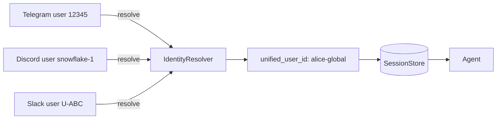

## What it does

By default each PraisonAI bot keys conversations as `bot_{platform}_{user_id}` —
the same human pinging from Telegram and Discord ends up with two
independent histories.

The **cross-platform mirror** introduces an opt-in `IdentityResolver` that
maps `(platform, platform_user_id)` to a single `unified_user_id`. When set,
all bots that share a session store and a resolver see the same chat history
for that human, regardless of which platform they used.

This unlocks the experience users actually expect: ping the agent on
Telegram in the morning, follow up on Discord in the afternoon, finish on
Slack — one conversation, one memory.

## Architecture



## Quick start — high-level BotOS API

```python
from praisonai import AgentOS
from praisonai.bots import BotOS
from praisonaiagents import Agent
from praisonaiagents.session import FileIdentityResolver

agent = Agent(name="assistant", instructions="Be helpful.")

# Persistent identity resolver — survives restarts.
resolver = FileIdentityResolver()  # ~/.praisonai/identity.json
resolver.link("telegram", "12345", "alice")
resolver.link("discord", "snowflake-1", "alice")

os = BotOS(
    agent=agent,
    platforms=["telegram", "discord"],
    identity_resolver=resolver,  # ← single line for cross-platform unification
)
os.run()
```

That's it. The same human pinging from Telegram or Discord now hits one
unified session, with the agent's memory intact across both.

## Low-level API (manual session manager)

```python
from praisonai.bots import BotSessionManager
from praisonaiagents.session import InMemoryIdentityResolver, DefaultSessionStore

resolver = InMemoryIdentityResolver()
resolver.link("telegram", "12345", "alice")
resolver.link("discord", "snowflake-1", "alice")

store = DefaultSessionStore()  # default: ~/.praisonai/sessions/
mgr_t = BotSessionManager(platform="telegram", identity_resolver=resolver, store=store)
mgr_d = BotSessionManager(platform="discord", identity_resolver=resolver, store=store)
# Both managers now share alice's history.
```

## Outbound delivery mirror

Use `mirror_to_session()` to append a message to a user's session
**without** sending it through the LLM — useful for scheduled deliveries,
cron notifications, or cross-platform replies so the agent has context
on the next inbound turn.

```python
from praisonai.bots import mirror_to_session

mirror_to_session(
    mgr_t,
    user_id="12345",
    message_text="Daily summary delivered: 5 PRs merged.",
    source_label="cron",
)
```

## Task-local session context

`SessionContext` exposes the current platform / chat / user inside any
tool, without polluting `os.environ` and without race conditions when
multiple messages are handled concurrently.

```python
from praisonaiagents.session import (
    set_session_context,
    get_session_context,
    clear_session_context,
)

token = set_session_context(
    platform="telegram",
    chat_id="100",
    user_id="12345",
    unified_user_id="alice",
)
try:
    ctx = get_session_context()  # task-local, async-safe
    ...
finally:
    clear_session_context(token)
```

## Privacy

Linking is **explicit and opt-in**. Without an `IdentityResolver`,
PraisonAI behaviour is unchanged — sessions remain platform-scoped.

In production, wire the resolver only after a DM-pairing flow has
cryptographically verified that the same human controls both accounts.

## Reference

- `praisonaiagents.session.IdentityResolverProtocol` — runtime-checkable.
- `praisonaiagents.session.InMemoryIdentityResolver` — built-in.
- `praisonaiagents.session.SessionContext` — task-local metadata.
- `praisonai.bots.mirror_to_session` — outbound mirror helper.
- `praisonai.bots.BotSessionManager(identity_resolver=...)` — wiring.
