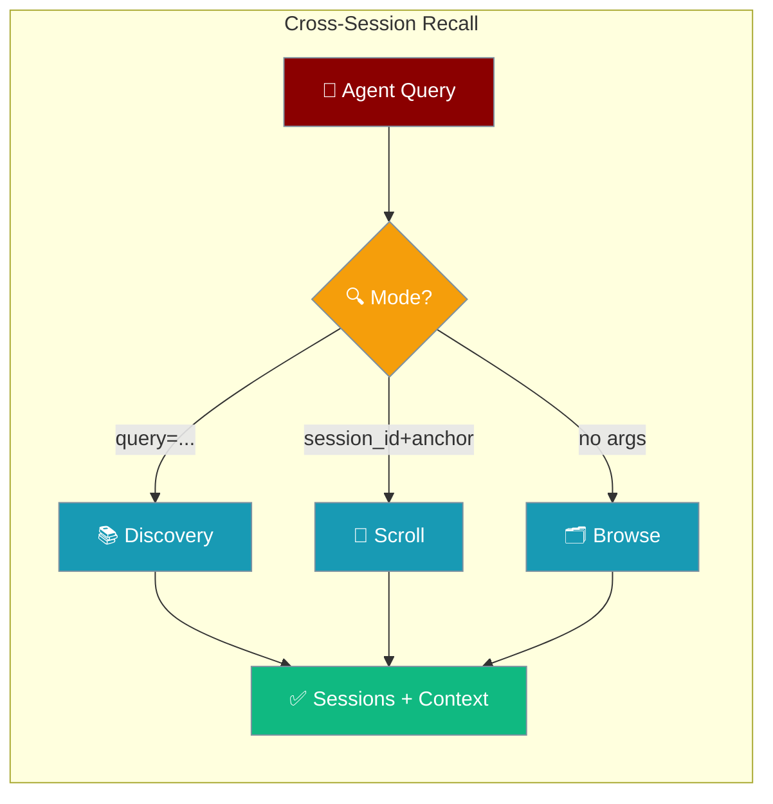
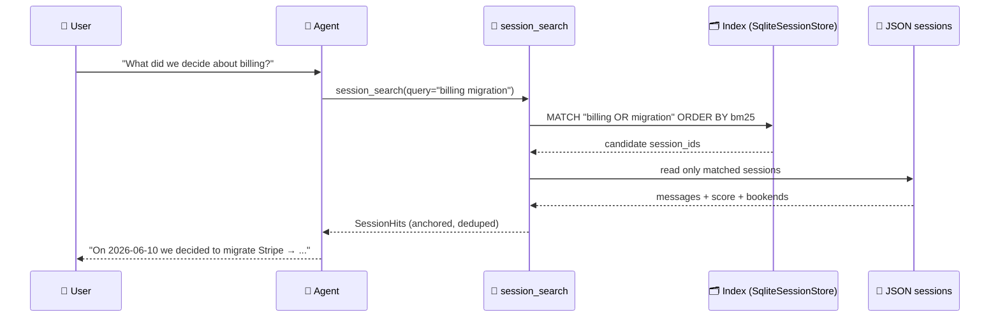
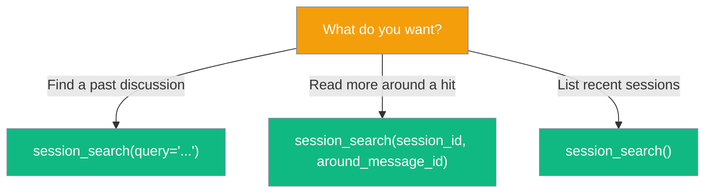
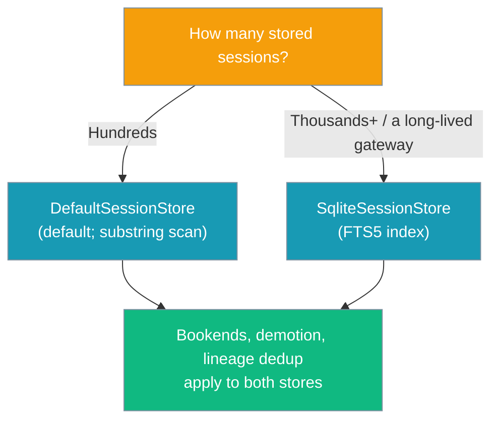

```python
from praisonaiagents import Agent

agent = Agent(
    name="recall-agent",
    instructions="Search past sessions when the user asks about earlier decisions.",
    tools=["session_search"],
)
agent.start("What did we decide about the billing migration?")
```

An agent can now search its own past conversation transcripts — asking "what did we decide about the billing migration?" across every stored session.

The user asks what was decided last week; session search recalls matching turns from prior stored conversations.




## Quick Start

<Steps>
<Step title="Add session_search to an agent">
```python
from praisonaiagents import Agent

agent = Agent(
    name="Gateway Assistant",
    instructions="Recall past conversations when the user asks 'what did we decide about X?'",
    tools=["session_search"]
)

agent.start("What did we decide about the billing migration?")
```
</Step>

<Step title="Call the three shapes directly">
```python
from praisonaiagents.tools import session_search

# 1. Discovery — find sessions matching a keyword
session_search(query="billing migration")

# 2. Scroll — read ±N messages around an anchor
session_search(session_id="abc-123", around_message_id="42", window=10)

# 3. Browse — most recent sessions ("what was I working on?")
session_search()
```
</Step>

<Step title="Scale to thousands of sessions">
```python
from praisonaiagents import Agent
from praisonaiagents.session import SqliteSessionStore

# Indexed store: FTS5 lookup instead of full-directory scan.
# Falls back to a substring scan if sqlite3/FTS5 is unavailable.
store = SqliteSessionStore(db_path="~/.praisonai/sessions.db")

agent = Agent(
    name="Gateway Assistant",
    instructions="Recall past conversations across thousands of stored sessions.",
    tools=["session_search"],
    session_store=store,
)

agent.start("What did we decide about the billing migration?")
```
</Step>
</Steps>

---

## How It Works



Sessions live at `~/.praisonai/sessions/*.json` — one JSON file per session. The default `DefaultSessionStore` search is a dependency-free substring/keyword scan with no setup. The index hop above appears only when a `SqliteSessionStore` is active; the default flow reads the JSON files directly.

**Picking the right shape:**



**Which store should I use?**



---

## Configuration Options

### `session_search` Parameters

| Parameter | Type | Default | Description |
|-----------|------|---------|-------------|
| `query` | `str` | `""` | Free-text query for **discovery** mode |
| `session_id` | `str` | `""` | Session to read in **scroll** mode |
| `around_message_id` | `str` | `""` | Anchor message index (as string) for scroll mode |
| `limit` | `int` | `5` | Maximum sessions/results to return |
| `window` | `int` | `5` | Messages to include around a hit/anchor |

### Return Shapes

<Tabs>
<Tab title="Discovery">
Returned when `query` is set:

```json
{
  "success": true,
  "mode": "discovery",
  "query": "billing migration",
  "total_found": 2,
  "results": [
    {
      "session_id": "abc-123",
      "title": "Assistant",
      "when": "2026-06-10T14:32:00Z",
      "snippet": "…we agreed to migrate billing from Stripe…",
      "score": 4.0,
      "anchor_index": 12,
      "messages": [
        {"index": 7, "role": "user", "content": "...", "timestamp": "..."},
        {"index": 8, "role": "assistant", "content": "...", "timestamp": "..."}
      ],
      "bookends": {
        "opening": [
          {"index": 0, "role": "user", "content": "Kick off billing review", "timestamp": "..."},
          {"index": 1, "role": "assistant", "content": "Here is the plan...", "timestamp": "..."}
        ],
        "closing": [
          {"index": 22, "role": "user", "content": "Confirm we're going with Adyen", "timestamp": "..."},
          {"index": 23, "role": "assistant", "content": "Confirmed — migrating to Adyen.", "timestamp": "..."}
        ]
      }
    }
  ]
}
```

The `bookends` key is present only when the session has more than `BOOKEND_SIZE` (2) user+assistant messages — mirroring `SessionHit.as_dict()`.
</Tab>
<Tab title="Scroll">
Returned when `session_id` is set (no `query`):

```json
{
  "success": true,
  "mode": "scroll",
  "session_id": "abc-123",
  "around_message_id": "42",
  "messages": [
    {"index": 37, "role": "user", "content": "...", "timestamp": "..."}
  ]
}
```
</Tab>
<Tab title="Browse">
Returned when called with no arguments:

```json
{
  "success": true,
  "mode": "browse",
  "total_found": 3,
  "results": [
    {
      "session_id": "abc-123",
      "title": "Assistant",
      "when": "2026-06-22T18:00:00Z",
      "message_count": 24
    }
  ]
}
```
</Tab>
</Tabs>

### Scoring

Discovery mode scores hits using keyword matching:

| Match type | Score added |
|-----------|------------|
| Exact substring match | +2 per message |
| Per-term keyword match | +1 per term per message |

Ties are broken by recency (`updated_at` descending). Scores are heuristic — treat them as relative rankings, not probabilities.

Snippets are centred on the first match and trimmed to ~120 characters with `…` ellipses.

---

## Anchored, Demoted, Deduped Results

Every discovery hit — from either store — carries anchored context, demotes noisy automated runs, and collapses continuations of the same conversation.

- **Bookends**: `{"opening": [...], "closing": [...]}` — the first and last 2 user+assistant messages of the session, so the agent sees goal → match → resolution in one call.
- **Automated demotion**: sessions tagged as automated/scheduled or whose message rate exceeds ~60 msg/hour have their score multiplied by `0.25`.
- **Lineage dedup**: reset/compacted continuations sharing `lineage_id` / `root_session_id` / `thread_id` collapse to the single best-scoring hit.

### Automated-session heuristics

| Signal | Trigger |
|--------|---------|
| `data["source"]` or `data["metadata"]["source"]` | one of `scheduled`, `automated`, `cron`, `system`, `batch` |
| `data["metadata"]["automated"]` | `True` |
| Message rate | `> 60 messages / hour` over the session span (needs ≥ 4 timestamped messages) |

Demotion multiplies the session's total score by `0.25` (constant `AUTOMATED_DEMOTION`).

### Bookends

Bookends return the first / last **2** user+assistant messages (`BOOKEND_SIZE = 2`). They are omitted when the session has ≤ 2 conversational messages, to avoid duplicating messages already in the context window.

### Lineage keys

| Key | Read from | Note |
|-----|-----------|------|
| `lineage_id` | `data` or `metadata` | Explicit chain identifier |
| `root_session_id` | `data` or `metadata` | Root of a continuation chain |
| `thread_id` | `data` or `metadata` | Thread identifier |

`parent_session_id` is **intentionally not** a lineage key — it points at an immediate parent, so sibling sessions forked from one parent stay distinct instead of suppressing each other.

---

## Common Patterns

### Gateway assistant recalling a past decision

```python
from praisonaiagents.tools import session_search
import json

# Step 1: find the session
result = json.loads(session_search(query="billing migration"))
if result["success"] and result["results"]:
    hit = result["results"][0]
    anchor = str(hit["anchor_index"])
    session_id = hit["session_id"]

    # Step 2: read more context around the hit
    context = json.loads(session_search(
        session_id=session_id,
        around_message_id=anchor,
        window=10
    ))
    print(context["messages"])
```

### "What was I working on?" at the start of a new session

```python
from praisonaiagents import Agent

agent = Agent(
    name="Daily Assistant",
    instructions="Start each session by reviewing what was worked on recently.",
    tools=["session_search"]
)

agent.start("Give me a quick summary of what I worked on yesterday.")
```

### Programmatic access via the store directly

```python
from praisonaiagents.session.store import get_default_session_store
from praisonaiagents.session import SearchableSessionStoreProtocol

store = get_default_session_store()
assert isinstance(store, SearchableSessionStoreProtocol)

# Discovery
hits = store.search("billing migration", limit=5, window=5)
for hit in hits:
    print(hit.session_id, hit.snippet)

# Scroll
messages = store.window("abc-123", around_message_id="42", window=5)

# Browse
summaries = store.recent(limit=10)
for s in summaries:
    print(s.session_id, s.message_count)
```

---

## Best Practices

<AccordionGroup>
<Accordion title="Keep window small for fast scans">
Use `window=3` to `window=5` for discovery. Widen only when you need more surrounding context after finding a hit — use scroll mode for that.
</Accordion>

<Accordion title="Treat scores as relative rankings">
Scores are heuristic keyword counts, not probability-calibrated relevance scores. A score of 4.0 beats 2.0 but says nothing absolute. Always let the agent reason about the returned snippets.
</Accordion>

<Accordion title="Scope sessions per user in multi-user deployments">
The default search is per-store, not per-user. In multi-user deployments, prefix `session_id` values with a user identifier (e.g. `user_42_session_xyz`) and search within those sessions explicitly.
</Accordion>

<Accordion title="Scale-out: swap in SqliteSessionStore">
For long-lived gateway bots with thousands of sessions, swap in `SqliteSessionStore` — a stdlib `sqlite3` + FTS5 index turns recall into a bounded `MATCH ... ORDER BY bm25` lookup instead of a full-directory scan. It transparently falls back to the substring scan if `sqlite3` or FTS5 is unavailable, so nothing breaks. See [Session Store](/docs/features/session-store#sqlitesessionstore).
</Accordion>
</AccordionGroup>

---

## Advanced: `SearchableSessionStoreProtocol`

The default store implements `SearchableSessionStoreProtocol`, a separate `runtime_checkable` protocol that adds search to any session store backend.

```python
from praisonaiagents.session import SearchableSessionStoreProtocol
from praisonaiagents.session.store import get_default_session_store

store = get_default_session_store()
assert isinstance(store, SearchableSessionStoreProtocol)
```

### Protocol Methods

| Method | Signature | Description |
|--------|-----------|-------------|
| `search` | `search(query, *, limit=5, window=5) -> List[SessionHit]` | Keyword scan across all stored sessions |
| `window` | `window(session_id, around_message_id=None, *, window=5) -> List[Dict]` | ±N messages around an anchor; uses most recent if anchor omitted |
| `recent` | `recent(*, limit=10) -> List[SessionSummary]` | Most recently updated sessions |

### `SessionHit` Fields

| Field | Type | Default | Description |
|-------|------|---------|-------------|
| `session_id` | `str` | required | The session that matched |
| `title` | `str` | `""` | Agent name or first user message snippet |
| `when` | `Optional[str]` | `None` | `updated_at` or `created_at` timestamp |
| `snippet` | `str` | `""` | Short snippet centred on the first match |
| `score` | `float` | `0.0` | Match score (higher = better) |
| `anchor_index` | `int` | `-1` | Index of the best-matching message |
| `messages` | `List[Dict]` | `[]` | Context window around the hit |
| `bookends` | `Dict[str, List[Dict]]` | `{}` | `{"opening": [...], "closing": [...]}` — first/last user+assistant turns; empty when the session has ≤ `BOOKEND_SIZE` conversational messages |

### `SessionSummary` Fields

| Field | Type | Default | Description |
|-------|------|---------|-------------|
| `session_id` | `str` | required | Session identifier |
| `title` | `str` | `""` | Agent name or session id |
| `when` | `Optional[str]` | `None` | Last update timestamp |
| `message_count` | `int` | `0` | Number of messages in the session |

<Note>
`SessionStoreProtocol` (the core persistence contract) is unchanged and backward compatible. `SearchableSessionStoreProtocol` is an additive, separately runtime-checkable protocol.
</Note>

---

<Note>
Session chat history is written to and read from the configured `SessionStore` first, then falls back to `Memory` for backward compatibility. Both restore paths now agree with the save path — if a resumed session comes back empty, check that the same store is configured on both save and restore.
</Note>

---

## Related

<CardGroup cols={2}>
<Card title="Bot Default Tools" icon="toolbox" href="/docs/features/bot-default-tools">
  Where session_search fits in the opt-in tool list for bots
</Card>
<Card title="Session Store" icon="database" href="/docs/features/session-store">
  How sessions are persisted in ~/.praisonai/sessions/
</Card>
<Card title="Memory" icon="brain" href="/docs/features/advanced-memory">
  Distilled long-term memory (different from raw session transcripts)
</Card>
<Card title="Knowledge" icon="book" href="/docs/features/knowledge">
  RAG over documents (also different from session recall)
</Card>
</CardGroup>
