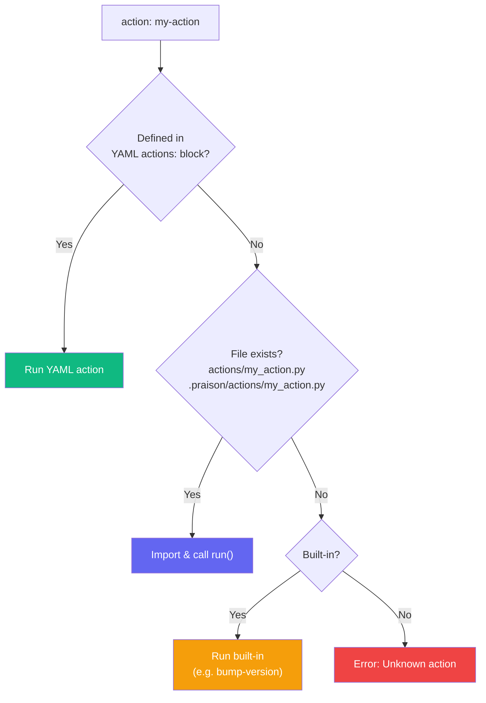

Custom actions turn repeating logic into reusable building blocks for [job workflows](/docs/features/job-workflows). Define them inline in YAML, as standalone Python files, or use built-in actions — all referenced with `action: my-action`.

```yaml
steps:
  - name: Say hello
    action: greet
```

That single line triggers a **3-tier resolution chain** to find and run the action.

---

## How Actions Resolve



| Priority | Type | Where it lives |
|----------|------|---------------|
| 1st | YAML-defined | `actions:` block in the workflow file |
| 2nd | File-based | `actions/my_action.py` or `.praison/actions/my_action.py` |
| 3rd | Built-in | Shipped with PraisonAI (e.g., `bump-version`) |

> [!TIP]
> YAML-defined actions always win. This lets you override any file-based or built-in action per-workflow.

---

## YAML-Defined Actions

Self-contained in the workflow file — no external files needed. Define them in the top-level `actions:` block.

```yaml yaml-actions-demo.yaml
type: job
name: yaml-actions-demo
description: Demonstrates YAML-defined custom actions

actions:
  check-python:
    run: python3 --version

  count-files:
    script: |
      import os
      cwd = os.getcwd()
      py_files = [f for f in os.listdir(cwd) if f.endswith('.py')]
      yaml_files = [f for f in os.listdir(cwd) if f.endswith('.yaml') or f.endswith('.yml')]
      result = f"Python: {len(py_files)}, YAML: {len(yaml_files)}"

  timestamp:
    script: |
      from datetime import datetime
      result = datetime.now().strftime("%Y-%m-%d %H:%M:%S")

steps:
  - name: Check Python version
    action: check-python

  - name: Count project files
    action: count-files

  - name: Get timestamp
    action: timestamp
```

```bash
praisonai workflow run yaml-actions-demo.yaml
```

### YAML Action Types

Each action defines **one** key — the same types available in regular steps:

| Key | What it does |
|-----|-------------|
| `run:` | Shell command |
| `script:` | Inline Python (set `result` variable for output) |
| `python:` | Run a Python script file |

---

## File-Based Actions

Reusable `.py` files that can be shared across multiple workflows.

### Directory Structure

```
my-project/
├── deploy.yaml             ← workflow file
├── actions/                ← per-workflow actions
│   ├── system_info.py
│   └── line_count.py
└── .praison/               ← project-level actions
    └── actions/
        └── deploy_k8s.py
```

### The Action Contract

Every action file must export a `run` function:

```python
def run(step, flags, cwd):
    """
    Args:
        step:  dict — the full YAML step (access custom keys)
        flags: dict — CLI flags (e.g., {"major": True})
        cwd:   str  — workflow working directory

    Returns:
        dict with:
          {"ok": True, "output": "..."} on success
          {"ok": False, "error": "..."} on failure
    """
    return {"ok": True, "output": "Hello from my action!"}
```

### Example: System Info Action

```python actions/system_info.py
import platform
import os

def run(step, flags, cwd):
    """Collect system information."""
    info_parts = [
        f"OS: {platform.system()} {platform.release()}",
        f"Python: {platform.python_version()}",
        f"Machine: {platform.machine()}",
        f"CWD: {cwd}",
    ]

    # Read custom config from the step YAML
    if step.get("show_env"):
        for var in step["show_env"].split(","):
            var = var.strip()
            info_parts.append(f"{var}: {os.environ.get(var, '(not set)')}")

    return {"ok": True, "output": " | ".join(info_parts)}
```

### Example: Line Count Action

```python actions/line_count.py
from pathlib import Path

def run(step, flags, cwd):
    """Count lines in files matching a glob pattern."""
    pattern = step.get("pattern", "*.py")
    directory = step.get("directory", ".")
    target = Path(cwd) / directory

    if not target.exists():
        return {"ok": False, "error": f"Directory not found: {target}"}

    total_lines = 0
    file_count = 0

    for filepath in target.rglob(pattern):
        if filepath.is_file():
            try:
                total_lines += len(filepath.read_text().splitlines())
                file_count += 1
            except (UnicodeDecodeError, PermissionError):
                continue

    return {
        "ok": True,
        "output": f"{file_count} files, {total_lines} lines ({pattern} in {directory})",
    }
```

### Using File-Based Actions

Reference them by name — dashes become underscores when looking up the `.py` file:

```yaml file-actions-demo.yaml
type: job
name: file-actions-demo
description: Demonstrates file-based custom actions

steps:
  - name: System info
    action: system-info

  - name: Count Python files
    action: line-count
    pattern: "*.py"
    directory: "."

  - name: Count YAML files
    action: line-count
    pattern: "*.yaml"
    directory: "."
```

```bash
praisonai workflow run file-actions-demo.yaml
```

> [!NOTE]
> `action: system-info` resolves to `actions/system_info.py`. Dashes in the action name become underscores in the filename.

---

## Built-in Actions

Shipped with PraisonAI, no files needed:

| Action | Description |
|--------|-------------|
| `bump-version` | Bump version in `pyproject.toml` (patch, minor, or major) |

```yaml
- name: Bump version
  action: bump-version
  file: pyproject.toml
  strategy: patch
```

Flags `--major` and `--minor` override the strategy at runtime:

```bash
praisonai workflow run release.yaml --major
```

---

## Passing Data to Actions

Custom keys on the step are passed through to the action via the `step` dict:

```yaml
steps:
  - name: Deploy to staging
    action: deploy
    environment: staging       # ← custom key
    region: us-east-1          # ← custom key
    skip_health_check: false   # ← custom key
```

```python actions/deploy.py
def run(step, flags, cwd):
    env = step.get("environment", "production")
    region = step.get("region", "us-west-2")
    skip_health = step.get("skip_health_check", False)

    # ... deploy logic ...
    return {"ok": True, "output": f"Deployed to {env} in {region}"}
```

---

## Resolution Priority Demo

When the same action name exists in both YAML and as a file, YAML wins:

```yaml
type: job

actions:
  greet:
    script: |
      result = "Hello from YAML!"    # ← this runs

steps:
  - name: Greet
    action: greet
    # Even if actions/greet.py exists, the YAML definition takes priority
```

---

## Best Practices

<AccordionGroup>
  <Accordion title="Use YAML actions for workflow-specific logic">
    If the action is only used in one workflow, define it inline. This keeps the workflow portable — a single file you can copy or share.
  </Accordion>

  <Accordion title="Use file-based actions for shared logic">
    If multiple workflows need the same action, put it in `actions/` (per-project) or `.praison/actions/` (project-level shared).
  </Accordion>

  <Accordion title="Always return the correct dict shape">
    File-based actions must return `{"ok": True, "output": "..."}` or `{"ok": False, "error": "..."}`. The workflow executor checks `ok` to determine pass/fail.
  </Accordion>

  <Accordion title="Use --dry-run to preview">
    Dry run shows all steps and their action names without executing:
    ```bash
    praisonai workflow run my-workflow.yaml --dry-run
    ```
  </Accordion>
</AccordionGroup>

---

## Related

<CardGroup cols={2}>
  <Card title="Job Workflows" icon="list-check" href="/docs/features/job-workflows">
    Core job workflow syntax and step types
  </Card>
  <Card title="YAML Workflows" icon="file-code" href="/docs/features/yaml-workflows">
    Agent-based YAML workflows
  </Card>
</CardGroup>
