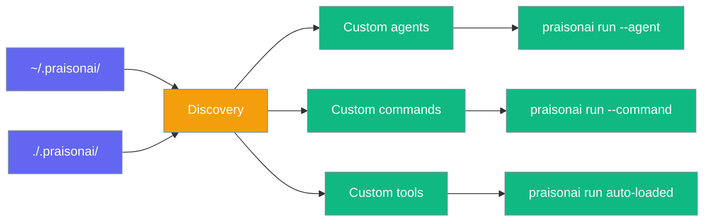
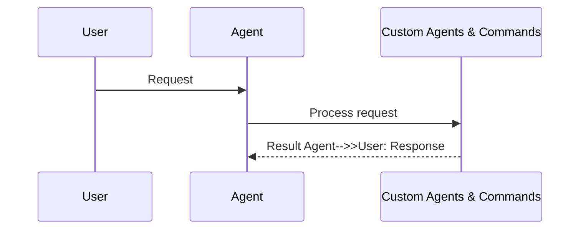
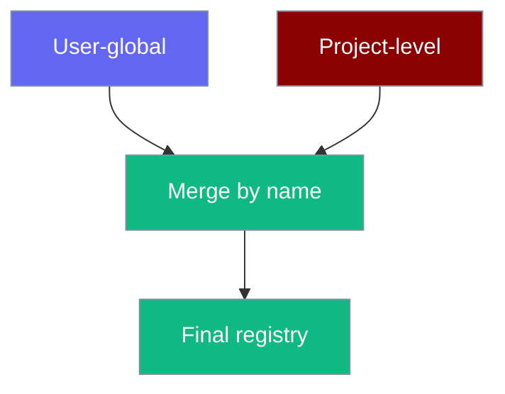
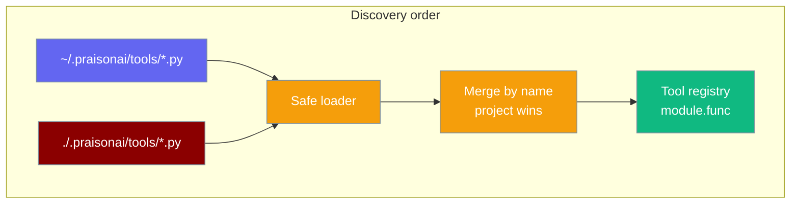
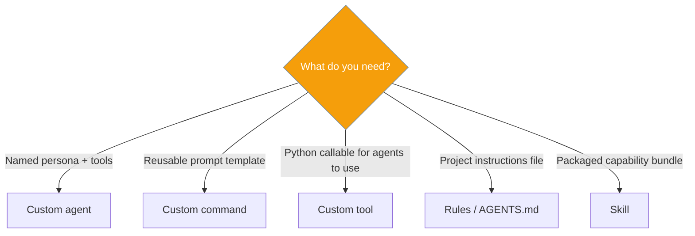

```python
from praisonaiagents import Agent

agent = Agent(name="custom-cmd-agent", instructions="Handle custom /commands in chat.")
agent.start("Register /summarise as a custom command that summarises the chat.")
```


Drop Markdown, YAML, or Python files into `.praisonai/agents/`, `.praisonai/commands/`, and `.praisonai/tools/` to extend the CLI without writing packaging code.

The user runs `praisonai run --agent researcher`; discovery loads custom agents, slash commands, and project-local tools from `.praisonai/`.




## How It Works




## Quick Start

<Note>
Skip the boilerplate — [`praisonai init`](/docs/cli/init) scaffolds a working `.praisonai/` with a starter agent and command, then read on to customise.
</Note>

```bash
praisonai init
```

<Steps>

<Step title="Create an agent file">

```markdown
<!-- .praisonai/agents/researcher.md -->
---
model: gpt-4o
role: Research Specialist
tools:
  - web_search
---

You are an expert researcher. Provide concise, cited answers.
```

</Step>

<Step title="Run the agent">

```bash
praisonai run --agent researcher "What's new in WebAssembly 3.0?"
```

</Step>

<Step title="Create a command file">

```markdown
<!-- .praisonai/commands/summarise.md -->
---
description: Summarise text
---

Summarise the following in three bullet points:

$ARGUMENTS
```

</Step>

<Step title="Run the command">

```bash
praisonai run --command summarise "Long article text here..."
```

</Step>

</Steps>

## How discovery works

| Location | Scope |
|----------|-------|
| `~/.praisonai/agents/` / `commands/` / `tools/` | User-global |
| `./.praisonai/agents/` / `commands/` / `tools/` | Project (walks up to git root) |

Project definitions **override** user definitions on name collision.



## Agent definitions

Files: `.praisonai/agents/*.md` or `*.yaml`

| Field | Description |
|-------|-------------|
| `model` | LLM model |
| `tools` | Tool list |
| `role` | Agent role |
| `goal` | Agent goal |
| `instructions` | System instructions |
| `mode` | Coarse permission shorthand (`build`, `read-only`, `plan`, `review`) **or** the `subagent` delegatability marker — makes this agent delegatable from another running agent; does not set permissions. See [Named Agent Delegation](/docs/features/named-agent-delegation). |
| `permission` | Per-capability allow / deny / ask rules |
| Markdown body | Becomes `system_prompt` when no `instructions` field |

## Scoping permissions

<Info>
Three built-in agents (`build`, `plan`, `review`) are available **without any file** — see [Agent Presets & Modes](/docs/features/agent-presets-and-modes).
</Info>

Add `mode:` to a definition for instant read-only or review scoping:

```markdown
---
name: reviewer
mode: read-only
---
You are a meticulous code reviewer…
```

For finer control, use the `permission:` block:

```markdown
---
name: git-assistant
permission:
  bash:
    "git *": ask
    "*": deny
  read: allow
---
You are a git-aware assistant.
```

See [Agent Presets & Modes](/docs/features/agent-presets-and-modes) for the full modes reference, permission syntax, and precedence rules.

### Supported `mode:` values

| Value | Effect |
|-------|--------|
| `read-only` / `plan` | Read-only scoping — denies mutating tools |
| `accept-edits` | Auto-accept file edits |
| `bypass` | Skip permission checks |
| `subagent` | **Delegatability marker** — makes the agent delegatable from other agents at run time. Applies no permission changes. |

`mode: subagent` marks an agent as delegatable from other agents at run time (see [Named Agent Delegation](/docs/features/named-agent-delegation)). It is a marker only — it does **not** apply any permission changes and is ignored when computing permissions. Every other `mode:` value still flows through the permission engine as before.

```markdown
<!-- .praisonai/agents/researcher.md — delegatable teammate -->
---
model: gpt-4o-mini
role: Research Specialist
goal: Gather accurate, cited facts on a topic
mode: subagent
tools:
  - web_search
---
You are a meticulous researcher. Provide concise, cited findings.
```

## Command templates

Files: `.praisonai/commands/*.md`

| Pattern | Behaviour |
|---------|-----------|
| `$ARGUMENTS` | Replaced with user input |
| `@path/to/file` | Inlines file contents |
| `` !`cmd` `` | **Opt-in** live shell substitution — runs `cmd` and inlines stdout |
| `$(shell cmd)` | Escaped — **not executed** (safety) |

### Opt-in live shell substitution

`` !`cmd` `` is **disabled by default**. Enable with any one of:

1. `PRAISONAI_ALLOW_SHELL=true` environment variable
2. `commands.allow_shell: true` in `.praisonai/config.yaml`
3. Per-command frontmatter `allow_shell: true`

```markdown
---
name: review
allow_shell: true
---
Review this diff:

!`git diff --stat`
```

Safety bounds: 30s timeout, 100KB max stdout, runs in the template's working directory. Non-zero exit raises `ShellSubstitutionError`. `` !`cmd` `` inside `$ARGUMENTS` or `@file` contents is never executed — only markers in the original template run.

## Project-local tools

Drop any `.py` file into `.praisonai/tools/` and every `praisonai run` in that project auto-loads its tools — no `--tools` flag, no packaging, no imports in your agent code.

```python
# .praisonai/tools/greet.py
from praisonaiagents import tool

@tool
def hello(name: str) -> str:
    """Say hello to name."""
    return f"Hello, {name}!"
```

```bash
export PRAISONAI_ALLOW_LOCAL_TOOLS=true
praisonai run "Say hello to Alex"
# → agent auto-discovers greet.hello and calls it
```

That is the whole feature. The rest of this section is detail.

<Warning>
Loading a tool file executes its Python. Auto-load is gated by `PRAISONAI_ALLOW_LOCAL_TOOLS=true` — the same opt-in that guards every local tool in the CLI. Without it, `.praisonai/tools/` is skipped entirely.
</Warning>

### How discovery works

| Location | Scope | Overrides on collision? |
|----------|-------|:-----------------------:|
| `~/.praisonai/tools/*.py` | User-global (all your projects) | — |
| `./.praisonai/tools/*.py` | Project (walks up to the git root) | ✅ wins |



### What gets loaded

| Rule | Behaviour |
|------|-----------|
| Preferred exports | Functions decorated with `@tool` — private helpers live safely alongside as plain `def`s |
| Fallback exports | If no `@tool` functions exist in a file, all top-level public callables are loaded |
| Namespace | Every callable is exposed as `<module_stem>.<function_name>` (e.g. `greet.hello`) |
| Skipped files | Any file whose name starts with `_` (e.g. `_helpers.py`) is ignored |
| Skipped members | Any callable whose name starts with `_`, and names imported from other modules |
| Safety gate | Requires `PRAISONAI_ALLOW_LOCAL_TOOLS=true` (same gate as explicit local `--tools`) |

### Precedence & opt-out

| Situation | Result |
|-----------|--------|
| `PRAISONAI_ALLOW_LOCAL_TOOLS=true`, `.praisonai/tools/` present | Auto-loaded — callables added to the run's tool list |
| `praisonai run --tools my_tool` | Explicit `--tools` wins; auto-loaded tools still merge in (de-duped by identity) |
| `PRAISONAI_ALLOW_LOCAL_TOOLS` unset | Auto-load disabled — behaviour identical to before this feature |
| No `.praisonai/tools/` directory | No-op |

### A richer example — private helpers stay private

```python
# .praisonai/tools/pricing.py
from praisonaiagents import tool

def _cents(usd: float) -> int:            # skipped — no @tool
    return int(round(usd * 100))

@tool
def quote(item: str, usd: float) -> str:
    """Return a formatted price quote for item at usd dollars."""
    return f"{item}: ${_cents(usd) / 100:.2f}"
```

```bash
export PRAISONAI_ALLOW_LOCAL_TOOLS=true
praisonai run "Quote espresso at 3.50"
# → calls pricing.quote; _cents is never exposed to the LLM
```

### Scaffold with `praisonai init`

```bash
praisonai init
# writes:
#   .praisonai/agents/assistant.md
#   .praisonai/commands/review.md
#   .praisonai/tools/example.py   ← new
```

The scaffolded `example.py` is a commented `@tool` stub — uncomment or replace it in place.

## Making an agent delegatable

Mark an agent with `mode: subagent` so a running primary agent can hand it sub-tasks by name.

```markdown
---
name: researcher
model: gpt-4o
mode: subagent
---
You are an expert researcher.
```

Now a running primary agent (`praisonai run --agent lead`) can call `spawn_subagent(agent_name="researcher", …)` and this agent runs the sub-task under its own model/tools/permissions. See [Named Agent Delegation](/docs/features/named-agent-delegation).

## Agent vs command vs skill vs rule



## Slash commands

Custom commands auto-register in interactive mode as `CommandKind.CUSTOM`. Disable with `SlashCommandHandler(discover_custom=False)`.

Custom commands appear automatically in Telegram / Discord `/` autocomplete when your bot restarts, filtered by the same `CommandAccessPolicy` that gates execution. See [Native `/` Autocomplete](/docs/features/bot-commands).

### Inside `praisonai code` too

The same `.praisonai/commands/*.md` files work as `/name` inside `praisonai code`, the REPL, and the async TUI. A unified `CommandRegistry` aggregates built-ins, your custom commands, skills, MCP prompts, and pip-installed `praisonai.commands` packs into one namespace:

```text
> /mydeploy staging
```

This runs the exact interpolated template that `praisonai run --command mydeploy staging` would — byte-for-byte parity between interactive and CLI. See [Slash Commands → Unified Command Registry](/docs/cli/slash-commands#unified-command-registry).

## Python API

```python
from praisonai_code.cli.features.custom_definitions import (
    load_agent_from_name,
    interpolate_command_template,
    discover_project_tools,      # NEW — returns loaded tool callables
)

config = load_agent_from_name("researcher")
prompt = interpolate_command_template("summarise", "Long text...")
tools = discover_project_tools()  # [<greet.hello>, <pricing.quote>, ...]
```

`discover_project_tools()` returns a `list` of tool callables (empty unless `PRAISONAI_ALLOW_LOCAL_TOOLS=true`). For metadata, `CustomDefinitionsDiscovery().list_tools()` returns `CustomTool(name, path, callable, source)` records where `name` is the namespaced `<module>.<func>`.

## Best Practices

<AccordionGroup>

<Accordion title="Use project files for team sharing">
Commit `.praisonai/agents/`, `.praisonai/commands/`, and `.praisonai/tools/` to git. Every teammate and CI run picks up the same tool set on the next `praisonai run` — no `pip install` and no `--tools` flag.
</Accordion>

<Accordion title="Decorate public tools, keep helpers private">
`.praisonai/tools/_helpers.py` is skipped entirely. Inside a loaded file, functions without `@tool` are only fallback-loaded when the file has no `@tool` at all — so decorating your public entry points keeps private helpers off the LLM's tool list.
</Accordion>

<Accordion title="Keep user-global files personal">
Use `~/.praisonai/` for personal shortcuts that should not override team agents.
</Accordion>

<Accordion title="Never rely on unguarded shell substitution">
`` !`cmd` `` requires an explicit opt-in gate (`allow_shell: true`, config, or `PRAISONAI_ALLOW_SHELL`). `$(...)` is always escaped — use `` !`cmd` `` only when you need live output like `git diff`.
</Accordion>

<Accordion title="Start with praisonai init">
Run [`praisonai init`](/docs/cli/init) to scaffold `.praisonai/agents/`, `.praisonai/commands/`, **and** `.praisonai/tools/` before hand-writing files.
</Accordion>

</AccordionGroup>

## Related

<CardGroup cols={2}>
  <Card title="Run CLI" icon="play" href="/docs/cli/run">
    --agent and --command flags
  </Card>
  <Card title="Agent CLI" icon="robot" href="/docs/cli/agent">
    List and inspect custom agents
  </Card>
  <Card title="Command CLI" icon="terminal" href="/docs/cli/command">
    List and preview commands
  </Card>
  <Card title="Slash Commands" icon="slash" href="/docs/cli/slash-commands">
    Interactive custom commands
  </Card>
  <Card title="Init CLI" icon="wand-magic-sparkles" href="/docs/cli/init">
    Scaffold .praisonai/ in one command
  </Card>
  <Card title="Tools" icon="wrench" href="/docs/features/tools">
    The @tool decorator and building custom tools
  </Card>
  <Card title="Agent Presets & Modes" icon="shield-check" href="/docs/features/agent-presets-and-modes">
    Built-in presets and per-agent permission scoping
  </Card>
  <Card title="Named Agent Delegation" icon="users" href="/docs/features/named-agent-delegation">
    Delegate named sub-tasks to your agents with mode: subagent
  </Card>
</CardGroup>
