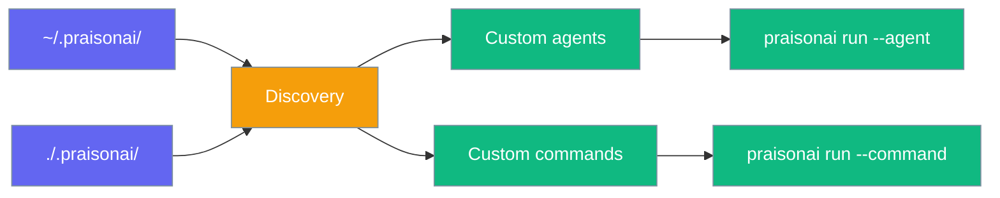
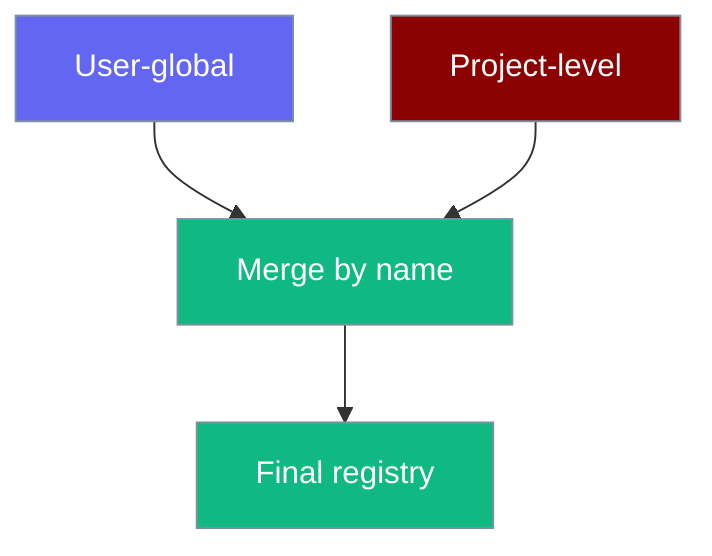
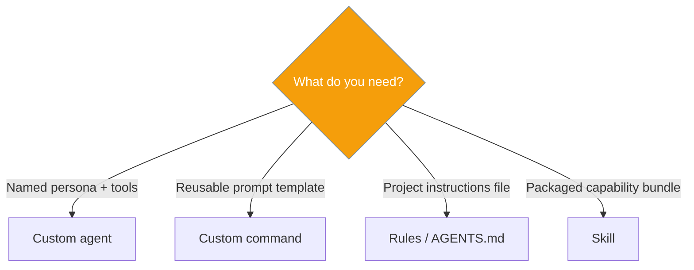

Drop Markdown or YAML files into `.praisonai/agents/` and `.praisonai/commands/` to extend the CLI without writing Python.



## Quick Start

<Steps>

<Step title="Create an agent file">

```markdown
<!-- .praisonai/agents/researcher.md -->
---
model: gpt-4o
role: Research Specialist
tools:
  - web_search
---

You are an expert researcher. Provide concise, cited answers.
```

</Step>

<Step title="Run the agent">

```bash
praisonai run --agent researcher "What's new in WebAssembly 3.0?"
```

</Step>

<Step title="Create a command file">

```markdown
<!-- .praisonai/commands/summarise.md -->
---
description: Summarise text
---

Summarise the following in three bullet points:

$ARGUMENTS
```

</Step>

<Step title="Run the command">

```bash
praisonai run --command summarise "Long article text here..."
```

</Step>

</Steps>

## How discovery works

| Location | Scope |
|----------|-------|
| `~/.praisonai/agents/` / `commands/` | User-global |
| `./.praisonai/agents/` / `commands/` | Project (walks up to git root) |

Project definitions **override** user definitions on name collision.



## Agent definitions

Files: `.praisonai/agents/*.md` or `*.yaml`

| Field | Description |
|-------|-------------|
| `model` | LLM model |
| `tools` | Tool list |
| `role` | Agent role |
| `goal` | Agent goal |
| `instructions` | System instructions |
| Markdown body | Becomes `system_prompt` when no `instructions` field |

## Command templates

Files: `.praisonai/commands/*.md`

| Pattern | Behaviour |
|---------|-----------|
| `$ARGUMENTS` | Replaced with user input |
| `@path/to/file` | Inlines file contents |
| `$(shell cmd)` | Escaped — **not executed** (safety) |

## Agent vs command vs skill vs rule



## Slash commands

Custom commands auto-register in interactive mode as `CommandKind.CUSTOM`. Disable with `SlashCommandHandler(discover_custom=False)`.

## Python API

```python
from praisonai.cli.features.custom_definitions import (
    load_agent_from_name,
    interpolate_command_template,
)

config = load_agent_from_name("researcher")
prompt = interpolate_command_template("summarise", "Long text...")
```

## Best practices

<AccordionGroup>

<Accordion title="Use project files for team sharing">
Commit `.praisonai/agents/` and `.praisonai/commands/` to git.
</Accordion>

<Accordion title="Keep user-global files personal">
Use `~/.praisonai/` for personal shortcuts that should not override team agents.
</Accordion>

<Accordion title="Never rely on shell substitution">
`$(...)` is escaped deliberately — use `@file` for file content instead.
</Accordion>

</AccordionGroup>

## Related

<CardGroup cols={2}>
  <Card title="Run CLI" icon="play" href="/docs/cli/run">
    --agent and --command flags
  </Card>
  <Card title="Agent CLI" icon="robot" href="/docs/cli/agent">
    List and inspect custom agents
  </Card>
  <Card title="Command CLI" icon="terminal" href="/docs/cli/command">
    List and preview commands
  </Card>
  <Card title="Slash Commands" icon="slash" href="/docs/cli/slash-commands">
    Interactive custom commands
  </Card>
</CardGroup>
