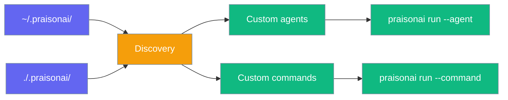
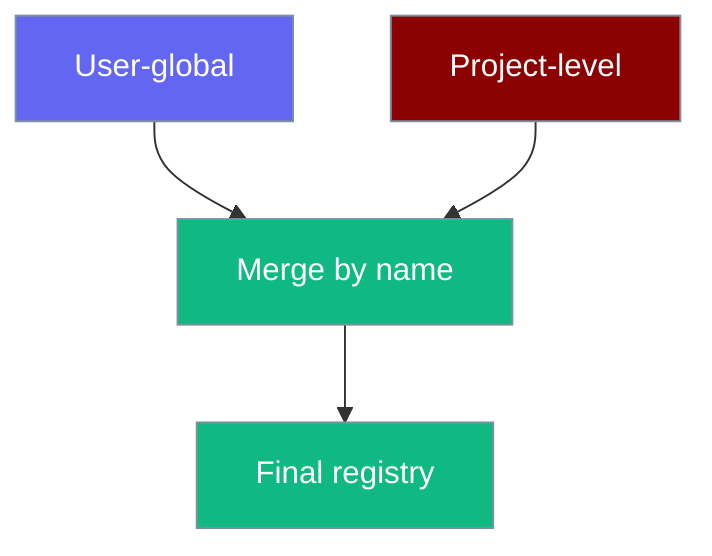
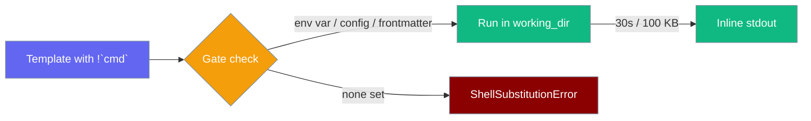
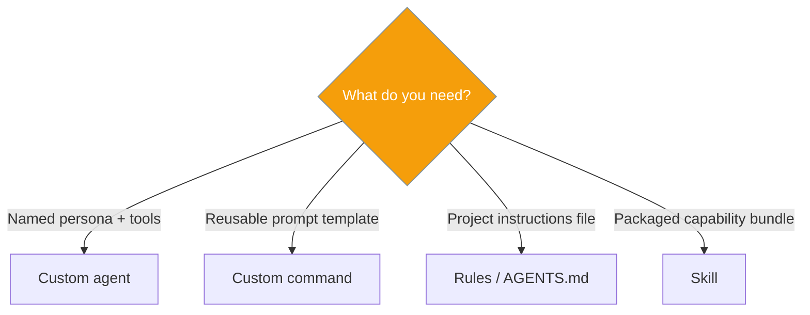

Drop Markdown or YAML files into `.praisonai/agents/` and `.praisonai/commands/` to extend the CLI without writing Python.



## Quick Start

<Note>
Skip the boilerplate — [`praisonai init`](/docs/cli/init) scaffolds a working `.praisonai/` with a starter agent and command, then read on to customise.
</Note>

```bash
praisonai init
```

<Steps>

<Step title="Create an agent file">

```markdown
<!-- .praisonai/agents/researcher.md -->
---
model: gpt-4o
role: Research Specialist
tools:
  - web_search
---

You are an expert researcher. Provide concise, cited answers.
```

</Step>

<Step title="Run the agent">

```bash
praisonai run --agent researcher "What's new in WebAssembly 3.0?"
```

</Step>

<Step title="Create a command file">

```markdown
<!-- .praisonai/commands/summarise.md -->
---
description: Summarise text
---

Summarise the following in three bullet points:

$ARGUMENTS
```

</Step>

<Step title="Run the command">

```bash
praisonai run --command summarise "Long article text here..."
```

</Step>

</Steps>

## How discovery works

| Location | Scope |
|----------|-------|
| `~/.praisonai/agents/` / `commands/` | User-global |
| `./.praisonai/agents/` / `commands/` | Project (walks up to git root) |

Project definitions **override** user definitions on name collision.



## Agent definitions

Files: `.praisonai/agents/*.md` or `*.yaml`

| Field | Description |
|-------|-------------|
| `model` | LLM model |
| `tools` | Tool list |
| `role` | Agent role |
| `goal` | Agent goal |
| `instructions` | System instructions |
| `mode` | Coarse permission shorthand: `build`, `read-only`, `plan`, `review` |
| `permission` | Per-capability allow / deny / ask rules |
| Markdown body | Becomes `system_prompt` when no `instructions` field |

## Scoping permissions

<Info>
Three built-in agents (`build`, `plan`, `review`) are available **without any file** — see [Agent Presets & Modes](/docs/features/agent-presets-and-modes).
</Info>

Add `mode:` to a definition for instant read-only or review scoping:

```markdown
---
name: reviewer
mode: read-only
---
You are a meticulous code reviewer…
```

For finer control, use the `permission:` block:

```markdown
---
name: git-assistant
permission:
  bash:
    "git *": ask
    "*": deny
  read: allow
---
You are a git-aware assistant.
```

See [Agent Presets & Modes](/docs/features/agent-presets-and-modes) for the full modes reference, permission syntax, and precedence rules.

## Command templates

Files: `.praisonai/commands/*.md`

| Pattern | Behaviour |
|---------|-----------|
| `$ARGUMENTS` | Replaced with user input |
| `@path/to/file` | Inlines file contents |
| `$(shell cmd)` | Escaped — **not executed** (safety) |
| `` !`cmd` `` | **Live shell substitution** — opt-in, runs `cmd` and inlines stdout |

### Live shell substitution (opt-in)

`` !`cmd` `` runs a shell command and inlines its stdout directly into the template — disabled by default, so templates are safe to share and commit.



**Agent-centric example** — a `/commit` command that inlines the live diff:

```markdown
<!-- .praisonai/commands/commit.md -->
---
description: Stage and commit with a generated message based on the live diff
allow_shell: true
---

You are a senior engineer writing a concise conventional-commit message.

Here is the staged diff:

```
!`git diff --cached`
```

Here is the unstaged diff for context:

```
!`git diff`
```

Write a single conventional-commit message that accurately describes the staged changes.
Then call `bash` to run `git commit -m "<your message>"`.
```

```bash
praisonai run --command commit
```

#### Enable gates

Any one of these is sufficient to enable live substitution:

| Gate | How to set |
|------|-----------|
| Env var | `export PRAISONAI_ALLOW_SHELL=true` |
| Project config | `commands.allow_shell: true` in `.praisonai/config.yaml` |
| Per-command frontmatter | `allow_shell: true` in the command's `---` block |
| Python API | `interpolate_command_template(..., allow_shell=True)` |

**Per-command frontmatter** (narrowest scope — recommended):

```markdown
---
description: My command
allow_shell: true
---
!`git log --oneline -5`
```

**Project-wide config** (all commands in this project):

```yaml
# .praisonai/config.yaml
commands:
  allow_shell: true
```

**Whole-session env var** (all commands in all projects):

```bash
export PRAISONAI_ALLOW_SHELL=true
praisonai run --command commit
```

#### Error when no gate is set

```bash
$ praisonai run --command commit
Error: Command template contains live shell substitution (!`...`) but shell
execution is not enabled. Enable it with PRAISONAI_ALLOW_SHELL=true, the
`commands.allow_shell` config flag, or `allow_shell: true` in the command's
frontmatter.
```

This is a `ShellSubstitutionError` — a clear error rather than silent escape.

#### Safety bounds

| Bound | Value |
|-------|-------|
| Timeout | 30 seconds (wall-clock) |
| Max stdout | 100 000 bytes — applied while reading, not after |
| Working dir | Template's `working_dir` |
| Non-zero exit | Raises `ShellSubstitutionError` |

#### Security model

Live substitution is resolved against the **original template only**, before `$ARGUMENTS` or `@file` injection:

- `` !`cmd` `` inside `$ARGUMENTS` — **inert text, never executed**
- `` !`cmd` `` inside `@file` contents — **inert text, never executed**
- `$(...)` inside `$ARGUMENTS` — still escaped even when shell is enabled
- Shell stdout containing `$(...)` — inlined verbatim, not re-escaped

<Warning>
Enabling `PRAISONAI_ALLOW_SHELL=true` globally affects every command template the CLI discovers. Prefer per-command frontmatter (`allow_shell: true`) for the narrowest possible scope.
</Warning>

## Agent vs command vs skill vs rule



## Slash commands

Custom commands auto-register in interactive mode as `CommandKind.CUSTOM`. Disable with `SlashCommandHandler(discover_custom=False)`.

## Python API

```python
from praisonai.cli.features.custom_definitions import (
    load_agent_from_name,
    interpolate_command_template,
    ShellSubstitutionError,
    SHELL_SUBSTITUTION_ENV,
    SHELL_SUBSTITUTION_TIMEOUT,
    SHELL_SUBSTITUTION_MAX_BYTES,
)

config = load_agent_from_name("researcher")

try:
    prompt = interpolate_command_template("commit", "", allow_shell=True)
except ShellSubstitutionError as e:
    print(f"Shell substitution failed: {e}")
```

## Best practices

<AccordionGroup>

<Accordion title="Use project files for team sharing">
Commit `.praisonai/agents/` and `.praisonai/commands/` to git.
</Accordion>

<Accordion title="Keep user-global files personal">
Use `~/.praisonai/` for personal shortcuts that should not override team agents.
</Accordion>

<Accordion title="Prefer @file over !`cmd` when you can">
`@file` inlines static file contents with no execution risk. Reserve `` !`cmd` `` for data that must be live at run time — like `git diff` or `date`.
</Accordion>

<Accordion title="Treat !`cmd` output as untrusted">
`$ARGUMENTS` and `@file` content that contains `` !`cmd` `` is intentionally inert — the guard runs before injection, not after. Never lower that guard.
</Accordion>

</AccordionGroup>

## Related

<CardGroup cols={2}>
  <Card title="Run CLI" icon="play" href="/docs/cli/run">
    --agent and --command flags
  </Card>
  <Card title="Agent CLI" icon="robot" href="/docs/cli/agent">
    List and inspect custom agents
  </Card>
  <Card title="Command CLI" icon="terminal" href="/docs/cli/command">
    List and preview commands
  </Card>
  <Card title="Shell Substitution" icon="terminal" href="/docs/features/command-shell-substitution">
    Dedicated guide for !`cmd` substitution
  </Card>
  <Card title="Slash Commands" icon="slash" href="/docs/cli/slash-commands">
    Interactive custom commands
  </Card>
  <Card title="Init CLI" icon="wand-magic-sparkles" href="/docs/cli/init">
    Scaffold .praisonai/ in one command
  </Card>
  <Card title="Agent Presets & Modes" icon="shield-check" href="/docs/features/agent-presets-and-modes">
    Built-in presets and per-agent permission scoping
  </Card>
  <Card title="Security Environment Variables" icon="shield" href="/docs/features/security-environment-variables">
    PRAISONAI_ALLOW_SHELL and other security flags
  </Card>
</CardGroup>
