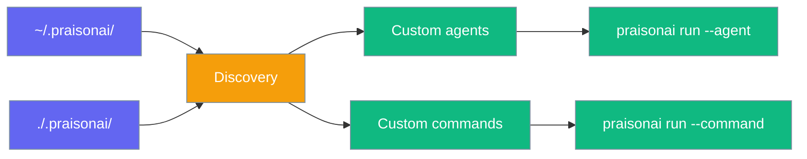
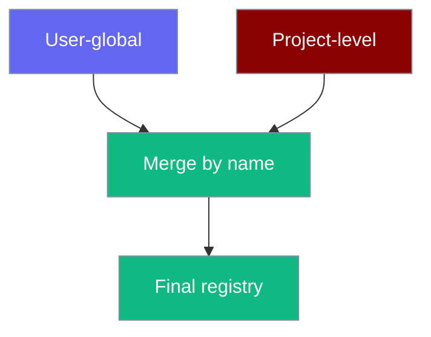
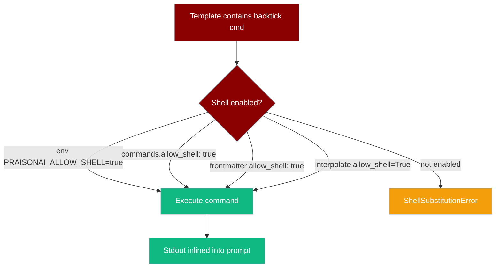
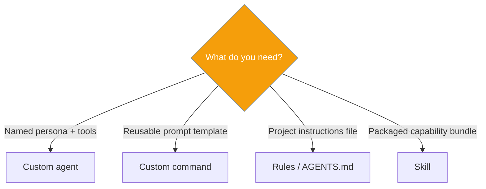

Drop Markdown or YAML files into `.praisonai/agents/` and `.praisonai/commands/` to extend the CLI without writing Python.



## Quick Start

<Note>
Skip the boilerplate — [`praisonai init`](/docs/cli/init) scaffolds a working `.praisonai/` with a starter agent and command, then read on to customise.
</Note>

```bash
praisonai init
```

<Steps>

<Step title="Create an agent file">

```markdown
<!-- .praisonai/agents/researcher.md -->
---
model: gpt-4o
role: Research Specialist
tools:
  - web_search
---

You are an expert researcher. Provide concise, cited answers.
```

</Step>

<Step title="Run the agent">

```bash
praisonai run --agent researcher "What's new in WebAssembly 3.0?"
```

</Step>

<Step title="Create a command file">

```markdown
<!-- .praisonai/commands/summarise.md -->
---
description: Summarise text
---

Summarise the following in three bullet points:

$ARGUMENTS
```

</Step>

<Step title="Run the command">

```bash
praisonai run --command summarise "Long article text here..."
```

</Step>

</Steps>

## How discovery works

| Location | Scope |
|----------|-------|
| `~/.praisonai/agents/` / `commands/` | User-global |
| `./.praisonai/agents/` / `commands/` | Project (walks up to git root) |

Project definitions **override** user definitions on name collision.



## Agent definitions

Files: `.praisonai/agents/*.md` or `*.yaml`

| Field | Description |
|-------|-------------|
| `model` | LLM model |
| `tools` | Tool list |
| `role` | Agent role |
| `goal` | Agent goal |
| `instructions` | System instructions |
| `mode` | Coarse permission shorthand: `build`, `read-only`, `plan`, `review` |
| `permission` | Per-capability allow / deny / ask rules |
| Markdown body | Becomes `system_prompt` when no `instructions` field |

## Scoping permissions

<Info>
Three built-in agents (`build`, `plan`, `review`) are available **without any file** — see [Agent Presets & Modes](/docs/features/agent-presets-and-modes).
</Info>

Add `mode:` to a definition for instant read-only or review scoping:

```markdown
---
name: reviewer
mode: read-only
---
You are a meticulous code reviewer…
```

For finer control, use the `permission:` block:

```markdown
---
name: git-assistant
permission:
  bash:
    "git *": ask
    "*": deny
  read: allow
---
You are a git-aware assistant.
```

See [Agent Presets & Modes](/docs/features/agent-presets-and-modes) for the full modes reference, permission syntax, and precedence rules.

## Command templates

Files: `.praisonai/commands/*.md`

| Pattern | Behaviour |
|---------|-----------|
| `$ARGUMENTS` | Replaced with user input |
| `@path/to/file` | Inlines file contents |
| `$(shell cmd)` | Escaped — **not executed** (safety) |
| `` !`cmd` `` | Live shell output — **opt-in only** (see below) |

## Live shell substitution (opt-in)

Embed the live output of a shell command into your prompt template using the `` !`cmd` `` syntax. This is **disabled by default** — you must explicitly enable it.



### Enable mechanisms

<Tabs>

<Tab title="Environment variable">

```bash
PRAISONAI_ALLOW_SHELL=true praisonai run --command commit "Add auth"
```

Applies to all commands in the process.

</Tab>

<Tab title="Project config">

```yaml
# .praisonai/config.yaml
commands:
  allow_shell: true
```

Applies to all commands in the project.

</Tab>

<Tab title="Per-command frontmatter">

```markdown
<!-- .praisonai/commands/commit.md -->
---
description: Commit staged changes with an AI-generated message
allow_shell: true
---

Here is my staged diff:

!`git diff --staged`

Write a conventional commit message for these changes.
```

Applies only to that one command file.

</Tab>

<Tab title="Programmatic">

```python
from praisonai.cli.features.custom_definitions import interpolate_command_template

prompt = interpolate_command_template("commit", "", allow_shell=True)
```

</Tab>

</Tabs>

### Limits

| Limit | Value |
|-------|-------|
| Working directory | Command's `working_dir` (defaults to cwd) |
| Timeout | 30 seconds — process killed on expiry |
| Stdout cap | 100 KB — output is truncated, not an error |

### Error behaviour

When the `` !`cmd` `` syntax appears in a template but shell execution is **not** enabled, the CLI raises `ShellSubstitutionError` — it never silently escapes the substitution:

```
Error: Command template contains live shell substitution (!`...`) but
shell execution is not enabled. Enable it with PRAISONAI_ALLOW_SHELL=true,
the `commands.allow_shell` config flag, or `allow_shell: true` in the
command's frontmatter.
```

### Syntax comparison

| Syntax | Behaviour |
|--------|-----------|
| `$(cmd)` | **Always escaped** — the `$` is backslash-escaped, never run |
| `` !`cmd` `` | **Opt-in executed** — runs only when explicitly enabled |

The two syntaxes are intentionally distinct so existing commands keep working unchanged.

## Agent vs command vs skill vs rule



## Slash commands

Custom commands auto-register in interactive mode as `CommandKind.CUSTOM`. Disable with `SlashCommandHandler(discover_custom=False)`.

## Python API

```python
from praisonai.cli.features.custom_definitions import (
    load_agent_from_name,
    interpolate_command_template,
)

config = load_agent_from_name("researcher")
prompt = interpolate_command_template("summarise", "Long text...")
```

## Best practices

<AccordionGroup>

<Accordion title="Use project files for team sharing">
Commit `.praisonai/agents/` and `.praisonai/commands/` to git.
</Accordion>

<Accordion title="Keep user-global files personal">
Use `~/.praisonai/` for personal shortcuts that should not override team agents.
</Accordion>

<Accordion title="Prefer @file over shell substitution for static content">
`$(...)` is escaped deliberately. For static file content use `@file` instead. Use the `` !`cmd` `` opt-in syntax only for dynamic data that must be freshly generated at runtime.
</Accordion>

<Accordion title="Enable shell substitution at the narrowest scope">
Prefer per-command `allow_shell: true` in frontmatter over the project-wide config flag or env var, so only the commands that need live shell execution get it.
</Accordion>

</AccordionGroup>

## Related

<CardGroup cols={2}>
  <Card title="Run CLI" icon="play" href="/docs/cli/run">
    --agent and --command flags
  </Card>
  <Card title="Agent CLI" icon="robot" href="/docs/cli/agent">
    List and inspect custom agents
  </Card>
  <Card title="Command CLI" icon="terminal" href="/docs/cli/command">
    List and preview commands
  </Card>
  <Card title="Slash Commands" icon="slash" href="/docs/cli/slash-commands">
    Interactive custom commands
  </Card>
  <Card title="Init CLI" icon="wand-magic-sparkles" href="/docs/cli/init">
    Scaffold .praisonai/ in one command
  </Card>
  <Card title="Agent Presets & Modes" icon="shield-check" href="/docs/features/agent-presets-and-modes">
    Built-in presets and per-agent permission scoping
  </Card>
</CardGroup>
