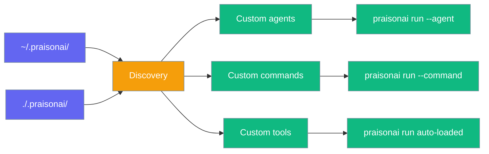
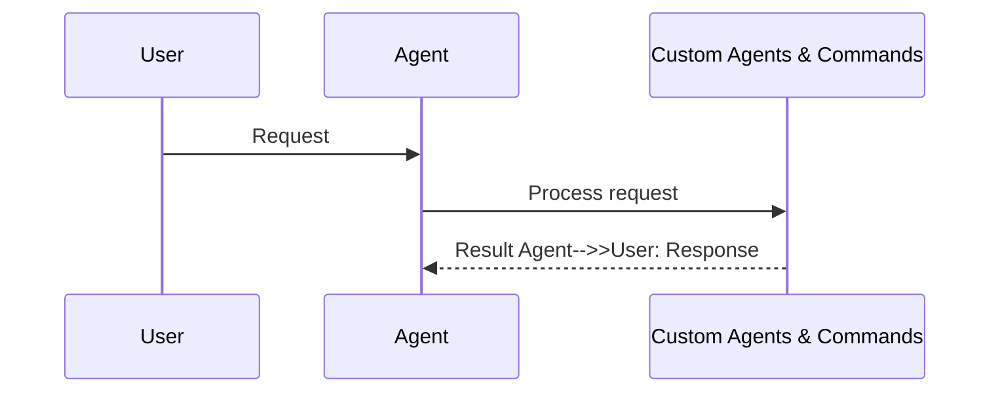
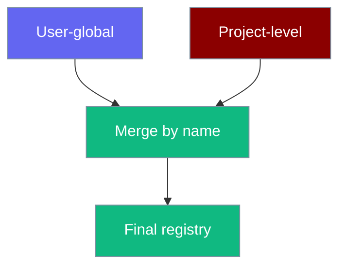
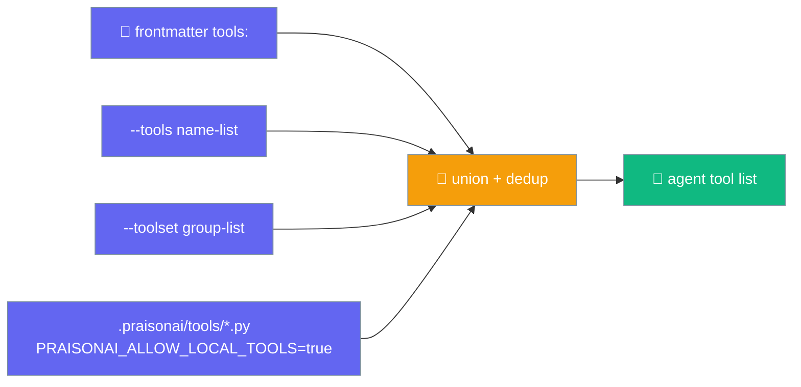
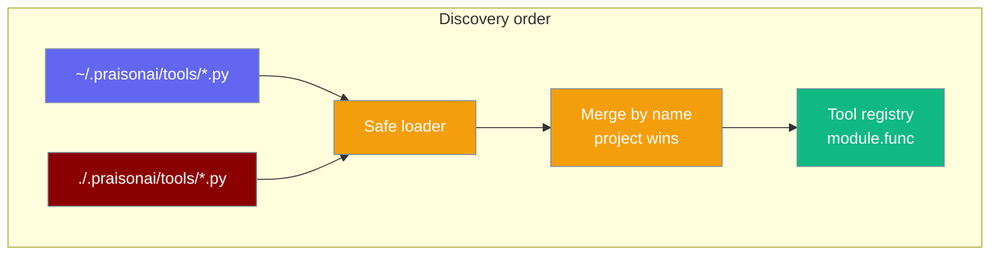
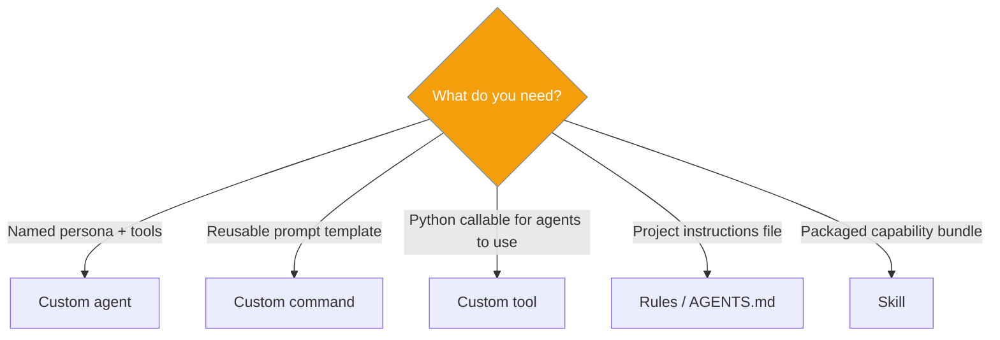

```python
from praisonaiagents import Agent

agent = Agent(name="custom-cmd-agent", instructions="Handle custom /commands in chat.")
agent.start("Register /summarise as a custom command that summarises the chat.")
```


Drop Markdown, YAML, or Python files into `.praisonai/agents/`, `.praisonai/commands/`, and `.praisonai/tools/` to extend the CLI without writing packaging code.

The user runs `praisonai run --agent researcher`; discovery loads custom agents, slash commands, and project-local tools from `.praisonai/`.



```mermaid
graph LR
    U[~/.praisonai/] --> D[Discovery]
    P[./.praisonai/] --> D
    D --> A[Custom agents]
    D --> C[Custom commands]
    D --> T[Custom tools]
    A --> R[praisonai run --agent]
    C --> RC[praisonai run --command]
    T --> RT[praisonai run auto-loaded]

    classDef dir fill:#6366F1,stroke:#7C90A0,color:#fff
    classDef discover fill:#F59E0B,stroke:#7C90A0,color:#fff
    classDef run fill:#10B981,stroke:#7C90A0,color:#fff

    class U,P dir
    class D discover
    class A,C,T,R,RC,RT run

```

## How It Works


```mermaid
sequenceDiagram
    participant User
    participant Agent
    participant Feature as Custom Agents & Commands

    User->>Agent: Request
    Agent->>Feature: Process request
    Feature-->>Agent: Result    Agent-->>User: Response
```


## Quick Start

<Note>
Skip the boilerplate — [`praisonai init`](/cli/init) scaffolds a working `.praisonai/` with a starter agent and command, then read on to customise.
</Note>

```bash
praisonai init
```

<Steps>

<Step title="Create an agent file">

```markdown
<!-- .praisonai/agents/researcher.md -->
---
model: gpt-4o
role: Research Specialist
tools:
  - web_search
---

You are an expert researcher. Provide concise, cited answers.
```

</Step>

<Step title="Run the agent">

```bash
praisonai run --agent researcher "What's new in WebAssembly 3.0?"
```

</Step>

<Step title="Create a command file">

```markdown
<!-- .praisonai/commands/summarise.md -->
---
description: Summarise text
---

Summarise the following in three bullet points:

$ARGUMENTS
```

</Step>

<Step title="Run the command">

```bash
praisonai run --command summarise "Long article text here..."
```

</Step>

</Steps>

## How discovery works

| Location | Scope |
|----------|-------|
| `~/.praisonai/agents/` / `commands/` / `tools/` | User-global |
| `./.praisonai/agents/` / `commands/` / `tools/` | Project (walks up to git root) |

Project definitions **override** user definitions on name collision.


```mermaid
graph TB
    U[User-global] --> M[Merge by name]
    P[Project-level] --> M
    M --> F[Final registry]

    classDef user fill:#6366F1,stroke:#7C90A0,color:#fff
    classDef project fill:#8B0000,stroke:#7C90A0,color:#fff
    classDef final fill:#10B981,stroke:#7C90A0,color:#fff

    class U user
    class P project
    class M,F final
```

## Agent definitions

Files: `.praisonai/agents/*.md` or `*.yaml`

| Field | Description |
|-------|-------------|
| `model` | LLM model |
| `tools` | Tool list |
| `role` | Agent role |
| `goal` | Agent goal |
| `instructions` | System instructions |
| `mode` | Coarse permission shorthand (`build`, `read-only`, `plan`, `review`) **or** the `subagent` delegatability marker — makes this agent delegatable from another running agent; does not set permissions. See [Named Agent Delegation](/features/named-agent-delegation). |
| `permission` | Per-capability allow / deny / ask rules |
| Markdown body | Becomes `system_prompt` when no `instructions` field |

## Tool composition on `praisonai run --agent`

When `praisonai run --agent <name>` runs, the agent's tool list is built from these sources, in order, and dedup'd by callable identity:


```mermaid
graph LR
    FM[📝 frontmatter tools:] --> M[🔀 union + dedup]
    CT[--tools name-list] --> M
    TS[--toolset group-list] --> M
    LT[.praisonai/tools/*.py<br/>PRAISONAI_ALLOW_LOCAL_TOOLS=true] --> M
    M --> A[🤖 agent tool list]

    classDef input fill:#6366F1,stroke:#7C90A0,color:#fff
    classDef proc  fill:#F59E0B,stroke:#7C90A0,color:#fff
    classDef out   fill:#10B981,stroke:#7C90A0,color:#fff

    class FM,CT,TS,LT input
    class M proc
    class A out
```

Example:

```bash
# researcher.md frontmatter → tools: [web_search]
# .praisonai/tools/greet.py  → greet.greet
praisonai run --agent researcher --tools github --allow-local-tools \
  "Greet Ada, then research WebAssembly 3.0"
# → final tool list: web_search, github, greet.greet
```

Before this was fixed ([#3047](https://github.com/MervinPraison/PraisonAI/issues/3047)), only the frontmatter list was honoured on the `--agent` path.

## Scoping permissions

<Info>
Three built-in agents (`build`, `plan`, `review`) are available **without any file** — see [Agent Presets & Modes](/features/agent-presets-and-modes).
</Info>

Add `mode:` to a definition for instant read-only or review scoping:

```markdown
---
name: reviewer
mode: read-only
---
You are a meticulous code reviewer…
```

For finer control, use the `permission:` block:

```markdown
---
name: git-assistant
permission:
  bash:
    "git *": ask
    "*": deny
  read: allow
---
You are a git-aware assistant.
```

See [Agent Presets & Modes](/features/agent-presets-and-modes) for the full modes reference, permission syntax, and precedence rules.

### Supported `mode:` values

| Value | Effect |
|-------|--------|
| `read-only` / `plan` | Read-only scoping — denies mutating tools |
| `accept-edits` | Auto-accept file edits |
| `bypass` | Skip permission checks |
| `subagent` | **Delegatability marker** — makes the agent delegatable from other agents at run time. Applies no permission changes. |

`mode: subagent` marks an agent as delegatable from other agents at run time (see [Named Agent Delegation](/features/named-agent-delegation)). It is a marker only — it does **not** apply any permission changes and is ignored when computing permissions. Every other `mode:` value still flows through the permission engine as before.

```markdown
<!-- .praisonai/agents/researcher.md — delegatable teammate -->
---
model: gpt-4o-mini
role: Research Specialist
goal: Gather accurate, cited facts on a topic
mode: subagent
tools:
  - web_search
---
You are a meticulous researcher. Provide concise, cited findings.
```

## Command templates

Files: `.praisonai/commands/*.md`

| Pattern | Behaviour |
|---------|-----------|
| `$ARGUMENTS` | Replaced with user input |
| `$1`, `$2`, …, `$n` | Positional token from the user's argument string (quote-aware; Windows-path-safe). Injected in the same pass as `$ARGUMENTS` so user input is never re-scanned. Out-of-range positions (e.g. `$100`) are preserved as literal text. |
| `@path/to/file` | Inlines file contents |
| `` !`cmd` `` | **Opt-in** live shell substitution — runs `cmd` and inlines stdout |
| `$(shell cmd)` | Escaped — **not executed** (safety) |

### Positional arguments

Reference `$1`, `$2`, …, `$n` to pull individual tokens out of the user's argument string — `$ARGUMENTS` still holds the whole string.

```bash
# Agent-facing: ask the agent to author the command, then call it
praisonai run --agent build "Create .praisonai/commands/migrate.md that rewrites a component from one framework to another using $1 $2 $3."
```

Bare-minimum command file:

```markdown
<!-- .praisonai/commands/migrate.md -->
---
description: Rewrite a component from one framework to another
argument-hint: <component> <from> <to>
model: gpt-4o
tools: read_file, write_file, grep
---

Rewrite the `$1` component from `$2` to `$3`.

Full request: $ARGUMENTS
```

Invocation:

```bash
praisonai run --command migrate SearchBar React Vue
# → template resolves to:
#   Rewrite the `SearchBar` component from `React` to `Vue`.
#   Full request: SearchBar React Vue
```

| Case | Template | User args | Result |
|------|----------|-----------|--------|
| Basic positional | `Deploy $1 to $2` | `web staging` | `Deploy web to staging` |
| Quoted token stays one arg | `Say $1 to $2` | `"hello world" friend` | `Say hello world to friend` |
| Windows path preserved | `cd $1` | `C:\Users\alice` | `cd C:\Users\alice` |
| Out-of-range → literal | `Legacy price $100` | `x y z` | `Legacy price $100` |
| Both patterns | `First: $1 / All: $ARGUMENTS` | `foo bar baz` | `First: foo / All: foo bar baz` |
| Injected `$1` in user text is **not** re-scanned | `Echo: $ARGUMENTS` | `$1 literal` | `Echo: $1 literal` |
| Injected `$(evil)` is escaped | `Cmd: $1` | `$(rm -rf /)` | `Cmd: \$(rm -rf /)` |

<Warning>
Positional tokens are escaped exactly like `$ARGUMENTS` — a user cannot smuggle `$(...)` shell substitution through `$1..$n` even when the command has `allow_shell: true`. The `` !`cmd` `` pattern still applies only to the template itself, never to injected user input.
</Warning>

### Command frontmatter

Frontmatter fields tune how a command runs. Every field is optional — a command with only a `description` still works.

| Field | Aliases | Type | Default | Description |
|-------|---------|------|---------|-------------|
| `description` | — | `str` | `None` | Short one-line description shown in help / listings |
| `allow_shell` | — | `bool` | `false` | Per-command opt-in for live `` !`cmd` `` substitution |
| `argument-hint` | `argument_hint` | `str` | `None` | Human-facing hint like `<pr-number> [reviewer]`, surfaced in help / previews of the command |
| `model` | — | `str` | `None` | Preferred LLM model to use when this command runs the agent (overrides the caller's default) |
| `tools` | `allowed-tools`, `allowed_tools` | `list[str]` or comma/space string | `None` | Allowed-tools hint scoping which tools the agent should have available when the command runs. Accepts a YAML list **or** a free-form string (`"read_file, write_file grep"` → `["read_file", "write_file", "grep"]`) |

`tools` wins when present; otherwise `allowed-tools` / `allowed_tools` supply the list.

```markdown
<!-- .praisonai/commands/review-pr.md -->
---
description: Review a pull request against the current branch
argument-hint: <pr-number> [reviewer]
model: gpt-4o
allowed-tools:
  - github
  - grep
  - read_file
---

Review PR #$1 for correctness, security, and style. Assign secondary review to $2.

$ARGUMENTS
```

The single-line form of `tools` is equivalent to the YAML list above:

```yaml
tools: github, grep, read_file
```

### Opt-in live shell substitution

`` !`cmd` `` is **disabled by default**. Enable with any one of:

1. `PRAISONAI_ALLOW_SHELL=true` environment variable
2. `commands.allow_shell: true` in `.praisonai/config.yaml`
3. Per-command frontmatter `allow_shell: true`

```markdown
---
name: review
allow_shell: true
---
Review this diff:

!`git diff --stat`
```

Safety bounds: 30s timeout, 100KB max stdout, runs in the template's working directory. Non-zero exit raises `ShellSubstitutionError`. `` !`cmd` `` inside `$ARGUMENTS` or `@file` contents is never executed — only markers in the original template run.

<Note>The same gate now controls the interactive `!cmd` shell escape in `praisonai code`. Enabling `PRAISONAI_ALLOW_SHELL=true` (or `commands.allow_shell: true`) turns on both `` !`cmd` `` template substitution *and* the interactive `!` / `!!` prefixes. See [Shell Escape](/docs/features/interactive-shell-escape) for the interactive surface.</Note>

## Project-local tools

Drop any `.py` file into `.praisonai/tools/` and every `praisonai run` — including `run --agent <name>` — in that project auto-loads its tools — no `--tools` flag, no packaging, no imports in your agent code.

```python
# .praisonai/tools/greet.py
from praisonaiagents import tool

@tool
def hello(name: str) -> str:
    """Say hello to name."""
    return f"Hello, {name}!"
```

```bash
export PRAISONAI_ALLOW_LOCAL_TOOLS=true
praisonai run "Say hello to Alex"
# → agent auto-discovers greet.hello and calls it
```

That is the whole feature. The rest of this section is detail.

<Warning>
Loading a tool file executes its Python. Auto-load is gated by `PRAISONAI_ALLOW_LOCAL_TOOLS=true` — the same opt-in that guards every local tool in the CLI. You can also pass `--allow-local-tools` on the individual `praisonai run` invocation as a per-invocation equivalent.
</Warning>

### How discovery works

| Location | Scope | Overrides on collision? |
|----------|-------|:-----------------------:|
| `~/.praisonai/tools/*.py` | User-global (all your projects) | — |
| `./.praisonai/tools/*.py` | Project (walks up to the git root) | ✅ wins |


```mermaid
graph TB
    subgraph "Discovery order"
        U[~/.praisonai/tools/*.py] --> S[Safe loader]
        P[./.praisonai/tools/*.py] --> S
        S --> M[Merge by name<br/>project wins]
        M --> REG[Tool registry<br/>module.func]
    end

    classDef user fill:#6366F1,stroke:#7C90A0,color:#fff
    classDef project fill:#8B0000,stroke:#7C90A0,color:#fff
    classDef loader fill:#F59E0B,stroke:#7C90A0,color:#fff
    classDef result fill:#10B981,stroke:#7C90A0,color:#fff

    class U user
    class P project
    class S,M loader
    class REG result
```

### What gets loaded

| Rule | Behaviour |
|------|-----------|
| Preferred exports | Functions decorated with `@tool` — private helpers live safely alongside as plain `def`s |
| Fallback exports | If no `@tool` functions exist in a file, all top-level public callables are loaded |
| Namespace | Every callable is exposed as `<module_stem>.<function_name>` (e.g. `greet.hello`) |
| Skipped files | Any file whose name starts with `_` (e.g. `_helpers.py`) is ignored |
| Skipped members | Any callable whose name starts with `_`, and names imported from other modules |
| Safety gate | Requires `PRAISONAI_ALLOW_LOCAL_TOOLS=true` or `--allow-local-tools` (same gate as explicit local `--tools`) |

### Precedence & opt-out

| Situation | Result |
|-----------|--------|
| `PRAISONAI_ALLOW_LOCAL_TOOLS=true`, `.praisonai/tools/` present | Auto-loaded — callables added to the run's tool list |
| `praisonai run --tools my_tool` | Explicit `--tools` wins; auto-loaded tools still merge in (de-duped by identity) |
| `PRAISONAI_ALLOW_LOCAL_TOOLS` unset | Auto-load disabled — a one-line hint is printed naming the tool files found and the enable step (`--allow-local-tools` or `PRAISONAI_ALLOW_LOCAL_TOOLS=true`) |
| No `.praisonai/tools/` directory | No-op |

### A richer example — private helpers stay private

```python
# .praisonai/tools/pricing.py
from praisonaiagents import tool

def _cents(usd: float) -> int:            # skipped — no @tool
    return int(round(usd * 100))

@tool
def quote(item: str, usd: float) -> str:
    """Return a formatted price quote for item at usd dollars."""
    return f"{item}: ${_cents(usd) / 100:.2f}"
```

```bash
export PRAISONAI_ALLOW_LOCAL_TOOLS=true
praisonai run "Quote espresso at 3.50"
# → calls pricing.quote; _cents is never exposed to the LLM
```

### Scaffold a single agent with `praisonai agent create`

Turn a one-line description into a permission-scoped agent file in one command — no editor round-trip.

```bash
praisonai agent create code-reviewer -d "Reviews diffs and suggests improvements" -p read-only --yes
# writes: .praisonai/agents/code-reviewer.md
```

The permission preset (`read-only` / `review` / `full`) maps to the same `mode:` shorthand documented in [Scoping permissions](#scoping-permissions) above — no parallel grammar. When a provider credential is available, the system prompt is drafted via the LLM; otherwise the CLI writes an editable stub so file creation never blocks.

Use this when you want *one* focused agent; use [`praisonai init`](/cli/init) when you also want starter commands and a tools scaffold next to it.

See [`praisonai agent create`](/docs/cli/agent#create) for the full flag reference.

### Scaffold with `praisonai init`

```bash
praisonai init
# writes:
#   .praisonai/agents/assistant.md
#   .praisonai/commands/review.md
#   .praisonai/tools/example.py   ← new
```

The scaffolded `example.py` is a commented `@tool` stub — uncomment or replace it in place. For a single-agent scaffold, see [`praisonai agent create`](/docs/cli/agent#create).

## Making an agent delegatable

Mark an agent with `mode: subagent` so a running primary agent can hand it sub-tasks by name.

```markdown
---
name: researcher
model: gpt-4o
mode: subagent
---
You are an expert researcher.
```

Now a running primary agent (`praisonai run --agent lead`) can call `spawn_subagent(agent_name="researcher", …)` and this agent runs the sub-task under its own model/tools/permissions. See [Named Agent Delegation](/features/named-agent-delegation).

## Agent vs command vs skill vs rule


```mermaid
graph TB
    Q{What do you need?}
    Q -->|Named persona + tools| A[Custom agent]
    Q -->|Reusable prompt template| C[Custom command]
    Q -->|Python callable for agents to use| T[Custom tool]
    Q -->|Project instructions file| R[Rules / AGENTS.md]
    Q -->|Packaged capability bundle| S[Skill]

    classDef pick fill:#F59E0B,stroke:#7C90A0,color:#fff
    class Q pick
```

## Slash commands

Custom commands auto-register in interactive mode as `CommandKind.CUSTOM`. Disable with `SlashCommandHandler(discover_custom=False)`.

Custom commands appear automatically in Telegram / Discord `/` autocomplete when your bot restarts, filtered by the same `CommandAccessPolicy` that gates execution. See [Native `/` Autocomplete](/features/bot-commands).

### Inside `praisonai code` too

The same `.praisonai/commands/*.md` files work as `/name` inside `praisonai code`, the REPL, and the async TUI. A unified `CommandRegistry` aggregates built-ins, your custom commands, skills, MCP prompts, and pip-installed `praisonai.commands` packs into one namespace:

```text
> /mydeploy staging
```

This runs the exact interpolated template that `praisonai run --command mydeploy staging` would — byte-for-byte parity between interactive and CLI. See [Slash Commands → Unified Command Registry](/docs/cli/slash-commands#unified-command-registry).

## Python API

```python
from praisonai_code.cli.features.custom_definitions import (
    load_agent_from_name,
    interpolate_command_template,
    discover_project_tools,      # NEW — returns loaded tool callables
)

config = load_agent_from_name("researcher")
prompt = interpolate_command_template("summarise", "Long text...")
tools = discover_project_tools()  # [<greet.hello>, <pricing.quote>, ...]
```

`discover_project_tools()` returns a `list` of tool callables (empty unless `PRAISONAI_ALLOW_LOCAL_TOOLS=true`). For metadata, `CustomDefinitionsDiscovery().list_tools()` returns `CustomTool(name, path, callable, source)` records where `name` is the namespaced `<module>.<func>`.

## Best Practices

<AccordionGroup>

<Accordion title="Use project files for team sharing">
Commit `.praisonai/agents/`, `.praisonai/commands/`, and `.praisonai/tools/` to git. Every teammate and CI run picks up the same tool set on the next `praisonai run` — no `pip install` and no `--tools` flag.
</Accordion>

<Accordion title="Decorate public tools, keep helpers private">
`.praisonai/tools/_helpers.py` is skipped entirely. Inside a loaded file, functions without `@tool` are only fallback-loaded when the file has no `@tool` at all — so decorating your public entry points keeps private helpers off the LLM's tool list.
</Accordion>

<Accordion title="Keep user-global files personal">
Use `~/.praisonai/` for personal shortcuts that should not override team agents.
</Accordion>

<Accordion title="Never rely on unguarded shell substitution">
`` !`cmd` `` requires an explicit opt-in gate (`allow_shell: true`, config, or `PRAISONAI_ALLOW_SHELL`). `$(...)` is always escaped — use `` !`cmd` `` only when you need live output like `git diff`.
</Accordion>

<Accordion title="Prefer $1..$n when the order matters">
Positional args make the interpolation explicit and let you write help hints (`argument-hint: <from> <to>`) that survive editor tooltips. Use `$ARGUMENTS` only when the command should receive the raw request verbatim.
</Accordion>

<Accordion title="Set argument-hint for every non-trivial command">
The hint shows up when the command is listed in `praisonai command list` / autocompleted in the interactive REPL and in bot slash-command menus. It's the fastest way to teach yourself and your team what an argument looks like without opening the file.
</Accordion>

<Accordion title="Use tools: to sandbox the command">
When set, the command runs with only those tools available even if the caller's default agent has more. Pair with a read-only `model:` for review/inspection commands.
</Accordion>

<Accordion title="Start with praisonai init">
Run [`praisonai init`](/cli/init) to scaffold `.praisonai/agents/`, `.praisonai/commands/`, **and** `.praisonai/tools/` before hand-writing files.
</Accordion>

</AccordionGroup>

## Related

<CardGroup cols={2}>
  <Card title="Run CLI" icon="play" href="/cli/run">
    --agent and --command flags
  </Card>
  <Card title="Agent CLI" icon="robot" href="/cli/agent">
    List and inspect custom agents
  </Card>
  <Card title="Command CLI" icon="terminal" href="/cli/command">
    List and preview commands
  </Card>
  <Card title="Slash Commands" icon="slash" href="/cli/slash-commands">
    Interactive custom commands
  </Card>
  <Card title="Init CLI" icon="wand-magic-sparkles" href="/cli/init">
    Scaffold .praisonai/ in one command
  </Card>
  <Card title="Tools" icon="wrench" href="/features/tools">
    The @tool decorator and building custom tools
  </Card>
  <Card title="Project-Local Tools" icon="folder-tree" href="/features/project-local-tools">
    Auto-discovered .praisonai/tools/*.py on run and run --agent
  </Card>
  <Card title="Agent Presets & Modes" icon="shield-check" href="/features/agent-presets-and-modes">
    Built-in presets and per-agent permission scoping
  </Card>
  <Card title="Named Agent Delegation" icon="users" href="/features/named-agent-delegation">
    Delegate named sub-tasks to your agents with mode: subagent
  </Card>
</CardGroup>
