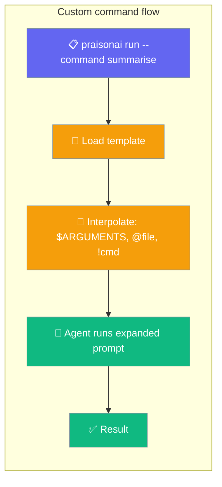

Custom commands are Markdown templates stored in `.praisonai/commands/` that expand into full prompts when you run `praisonai run --command <name>`.



## Quick Start

<Steps>
<Step title="Create a command template">
```bash
mkdir -p .praisonai/commands
```

```markdown
# .praisonai/commands/summarise.md
Summarise the following text in three bullet points:

$ARGUMENTS
```
</Step>

<Step title="Run the command">
```bash
praisonai run --command summarise "Long article text goes here"
```

`$ARGUMENTS` is replaced with the text you pass as `TARGET`.
</Step>

<Step title="Add frontmatter for metadata">
```markdown
---
description: "Summarise text into three bullet points"
---

Summarise the following text in three bullet points:

$ARGUMENTS
```
</Step>
</Steps>

---

## Template Interpolation

| Syntax | Behaviour |
|---|---|
| `$ARGUMENTS` | Replaced with the text passed as `TARGET` on the CLI |
| `@path/to/file` | Replaced with the contents of that file (relative to the project root) |
| `$(...)` | **Always escaped** — never executed (literal `\$(...)` in output) |
| `` !`cmd` `` | Opt-in live shell output — **disabled by default** (see [Shell Substitution](#shell-substitution)) |

### `$ARGUMENTS`

```markdown
Review this code:

$ARGUMENTS
```

```bash
praisonai run --command review "function foo() { return 42; }"
```

### `@file` inclusion

Inline the contents of a file at template load time:

```markdown
Here is the current diff:

@git-diff.txt

Suggest a commit message.
```

File paths are resolved relative to the project root and sandboxed — paths that escape the root are left as-is.

### `$(...)` escape

`$(shell)` syntax is **always escaped** to prevent accidental command execution. The literal string `$(date)` in a template becomes `\$(date)` in the expanded prompt — safe to pass to the LLM as-is.

---

## Shell Substitution

Live shell output can be embedded in templates with `` !`cmd` ``. This is **disabled by default** for security.

```markdown
---
allow_shell: true
---

Here is the current git diff:

!`git diff HEAD`

Write a commit message for these changes.
```

### Enabling shell substitution

Enable it with any of these (listed from lowest to highest precedence):

| Method | How |
|---|---|
| **Project config** | Set `commands.allow_shell: true` in `.praisonai/config.yaml` |
| **Environment variable** | `PRAISONAI_ALLOW_SHELL=true` |
| **Per-command frontmatter** | `allow_shell: true` in the command's `.md` file |
| **Programmatic** | `interpolate(..., allow_shell=True)` in Python |

### Project config

```yaml
# .praisonai/config.yaml
commands:
  allow_shell: true
```

### Environment variable

```bash
PRAISONAI_ALLOW_SHELL=true praisonai run --command commit "wip"
```

### Per-command frontmatter

```markdown
---
description: "Generate a commit message from the current diff"
allow_shell: true
---

Here is the current diff:

!`git diff HEAD`

Write a conventional commit message for these changes.
```

### What happens when it's disabled?

If a template contains `` !`cmd` `` but shell execution is not enabled, you get a clear error:

```
Error: Command template contains live shell substitution (!`...`) but
shell execution is not enabled. Enable it with PRAISONAI_ALLOW_SHELL=true,
the `commands.allow_shell` config flag, or `allow_shell: true` in the
command's frontmatter.
```

The command does **not** silently escape or skip the substitution — the error is intentional.

### Safety bounds

| Bound | Value |
|---|---|
| **Timeout** | 30 seconds |
| **Stdout cap** | 100 KB |
| **Execution order** | Shell substitutions run on the original template, before `$ARGUMENTS` and `@file` injection — untrusted input can never introduce a `` !`cmd` `` that gets executed |

---

## File Layout

```
~/.praisonai/commands/          # user-global (all projects)
  summarise.md
  commit.md

.praisonai/commands/            # project-level (this project)
  review.md
  changelog.md
```

**Discovery order:** user-global first, then project-level. Project-level wins on name collision.

---

## Frontmatter Fields

```markdown
---
description: "Human-readable description shown in listings"
allow_shell: true               # opt-in live !`cmd` execution (default: false)
---

Template body goes here.
$ARGUMENTS
```

| Field | Type | Default | Description |
|---|---|---|---|
| `description` | string | — | Shown in `praisonai command list` |
| `allow_shell` | bool | `false` | Enable `` !`cmd` `` substitution for this command |

---

## Examples

### Commit message generator

```markdown
---
description: "Generate a conventional commit message from the staged diff"
allow_shell: true
---

Write a conventional commit message for the following diff:

!`git diff --staged`

Rules:
- Use feat/fix/docs/chore/refactor prefix
- One-line summary, 72 chars max
- No body unless the change is complex
```

```bash
git add -A
praisonai run --command commit
```

### Code review

```markdown
---
description: "Review a file or snippet for bugs and style issues"
---

Review this code for bugs, security issues, and style problems:

$ARGUMENTS

Provide specific, actionable feedback with line references where possible.
```

```bash
praisonai run --command review "$(cat src/auth.py)"
```

### Changelog entry

```markdown
---
description: "Draft a changelog entry from recent commits"
allow_shell: true
---

Draft a changelog entry (keep-a-changelog format) based on these recent commits:

!`git log --oneline -20`

Group changes into Added / Changed / Fixed / Removed.
```

```bash
praisonai run --command changelog
```

---

## Best Practices

<AccordionGroup>

<Accordion title="Enable shell substitution only where needed">
Use per-command `allow_shell: true` frontmatter rather than the project-wide config flag. This limits the scope of live shell execution to the specific commands that need it.
</Accordion>

<Accordion title="Keep shell commands simple and deterministic">
`` !`git diff HEAD` `` is safe. `` !`curl https://...` `` in a shared config is a security risk. Prefer reading local files or running version-control commands.
</Accordion>

<Accordion title="Put user-global commands in ~/.praisonai/commands/">
Commands useful across all projects (commit, review, summarise) belong in the user-global directory. Project-specific commands go in `.praisonai/commands/`.
</Accordion>

<Accordion title="Use $ARGUMENTS for the variable part, @file for static context">
Pass the input the user provides via `$ARGUMENTS` and load static files (style guide, schema, existing code) via `@file`. This gives a clean separation between user input and template context.
</Accordion>

</AccordionGroup>

---

## Related

<CardGroup cols={2}>
<Card title="Run Command" icon="play" href="/docs/cli/run">
`--command` flag and how `TARGET` maps to `$ARGUMENTS`.
</Card>
<Card title="Custom Agents" icon="user" href="/docs/cli/agent">
Named agent definitions in `.praisonai/agents/`.
</Card>
<Card title="Command CLI" icon="terminal" href="/docs/cli/command">
`praisonai command` — list and inspect defined commands.
</Card>
<Card title="Permissions" icon="shield" href="/docs/cli/permissions">
Control what tools agents can use when running a command.
</Card>
</CardGroup>
