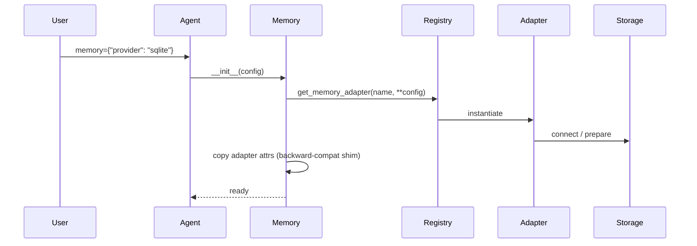

PraisonAI's memory backends are pluggable — register your own adapter to store agent memory in any system.


## Quick Start

<Steps>
<Step title="Simple Usage">
Use a built-in adapter via string to anchor the mental model:

```python
from praisonaiagents import Agent

agent = Agent(
    name="assistant",
    instructions="Remember user preferences",
    memory="in_memory",  # Ephemeral dict-backed storage
)
agent.start("My favourite colour is blue")
```
</Step>

<Step title="With a Custom Adapter">
Register your adapter, then point the agent at it:

```python
from typing import Any, Dict, List, Optional
from praisonaiagents import Agent, add_memory_adapter


class RedisMemoryAdapter:
    def __init__(self, **kwargs):
        self._store: List[Dict[str, Any]] = []

    def store_short_term(self, text: str, metadata: Optional[Dict[str, Any]] = None, **kwargs) -> str:
        doc_id = str(len(self._store))
        self._store.append({"id": doc_id, "text": text, "metadata": metadata or {}})
        return doc_id

    def search_short_term(self, query: str, limit: int = 5, **kwargs) -> List[Dict[str, Any]]:
        hits = [e for e in self._store if query.lower() in e["text"].lower()]
        return hits[:limit]

    def store_long_term(self, text: str, metadata: Optional[Dict[str, Any]] = None, **kwargs) -> str:
        return self.store_short_term(text, metadata, **kwargs)

    def search_long_term(self, query: str, limit: int = 5, **kwargs) -> List[Dict[str, Any]]:
        return self.search_short_term(query, limit, **kwargs)

    def get_all_memories(self, **kwargs) -> List[Dict[str, Any]]:
        return list(self._store)


add_memory_adapter("redis", RedisMemoryAdapter)

agent = Agent(
    name="assistant",
    memory={"provider": "redis"},
)
```
</Step>
</Steps>

## How It Works

When `Memory` initialises, it resolves the provider through the adapter registry — the only code path for backend setup since PR #2060 removed orphaned legacy `_init_*` methods.



## Built-in Adapters

| Adapter | Registry name | Backend | When to use |
|---------|---------------|---------|-------------|
| `SqliteMemoryAdapter` | `"sqlite"` | SQLite file | Default persistent local storage |
| `InMemoryAdapter` | `"in_memory"` | Python dict | Tests, ephemeral workflows |
| Factory | `"chroma"` | ChromaDB (lazy) | Vector search, local RAG |
| Factory | `"mongodb"` | MongoDB (lazy) | Document store, Atlas Vector Search |
| Factory | `"mem0"` | Mem0 cloud (lazy) | Managed graph / cloud memory |

Heavy backends register as **factories** in `praisonaiagents.memory.adapters.factories` so optional dependencies load only when requested.

## Register Your Own Adapter

Implement `MemoryProtocol` — at minimum: `store_short_term`, `search_short_term`, `store_long_term`, `search_long_term`, and `get_all_memories`.

```python
from praisonaiagents import add_memory_adapter, get_memory_adapter

add_memory_adapter("my_backend", MyAdapter)
adapter = get_memory_adapter("my_backend")
```

<Note>
`add_memory_adapter` and `register_memory_adapter` are synonyms; both work. `add_memory_adapter` is the canonical name per the SDK naming convention (`add_X` = register something).
</Note>

Then use it from an agent:

```python
agent = Agent(memory={"provider": "my_backend"})
```

## Registry API at a Glance

| Function | Purpose | Alias |
|---|---|---|
| `add_memory_adapter(name, cls)` | Register an adapter class | `register_memory_adapter` |
| `add_memory_factory(name, fn)` | Register a lazy factory function | `register_memory_factory` |
| `get_memory_adapter(name, **kwargs)` | Instantiate a registered adapter | — |
| `has_memory_adapter(name)` | Check whether a name is registered | — |
| `list_memory_adapters()` | List all registered names | — |

## Common Patterns

**Async adapter** — implement `AsyncMemoryProtocol` (`astore_short_term`, `asearch_short_term`, etc.) when your backend is async-native.

**Lazy-loaded heavy backend** — use `add_memory_factory(name, create_fn)` (or its synonym `register_memory_factory`) so imports like `chromadb` or `pymongo` happen inside the factory, not at package import time.

**Extending an existing adapter** — subclass `SqliteMemoryAdapter` or wrap `InMemoryAdapter` and register under a new name.

**Inspect the registry** — check what's registered before wiring an agent:

```python
from praisonaiagents import has_memory_adapter, list_memory_adapters, add_memory_adapter

if not has_memory_adapter("redis"):
    add_memory_adapter("redis", RedisMemoryAdapter)

print(list_memory_adapters())  # ['sqlite', 'in_memory', 'mem0', 'chroma', 'mongodb', 'redis']
```

## Best Practices

<AccordionGroup>
<Accordion title="Prefer the registry over patching Memory">
Register adapters with `add_memory_adapter` or `add_memory_factory` instead of monkey-patching `Memory` internals.
</Accordion>

<Accordion title="Implement sync and async when possible">
Sync methods satisfy `MemoryProtocol`; add `AsyncMemoryProtocol` methods if your store supports non-blocking I/O.
</Accordion>

<Accordion title="Close connections in .close()">
Implement `close()` on adapters that hold clients (MongoDB, ChromaDB). `Session.close()` calls `memory.close_connections()` which forwards to the adapter.
</Accordion>

<Accordion title="List registered adapters at runtime">
```python
from praisonaiagents import list_memory_adapters
print(list_memory_adapters())  # ['sqlite', 'in_memory', 'mem0', 'chroma', 'mongodb', ...]
```
</Accordion>
</AccordionGroup>

## Related

<CardGroup cols={2}>
<Card title="Memory Concepts" icon="brain" href="/docs/features/advanced-memory">
  Provider strings, short-term vs long-term, and configuration basics.
</Card>
<Card title="Memory Cleanup" icon="broom" href="/docs/best-practices/memory-cleanup">
  Session teardown and adapter `close()` lifecycle.
</Card>
<Card title="MongoDB Memory" icon="database" href="/docs/features/mongodb-memory">
  Atlas Vector Search and `use_vector_search` configuration.
</Card>
<Card title="Memory Troubleshooting" icon="triangle-exclamation" href="/docs/features/memory-troubleshooting">
  ImportError and fallback behaviour when providers are missing.
</Card>
</CardGroup>
