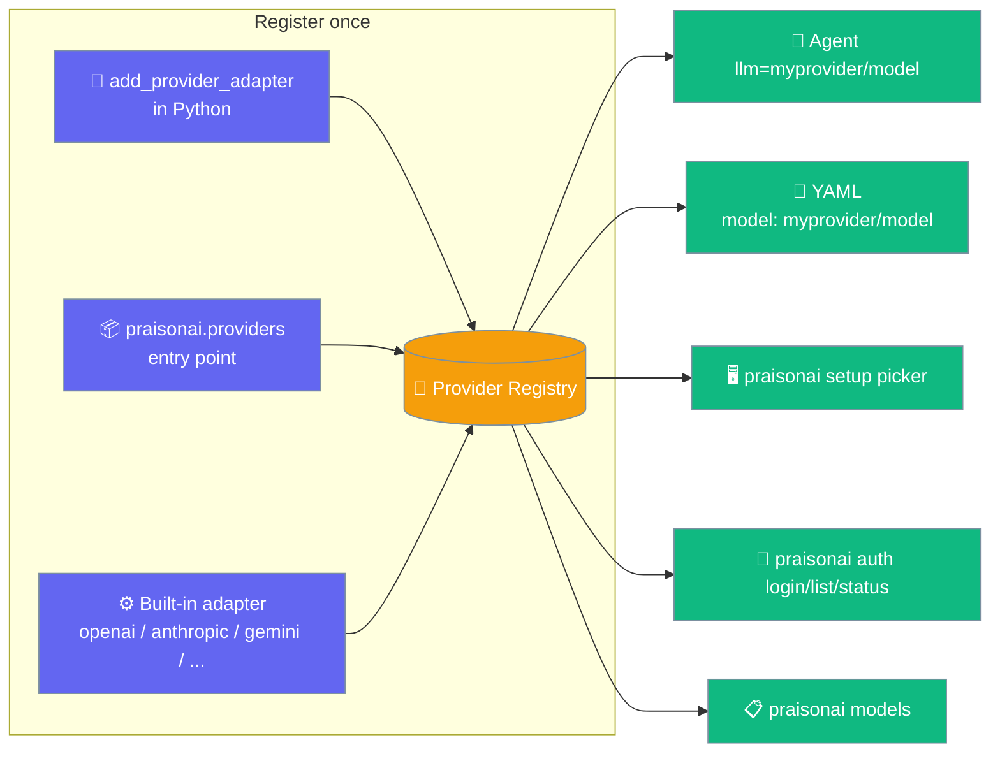
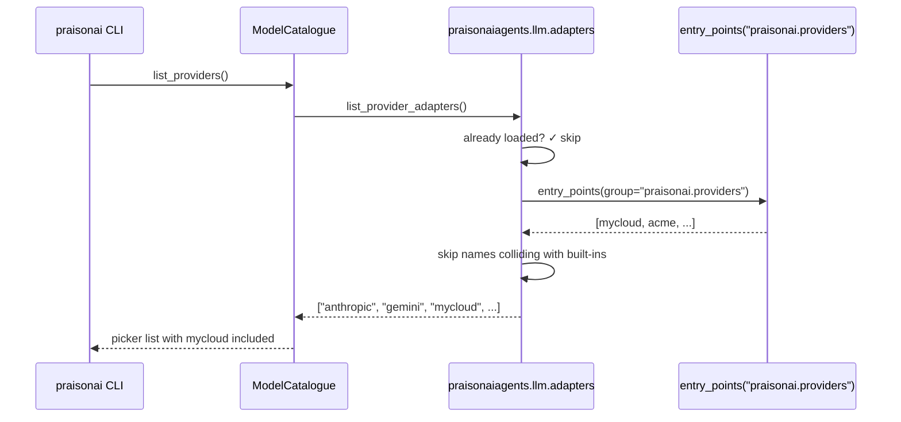
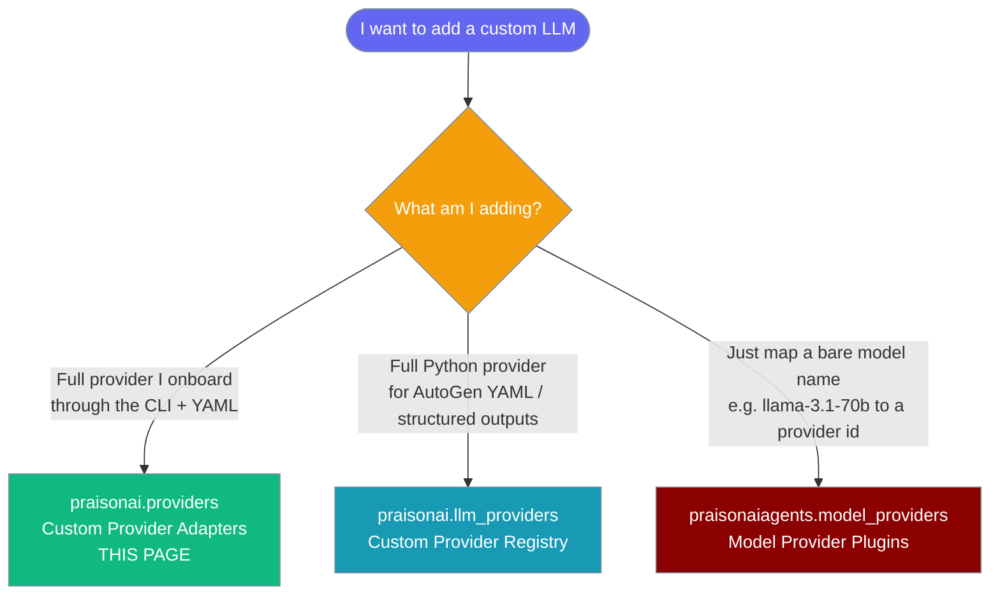

Register a custom LLM provider in Python or as a pip plugin, and it works end-to-end — from the `Agent(llm="myprovider/model")` call, in YAML, and in every `praisonai` CLI command — without editing core.



## Quick Start

<Steps>
<Step title="Use a provider you registered in Python">
Register an adapter, then point an agent at it with a `provider/model` string.

```python
from praisonaiagents import Agent
from praisonaiagents.llm.adapters import add_provider_adapter, DefaultAdapter

class MyCloudAdapter(DefaultAdapter):
    pass

add_provider_adapter("mycloud", MyCloudAdapter())

agent = Agent(
    name="Cloud Agent",
    instructions="Answer briefly",
    llm="mycloud/model-v1",
)
agent.start("Say hello")
```
</Step>

<Step title="Ship it as a pip-installable plugin">
Publish the adapter under the `praisonai.providers` entry-point group so any `pip install` makes it first-class.

```toml
# your-plugin/pyproject.toml
[project.entry-points."praisonai.providers"]
mycloud = "my_pkg.adapter:MyCloudAdapter"
```

The entry point can be:
- An adapter **instance**: `"my_pkg:ADAPTER_INSTANCE"`
- An adapter **class**: `"my_pkg.adapter:MyCloudAdapter"` (instantiated on load)
- A zero-arg **factory callable**: `"my_pkg.adapter:build_adapter"` (called on load)

After `pip install your-plugin`:

```bash
praisonai auth login mycloud          # prompts for MYCLOUD_API_KEY, stores it
praisonai setup                        # mycloud appears in the picker
praisonai models                       # mycloud models listed
praisonai run "Say hello" --model mycloud/model-v1
```
</Step>
</Steps>

---

## How It Works

Discovery is lazy and idempotent: the first call to `list_provider_adapters()` or `get_provider_adapter()` scans the `praisonai.providers` entry-point group once per process.



| Rule | Behaviour |
|---|---|
| Discovery is lazy | `load_provider_entry_points()` is idempotent and runs at most once per process. |
| Built-ins win | A plugin entry-point named `anthropic`, `gemini`, `openai`, `ollama`, `claude` is skipped silently — no built-in override from a plugin. Use `add_provider_adapter(name, adapter)` in Python if you intend to override a built-in. |
| Fail-safe | A broken plugin (import error, factory raises) is skipped — provider resolution never breaks. |
| Credentials | A discovered provider needs `<PROVIDER>_API_KEY` by default (e.g. `MYCLOUD_API_KEY`), flowing through the standard credential store and env export. |
| Prefix routing | `Agent(llm="mycloud/model-v1")` routes through the registered adapter via `LLM._detect_provider` — not silently to OpenAI. |
| Explicit prefix wins | A discovered prefix starting with a built-in name (`gptlike/…`, `geminity/…`) resolves to the discovered provider over the bare-name fallback in `provider_for_model`. |

---

## Same provider, three surfaces

The same provider works identically from Python, YAML, and the CLI.

<Tabs>
  <Tab title="Python">
```python
from praisonaiagents import Agent

agent = Agent(name="Cloud Agent", llm="mycloud/model-v1")
agent.start("Say hello")
```
  </Tab>
  <Tab title="YAML">
```yaml
framework: praisonai
agents:
  cloud:
    role: Responder
    goal: Reply
    instructions: "Reply briefly"
    llm: mycloud/model-v1
```
  </Tab>
  <Tab title="CLI">
```bash
praisonai auth login mycloud
praisonai run "Say hello" --model mycloud/model-v1
```
  </Tab>
</Tabs>

---

## Choosing between the three plugin systems

PraisonAI has three separate provider-plugin systems — pick the one that matches what you are adding.



---

## Public API

Import everything from `praisonaiagents.llm.adapters`.

```python
from praisonaiagents.llm.adapters import (
    add_provider_adapter,
    list_provider_adapters,
    load_provider_entry_points,
    get_provider_adapter,
    DefaultAdapter,              # convenient base class
)
from praisonaiagents.llm.protocols import LLMProviderAdapterProtocol  # for type hints
```

| Symbol | Signature | Purpose |
|---|---|---|
| `add_provider_adapter` | `(name: str, adapter: LLMProviderAdapterProtocol) -> None` | Register an adapter in Python at runtime. |
| `list_provider_adapters` | `() -> List[str]` | Sorted list of all registered adapter names (built-ins + runtime + entry-point). Triggers lazy discovery. |
| `load_provider_entry_points` | `() -> None` | Idempotent entry-point scan. Called automatically on first `list_provider_adapters()` / `get_provider_adapter()`. |
| `get_provider_adapter` | `(name: str) -> LLMProviderAdapterProtocol` | Look up an adapter by provider id or `provider/model` prefix. Falls back to `DefaultAdapter` for an unknown name. |

The adapter object implements `LLMProviderAdapterProtocol` (in `praisonaiagents/llm/protocols.py`) with hooks like `supports_prompt_caching()`, `supports_streaming()`, `format_tool_result_message(...)`, and `get_default_settings()`. Subclassing `DefaultAdapter` gives sensible defaults for all of them.

---

## Common Patterns

Reuse `DefaultAdapter` as a base when your provider is OpenAI-compatible — same request/response shape, only credentials differ.

```python
from praisonaiagents.llm.adapters import add_provider_adapter, DefaultAdapter

class MyCloudAdapter(DefaultAdapter):
    pass

add_provider_adapter("mycloud", MyCloudAdapter())
```

Let credentials auto-detect — setting `MYCLOUD_API_KEY` in the environment is enough for a first run, no `auth login` needed.

```bash
export MYCLOUD_API_KEY=sk-...
praisonai run "Say hello" --model mycloud/model-v1
```

Avoid names that collide with built-ins (`openai`, `anthropic`, `gemini`, `ollama`, `claude`) — the loader skips those silently and your plugin will seem not to register.

---

## Best Practices

<AccordionGroup>
<Accordion title="Use a conventional lowercase name">
Matching is case-insensitive and the registry stores names lowercase — register `mycloud`, not `MyCloud`.
</Accordion>

<Accordion title="Keep adapter construction cheap and failure-tolerant">
The loader catches construction errors and skips, so a slow or raising adapter silently disappears from the picker — connect lazily on first request.
</Accordion>

<Accordion title="Document your default model">
Users expect a default model row in `auth list`; if yours differs from the built-ins, mention it in your package's README.
</Accordion>

<Accordion title="Prefer entry-point registration for reusable providers">
Shipping via the `praisonai.providers` entry point gives users picker, `auth`, and YAML support without any Python glue — favour it over runtime `add_provider_adapter`.
</Accordion>
</AccordionGroup>

---

## Related

<CardGroup cols={2}>
  <Card title="Custom Provider Registry" icon="plug" href="/models/custom-provider">
    The different `praisonai.llm_providers` system (Python-only, structured completion).
  </Card>
  <Card title="Model Provider Plugins" icon="plug" href="/features/model-provider-plugins">
    The different `praisonaiagents.model_providers` system (bare-name → provider id matchers).
  </Card>
  <Card title="Auth" icon="key" href="/cli/auth">
    How a discovered provider's `<PROVIDER>_API_KEY` is stored and surfaced.
  </Card>
  <Card title="Setup" icon="gear" href="/cli/setup">
    The picker that enumerates discovered providers.
  </Card>
</CardGroup>
