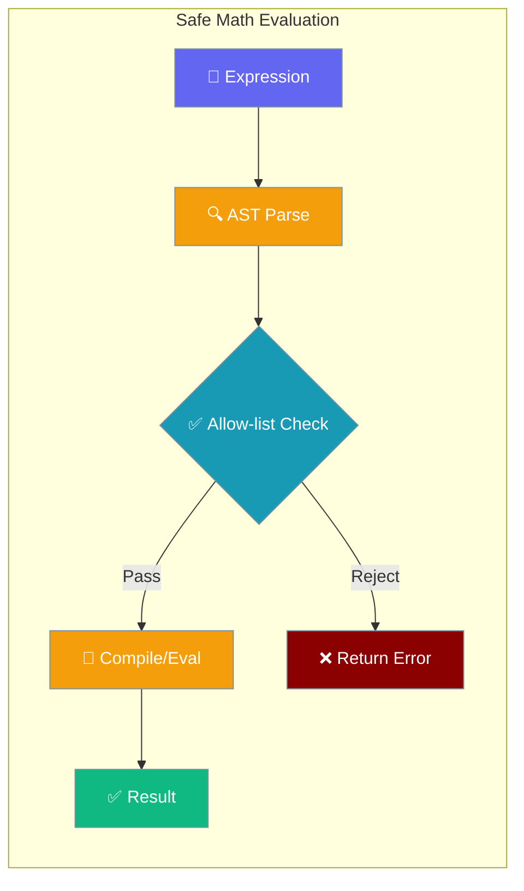
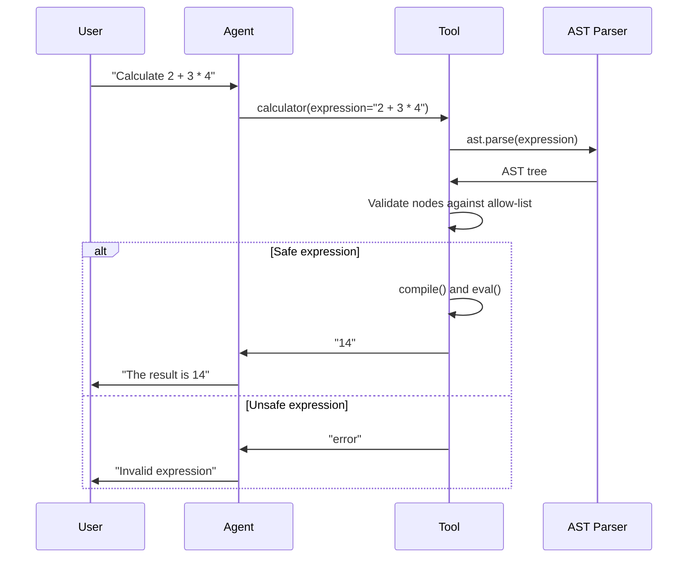

Use an AST allow-list instead of `eval()` when a custom tool evaluates user-supplied math.



## Quick Start

<Steps>
<Step title="Unsafe (don't do this)">
<Warning>
This pattern is dangerous and vulnerable to remote code execution attacks:

```python
# DON'T USE - Unsafe pattern
def unsafe_calculator(expr):
    try:
        result = eval(expr, {"__builtins__": {}})
        return str(result)
    except Exception:
        return "error"
```
</Warning>
</Step>

<Step title="Safe pattern">
Use the AST-based allow-list for secure math evaluation:

```python
import ast
from praisonaiagents import Agent

def _safe_calc(expr: str) -> str:
    """Safely evaluate basic arithmetic expressions using AST."""
    try:
        # Parse the expression into an AST
        tree = ast.parse(expr, mode='eval')
        
        # Check if all nodes are safe
        for node in ast.walk(tree):
            if not isinstance(node, (
                ast.Expression, ast.BinOp, ast.UnaryOp,
                ast.Constant, ast.Num,  # ast.Num for older Python versions
                ast.Add, ast.Sub, ast.Mult, ast.Div,
                ast.USub, ast.UAdd
            )):
                return "error"  # Reject unsafe operations
        
        # Compile and evaluate the safe expression
        code = compile(tree, '<string>', 'eval')
        result = eval(code)
        return str(result)
    except Exception:
        return "error"

# Create agent with safe calculator tool
agent = Agent(
    name="MathAgent",
    instructions="You are a helpful math assistant. Use the calculator for arithmetic.",
    tools=[
        {
            "type": "function",
            "function": {
                "name": "calculator",
                "description": "Safely evaluate basic arithmetic expressions",
                "parameters": {
                    "type": "object",
                    "properties": {
                        "expression": {
                            "type": "string",
                            "description": "Math expression like '2 + 3 * 4'"
                        }
                    },
                    "required": ["expression"]
                }
            }
        }
    ]
)

@agent.tool
def calculator(expression: str) -> str:
    """Safely calculate arithmetic expressions."""
    return _safe_calc(expression)

# Test the safe calculator
result = agent.start("Calculate 15 + 27 * 3")
```
</Step>
</Steps>

---

## How It Works



---

## Allow-list Reference

The AST allow-list permits only these node types for safe arithmetic evaluation:

| Node Type | Purpose | Example |
|-----------|---------|---------|
| `ast.Expression` | Root expression node | Required wrapper |
| `ast.BinOp` | Binary operations | `2 + 3`, `4 * 5` |
| `ast.UnaryOp` | Unary operations | `-5`, `+3` |
| `ast.Constant` | Literal values | `42`, `3.14` |
| `ast.Add` | Addition operator | `+` |
| `ast.Sub` | Subtraction operator | `-` |
| `ast.Mult` | Multiplication operator | `*` |
| `ast.Div` | Division operator | `/` |
| `ast.USub` | Unary minus | `-x` |
| `ast.UAdd` | Unary plus | `+x` |

**Explicitly rejected constructs:**
- Function calls (`pow()`, `exec()`, `__import__()`)
- Attribute access (`.attr`, `obj.method`)  
- Names/variables (`x`, `globals`)
- List/dict comprehensions
- Power operator (`**`)
- Modulo operator (`%`)

---

## Common Patterns

### Integrate with MCP server

```python
from praisonaiagents.mcp import MCP
import ast

def _safe_calc(expr: str) -> str:
    """Safe math evaluation for MCP tools."""
    try:
        tree = ast.parse(expr, mode='eval')
        for node in ast.walk(tree):
            if not isinstance(node, (
                ast.Expression, ast.BinOp, ast.UnaryOp,
                ast.Constant, ast.Num,
                ast.Add, ast.Sub, ast.Mult, ast.Div,
                ast.USub, ast.UAdd
            )):
                return "error"
        code = compile(tree, '<string>', 'eval')
        return str(eval(code))
    except Exception:
        return "error"

# Use in MCP server context
mcp_server = MCP(
    name="safe-calculator",
    tools=[{
        "name": "calculate",
        "description": "Safely evaluate arithmetic expressions", 
        "handler": lambda expr: _safe_calc(expr["expression"])
    }]
)
```

### Integrate with a local provider tool

```python
from praisonai import Agent, ManagedAgent, LocalManagedConfig

def _safe_calc(expr: str) -> str:
    """AST-based safe calculator."""
    try:
        tree = ast.parse(expr, mode='eval')
        for node in ast.walk(tree):
            if not isinstance(node, (
                ast.Expression, ast.BinOp, ast.UnaryOp,
                ast.Constant, ast.Num,
                ast.Add, ast.Sub, ast.Mult, ast.Div,
                ast.USub, ast.UAdd
            )):
                return "error"
        code = compile(tree, '<string>', 'eval')
        return str(eval(code))
    except Exception:
        return "error"

def handle_calculator(tool_name, tool_input):
    """Safe calculator handler for managed agents."""
    expr = tool_input.get("expression", "0")
    result = _safe_calc(expr)
    print(f"  [Calculator: {expr} = {result}]")
    return result

# Configure managed agent with safe calculator
managed = ManagedAgent(
    provider="local",
    config=LocalManagedConfig(
        model="gpt-4o-mini",
        system="You are an assistant with a calculator tool. Use it for math.",
        name="SafeCalcAgent",
        tools=[{
            "type": "custom",
            "name": "calculator",
            "description": "Evaluate a math expression safely",
            "input_schema": {
                "type": "object",
                "properties": {
                    "expression": {"type": "string", "description": "Math expression"},
                },
                "required": ["expression"],
            },
        }],
    ),
    on_custom_tool=handle_calculator,
)

agent = Agent(name="calc", backend=managed)
result = agent.start("Use the calculator to compute 99 * 77")
```

---

## Best Practices

<AccordionGroup>
<Accordion title="Never call eval() on user input">
Always parse user expressions through AST validation before evaluation. The `eval()` function can execute arbitrary Python code and should never receive untrusted input, even with restricted `__builtins__`.
</Accordion>

<Accordion title="Reject before parsing using a character allow-list">
Add an initial character filter to catch obviously malicious input:

```python
def _safe_calc(expr: str) -> str:
    # Pre-filter: only allow safe characters
    allowed_chars = set("0123456789+-*/(). ")
    if not all(c in allowed_chars for c in expr):
        return "error"
    
    # Continue with AST parsing...
    try:
        tree = ast.parse(expr, mode='eval')
        # ... rest of validation
    except Exception:
        return "error"
```
</Accordion>

<Accordion title="Return a sentinel string rather than raising">
Return `"error"` instead of raising exceptions to provide graceful degradation in agent workflows. This prevents the entire agent conversation from failing due to a malformed math expression.
</Accordion>

<Accordion title="Cap expression length">
Prevent resource exhaustion by limiting expression length:

```python
def _safe_calc(expr: str) -> str:
    if len(expr) > 100:  # Reasonable limit
        return "error"
    
    # Continue with validation...
```
</Accordion>
</AccordionGroup>

---

## Related

<CardGroup cols={2}>
<Card title="Security Guide" icon="shield" href="/security">
  Complete security practices and hardening measures
</Card>
<Card title="Custom Tools" icon="wrench" href="/concepts/tools">
  Build custom tools for agents with proper patterns
</Card>
</CardGroup>