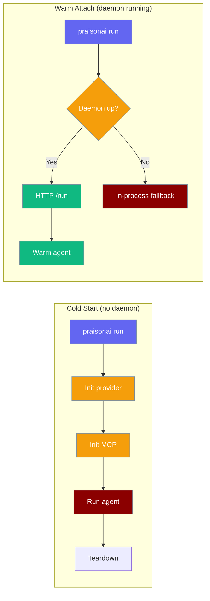
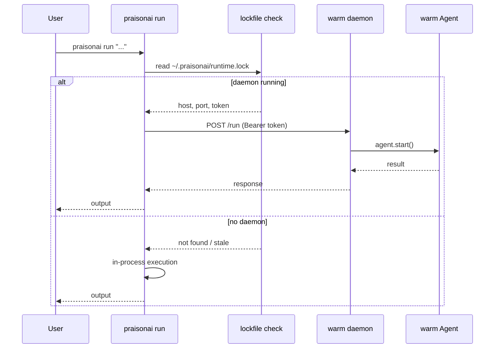
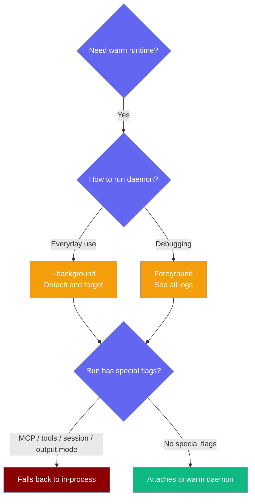

`praisonai daemon` keeps your AI providers and MCP connections warm so each `praisonai run` skips cold-start overhead.



## Quick Start

<Steps>
<Step title="Start the daemon in the background">
```bash
praisonai daemon start --background
```
```
✓ Warm runtime started in background at http://127.0.0.1:54321 (pid 12345)
```
</Step>

<Step title="Run agents — attach happens automatically">
```bash
# First time — no runtime, normal cold-start
praisonai run "summarize this"

# After daemon start — subsequent runs skip cold-start
praisonai run "summarize this again"        # fast
praisonai run "now translate to French"     # fast
```

No flags needed. `praisonai run` detects the daemon automatically.
</Step>

<Step title="Check status and stop">
```bash
praisonai daemon status
```
```
✓ Warm runtime running at http://127.0.0.1:54321 (pid 12345).
```

```bash
praisonai daemon stop
```
</Step>
</Steps>

## User Interaction Flow

```bash
# First time — no daemon, normal cold-start
$ praisonai run "summarize this"

# Boot once in the background
$ praisonai daemon start --background
✓ Warm runtime started in background at http://127.0.0.1:54321 (pid 12345)

# Subsequent runs skip cold-start automatically — same command, no flags
$ praisonai run "summarize this again"        # fast
$ praisonai run "now translate to French"     # fast

# Check what's running
$ praisonai daemon status
✓ Warm runtime running at http://127.0.0.1:54321 (pid 12345).

# Tear down (or just let --idle-timeout do it)
$ praisonai daemon stop
```

## How It Works



## Decision Guide



## Configuration Options

### `praisonai daemon start`

| Flag | Type | Default | Description |
|------|------|---------|-------------|
| `--host`, `-h` | `str` | `127.0.0.1` | Loopback host to bind. Non-loopback values are rejected. |
| `--port`, `-p` | `int` | `0` | Port to bind. `0` = auto-select a free port. |
| `--model`, `-m` | `str` | `None` | Default model for warm agents. |
| `--idle-timeout` | `float` | `1800.0` | Seconds idle before auto-shutdown. `0` disables auto-shutdown. |
| `--background`, `-b` | `bool` | `False` | Detach and run in the background. |

### `praisonai daemon status`

| Flag | Type | Default | Description |
|------|------|---------|-------------|
| `--json` | `bool` | `False` | Output JSON: `{running, host, port, pid, base_url}` |

### `praisonai daemon stop`

No flags. Sends `SIGTERM` to the running daemon after a health-ping confirms the correct process.

## When `run` Stays In-Process

`praisonai run` skips the daemon and runs in-process when any of these flags are set:

- **Tool flags:** `--mcp`, `--tools`, `--toolset`
- **Approval flags:** `--approval`, `--approve-all-tools`
- **Memory:** `--memory`
- **Permission flags:** `--permissions`, `--allow`, `--deny`, `--permission-default`
- **Session flags:** `--continue`, `--session`, `--fork`
- **Output modes:** `--output actions`, `--output json`, `--output stream`, `--output stream-json`

The daemon carries no per-invocation overrides or session state, so these fall back to guarantee correct behavior.

<Warning>
**Security model**

- **Loopback-only bind** — non-loopback `--host` values are rejected with exit code 1.
- **Bearer-token auth only** — every request requires `Authorization: Bearer <token>`. No query-param fallback.
- **Per-process token** — `secrets.token_urlsafe(32)` is generated fresh on every `daemon start`.
- **Lockfile mode `0600`** — atomic open with mode bits set up-front, preventing a world-readable window.
- **PID-reuse-safe stop** — `daemon stop` pings the runtime before sending `SIGTERM`; a failed ping cleans the stale lockfile instead of killing an unrelated process.
- **Per-model serialization** — concurrent `/run` calls are serialized by a per-model lock to prevent state corruption.
- **Cache eviction on failure** — when `agent.start()` raises, the cached agent is evicted so the next call rebuilds clean.
</Warning>

## Common Patterns

**Repeated `praisonai run` in a shell loop:**

```bash
praisonai daemon start --background

for query in "summarize doc1.txt" "summarize doc2.txt" "compare both"; do
  praisonai run "$query"
done

praisonai daemon stop
```

**Auto-shutdown at night with `--idle-timeout`:**

```bash
# Shut down after 10 minutes of no activity
praisonai daemon start --background --idle-timeout 600
```

**Scripted status checks with `--json`:**

```bash
status=$(praisonai daemon status --json)
running=$(echo "$status" | python3 -c "import json,sys; print(json.load(sys.stdin)['running'])")

if [ "$running" = "True" ]; then
  echo "Daemon is up"
fi
```

## Best Practices

<AccordionGroup>
<Accordion title="Use --background for everyday workflows">
`praisonai daemon start --background` lets you boot once and forget. Subsequent `praisonai run` calls attach automatically.
</Accordion>

<Accordion title="Use foreground mode for debugging">
Run `praisonai daemon start` (without `--background`) to see all daemon logs in real time — useful when diagnosing unexpected fallbacks.
</Accordion>

<Accordion title="Don't set --idle-timeout=0 unless you mean it">
`--idle-timeout=0` disables auto-shutdown entirely. The daemon will run until you call `daemon stop` or kill the process.
</Accordion>

<Accordion title="The lockfile is per-project">
The runtime lockfile lives at `~/.praisonai/runtime.lock`. Each machine runs one daemon; multiple `praisonai run` calls in the same project share it.
</Accordion>
</AccordionGroup>

## Related

<CardGroup cols={2}>
<Card title="Run Command" icon="play" href="/docs/cli/run">
  Full reference for praisonai run flags and output modes
</Card>
<Card title="MCP Integration" icon="plug" href="/docs/mcp/mcp-tools">
  MCP connections are the biggest cold-start cost the daemon eliminates
</Card>
<Card title="Session Resume" icon="rotate-ccw" href="/docs/cli/session-resume">
  Resuming sessions with --continue and --session
</Card>
<Card title="Models" icon="microchip" href="/docs/models">
  Configure the default model for warm agents with --model
</Card>
</CardGroup>
