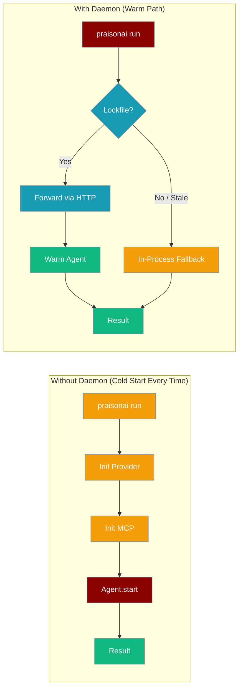
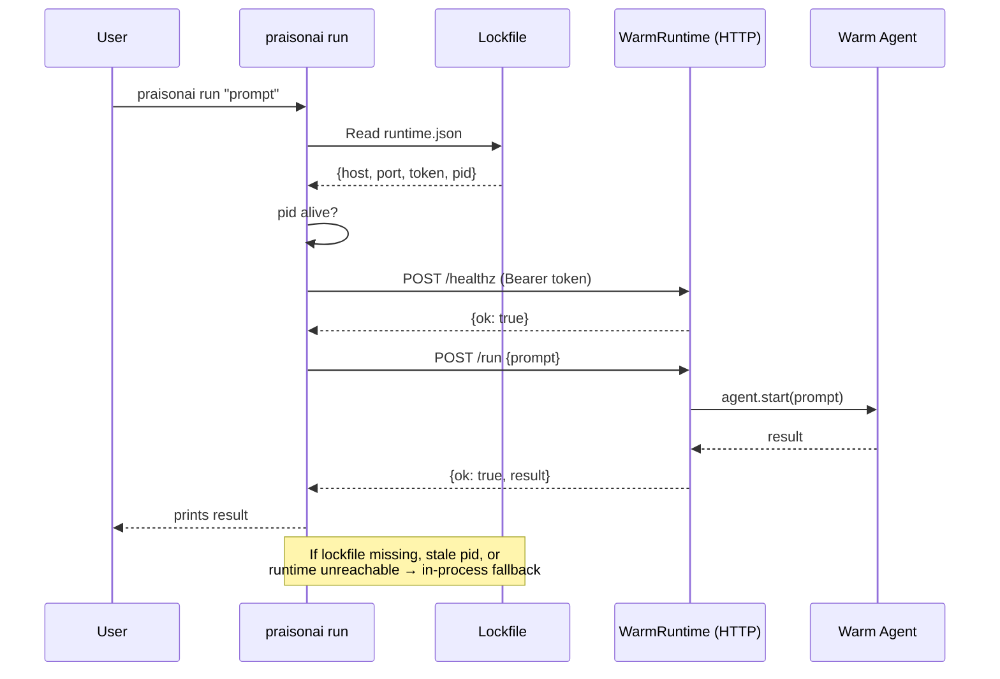
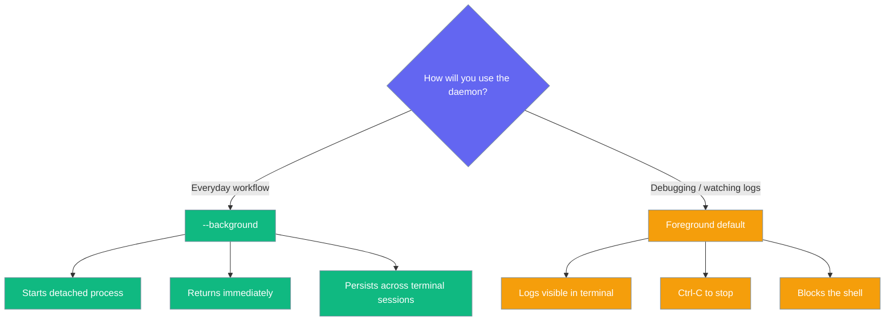

```python
from praisonaiagents import Agent

agent = Agent(name="daemon-agent", instructions="Run as a background daemon process.")
agent.start("Start the agent daemon and listen for incoming tasks.")
```


`praisonai daemon` keeps provider clients and MCP connections hot in memory so repeated `praisonai run` calls skip cold-start entirely.

The user runs repeated `praisonai run` commands; the warm daemon forwards work to hot provider and MCP connections.




## Quick Start

<Steps>
<Step title="Start the daemon in the background">
```bash
praisonai daemon start --background
```
```
✓ Warm runtime started in background at http://127.0.0.1:54321 (pid 12345)
```
The daemon writes a project-local lockfile and binds to a free loopback port. All subsequent `praisonai run` calls in the same project directory automatically detect and attach to it.
</Step>

<Step title="Run prompts — no extra flags needed">
```bash
praisonai run "Write a haiku about clouds"
praisonai run "Now make it rhyme"
praisonai run "Translate to Spanish"
```
Each call transparently attaches to the warm runtime. Provider and MCP clients are already initialised — only the prompt is forwarded.
</Step>

<Step title="Check status and stop">
```bash
praisonai daemon status
```
```
✓ Warm runtime running at http://127.0.0.1:54321 (pid 12345).
```

```bash
praisonai daemon stop
```
```
✓ Stopped warm runtime (pid 12345).
```
</Step>
</Steps>

---

## How It Works



| Component | Role |
|-----------|------|
| **Lockfile** (`runtime.json`) | Stores `{host, port, token, pid}` at `<project_data_dir>/runtime/runtime.json`. Mode `0600` — token is never world-readable. |
| **WarmRuntime** | Holds one warm `Agent` per model. Reuses it across calls. Evicts the agent on failure to prevent state bleed. |
| **RuntimeClient** | Thin stdlib (`urllib`) HTTP client. Raises `RuntimeUnavailable` on any error — `run` then falls back in-process. |
| **Idle watcher** | Background thread shuts down the server after `--idle-timeout` seconds of inactivity (default 30 min). |

---

## Configuration Options

### `praisonai daemon start`

| Flag | Type | Default | Description |
|------|------|---------|-------------|
| `--host`, `-h` | `str` | `127.0.0.1` | Loopback host to bind. Non-loopback addresses are rejected. |
| `--port`, `-p` | `int` | `0` | Port to bind. `0` = auto-select a free port. |
| `--model`, `-m` | `str` | `None` | Default model for the warm agent. |
| `--idle-timeout` | `float` | `1800.0` | Seconds idle before auto-shutdown. `0` disables auto-shutdown. |
| `--background`, `-b` | `bool` | `False` | Detach and run in the background. |

### `praisonai daemon status`

| Flag | Type | Default | Description |
|------|------|---------|-------------|
| `--json` | `bool` | `False` | Output JSON for scripting. Returns `{running, host, port, pid, base_url}`. |

```bash
praisonai daemon status --json
```
```json
{
  "running": true,
  "host": "127.0.0.1",
  "port": 54321,
  "pid": 12345,
  "base_url": "http://127.0.0.1:54321"
}
```

### `praisonai daemon stop`

No flags. Sends SIGTERM after a health-check ping to guard against PID reuse. Cleans up the lockfile.

---

## When to Use Foreground vs Background



---

## When `run` Stays In-Process

`praisonai run` skips the daemon and runs locally whenever you pass any of these flags:

| Flag(s) | Why it stays in-process |
|---------|------------------------|
| `--mcp`, `--tools`, `--toolset` | Per-invocation tool overrides need in-process state. |
| `--approval`, `--approve-all-tools` | Approval flow requires interactive in-process handling. |
| `--memory` | Memory store is managed in-process. |
| `--permissions` overrides | Security policy must be enforced locally. |
| `--continue`, `--session`, `--fork` | Session continuity and forking run in-process; the daemon carries no session state. |
| `--output actions`, `json`, `stream`, `stream-json` | Structured output modes need richer in-process event bridging. |

In all these cases, `praisonai run` behaves exactly as it did before the daemon feature. No flags are needed to opt out — it happens automatically.

---

## Common Patterns

<AccordionGroup>
<Accordion title="Iterating on prompts in a shell loop">
```bash
praisonai daemon start --background

for topic in clouds mountains rivers; do
  praisonai run "Write a haiku about $topic"
done

praisonai daemon stop
```
Only the first call pays setup cost. The loop body is fast — just HTTP over loopback.
</Accordion>

<Accordion title="Auto-shutdown at night with --idle-timeout">
```bash
# Shut down after 1 hour of inactivity (3600 seconds)
praisonai daemon start --background --idle-timeout 3600

# Or disable auto-shutdown entirely (not recommended for long sessions)
praisonai daemon start --background --idle-timeout 0
```
The default is 1800 seconds (30 minutes). The daemon shuts itself down silently when the idle timer expires.
</Accordion>

<Accordion title="Scripting status checks">
```bash
STATUS=$(praisonai daemon status --json)
RUNNING=$(echo "$STATUS" | python3 -c "import sys,json; d=json.load(sys.stdin); print(d['running'])")

if [ "$RUNNING" = "True" ]; then
  echo "Daemon is up"
else
  praisonai daemon start --background
fi
```
The `--json` flag returns `{running, host, port, pid, base_url}` — safe for `jq` or any JSON parser.
</Accordion>

<Accordion title="Using a specific model">
```bash
praisonai daemon start --background --model gpt-4o

# All runs that don't specify --model will use gpt-4o from the warm agent
praisonai run "summarize this document"
```
</Accordion>
</AccordionGroup>

---

## Security

<Warning>
**The daemon is local-only and should never be exposed beyond loopback.**

- **Loopback only**: The CLI rejects any `--host` that is not a loopback address (e.g. `127.0.0.1`, `::1`). There is no way to bind to an externally reachable interface.
- **Per-process bearer token**: Generated via `secrets.token_urlsafe(32)` at startup. A new token is generated every time the daemon starts. The token is accepted only via `Authorization: Bearer <token>` — never via query parameters.
- **File-permissioned lockfile**: `runtime.json` is written with mode `0600` (owner read/write only) using an atomic `O_CREAT|O_TRUNC` open with mode bits set up-front — the token is never written with loose permissions even briefly.
- **Idle timeout**: The daemon auto-shuts down after `--idle-timeout` seconds (default 30 minutes), limiting its exposure window.
- **PID liveness check**: `daemon stop` pings the runtime before sending SIGTERM to guard against signalling an unrelated process that inherited the same PID.
</Warning>

---

## Best Practices

<AccordionGroup>
<Accordion title="Use --background for everyday workflows">
Foreground mode is useful for debugging (you can see log output). For all other use cases, `--background` is simpler: it returns immediately and the daemon persists across terminal sessions.
</Accordion>

<Accordion title="Tune --idle-timeout carefully">
The default 30-minute timeout is a good balance between warmth and resource usage. Setting `--idle-timeout 0` means the daemon never shuts down automatically — only use this if you understand it will consume memory indefinitely.
</Accordion>

<Accordion title="One daemon per project">
The lockfile is stored under the project data directory, scoped to the current project. Running two daemons in the same project will print a warning and exit. Each project directory gets its own independent daemon.
</Accordion>

<Accordion title="Check status before starting">
```bash
praisonai daemon status
# → No warm runtime is running.

praisonai daemon start --background
```
Starting a daemon when one is already running prints a warning and exits cleanly — there is no risk of running two daemons accidentally.
</Accordion>
</AccordionGroup>

---

## Related

<CardGroup cols={2}>
<Card title="Run Command" icon="play" href="/docs/cli/run">
  The `praisonai run` command — automatically attaches to a warm daemon when one is running.
</Card>
<Card title="MCP Integration" icon="plug" href="/docs/mcp/overview">
  MCP server connections benefit most from the warm runtime — they stay connected across `run` calls.
</Card>
</CardGroup>
