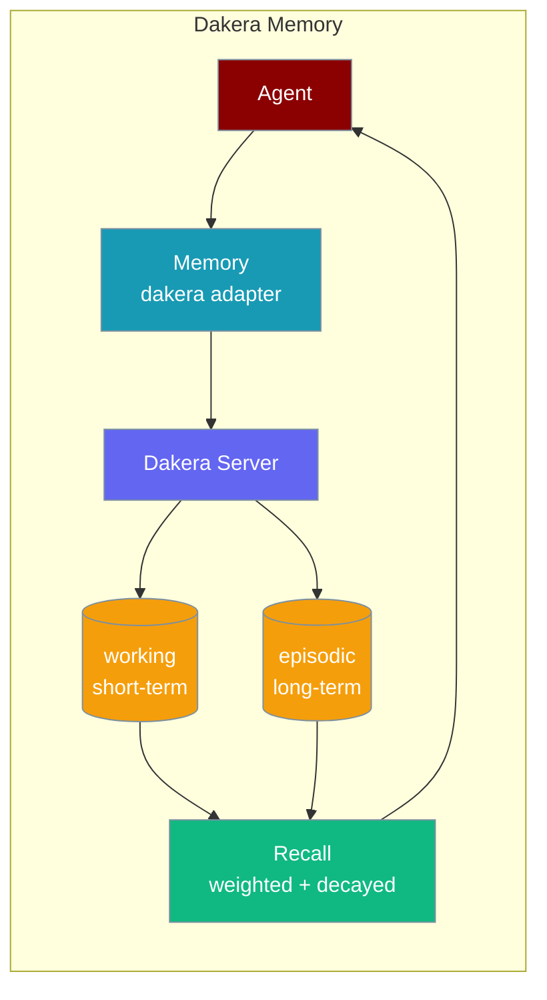
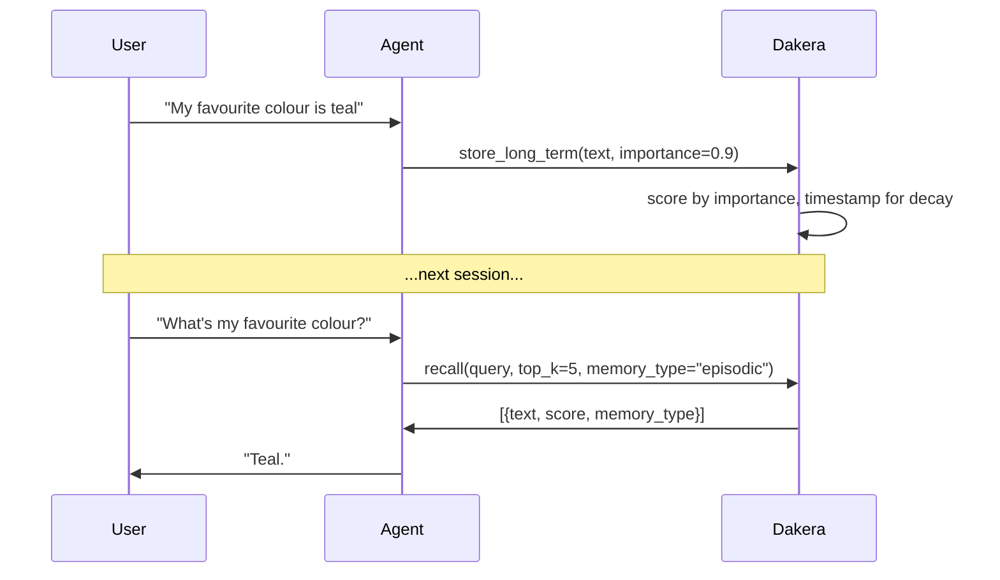

Dakera gives your agent decay-weighted memory that fades stale context and keeps fresh, important facts on top.

```python
from praisonaiagents import Agent

agent = Agent(
    name="assistant",
    instructions="Remember what the user tells you across sessions.",
    memory={
        "provider": "dakera",
        "config": {
            "url": "http://localhost:3000",
            "api_key": "dk-...",
            "agent_id": "my-agent",
        },
    },
)
agent.start("Remember that my favourite colour is teal")
```

Later chats can recall the fact — Dakera weights it by importance and decays older memories.



## Quick Start

<Steps>

<Step title="Install">

```bash
pip install "praisonaiagents[dakera]"
```

This installs `dakera>=0.12.8`. Alternatively, `pip install dakera` installs the SDK on its own.

Run the Dakera server locally with Docker Compose — see [`dakera-ai/dakera-deploy`](https://github.com/dakera-ai/dakera-deploy) for the compose file. The default port is `3000`, matching the adapter default.

</Step>

<Step title="Configure with environment variables">

```bash
export DAKERA_URL="http://localhost:3000"
export DAKERA_API_KEY="dk-..."
export DAKERA_AGENT_ID="my-agent"
```

```python
from praisonaiagents import Agent

agent = Agent(
    name="assistant",
    instructions="Remember what the user tells you across sessions.",
    memory="dakera",
)
agent.start("Remember that my favourite colour is teal")
```

</Step>

<Step title="Configure with a dict">

```python
from praisonaiagents import Agent

agent = Agent(
    name="assistant",
    instructions="Remember what the user tells you across sessions.",
    memory={
        "provider": "dakera",
        "config": {
            "url": "http://localhost:3000",
            "api_key": "dk-...",
            "agent_id": "my-agent",
            "default_importance": 0.6,
        },
    },
)
agent.start("Remember that my favourite colour is teal")
```

</Step>

</Steps>

---

## How It Works



Dakera stores memories with an importance score and timestamps them. Over time, memories decay — so stale context stops competing with fresh, relevant facts.

---

## Memory Tiers

PraisonAI maps its two memory tiers onto distinct Dakera `memory_type` values:

| PraisonAI tier | Default Dakera `memory_type` | Override config key | Description |
|---|---|---|---|
| short-term (`store_short_term` / `search_short_term`) | `"working"` | `short_term_type` | Recency-heavy scratch context, reset frequently |
| long-term (`store_long_term` / `search_long_term`) | `"episodic"` | `long_term_type` | Durable knowledge, persists across sessions |

Unlike Mem0 or ChromaDB, Dakera has a first-class `memory_type` field — so the two tiers never collapse.

---

## Configuration Options

| Option | Type | Default | Env fallback | Description |
|---|---|---|---|---|
| `url` (alias `base_url`) | `str` | `"http://localhost:3000"` | `DAKERA_URL` → `DAKERA_API_URL` | Dakera server URL |
| `api_key` | `str` | `None` | `DAKERA_API_KEY` | API key for the Dakera server |
| `agent_id` | `str` | `"praisonai"` | `DAKERA_AGENT_ID` | Namespaces this agent's memories |
| `short_term_type` | `str` | `"working"` | — | Dakera `memory_type` for the short-term tier |
| `long_term_type` | `str` | `"episodic"` | — | Dakera `memory_type` for the long-term tier |
| `default_importance` | `float` | `0.5` | — | Importance score when a store call does not supply one |

**Env fallback chain for URL:** `DAKERA_URL` → `DAKERA_API_URL` → `"http://localhost:3000"`.

**Precedence:** config dict > env var > hard default. Config dict values always win.

### Reserved metadata keys

These keys are lifted out of `metadata` and promoted to Dakera fields. Explicit `kwargs` win over metadata values:

| Key | Dakera field |
|---|---|
| `importance` | Importance score |
| `session_id` | Session scope |
| `tags` | Memory tags |

Reserved keys are stripped from `metadata` before storage so they never leak into the payload.

### Environment variables only

<AccordionGroup>
<Accordion title="Env-var-only form">
```bash
export DAKERA_URL="http://localhost:3000"
export DAKERA_API_KEY="dk-..."
export DAKERA_AGENT_ID="my-agent"
```

```python
from praisonaiagents import Agent

agent = Agent(name="Assistant", memory="dakera")
```

</Accordion>
</AccordionGroup>

---

## Precedence Ladder

```python
# Level 1: String (simplest — uses env vars for URL/key/agent_id)
agent = Agent(memory="dakera")

# Level 2: Dict (recommended — inline config)
agent = Agent(
    memory={
        "provider": "dakera",
        "config": {
            "url": "http://localhost:3000",
            "api_key": "dk-...",
            "agent_id": "my-agent",
        },
    }
)
```

<Warning>
Do not invent a `DakeraConfig` dataclass, a `Dakera(...)` instance form, or a `Bool` / `Array` level — none exist in the SDK. The supported forms are: `memory="dakera"` (env-var driven), `memory={"provider": "dakera", "config": {...}}` (nested), or a flat dict of config keys (`memory={"url": "...", "api_key": "..."}`).
</Warning>

---

## Store, Search, Delete & Reset

### Storing memories

```python
from praisonaiagents import Memory

memory = Memory(config={"provider": "dakera", "config": {"agent_id": "my-agent"}})

# Short-term (working memory) — capture the returned id
mid = memory.store_short_term(
    "User is asking about Python today",
    metadata={"session_id": "sess-1"},
)

# Later — targeted delete uses the id (returns True on success)
memory.delete_short_term(mid)

# Or wipe everything
memory.reset_short_term()

# Long-term with explicit importance
memory.store_long_term(
    "User prefers dark mode",
    importance=0.9,
    tags=["preference", "ui"],
)
```

`importance`, `session_id`, and `tags` can be passed as top-level kwargs or inside the `metadata` dict — kwargs always win. `metadata` is the container, not a promoted field.

On `sqlite` / `in_memory` providers, `reset_*` / `delete_*` delegate to the active adapter (mirroring how `search_short_term` already delegates), so they operate on the adapter-created `short_term_memory` / `long_term_memory` tables.

### Searching memories

```python
# Search short-term
results = memory.search_short_term("Python", limit=5)

# Search long-term, filtering by importance
results = memory.search_long_term("colour preference", limit=5, min_importance=0.7)

# Each result has this shape:
# {"id": str, "text": str, "metadata": dict, "score": float | None, "memory_type": str | None}
```

### Retrieving all memories

```python
# Uses Dakera's batch_recall — no embedding required
all_memories = memory.get_all_memories(limit=1000)
```

### Deleting memories

<Note>
Dakera is one of the only providers that supports `DeletableMemoryProtocol` and `ResettableMemoryProtocol` — mem0, ChromaDB, and MongoDB do not implement these optional protocols.
</Note>

```python
# Delete by id — returns True on success, False on failure (logs warning)
deleted = memory.delete_memory("mem-id-123")

# Delete multiple — returns count deleted
count = memory.delete_memories(["mem-id-1", "mem-id-2", "mem-id-3"])
```

### Resetting tiers

```python
# Clear all working (short-term) memory for this agent — scoped by memory_type
memory.reset_short_term()

# Clear all episodic (long-term) memory for this agent
# Does NOT wipe short-term memory
memory.reset_long_term()
```

---

## Common Patterns

### Namespace per user / tenant

```python
from praisonaiagents import Agent

user_agent = Agent(
    name="assistant",
    memory={
        "provider": "dakera",
        "config": {
            "url": "http://localhost:3000",
            "agent_id": "user-alice",
        },
    },
)
```

Different `agent_id`s on the same Dakera server keep memories fully isolated.

### Overriding tier mapping for custom Dakera types

If your Dakera server is configured with custom memory types, override the defaults.

```python
from praisonaiagents import Agent

agent = Agent(
    name="assistant",
    memory={
        "provider": "dakera",
        "config": {
            "url": "http://localhost:3000",
            "api_key": "dk-...",
            "agent_id": "my-agent",
            "long_term_type": "semantic",
        },
    },
)
```

### Boost recall for high-signal facts

```python
from praisonaiagents import Memory

memory = Memory(config={"provider": "dakera"})

memory.store_long_term(
    "User's payment method is Visa ending 4242",
    importance=0.9,
)
```

Higher importance scores surface this fact ahead of lower-scored memories when Dakera ranks results.

### Filter recall by minimum importance

```python
results = memory.search_long_term(
    "payment details",
    limit=5,
    min_importance=0.7,
)
```

---

## Best Practices

<AccordionGroup>

<Accordion title="Set agent_id per agent (or per user)">
Each agent or user should have a unique `agent_id` so memories don't cross-read. One Dakera server can host many namespaced agents.
</Accordion>

<Accordion title="Use default_importance to bias new stores">
Set `default_importance` in config to bias all new stores without repeating it on every call. Pass explicit `importance` only on the highest-signal facts.
</Accordion>

<Accordion title="Keep working resets frequent, episodic resets rare">
Reset `working` (short-term) memory at the end of each session or task. Avoid resetting `episodic` (long-term) memory unless you intentionally want to wipe all durable knowledge — this matches how Dakera's decay is tuned.
</Accordion>

<Accordion title="Prefer env vars in production">
Use `DAKERA_URL`, `DAKERA_API_KEY`, and `DAKERA_AGENT_ID` so credentials don't appear in source code or version control.
</Accordion>

</AccordionGroup>

---

## Deploying Dakera

Dakera is a self-hosted memory server. The quickest way to run it is with Docker Compose via [`dakera-ai/dakera-deploy`](https://github.com/dakera-ai/dakera-deploy). The default compose port is `3000`, which matches the adapter's default `http://localhost:3000`, so no URL config is needed for local development.

---

## Related

<CardGroup cols={2}>
<Card title="Memory Configuration" icon="brain" href="/docs/features/memory">
  Provider strings, MemoryConfig, and backend overview.
</Card>
<Card title="Custom Memory Adapters" icon="puzzle-piece" href="/docs/features/custom-memory-adapters">
  Register your own memory backend with the adapter registry.
</Card>
<Card title="MongoDB Memory" icon="database" href="/docs/features/mongodb-memory">
  Document-backed memory with optional Atlas Vector Search.
</Card>
<Card title="Memory Overview" icon="book" href="/docs/memory/overview">
  Memory system overview and quickstart.
</Card>
<Card title="Memory Storage" icon="database" href="/docs/memory/storage">
  All supported database backends.
</Card>
</CardGroup>
