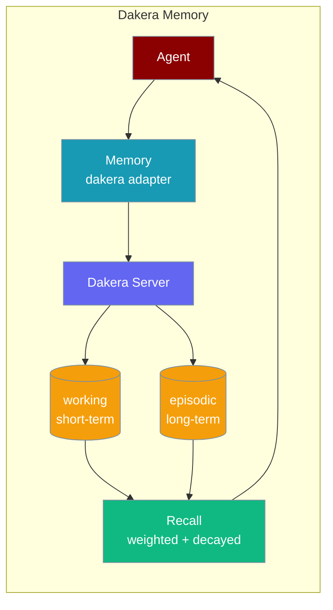
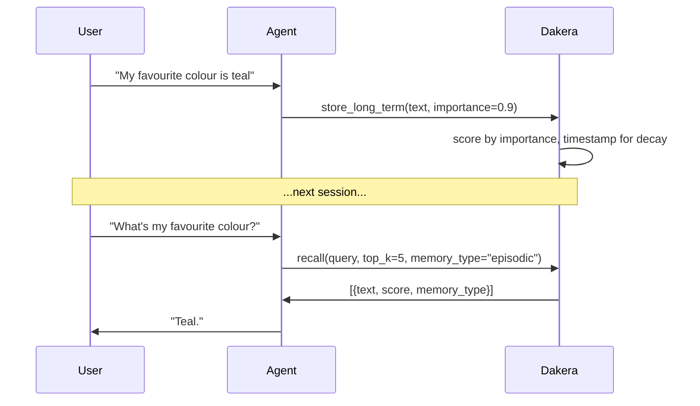

Dakera gives your agent decay-weighted memory that fades stale context and keeps fresh, important facts on top.

```python
from praisonaiagents import Agent

agent = Agent(
    name="assistant",
    instructions="Remember what the user tells you across sessions.",
    memory={
        "provider": "dakera",
        "config": {
            "url": "http://localhost:3000",
            "api_key": "dk-...",
            "agent_id": "my-agent",
        },
    },
)
agent.start("Remember that my favourite colour is teal")
```

Later chats can recall the fact — Dakera weights it by importance and decays older memories.



## Quick Start

<Steps>

<Step title="Install">

```bash
pip install 'praisonaiagents[dakera]'
```

This installs `dakera>=0.12.8`. Alternatively, `pip install dakera` installs the SDK on its own.

Start the Dakera server locally using the official Docker Compose from [dakera-ai/dakera-deploy](https://github.com/dakera-ai/dakera-deploy). The default port is `3000`.

</Step>

<Step title="Configure with environment variables">

```bash
export DAKERA_URL="http://localhost:3000"
export DAKERA_API_KEY="dk-..."
export DAKERA_AGENT_ID="my-agent"
```

```python
from praisonaiagents import Agent

agent = Agent(
    name="assistant",
    instructions="Remember what the user tells you across sessions.",
    memory="dakera",
)
agent.start("Remember that my favourite colour is teal")
```

</Step>

<Step title="Configure with a dict">

```python
from praisonaiagents import Agent

agent = Agent(
    name="assistant",
    instructions="Remember what the user tells you across sessions.",
    memory={
        "provider": "dakera",
        "config": {
            "url": "http://localhost:3000",
            "api_key": "dk-...",
            "agent_id": "my-agent",
        },
    },
)
agent.start("Remember that my favourite colour is teal")
```

</Step>

</Steps>

---

## How It Works



Dakera stores each memory with an importance score and a timestamp. On each recall, it boosts recently accessed, high-importance memories and suppresses older, low-importance ones. Short-term (`working`) memories hold recency-heavy scratch context; long-term (`episodic`) memories hold durable knowledge.

### Tier mapping

| PraisonAI tier | Dakera `memory_type` | Config override |
|---|---|---|
| short-term | `working` (default) | `short_term_type` |
| long-term | `episodic` (default) | `long_term_type` |

`working` memories are recency-heavy scratch context — good for current task details. `episodic` memories are durable knowledge — good for user preferences and facts that should survive across sessions.

---

## Configuration Options

### Config dict options

| Option | Type | Default | Description |
|---|---|---|---|
| `url` (alias `base_url`) | `str` | `http://localhost:3000` | Dakera server URL. |
| `api_key` | `str` | `None` | API key for the Dakera server. |
| `agent_id` | `str` | `"praisonai"` | Namespace for this agent's memories. |
| `short_term_type` | `str` | `"working"` | Dakera `memory_type` used for `store_short_term` / `search_short_term`. |
| `long_term_type` | `str` | `"episodic"` | Dakera `memory_type` used for `store_long_term` / `search_long_term`. |
| `default_importance` | `float` | `0.5` | Importance score applied when a store call doesn't supply one. |

### Environment variables

Precedence order: **config dict > env var > hard default**.

| Env var | Falls back into |
|---|---|
| `DAKERA_URL` | `url` |
| `DAKERA_API_URL` | `url` (secondary fallback if `DAKERA_URL` is unset) |
| `DAKERA_API_KEY` | `api_key` |
| `DAKERA_AGENT_ID` | `agent_id` |

### Precedence ladder

```python
# Level 1: String (simplest — uses env vars for URL/key/agent_id)
agent = Agent(memory="dakera")

# Level 2: Dict (recommended — inline config)
agent = Agent(
    memory={
        "provider": "dakera",
        "config": {
            "url": "http://localhost:3000",
            "api_key": "dk-...",
            "agent_id": "my-agent",
        },
    }
)
```

---

## Store, Search, and Reset

### Storing memories

Both `store_short_term` and `store_long_term` accept `metadata`, `importance`, `session_id`, and `tags` — either via the `metadata` dict or as direct kwargs. Kwargs take precedence. Reserved keys (`importance`, `session_id`, `tags`) are stripped from `metadata` before storage so they never leak into the payload.

```python
from praisonaiagents import Agent

agent = Agent(
    name="assistant",
    memory={
        "provider": "dakera",
        "config": {"url": "http://localhost:3000", "api_key": "dk-...", "agent_id": "my-agent"},
    },
)

agent.start("My project deadline is Friday — remember this!")
```

### Searching memories

`search_short_term` and `search_long_term` support `limit` and `min_importance`. Each result has the shape:

```python
{
    "id": "...",
    "text": "...",
    "metadata": {...},
    "score": 0.87,
    "memory_type": "episodic",
}
```

### Getting all memories

`get_all_memories()` uses Dakera's `batch_recall` — no embedding needed.

### Deleting memories

`delete_memory(memory_id)` returns `True` on success and `False` on failure (logging a warning). `delete_memories(memory_ids)` returns the count deleted.

### Resetting memories

`reset_short_term()` clears all `working` memories. `reset_long_term()` clears all `episodic` memories. Each reset is scoped by `memory_type`, so resetting long-term does not wipe short-term.

---

## Common Patterns

### Multiple agents sharing one Dakera server

Use distinct `agent_id` values so agents don't cross-read each other's memories.

```python
from praisonaiagents import Agent

alice = Agent(
    name="alice",
    memory={"provider": "dakera", "config": {"url": "http://localhost:3000", "api_key": "dk-...", "agent_id": "alice"}},
)

bob = Agent(
    name="bob",
    memory={"provider": "dakera", "config": {"url": "http://localhost:3000", "api_key": "dk-...", "agent_id": "bob"}},
)
```

### Overriding tier mapping for custom Dakera types

If your Dakera server is configured with custom memory types, override the defaults.

```python
from praisonaiagents import Agent

agent = Agent(
    name="assistant",
    memory={
        "provider": "dakera",
        "config": {
            "url": "http://localhost:3000",
            "api_key": "dk-...",
            "agent_id": "my-agent",
            "long_term_type": "semantic",
        },
    },
)
```

### Boosting recall for high-signal facts

Pass `importance` explicitly when storing facts you know are critical.

```python
from praisonaiagents import Agent

agent = Agent(
    name="assistant",
    memory={
        "provider": "dakera",
        "config": {"url": "http://localhost:3000", "api_key": "dk-...", "agent_id": "my-agent"},
    },
)

agent.start("Critical: the user's allergy is peanuts")
```

Or via metadata:

```python
agent.memory.store_long_term(
    "User is allergic to peanuts",
    metadata={"importance": 0.95, "tags": ["health", "critical"]},
)
```

---

## Best Practices

<AccordionGroup>
  <Accordion title="Set agent_id per agent or per user">
    Use a unique `agent_id` for each agent (or each user) to prevent cross-read between unrelated memory namespaces.
  </Accordion>
  <Accordion title="Use default_importance to bias new memories">
    Set `default_importance` to a higher value (e.g. `0.7`) when all memories in your workflow are high-signal. Pass explicit `importance` (e.g. `0.95`) for the most critical facts.
  </Accordion>
  <Accordion title="Reset working memory frequently, episodic rarely">
    `working` memory is designed for scratch context — reset it at the end of each task. `episodic` memory holds durable knowledge — reset it only when you explicitly want to forget the user's history.
  </Accordion>
  <Accordion title="Prefer environment variables in production">
    Set `DAKERA_URL`, `DAKERA_API_KEY`, and `DAKERA_AGENT_ID` as environment variables so credentials don't appear in code or config files.
  </Accordion>
</AccordionGroup>

---

## Deploying Dakera

Dakera is a self-hosted memory server. Use the official Docker Compose from [dakera-ai/dakera-deploy](https://github.com/dakera-ai/dakera-deploy) to run it locally or in your infrastructure. The default compose port is `3000`, which matches the adapter's default `http://localhost:3000` URL.

---

## Related

<CardGroup cols={2}>
  <Card title="Memory Overview" icon="brain" href="/docs/memory/overview">
    PraisonAI memory types and when to use them.
  </Card>
  <Card title="Memory Storage" icon="database" href="/docs/memory/storage">
    All supported database backends.
  </Card>
  <Card title="Custom Memory Adapters" icon="puzzle-piece" href="/docs/features/custom-memory-adapters">
    Registry pattern and custom backend registration.
  </Card>
  <Card title="MongoDB Memory" icon="leaf" href="/docs/features/mongodb-memory">
    Document-backed memory with optional vector search.
  </Card>
</CardGroup>
