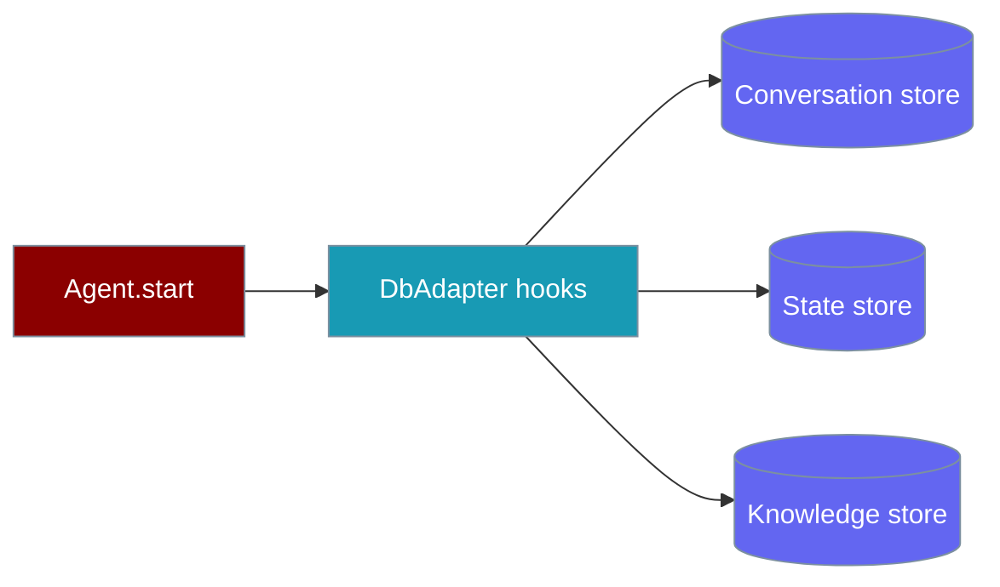
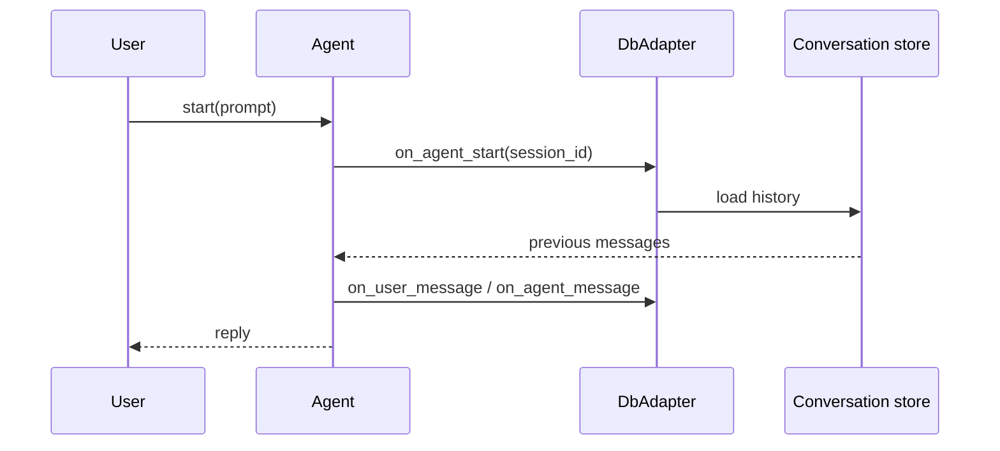

Persist every agent turn to external databases — conversations resume across restarts and you can query run history later.

```python
import os
from praisonaiagents import Agent, MemoryConfig, db

agent = Agent(
    name="Assistant",
    instructions="You are a helpful assistant.",
    memory=MemoryConfig(
        db=db(database_url=os.getenv("PRAISON_CONVERSATION_URL")),
        session_id="user-123",
    ),
)
agent.start("Hello!")
```



## Quick Start

<Steps>
<Step title="Simple usage">
```python
import os
from praisonaiagents import Agent, db

agent = Agent(
    name="Assistant",
    instructions="You are a helpful assistant.",
    memory=db(database_url=os.getenv("PRAISON_CONVERSATION_URL", "sqlite:///conversations.db")),
)
agent.start("Hello!")
```
</Step>

<Step title="With session continuity">
```python
import os
from praisonaiagents import Agent, MemoryConfig, db

store = db(database_url=os.getenv("PRAISON_CONVERSATION_URL"))

agent = Agent(
    name="Assistant",
    memory=MemoryConfig(db=store, session_id="session-001"),
)
agent.start("My favourite colour is blue")

# Later run — same session_id restores history
agent2 = Agent(
    name="Assistant",
    memory=MemoryConfig(db=store, session_id="session-001"),
)
agent2.start("What's my favourite colour?")
```
</Step>

<Step title="CLI with persistence">
```bash
export PRAISON_CONVERSATION_URL="postgresql://localhost/praisonai"
praisonai persistence doctor
praisonai persistence run --session-id demo "Remember my name is Alice"
praisonai persistence resume --session-id demo --continue "What's my name?"
```
</Step>
</Steps>

---

## How It Works



| Store | Purpose | Example backends |
|---|---|---|
| Conversation | Chat history, tool calls | PostgreSQL, MySQL, SQLite, Supabase, SurrealDB |
| State | Runs, traces, metadata | Redis, MongoDB, DynamoDB, Firestore |
| Knowledge | Vectors / RAG | Qdrant, ChromaDB, Pinecone, Weaviate |

On first chat, the adapter loads prior messages for the `session_id`. Each turn writes user and agent messages automatically — no manual save calls.

---

## Configuration Options

Pass a `db()` instance via `memory=` (or `MemoryConfig(db=…, session_id=…)` for explicit sessions).

| Parameter | Description |
|---|---|
| `database_url` | Conversation store URL |
| `state_url` | State / run history store |
| `knowledge_url` | Vector or knowledge store |

```python
import os
from praisonaiagents import Agent, MemoryConfig, db

agent = Agent(
    name="Researcher",
    memory=MemoryConfig(
        db=db(
            database_url=os.getenv("PRAISON_CONVERSATION_URL"),
            state_url=os.getenv("PRAISON_STATE_URL"),
            knowledge_url=os.getenv("PRAISON_KNOWLEDGE_URL"),
        ),
        session_id="research-42",
    ),
)
```

### Environment variables

```bash
export PRAISON_CONVERSATION_URL="postgresql://localhost:5432/praisonai"
export PRAISON_STATE_URL="redis://localhost:6379"
export PRAISON_KNOWLEDGE_URL="http://localhost:6333"
```

<Note>
Database backends require the `praisonai` wrapper (`pip install praisonai`). The core SDK defines `DbAdapter`; implementations live in `praisonai.db`.
</Note>

### Default session ID

If you omit `session_id`, PraisonAI generates a per-hour ID (UTC):

```
Format: YYYYMMDDHH-{agent_hash}
Example: 2025122414-a1b2c3
```

---

## Docker (local development)

```bash
docker run -d --name praison-postgres -p 5432:5432 \
  -e POSTGRES_PASSWORD=praison123 \
  -e POSTGRES_DB=praisonai postgres:16

docker run -d --name praison-redis -p 6379:6379 redis:7
docker run -d --name praison-qdrant -p 6333:6333 qdrant/qdrant
```

---

## CLI commands

```bash
praisonai persistence doctor
praisonai persistence status
praisonai persistence migrate
praisonai persistence export --session-id my-session --output backup.jsonl
praisonai persistence import --file backup.jsonl
```

---

## Async-Safe Initialisation

The `DatabaseAdapter`'s async callbacks (`on_agent_start`, `on_user_message`, `on_agent_message`, `on_tool_call`, `on_agent_end`) never block the event loop. Store construction runs off-loop via `asyncio.to_thread`, so FastAPI handlers, Jupyter notebooks, and async test suites all work without stalls on cold startup.

---

## Transient Failure Handling

When a database is temporarily unavailable (bad config, network blip, cloud auth glitch), the adapter records the failure and waits before re-attempting. This prevents hammering a down backend on every agent callback while still recovering automatically once the backend is back.

The cool-down period is configurable via `init_retry_cooldown` (default **30 seconds**):

```python
from praisonai.db.adapter import DatabaseAdapter

adapter = DatabaseAdapter(
    database_url="postgresql://localhost/praisonai",
    init_retry_cooldown=10.0,  # try again 10s after a failed init
)
```

| Parameter | Type | Default | Description |
|-----------|------|---------|-------------|
| `init_retry_cooldown` | `float` | `30.0` | Seconds to wait before retrying a failed store init |

After a soft init failure (raised during `_ainit_stores()`), the adapter pauses for `init_retry_cooldown` seconds before re-running store construction on the next callback. Persistence resumes automatically once the backend becomes reachable — no process restart needed.

## Best Practices

<AccordionGroup>
<Accordion title="Use explicit session_id for continuity">
Without `session_id`, PraisonAI generates a per-hour ID. Set `MemoryConfig(session_id=…)` when users return to the same thread.
</Accordion>

<Accordion title="Read credentials from the environment">
Never hardcode database URLs — use `os.getenv("PRAISON_CONVERSATION_URL")`.
</Accordion>

<Accordion title="Run doctor before production">
`praisonai persistence doctor` validates connectivity for conversation, state, and knowledge stores.
</Accordion>

<Accordion title="Separate stores by concern">
Conversation history, run traces, and vectors scale differently — configure `database_url`, `state_url`, and `knowledge_url` independently.
</Accordion>
</AccordionGroup>

---

## Related

<CardGroup cols={2}>
<Card title="Run History" icon="clock-rotate-left" href="/docs/features/run-history">
  Query persisted runs and traces
</Card>
<Card title="Session Persistence" icon="floppy-disk" href="/docs/features/session-persistence">
  JSON file sessions without a database
</Card>
</CardGroup>
