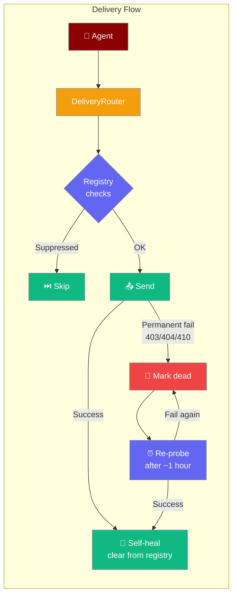
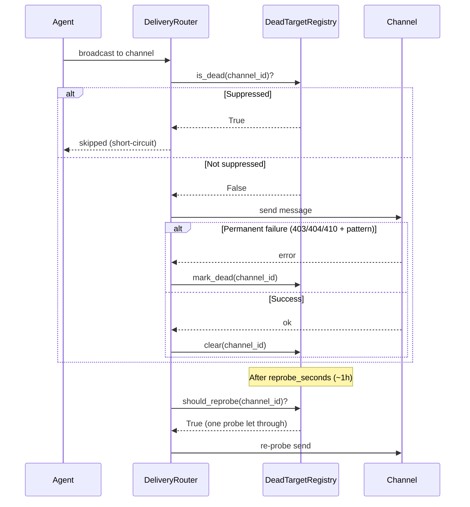

When broadcasting to many channels, some will permanently fail — the bot was kicked, the chat was deleted. The `DeadTargetRegistry` suppresses those channels so your agent stops retrying them, then automatically un-suppresses them the moment any send succeeds again.



## Quick Start

<Steps>
<Step title="Add a registry to your bot">

```python
from praisonaiagents import Agent
from praisonai.bots import Bot
from praisonai.bots._dead_targets import DeadTargetRegistry

agent = Agent(name="broadcaster", instructions="Send daily updates")
bot = Bot(
    "telegram",
    agent=agent,
    dead_targets=DeadTargetRegistry(path="~/.praisonai/state/dead.json"),
)
bot.run()
```

</Step>

<Step title="Configure eviction and re-probe intervals">

```python
from praisonai.bots._dead_targets import DeadTargetRegistry

registry = DeadTargetRegistry(
    path="~/.praisonai/state/dead.json",
    max_size=10_000,           # cap the registry size
    ttl_seconds=7 * 86400,    # auto-evict entries after 7 days
    reprobe_seconds=3600,      # re-probe dead channels every hour
)
```

</Step>

<Step title="Inspect or manage dead targets">

```python
from praisonai.bots._dead_targets import DeadTargetRegistry

registry = DeadTargetRegistry(path="~/.praisonai/state/dead.json")

# List channels currently suppressed
dead = registry.list_dead()
print(f"{len(dead)} channels suppressed")

# Manually clear a channel (e.g. after re-inviting the bot)
registry.clear("telegram:channel:-1001234567")

# Check size
print(registry.size())
```

</Step>
</Steps>

---

## How It Works



### Failure Classification

| Error type | Classification | Behaviour |
|-----------|---------------|-----------|
| HTTP 403 Forbidden | **Permanent** (if "bot was kicked" / "chat not found") | Mark dead |
| HTTP 404 Not Found | **Permanent** (channel-level) | Mark dead |
| HTTP 410 Gone | **Permanent** | Mark dead |
| HTTP 5xx / 429 / timeout | **Transient** | Existing retry path, not marked dead |
| HTTP 401 Unauthorized | **Account-level** (not per-channel) | Existing retry path |
| Message-scoped 404 | **Transient** | Not marked dead |

<Note>
The registry is **off by default** — passing no `dead_targets` argument leaves behaviour unchanged. This is a zero-cost opt-in for broadcast scenarios.
</Note>

---

## Configuration Options

| Option | Type | Default | Description |
|--------|------|---------|-------------|
| `path` | `str` | required | Path to the persistent JSON file (supports `~` expansion) |
| `max_size` | `int` | unlimited | Maximum number of dead entries to keep (oldest evicted first) |
| `ttl_seconds` | `int` | `None` | Auto-evict entries older than this many seconds |
| `reprobe_seconds` | `int` | `3600` | How often to let a single delivery attempt through to probe recovery |

### Registry API

| Method | Description |
|--------|-------------|
| `is_dead(target_id)` | Returns `True` if the channel is currently suppressed |
| `mark_dead(target_id)` | Suppress the channel and reset its re-probe clock |
| `clear(target_id)` | Remove a channel from the dead list (self-heal) |
| `list_dead()` | Return all currently suppressed channel IDs |
| `size()` | Number of entries in the registry |
| `should_reprobe(target_id)` | Returns `True` when re-probe window has elapsed |

---

## Common Patterns

### Broadcast bot with state persistence

```python
from praisonaiagents import Agent
from praisonai.bots import Bot
from praisonai.bots._dead_targets import DeadTargetRegistry

agent = Agent(name="newsletter", instructions="Send weekly digest to subscribers")
registry = DeadTargetRegistry(
    path="~/.praisonai/state/dead.json",
    reprobe_seconds=3600,  # try dead channels again after 1 hour
)
bot = Bot("telegram", agent=agent, dead_targets=registry)
bot.run()
```

### Manual inspection before a broadcast

```python
from praisonai.bots._dead_targets import DeadTargetRegistry

registry = DeadTargetRegistry(path="~/.praisonai/state/dead.json")
dead = registry.list_dead()

if dead:
    print(f"Skipping {len(dead)} suppressed channels:")
    for ch in dead:
        print(f"  {ch}")
```

---

## Best Practices

<AccordionGroup>

<Accordion title="Use for broadcast / proactive delivery bots">
The registry is most valuable when you push messages to many stored targets (newsletters, alerts). For one-on-one chat bots, the existing retry path is sufficient.
</Accordion>

<Accordion title="Store on a durable volume">
The JSON file survives restarts and preserves which channels are suppressed between runs. Store it on the same persistent volume as your SQLite approval store.
</Accordion>

<Accordion title="Self-healing is automatic">
When a successful send reaches a channel that was in the dead list — even a regular delivery, not only a scheduled re-probe — the channel is cleared automatically. No manual intervention needed.
</Accordion>

<Accordion title="401 errors are not permanent">
A 401 Unauthorized response is account-level, not per-channel. The registry never marks a channel dead for a 401 — use it only for 403/404/410 failures with the appropriate error text.
</Accordion>

</AccordionGroup>

---

## Related

<CardGroup cols={2}>
<Card title="Durable Delivery" icon="shield-check" href="/docs/features/durable-delivery">
  Retry and park outbound messages with exponential backoff
</Card>
<Card title="Proactive Delivery" icon="bell" href="/docs/features/proactive-delivery">
  Broadcast to multiple channels from an agent
</Card>
<Card title="Messaging Bots" icon="robot" href="/docs/features/messaging-bots">
  Deploy agents across chat channels
</Card>
<Card title="Delivery Config" icon="settings" href="/docs/features/delivery-config">
  Fine-tune outbound delivery behaviour
</Card>
</CardGroup>
