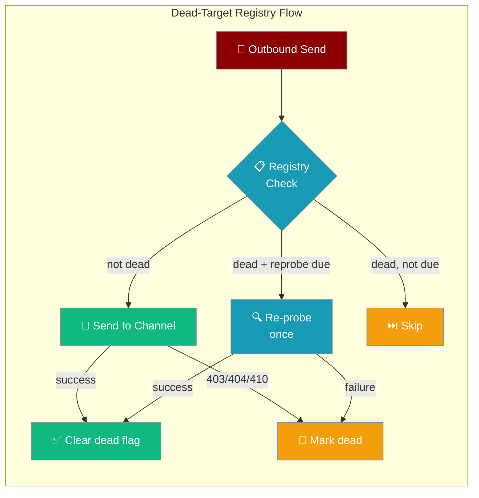
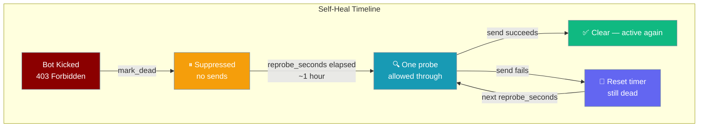

The dead-target registry stops your gateway from wasting requests on channels where the bot was kicked, the group was deleted, or a 403/404 is permanent — and automatically self-heals when a target recovers.



<Note>
The registry is **default OFF**. The `DeliveryRouter` works exactly as before until you construct and attach a `DeadTargetRegistry` instance.
</Note>

## Quick Start

<Steps>
<Step title="Enable the Registry">
Attach a registry to suppress known-dead targets:

```python
from praisonaiagents import Agent
from praisonai.bots import TelegramBot
from praisonai.bots import DeadTargetRegistry, DeliveryRouter

agent = Agent(
    name="Broadcast Agent",
    instructions="Deliver scheduled updates to subscribers.",
)

registry = DeadTargetRegistry()

bot = TelegramBot(
    token="YOUR_TOKEN",
    agent=agent,
    dead_target_registry=registry,
)
await bot.start()
```
</Step>

<Step title="Persist to a Custom Path">
By default the registry persists to `~/.praisonai/state/dead_targets.json`. Override it:

```python
from pathlib import Path
from praisonai.bots import DeadTargetRegistry

registry = DeadTargetRegistry(
    persist_path=Path("/var/lib/praisonai/dead_targets.json"),
    ttl_seconds=7 * 86400,      # forget after 7 days
    max_size=5000,               # cap at 5 000 dead entries
    reprobe_seconds=1800,        # re-probe every 30 minutes
)
```
</Step>

<Step title="Inspect and Clear Manually">
```python
from praisonai.bots import DeadTargetRegistry

registry = DeadTargetRegistry()

dead = registry.list_dead()
for target in dead:
    print(f"{target.platform}:{target.channel_id} — {target.reason}")

registry.clear("telegram", "-1001234567890")
print(f"Registry size: {registry.size()}")
```
</Step>
</Steps>

---

## How Self-Healing Works



A suppressed target is re-probed once per `reprobe_seconds` (default: 1 hour). On the first successful send `clear()` is called and the target re-enters normal circulation. On failure the clock resets for another `reprobe_seconds`.

---

## Permanent vs Transient Failures

| HTTP Status | Permanent? | Notes |
|-------------|-----------|-------|
| 403 Forbidden | ✅ | Bot kicked or blocked by user |
| 404 Not Found | ✅ | Chat deleted or never existed |
| 410 Gone | ✅ | Permanently removed |
| 401 Unauthorized | ❌ | Token/account issue — still retried |
| 5xx Server Error | ❌ | Transient — retry with backoff |
| 429 Too Many Requests | ❌ | Transient — honour Retry-After |

<Warning>
**401 is NOT a permanent failure.** It reflects an account- or token-level auth issue, not a per-channel dead target. The registry will not mark 401 responses as dead.
</Warning>

Platform-specific text patterns are also classified — e.g. "chat not found", "bot was kicked" in Telegram error messages trigger `mark_dead`.

---

## Configuration Options

| Option | Type | Default | Description |
|--------|------|---------|-------------|
| `persist_path` | `Path \| str` | `~/.praisonai/state/dead_targets.json` | JSON file for durability |
| `max_size` | `int` | `10000` | Maximum dead entries; oldest evicted when exceeded |
| `ttl_seconds` | `int` | `2592000` (30 days) | Entries older than this are forgotten |
| `reprobe_seconds` | `int` | `3600` (1 hour) | How often to let one send through for self-heal |

---

## Public API

| Method | Description |
|--------|-------------|
| `is_dead(platform, channel_id)` | Returns `True` if target is suppressed |
| `should_reprobe(platform, channel_id)` | Returns `True` if a reprobe is due |
| `mark_dead(platform, channel_id, reason)` | Suppresses the target |
| `clear(platform, channel_id)` | Removes suppression (called on success) |
| `list_dead()` | Returns all currently-dead targets |
| `size()` | Count of suppressed targets |

---

## Best Practices

<AccordionGroup>
<Accordion title="Enable registry for broadcast / proactive bots">
Subscription bots that push to many channels benefit most from the registry — fan-out cycles skip dead targets instantly instead of waiting for a timeout per doomed call.
</Accordion>

<Accordion title="Set TTL to match your re-subscription window">
If users typically re-add your bot within 7 days, set `ttl_seconds=604800`. The registry will forget the entry and perform a clean probe attempt rather than waiting the full 30-day default.
</Accordion>

<Accordion title="Monitor the registry size">
A rapidly-growing registry is a signal that your bot is being kicked at scale. Investigate the root cause before the registry fills to `max_size` and starts evicting entries.
</Accordion>

<Accordion title="Persistence is best-effort">
The registry writes atomically to a JSON file. On failure the write is logged as a warning but never raised — the in-memory state is still correct and the file will be updated on the next successful write.
</Accordion>
</AccordionGroup>

---

## Related

<CardGroup cols={2}>
<Card title="Durable Outbound Delivery" icon="shield-check" href="/docs/features/durable-outbound-delivery">
  Retry and DLQ for all channels
</Card>
<Card title="Delivery Config" icon="settings" href="/docs/features/delivery-config">
  Full delivery configuration reference
</Card>
<Card title="Proactive Delivery" icon="bell" href="/docs/features/proactive-delivery">
  Scheduled and broadcast message delivery
</Card>
<Card title="Bot Routing" icon="git-branch" href="/docs/features/bot-routing">
  Route messages across multiple channels
</Card>
</CardGroup>
