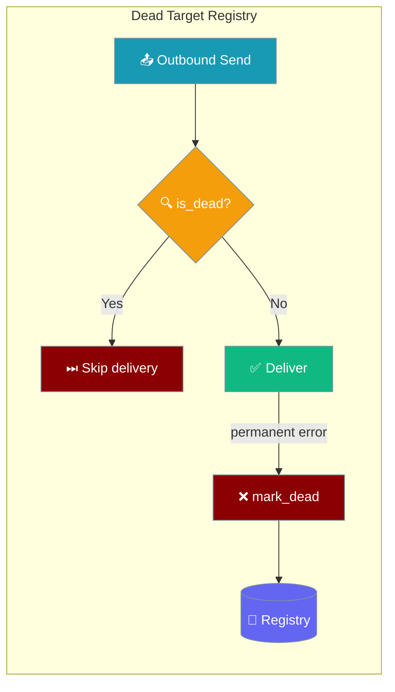
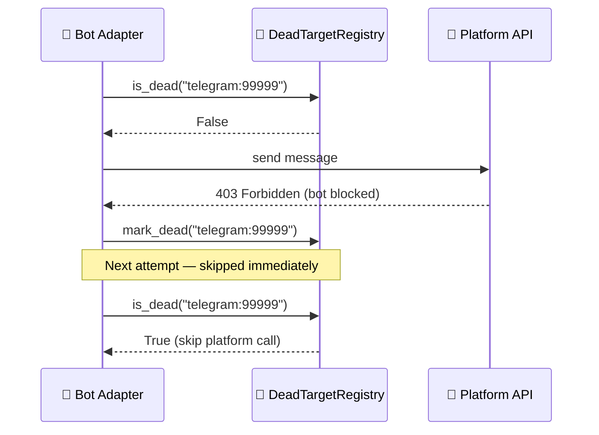

`DeadTargetRegistry` tracks chat targets that have permanently failed, blocking retry storms on deleted or blocked chats.



## Quick Start

<Steps>
<Step title="Enable on a bot">
Pass a configured `DeadTargetRegistry` to any bot adapter via `delivery_config`:

```python
import os
from praisonaiagents import Agent
from praisonai.bots import TelegramBot
from praisonai.bots._dead_targets import DeadTargetRegistry

registry = DeadTargetRegistry(max_size=1000, ttl_seconds=86400)

bot = TelegramBot(
    token=os.getenv("TELEGRAM_BOT_TOKEN"),
    agent=Agent(name="assistant", instructions="Help users."),
    dead_target_registry=registry,
)
bot.run()
```
</Step>

<Step title="Inspect the registry">
```python
# Check if a target is dead
if registry.is_dead("telegram:12345"):
    print("Target is dead — skipping")

# List all dead targets
for target in registry.list_dead():
    print(target)

# Get registry size
print(f"{registry.size()} dead targets tracked")
```
</Step>

<Step title="Clear a target (e.g. after manual recovery)">
```python
registry.clear("telegram:12345")
print("Target cleared — will retry on next send")
```
</Step>
</Steps>

---

## How It Works

When a permanent delivery failure occurs (e.g. chat deleted, bot blocked), the adapter calls `mark_dead()`. Subsequent sends to the same target call `is_dead()` first and skip delivery without hitting the platform API — preventing retry storms.

Entries expire automatically after `ttl_seconds`. A size cap (`max_size`) evicts the oldest entries when the registry is full.



---

## Configuration

### `DeadTargetRegistry`

| Parameter | Type | Default | Description |
|-----------|------|---------|-------------|
| `max_size` | `int` | `10_000` | Maximum number of dead targets to track. Oldest entries are evicted when exceeded. |
| `ttl_seconds` | `int` | `86400` | Seconds before a dead entry expires and the target becomes retryable (default 24 hours). |

```python
from praisonai.bots._dead_targets import DeadTargetRegistry

registry = DeadTargetRegistry(
    max_size=5_000,
    ttl_seconds=3 * 86400,  # 3 days
)
```

### Public API

| Method | Signature | Description |
|--------|-----------|-------------|
| `is_dead` | `(target: str) -> bool` | Returns `True` if the target is currently marked dead. |
| `mark_dead` | `(target: str) -> None` | Marks a target as dead. Starts the TTL clock. |
| `clear` | `(target: str) -> None` | Removes a target from the dead list (manual recovery). |
| `list_dead` | `() -> list[str]` | Returns all currently dead targets. |
| `size` | `() -> int` | Number of dead targets currently tracked. |

<Note>
The registry is **disabled by default**. Pass an instance explicitly to the bot adapter to enable it. Without it, all targets are retried on every outbound send.
</Note>

---

## Common Patterns

### Custom eviction on recovery

```python
async def on_user_unbanned(user_id: str):
    target = f"telegram:{user_id}"
    registry.clear(target)
    await bot.send_message(user_id, "Welcome back!")
```

### Log dead target events

```python
from praisonai.bots._dead_targets import DeadTargetRegistry

class LoggingRegistry(DeadTargetRegistry):
    def mark_dead(self, target: str) -> None:
        super().mark_dead(target)
        print(f"[DEAD TARGET] {target}")

registry = LoggingRegistry()
```

---

## Best Practices

<AccordionGroup>
<Accordion title="Keep TTL short for fast-recovering platforms">
A 24-hour default works for most bots. On platforms where users frequently delete and recreate accounts, use a shorter TTL (e.g. 1–4 hours) to allow re-delivery sooner.
</Accordion>

<Accordion title="Size the registry to your user base">
Each entry uses ~100 bytes. `max_size=10_000` uses ~1 MB. For bots with millions of users, increase `max_size` proportionally or use a persistent backend.
</Accordion>

<Accordion title="Always clear on manual recovery">
If an operator manually restores a blocked channel, call `registry.clear(target)` so the next send goes through. Without clearing, the entry persists until TTL expiry.
</Accordion>

<Accordion title="Pair with durable delivery">
The registry prevents re-sending to dead targets, but in-flight messages that fail permanently should also go to the outbound DLQ. See [Durable Delivery](/docs/features/durable-delivery) and [Delivery Config](/docs/features/delivery-config).
</Accordion>
</AccordionGroup>

---

## Related

<CardGroup cols={2}>
<Card title="Durable Delivery" icon="shield-check" href="/docs/features/durable-delivery">
Crash-safe outbound delivery with retry and DLQ
</Card>
<Card title="Delivery Config" icon="settings" href="/docs/features/delivery-config">
Configure outbound resilience and DLQ paths
</Card>
<Card title="Bot Gateway" icon="server" href="/docs/features/bot-gateway">
Core gateway and bot concepts
</Card>
<Card title="Outbound Media Delivery" icon="image" href="/docs/features/outbound-media-delivery">
Sending media through bots
</Card>
</CardGroup>
