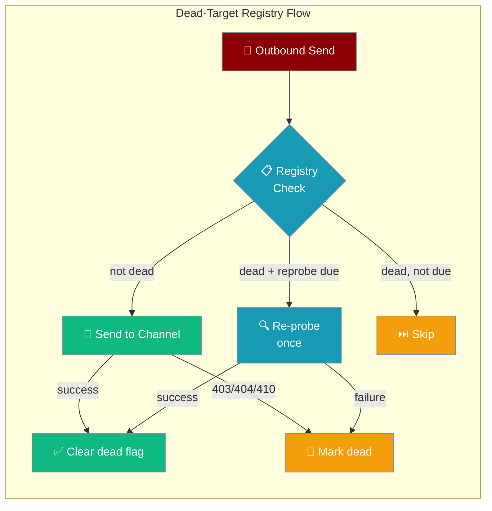
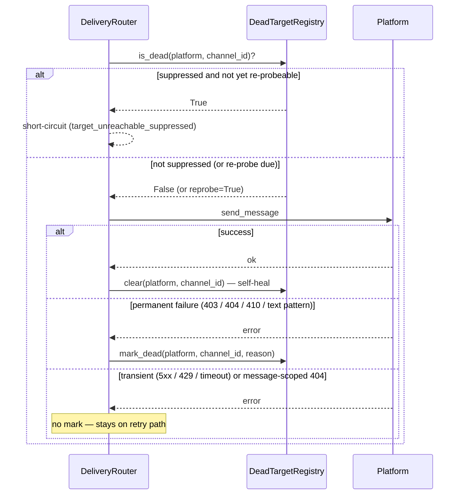
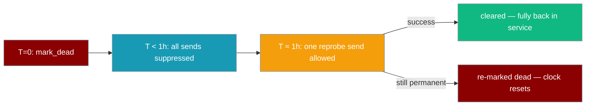

```python
from praisonaiagents import Agent

agent = Agent(name="gateway-agent", instructions="Route outbound bot messages safely.")
agent.start("Send the daily digest to the Telegram group.")
```
The dead-target registry stops your gateway from wasting requests on channels where the bot was kicked, the group was deleted, or a 403/404 is permanent — and automatically self-heals when a target recovers.

The user triggers an outbound send; the registry skips dead targets and re-probes them when recovery is due.




<Note>
The registry is **default OFF**. The `DeliveryRouter` works exactly as before until you construct and attach a `DeadTargetRegistry` instance.
</Note>

## Quick Start

<Steps>
<Step title="Enable the Registry">
Attach a registry to suppress known-dead targets:

```python
from praisonaiagents import Agent
from praisonai.bots import TelegramBot
from praisonai.bots import DeadTargetRegistry, DeliveryRouter

agent = Agent(
    name="Broadcast Agent",
    instructions="Deliver scheduled updates to subscribers.",
)

registry = DeadTargetRegistry()

bot = TelegramBot(
    token="YOUR_TOKEN",
    agent=agent,
    dead_target_registry=registry,
)
await bot.start()
```
</Step>

<Step title="Persist to a Custom Path">
By default the registry persists to `~/.praisonai/state/dead_targets.json`. Override it:

```python
from pathlib import Path
from praisonai.bots import DeadTargetRegistry

registry = DeadTargetRegistry(
    persist_path=Path("/var/lib/praisonai/dead_targets.json"),
    ttl_seconds=7 * 86400,      # forget after 7 days
    max_size=5000,               # cap at 5 000 dead entries
    reprobe_seconds=1800,        # re-probe every 30 minutes
)
```
</Step>

<Step title="Share Across Multiple Workers">
For a horizontally-scaled gateway, pass a shared [`DeliveryControlStore`](/docs/features/bot-rate-limiting#deliverycontrolstore) so every worker sees the same dead-target set. Marking a channel dead in worker A immediately suppresses sends from worker B; a successful send from any worker self-heals across all of them.

```python
from pathlib import Path
from praisonai.bots import DeadTargetRegistry, DeliveryControlStore

store = DeliveryControlStore(Path("~/.praisonai/state/delivery_control.sqlite"))

registry = DeadTargetRegistry(
    store=store,
    ttl_seconds=7 * 86400,
    max_size=5000,
    reprobe_seconds=1800,
)
```

<Warning>
Every registry sharing a store **must** use identical `ttl_seconds` and `max_size`. The dead-target sweep is table-wide (no per-registry column), so divergent bounds would silently prune the other registry's suppressions. `DeliveryControlStore.register_dead_config()` enforces this at construction: a second registry attaching to the same store with different bounds raises `ValueError` with a clear message. Use separate store files for registries with different settings.
</Warning>
</Step>

<Step title="Inspect and Clear Manually">
```python
from praisonai.bots import DeadTargetRegistry

registry = DeadTargetRegistry()

dead = registry.list_dead()
for target in dead:
    print(f"{target.platform}:{target.channel_id} — {target.reason}")

registry.clear("telegram", "-1001234567890")
print(f"Registry size: {registry.size()}")
```
</Step>
</Steps>

---

## How It Works



**Self-heal timeline:**



| Phase | Behaviour |
|-------|-----------|
| **mark_dead** | Target recorded with timestamp. Persisted atomically to JSON. |
| **suppressed** | Every `deliver()` call returns `False` immediately — no API hit. |
| **reprobe** | After `reprobe_seconds`, one send is allowed through to test recovery. |
| **self-heal** | Success clears the registry entry. Next send goes through normally. |
| **re-marked** | Permanent failure on reprobe resets the clock for another cycle. |

---

## Configuration Options

### `DeadTargetRegistry` constructor

```python
from praisonai.bots import DeadTargetRegistry

registry = DeadTargetRegistry(
    persist_path="~/.praisonai/state/dead_targets.json",
    max_size=10_000,
    ttl_seconds=2_592_000,
    reprobe_seconds=3600,
)
```

| Option | Type | Default | Description |
|--------|------|---------|-------------|
| `store` | `DeliveryControlStore` \| `None` | `None` | Shared SQLite store for cross-worker sharing. When set, `persist_path` is ignored — dead-target state lives entirely in the store (row-based atomic upsert, no whole-file JSON rewrite). Every registry sharing one store must use identical `ttl_seconds` / `max_size` (enforced by `register_dead_config`, raises `ValueError` on mismatch). See [Multi-worker (horizontally-scaled gateway)](/docs/features/bot-rate-limiting#multi-worker-horizontally-scaled-gateway). |
| `persist_path` | `Path \| None` | `~/.praisonai/state/dead_targets.json` | JSON file for durability. Parent directories are created automatically. Pass a tmp path for ephemeral / test instances. Ignored when `store=` is set. |
| `max_size` | `int` | `10_000` | Maximum dead entries kept. Oldest (by `ts`) are evicted when exceeded. `<= 0` disables the bound. |
| `ttl_seconds` | `int` | `2_592_000` (30 days) | Entries older than this are dropped lazily on the next access, so a long-dead target is eventually re-probed even if no send ever cleared it. `<= 0` disables TTL. |
| `reprobe_seconds` | `int` | `3600` (1 hour) | Once this elapses since `mark_dead`, **one** send is allowed through to test recovery. Success self-heals; repeated permanent failure resets the clock. `<= 0` disables re-probing. |

### Public methods

| Method | Returns | Description |
|--------|---------|-------------|
| `is_dead(platform, channel_id)` | `bool` | `True` if currently suppressed. Expired entries are removed lazily and `False` is returned. |
| `should_reprobe(platform, channel_id)` | `bool` | `True` if a dead target is due for a single self-healing re-probe (`reprobe_seconds` elapsed since last `mark_dead`). |
| `mark_dead(platform, channel_id, reason)` | `None` | Record a confirmed-permanent failure. Idempotent — re-marking refreshes the timestamp and resets the re-probe clock. Persisted atomically. |
| `clear(platform, channel_id)` | `None` | Un-suppress a target. Called automatically on every successful send. No-op if the target is not in the registry. Persisted atomically. |
| `list_dead()` | `list[DeadTarget]` | Snapshot of currently-suppressed targets (TTL-expired ones pruned first), sorted oldest-first by `ts`. |
| `size()` | `int` | Number of currently-suppressed targets (TTL-expired ones pruned first). |

`DeadTarget` is a frozen dataclass: `platform: str`, `channel_id: str`, `reason: str`, `ts: float` (Unix epoch).

---

## What Counts as Permanent

`is_permanent_target_failure(err, platform)` classifies an exception before `DeliveryRouter` calls `mark_dead`.

### Permanent — target marked dead

| Signal | Details |
|--------|---------|
| HTTP `403` Forbidden | Via `err.status`, `err.status_code`, or `err.error_code` |
| HTTP `404` Not Found | Same attribute probe — **only** if not a message-scoped 404 (see exclusions below) |
| HTTP `410` Gone | Same attribute probe |
| `forbidden` | Text pattern (case-insensitive) on the exception message |
| `bot was kicked` | |
| `bot was blocked` | |
| `user is deactivated` | |
| `chat not found` | |
| `channel not found` | |
| `group chat was deleted` | |
| `the group chat was deleted` | |
| `bot is not a member` | |
| `not enough rights` | |
| `have no rights to send` | |
| `need administrator rights` | |
| `peer_id_invalid` | |
| `account_not_found` | |
| `channel_archived` | |
| `is_archived` | |
| `blocked by the user` | |

### Not permanent — stays on the retry path

| Signal | Why excluded |
|--------|-------------|
| Any transient / recoverable error | 5xx, 429, timeouts, connection resets — checked **first**, transient wins |
| `message to edit not found` | Message-scoped 404 — does NOT condemn the whole channel |
| `message not found` | Same |
| `message to delete not found` | Same |
| `message_id_invalid` | Same |
| `thread not found` | Same |
| `unknown message` | Same |
| `reply not found` | Same |
| `message can't be edited` | Same |
| **HTTP `401` Unauthorized** | **Deliberately excluded.** 401 signals an account-/token-level auth problem (revoked or wrong credentials), not the death of one specific channel. Marking channels dead on a 401 would suppress every target the moment a token expires, and the 30-day TTL would keep them suppressed long after the token is fixed. Auth failures stay off the dead-target path. |

<Note>
**Platform names are stored lower-cased.** `mark_dead("Telegram", ...)` and `is_dead("TELEGRAM", ...)` refer to the same entry. Users coming from YAML keys like `Telegram:` don't need to worry about casing.
</Note>

---

## Common Patterns

### Long-running broadcast gateway

A gateway pushing periodic updates to many channels suppresses dead ones so they don't burn rate-limit budget on every cycle.

```python
import asyncio
from praisonai.bots import BotOS, DeliveryRouter, DeadTargetRegistry

registry = DeadTargetRegistry()
botos    = BotOS(...)
router   = DeliveryRouter(botos, dead_targets=registry)

async def broadcast(channels, message):
    for platform, channel_id in channels:
        await router.deliver(f"{platform}:{channel_id}", message)
```

Dead channels are skipped silently; recovered channels re-enter service within one reprobe cycle (~1 h by default).

<Note>
On a multi-worker gateway, pass the same `DeliveryControlStore` to every worker's registry and rate limiter. That way, a channel marked dead by worker A immediately stops burning fan-out cycles on workers B/C/D. See [Multi-worker (horizontally-scaled gateway)](/docs/features/bot-rate-limiting#multi-worker-horizontally-scaled-gateway).
</Note>

### Operator dashboard via `list_dead()`

Expose suppressed channels in a health or admin endpoint so operators can see what has been suppressed and why.

```python
from praisonai.bots import DeadTargetRegistry

registry = DeadTargetRegistry()

@app.get("/admin/dead-targets")
async def dead_targets():
    return [
        {"platform": t.platform, "channel_id": t.channel_id,
         "reason": t.reason, "since": t.ts}
        for t in registry.list_dead()
    ]
```

### Custom suppression for one chat

Un-suppress a channel manually after confirming the bot has been re-added.

```python
registry.clear("telegram", "-1001234567890")
```

---

## Best Practices

<AccordionGroup>
<Accordion title="Default-OFF on purpose">
Attach a registry only on long-running gateways with periodic, broadcast, or scheduled sends. Single-request CLIs and request-response bots don't need it — adding suppression to short-lived processes just adds complexity with no benefit.
</Accordion>

<Accordion title="Keep bounds consistent across workers">
When several workers share one `DeliveryControlStore`, they must agree on `ttl_seconds` and `max_size`. `DeliveryControlStore.register_dead_config()` enforces this at attach time — the second worker with divergent bounds raises `ValueError` instead of silently pruning the first worker's suppressions. Roll config changes through the whole fleet together; if you genuinely need two different retention windows, use two separate store files.
</Accordion>

<Accordion title="401 is intentionally NOT permanent">
Never treat HTTP 401 Unauthorized as a dead-target signal. Token expiry would suppress every channel simultaneously, and the 30-day TTL would hide the fix for a month. Auth failures stay on the normal error path so the operator sees and fixes them quickly.
</Accordion>

<Accordion title="Keep persist_path on a real filesystem">
Store the registry on a persistent local path — not `/tmp` and not a container tmpfs. The default `~/.praisonai/state/dead_targets.json` is the right location; use it as a template.

```python
registry = DeadTargetRegistry(
    persist_path="/data/praisonai/state/dead_targets.json"
)
```
</Accordion>

<Accordion title="Tune reprobe_seconds to your fan-out cadence">
The default 1-hour reprobe window suits most periodic-update gateways. Raise it if kicked-bot scenarios are rare and you'd rather not probe recovered channels frequently. Lower it if recovery latency matters (e.g. high-priority alert channels).

```python
registry = DeadTargetRegistry(reprobe_seconds=300)
```
</Accordion>

<Accordion title="list_dead() is your operator dashboard">
Expose `list_dead()` in your gateway's admin or health endpoint so operators can see suppressed channels at a glance. Pair it with `registry.size()` for a quick health metric.

```python
print(f"Suppressed channels: {registry.size()}")
for t in registry.list_dead():
    print(f"  {t.platform}:{t.channel_id} — {t.reason}")
```
</Accordion>


<Accordion title="Use for broadcast / proactive delivery bots">
The registry is most valuable when you push messages to many stored targets (newsletters, alerts). For one-on-one chat bots, the existing retry path is sufficient.
</Accordion>

<Accordion title="Store on a durable volume">
The JSON file survives restarts and preserves which channels are suppressed between runs. Store it on the same persistent volume as your SQLite approval store.
</Accordion>

<Accordion title="Self-healing is automatic">
When a successful send reaches a channel that was in the dead list — even a regular delivery, not only a scheduled re-probe — the channel is cleared automatically. No manual intervention needed.
</Accordion>

<Accordion title="Keep TTL short for fast-recovering platforms">
The 30-day default suits most bots. On platforms where users frequently delete and recreate accounts, use a shorter TTL (e.g. 1–7 days) to allow re-delivery sooner.
</Accordion>

<Accordion title="Size the registry to your user base">
Each entry uses ~100 bytes. `max_size=10_000` uses ~1 MB. For bots with millions of users, increase `max_size` proportionally or use a persistent backend.
</Accordion>

<Accordion title="Always clear on manual recovery">
If an operator manually restores a blocked channel, call `registry.clear(platform, channel_id)` so the next send goes through. Without clearing, the entry persists until TTL expiry.
</Accordion>

<Accordion title="Pair with durable delivery">
The registry prevents re-sending to dead targets, but in-flight messages that fail permanently should also go to the outbound DLQ. See [Durable Delivery](/docs/features/durable-delivery) and [Delivery Config](/docs/features/delivery-config).
</Accordion>

<Accordion title="Set TTL to match your re-subscription window">
If users typically re-add your bot within 7 days, set `ttl_seconds=604800`. The registry will forget the entry and perform a clean probe attempt rather than waiting the full 30-day default.
</Accordion>

<Accordion title="Monitor the registry size">
A rapidly-growing registry is a signal that your bot is being kicked at scale. Investigate the root cause before the registry fills to `max_size` and starts evicting entries.
</Accordion>

<Accordion title="Persistence is best-effort">
The registry writes atomically to a JSON file. On failure the write is logged as a warning but never raised — the in-memory state is still correct and the file will be updated on the next successful write.
</Accordion>
</AccordionGroup>

---

## Related

<CardGroup cols={2}>
<Card title="Durable Delivery" icon="shield-check" href="/docs/features/durable-delivery">
  Persistent outbox + retry for transient failures — composes with the dead-target registry
</Card>
<Card title="Channel Supervision" icon="heart-pulse" href="/docs/features/gateway-channel-supervision">
  Self-healing gateway channels with operator pause/resume/reconnect controls
</Card>
<Card title="Proactive Delivery" icon="send" href="/docs/features/proactive-delivery">
  Scheduled and broadcast outbound message delivery
</Card>
<Card title="Delivery Config" icon="settings" href="/docs/features/delivery-config">
  Delivery surface configuration reference
</Card>
</CardGroup>
