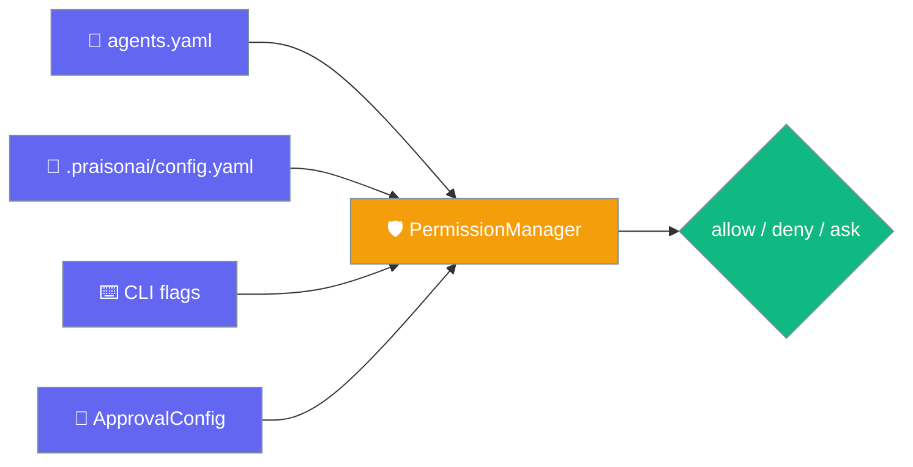
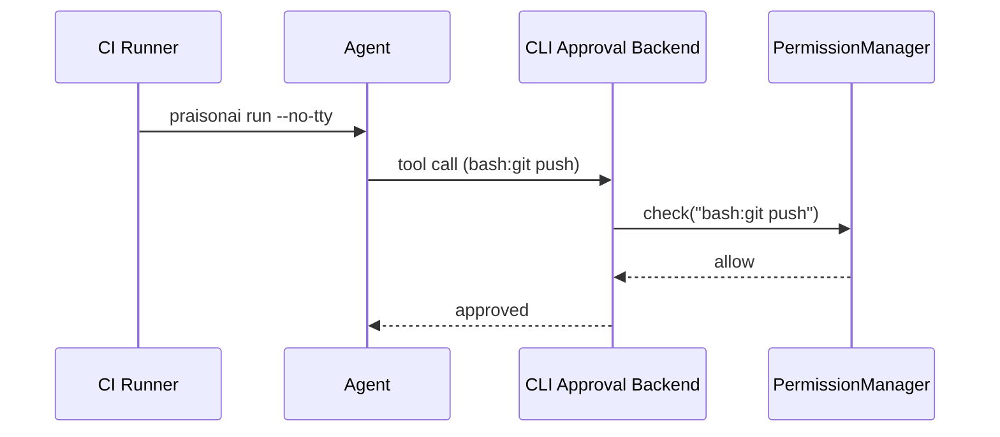

Declarative permissions let you pre-declare which tool calls to allow, deny, or ask about — so unattended CLI/CI runs stay safe without interactive prompts.

<Info>
Since PR #2208, `bash:` / `shell:` rules are matched against every sub-operation in a compound command. See [Command-Aware Permissions](/docs/features/command-aware-permissions).
</Info>



## Quick Start

<Steps>
<Step title="YAML">

```yaml
# agents.yaml
permissions:
  "read:*": allow
  "bash:rm *": deny
  "*": ask

agents:
  assistant:
    role: Assistant
    instructions: Help safely
```

```bash
praisonai run agents.yaml
```

</Step>

<Step title="CLI flags">

```bash
praisonai run "deploy the app" \
  --allow 'read:*' \
  --allow 'bash:git *' \
  --deny 'bash:rm *' \
  --permission-default ask
```

</Step>

<Step title="Python">

```python
from praisonaiagents import Agent

agent = Agent(
    name="CI Worker",
    instructions="Run safely in CI",
    approval={
        "permissions": {
            "read:*": "allow",
            "bash:rm *": "deny",
        },
    },
)
```

</Step>

<Step title="In project config">

Declare rules directly in `.praisonai/config.yaml` — automatically inherited by every `praisonai run` in the directory:

```yaml
# .praisonai/config.yaml
permissions:
  default: ask
  rules:
    - { pattern: "bash:git *", action: allow }
    - { pattern: "bash:rm *",  action: deny }
```

Or use the flat mapping form:

```yaml
# .praisonai/config.yaml
permissions:
  "read:*": allow
  "bash:rm *": deny
  "*": ask
```

</Step>
</Steps>

---

## How It Works



On each tool call, the backend builds a target string (`tool_name:arg`) and `PermissionManager.check()` returns **allow**, **deny**, or **ask**. Non-interactive runs honour declared rules; **ask** without a human present falls back to **deny**.

---

## Pattern Syntax

Patterns use `<tool_name>:<arg-glob>`:

| Pattern | Meaning |
|---|---|
| `read:*` | Any read tool call |
| `bash:git *` | Git shell commands |
| `write:/etc/*` | Writes under `/etc/` (including truncating redirections) |

### Compound shell commands

`bash:` and `shell:` targets are decomposed into their constituent operations — `&&`, `;`, `|`, subshells, `$(...)`, backticks, and truncating redirections. A single `deny` rule fires when the blocked executable appears **anywhere** inside the compound command. For example, `deny: bash:rm *` blocks `cd /tmp && rm -rf x` and `echo $(rm -rf x)`, not just a bare `rm` call.

<Card title="Command-Aware Permissions" icon="shield-halved" href="/docs/features/command-aware-permissions">
  Full behaviour details, evasion table, and aggregation rules
</Card>

Detailed dict form supports `is_regex`, `priority`, `agent_name`, and `description`:

```yaml
permissions:
  "read:*": allow
  "bash:rm *":
    action: deny
    description: Block destructive shell ops
    priority: 100
```

---

## Configuration Surfaces

| Surface | Where | Example |
|---|---|---|
| Per-agent definition | `mode:` / `permission:` in `.praisonai/agents/*.{md,yaml}` | `mode: read-only` |
| Project config | `.praisonai/config.yaml` `permissions:` | `"bash:rm *": deny` |
| YAML | Top-level or per-agent `approval.permissions:` in `agents.yaml` | `"bash:rm *": deny` |
| CLI | `--allow`, `--deny`, `--permissions <file>`, `--permission-default` | `--deny 'bash:rm *'` |
| Python | `ApprovalConfig(permissions={...})` | `{"read:*": "allow"}` |

**Precedence:** agent definition `mode:` / `permission:` → agent-level `approval.permissions` → top-level `agents.yaml` `permissions:` → `.praisonai/config.yaml` `permissions:` → CLI `--allow`/`--deny` (override file) → `--permission-default` → built-in defaults. CLI flags override config-yaml rules per-pattern. See [Agent Presets & Modes](/docs/features/agent-presets-and-modes) for the full per-agent permission reference.

Load from file:

```bash
praisonai run agents.yaml --permissions permissions.yaml --deny 'bash:curl *'
```

---

## Common Patterns

**Read-only CI runner** — `--permission-default deny` with `--allow 'read:*'`.

**Git-only worker** — allow `bash:git *`, deny everything else.

**Deny destructive commands** — baseline `"bash:rm *": deny` and `"write:/etc/*": deny`.

---

## Best Practices

<AccordionGroup>
<Accordion title="Set permission-default deny in CI">
Use `--permission-default deny` or `"*": deny` so undeclared tools are blocked.
</Accordion>

<Accordion title="Prefer specific patterns first">
Higher-priority rules win — declare `bash:git push *` before broad `bash:*`.
</Accordion>

<Accordion title="Version-control policy files">
Keep `permissions.yaml` next to `agents.yaml` in git.
</Accordion>

<Accordion title="Test with --no-tty locally">
Verify rules before deploying to CI.
</Accordion>
</AccordionGroup>

---

## Related

<CardGroup cols={2}>
<Card title="Single-Source Config" icon="gear" href="/docs/features/single-source-config">
  Model + MCP + permissions in one config file
</Card>
<Card title="Command-Aware Permissions" icon="shield-halved" href="/docs/features/command-aware-permissions">
  How compound commands are decomposed and checked
</Card>
<Card title="Permissions" icon="shield" href="/docs/features/permissions">
  Programmatic PermissionManager API
</Card>
<Card title="Approval" icon="check" href="/docs/features/approval">
  Interactive approval backends
</Card>
<Card title="Tool Approval CLI" icon="terminal" href="/docs/cli/tool-approval">
  CLI flags reference
</Card>
</CardGroup>
