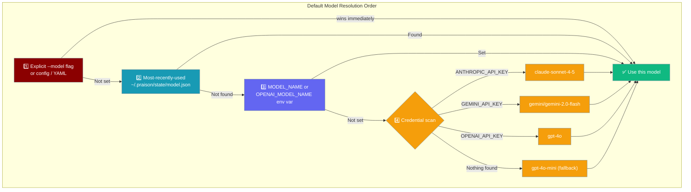

When you don't specify a model, the CLI picks the best one automatically based on which API keys you have. A one-line notice tells you what was chosen and why.

```python
from praisonaiagents import Agent

agent = Agent(
    name="Assistant",
    instructions="Help with tasks",
)

agent.start("Summarise the key points from this week")
```

The user omits `--model`; the CLI picks the best credential-backed model and prints what it chose.




## Quick Start

<Steps>
<Step title="Auto-pick model from credentials">

Set your API key and run any command — no `--model` needed:

```bash
export ANTHROPIC_API_KEY=sk-ant-...
praisonai chat "Tell me a joke"
```

```
No model set; using claude-sonnet-4-5 because ANTHROPIC_API_KEY is present.
```

The one-line notice only appears when a provider-inferred default is used (not when using the MRU or an explicit override).
</Step>

<Step title="Override for a single run">

```bash
praisonai chat --model gpt-4o "Explain quantum entanglement"
```

This model is saved as the most-recently-used and will be the default for the next run.
</Step>

<Step title="Pin the model for the project">

Add a `.praison.json` to your project root:

```json
{
  "model": "anthropic/claude-3-5-sonnet-20241022"
}
```

Every `praisonai` command in this directory now uses this model.
</Step>

<Step title="Check with praisonai doctor">

```bash
praisonai doctor
```

Shows which credentials are present and which model would be selected on the next zero-config run.
</Step>
</Steps>

---

## Resolution Order

| Priority | Source | Persisted as MRU? |
|----------|--------|:-----------------:|
| 1 (highest) | `--model` flag / config / YAML | ✅ Yes |
| 2 | Most-recently-used (`~/.praison/state/model.json`) | — |
| 3 | `MODEL_NAME` or `OPENAI_MODEL_NAME` env var | ✅ Yes |
| 4 | Provider credential probe (ANTHROPIC → GEMINI → OPENAI) | ❌ No |
| 5 (lowest) | `gpt-4o-mini` hard fallback | ❌ No |

Provider-inferred defaults (priority 4) and the `gpt-4o-mini` fallback (priority 5) are **intentionally not persisted** as MRU. Persisting them would let a stale default win over fresh credential-based inference on a later run when your available providers have changed.

---

## MRU State

The most-recently-used model is stored at:

```
~/.praison/state/model.json
```

Content:

```json
{"model": "claude-sonnet-4-5"}
```

To reset it (force credential-based re-inference):

```bash
rm ~/.praison/state/model.json
```

Or simply run with an explicit `--model` — that overwrites the MRU automatically.

---

## Best Practices

<AccordionGroup>
<Accordion title="Pin the model in CI">

Don't rely on auto-selection in automated pipelines. CI environments often have credentials for multiple providers, and the selected model can change if you add or remove a key.

```yaml
- name: Run agent task
  env:
    ANTHROPIC_API_KEY: ${{ secrets.ANTHROPIC_API_KEY }}
    MODEL_NAME: "anthropic/claude-3-5-sonnet-20241022"
  run: praisonai run task.yaml
```
</Accordion>

<Accordion title="Watch the transparency notice in development">

The transparency notice (`No model set; using X because Y is present.`) only fires for provider-inferred defaults. If you see it unexpectedly in a staging environment, your `.praison.json` or `MODEL_NAME` env var may not be set.
</Accordion>

<Accordion title="OPENAI_MODEL_NAME is still honoured">

For backward compatibility, the `OPENAI_MODEL_NAME` environment variable still overrides credential-based inference. If you have a legacy `.env` with this variable, it takes priority over the credential probe.
</Accordion>
</AccordionGroup>

---

## Related

<CardGroup cols={2}>
<Card title="CLI OAuth Login" icon="key" href="/docs/features/cli-oauth-login">
  Sign in to providers using browser-based OAuth
</Card>
<Card title="Models CLI" icon="microchip" href="/docs/features/models-cli">
  List, compare, and switch between available models
</Card>
</CardGroup>
