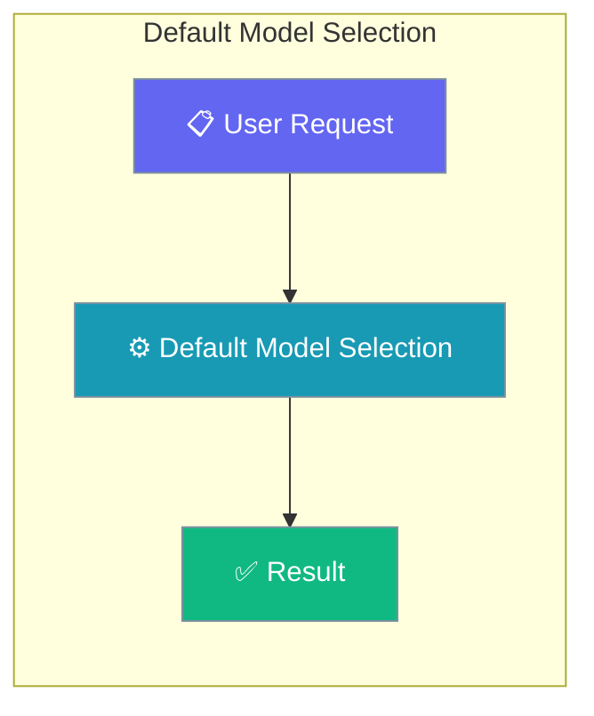
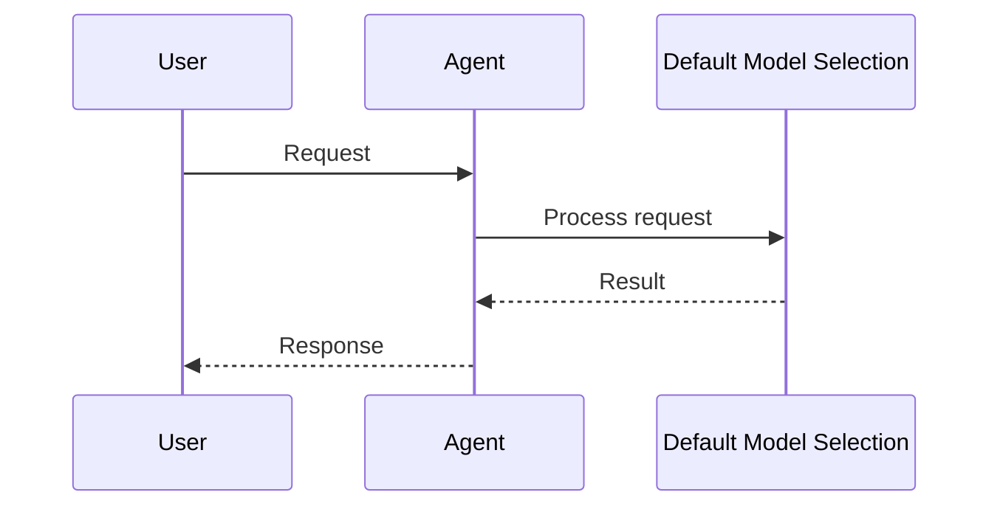
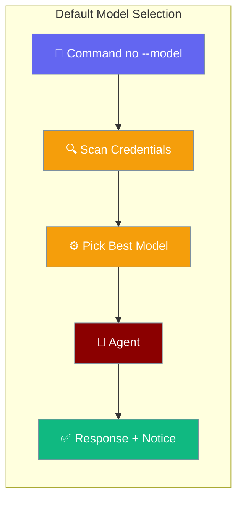
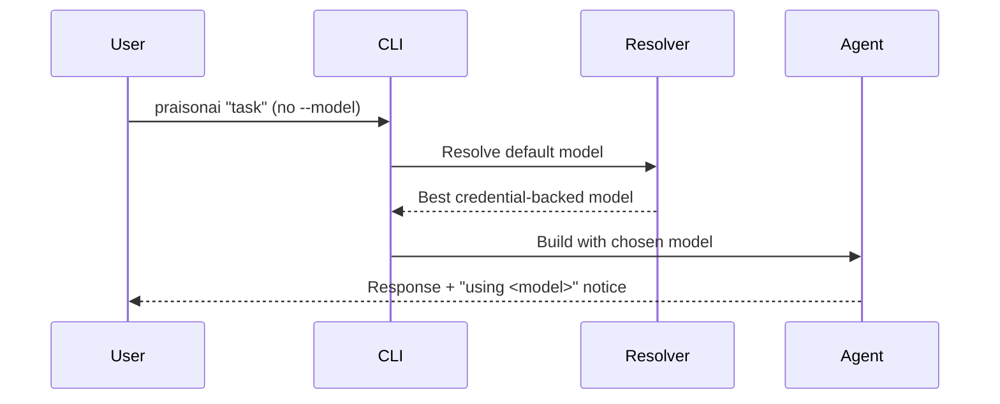
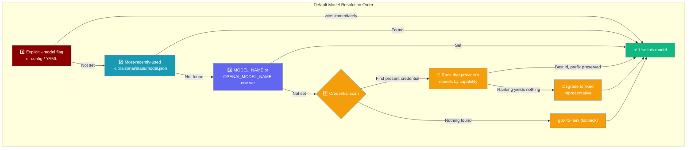
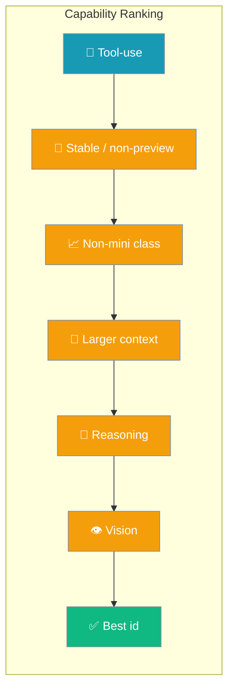

When you don't specify a model, the CLI ranks every model your credential unlocks by capability and picks the best one. A one-line notice tells you what was chosen and why. The same resolver drives the SDK `Agent(llm=None)` path — construct an `Agent` with no `llm=` and it picks from your credentials too.

<Note>
[PR #5412](https://github.com/MervinPraison/PraisonAI/pull/5412) made the credential default **capability-ranked best-available** per provider. A run with only `OPENAI_API_KEY` now lands on `gpt-4o`, not `gpt-4o-mini`. The `provider/` prefix is preserved so routing is unchanged.
</Note>

```python
import os
from praisonaiagents import Agent

os.environ["OPENAI_API_KEY"] = "sk-..."

# No llm= and only OPENAI_API_KEY set — picks the best OpenAI chat model
# available in the catalogue (e.g. gpt-4o), not gpt-4o-mini.
agent = Agent(instructions="Summarise the latest release notes.")
agent.start("Give me the top three changes in the last PR.")
```



```mermaid
graph LR
    subgraph "Default Model Selection"
        Request[📋 User Request] --> Process[⚙️ Default Model Selection]
        Process --> Result[✅ Result]
    end

    classDef input fill:#6366F1,stroke:#7C90A0,color:#fff
    classDef process fill:#189AB4,stroke:#7C90A0,color:#fff
    classDef output fill:#10B981,stroke:#7C90A0,color:#fff

    class Request input
    class Process process
    class Result output
```


```mermaid
sequenceDiagram
    participant User
    participant Agent
    participant Feature as Default Model Selection

    User->>Agent: Request
    Agent->>Feature: Process request
    Feature-->>Agent: Result
    Agent-->>User: Response
```


```python
from praisonaiagents import Agent

agent = Agent(
    name="Assistant",
    instructions="Help with tasks",
)

agent.start("Summarise the key points from this week")
```

The user omits `--model`; the CLI picks the best credential-backed model and prints what it chose.


```mermaid
graph LR
    subgraph "Default Model Selection"
        In[📝 Command no --model] --> Scan[🔍 Scan Credentials]
        Scan --> Pick[⚙️ Pick Best Model]
        Pick --> Agent[🤖 Agent]
        Agent --> Out[✅ Response + Notice]
    end

    classDef input fill:#6366F1,stroke:#7C90A0,color:#fff
    classDef process fill:#F59E0B,stroke:#7C90A0,color:#fff
    classDef agent fill:#8B0000,stroke:#7C90A0,color:#fff
    classDef output fill:#10B981,stroke:#7C90A0,color:#fff

    class In input
    class Scan,Pick process
    class Agent agent
    class Out output
```

## How It Works


```mermaid
sequenceDiagram
    participant User
    participant CLI
    participant Resolver
    participant Agent

    User->>CLI: praisonai "task" (no --model)
    CLI->>Resolver: Resolve default model
    Resolver-->>CLI: Best credential-backed model
    CLI->>Agent: Build with chosen model
    Agent-->>User: Response + "using <model>" notice
```

### Resolution Order


```mermaid
graph TB
    subgraph "Default Model Resolution Order"
        E["1️⃣ Explicit --model flag\nor config / YAML"] -->|"wins immediately"| USE["✅ Use this model"]
        E -->|Not set| R["2️⃣ Most-recently-used\n~/.praisonai/state/model.json"]
        R -->|Found| USE
        R -->|Not found| ENV["3️⃣ MODEL_NAME or\nOPENAI_MODEL_NAME env var"]
        ENV -->|Set| USE
        ENV -->|Not set| CRED{"4️⃣ Credential scan"}
        CRED -->|First present credential| RANK["🏅 Rank that provider's\nmodels by capability"]
        CRED -->|Nothing found| FB["gpt-4o-mini (fallback)"]
        RANK -->|Best id, prefix preserved| USE
        RANK -->|Ranking yields nothing| REP["Degrade to fixed\nrepresentative"]
        REP --> USE
        FB --> USE
    end

    classDef explicit fill:#8B0000,stroke:#7C90A0,color:#fff
    classDef mru fill:#189AB4,stroke:#7C90A0,color:#fff
    classDef env fill:#6366F1,stroke:#7C90A0,color:#fff
    classDef cred fill:#F59E0B,stroke:#7C90A0,color:#fff
    classDef use fill:#10B981,stroke:#7C90A0,color:#fff

    class E explicit
    class R mru
    class ENV env
    class CRED,RANK,REP,FB cred
    class USE use
```

### How the ranking works

When only a credential is set, the CLI ranks every model that credential unlocks by capability (tool-use, context, reasoning, vision) and uses the best-available one — not a fixed cheap default.

- Prefers tool-use (essential for agentic work).
- De-prioritises unstable preview / experimental / dated snapshot / `-auto` ids.
- De-prioritises `-mini` / `nano` / `small` / `lite` / `haiku` / `flash` / `3.5-turbo` class ids.
- Then larger `max_context`, then reasoning, then vision.
- Non-chat ids (embeddings, rerankers, speech, image, moderation, vision-encoder, clip) are excluded from the chat default.
- Google/Gemini aliasing: a `GEMINI_API_KEY`-only run still ranks litellm's `google`-labelled Gemini models (and vice-versa).

The ranking returns a bare id, but the **provider prefix is preserved** — `anthropic/<id>`, `gemini/<id>`, `cohere/<id>`, `openrouter/openai/<id>`, etc. keep their prefix so runtime routing is unchanged. If ranking yields nothing, selection degrades to the historical fixed representative.


```mermaid
graph LR
    subgraph "Capability Ranking"
        T[🔧 Tool-use] --> S[🧱 Stable / non-preview]
        S --> M[📈 Non-mini class]
        M --> C[📐 Larger context]
        C --> R[🧠 Reasoning]
        R --> V[👁️ Vision]
        V --> B[✅ Best id]
    end

    classDef tool fill:#189AB4,stroke:#7C90A0,color:#fff
    classDef filter fill:#F59E0B,stroke:#7C90A0,color:#fff
    classDef best fill:#10B981,stroke:#7C90A0,color:#fff

    class T tool
    class S,M,C,R,V filter
    class B best
```

<Tip>
Keep the catalogue current so a newly released flagship is ranked — run [`praisonai models refresh`](/features/models-cli#praisonai-models-refresh).
</Tip>

## Quick Start

<Steps>
<Step title="Auto-pick model from credentials">

Set your API key and run any command — no `--model` needed:

```bash
export ANTHROPIC_API_KEY=sk-ant-...
praisonai chat "Tell me a joke"
```

```
No model set; using claude-sonnet-4-5 because ANTHROPIC_API_KEY is present.
```

The one-line notice only appears when a provider-inferred default is used (not when using the MRU or an explicit override).
</Step>

<Step title="Override for a single run">

```bash
praisonai chat --model gpt-4o "Explain quantum entanglement"
```

This model is saved as the most-recently-used and will be the default for the next run.
</Step>

<Step title="Pin the model for the project">

Add a `.praison.json` to your project root:

```json
{
  "model": "anthropic/claude-3-5-sonnet-20241022"
}
```

Every `praisonai` command in this directory now uses this model.
</Step>

<Step title="Check with praisonai doctor">

```bash
praisonai doctor
```

Shows which credentials are present and which model would be selected on the next zero-config run.
</Step>
</Steps>

---

## Resolution Order

| Priority | Source | Persisted as MRU? |
|----------|--------|:-----------------:|
| 1 (highest) | `--model` flag / config / YAML | ✅ Yes |
| 2 | Most-recently-used (`~/.praisonai/state/model.json`) | — |
| 3 | `MODEL_NAME` or `OPENAI_MODEL_NAME` env var | ✅ Yes |
| 4 | Provider credential probe — capability-ranked best-available for the first present credential (prefix preserved) | ❌ No |
| 5 (lowest) | `gpt-4o-mini` hard fallback | ❌ No |

Provider-inferred defaults (priority 4) and the `gpt-4o-mini` fallback (priority 5) are **intentionally not persisted** as MRU. Persisting them would let a stale default win over fresh credential-based inference on a later run when your available providers have changed.

---

## MRU State

The most-recently-used model is stored at:

```
~/.praisonai/state/model.json
```

This honours `PRAISONAI_HOME` (`$PRAISONAI_HOME/state/model.json` when set). The legacy `~/.praison/state/model.json` is still read as a fallback.

Content:

```json
{"model": "claude-sonnet-4-5"}
```

To reset it (force credential-based re-inference):

```bash
rm ~/.praisonai/state/model.json
```

Or simply run with an explicit `--model` — that overwrites the MRU automatically.

---

## Best Practices

<AccordionGroup>
<Accordion title="Pin the model in CI">

Don't rely on auto-selection in automated pipelines. CI environments often have credentials for multiple providers, and the selected model can change if you add or remove a key.

```yaml
- name: Run agent task
  env:
    ANTHROPIC_API_KEY: ${{ secrets.ANTHROPIC_API_KEY }}
    MODEL_NAME: "anthropic/claude-3-5-sonnet-20241022"
  run: praisonai run task.yaml
```
</Accordion>

<Accordion title="Watch the transparency notice in development">

The transparency notice (`No model set; using X because Y is present.`) only fires for provider-inferred defaults. If you see it unexpectedly in a staging environment, your `.praison.json` or `MODEL_NAME` env var may not be set.
</Accordion>

<Accordion title="OPENAI_MODEL_NAME is still honoured">

For backward compatibility, the `OPENAI_MODEL_NAME` environment variable still overrides credential-based inference. If you have a legacy `.env` with this variable, it takes priority over the credential probe.
</Accordion>
</AccordionGroup>

---

## Related

<CardGroup cols={2}>
<Card title="CLI OAuth Login" icon="key" href="/features/cli-oauth-login">
  Sign in to providers using browser-based OAuth
</Card>
<Card title="Models CLI" icon="microchip" href="/features/models-cli">
  List, compare, and switch between available models
</Card>
</CardGroup>
