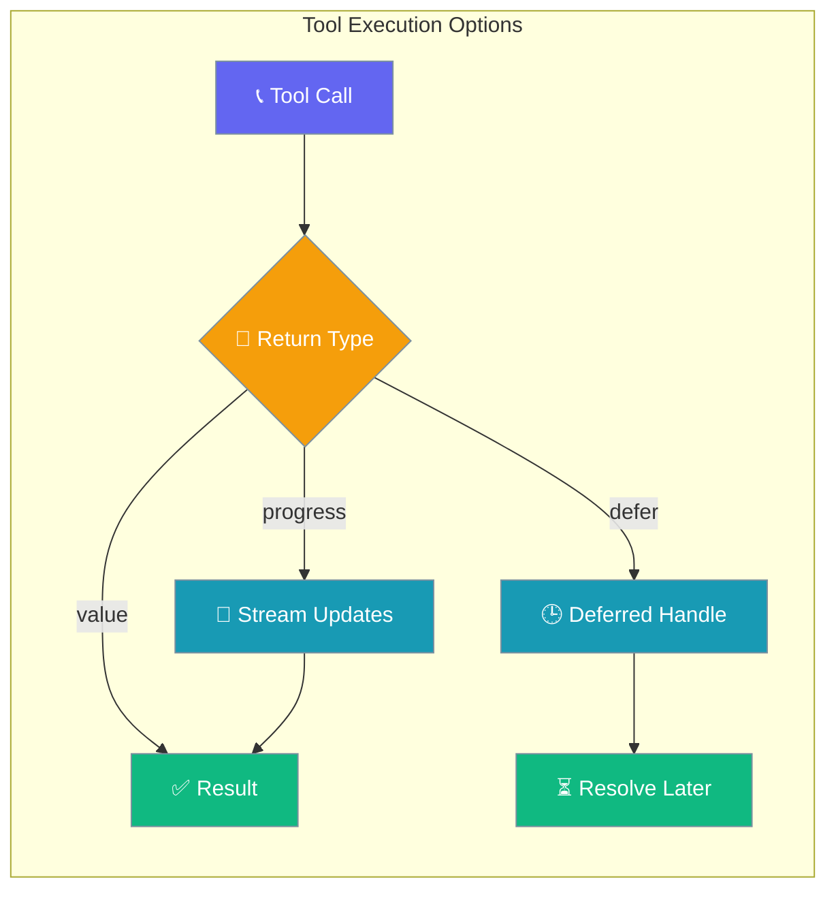
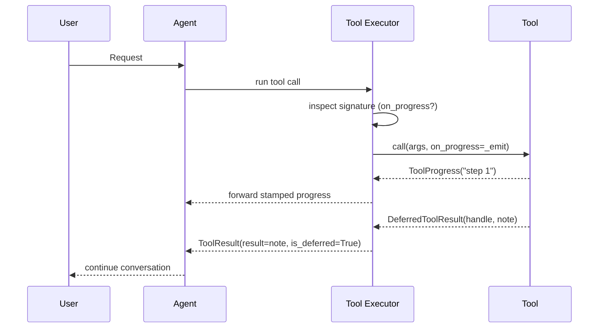
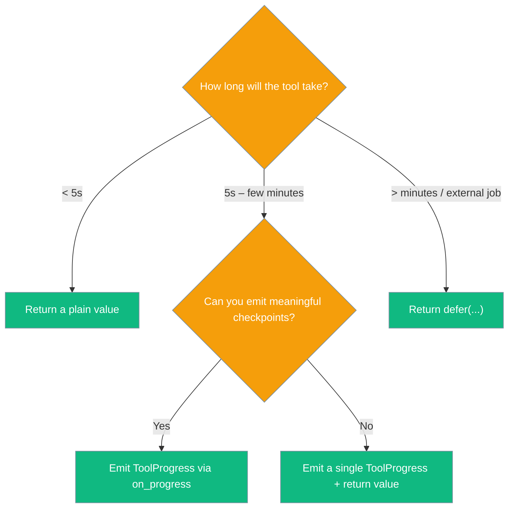

Slow tools can stream progress or hand back a "resolve later" handle so a single long-running call never freezes the whole turn.



## Quick Start

<Steps>
<Step title="Stream progress from a tool">
Add an `on_progress=None` parameter. The executor detects it and wires updates through automatically — no other changes needed.

```python
from praisonaiagents import Agent
from praisonaiagents.tools import ToolProgress

def deep_research(topic: str, on_progress=None) -> str:
    if on_progress:
        on_progress(ToolProgress("searching sources..."))
        on_progress(ToolProgress("summarising..."))
    return f"Report on {topic}"

agent = Agent(
    name="Researcher",
    instructions="Answer research questions.",
    tools=[deep_research],
)
agent.start("Research quantum computing trends")
```
</Step>

<Step title="Defer a long-running job">
Return `defer(...)` and the model sees the `note` immediately — no blocking on a 10-minute render.

```python
from praisonaiagents import Agent
from praisonaiagents.tools import defer, DeferredToolResult

render_queue = {}

def render_video(script: str) -> DeferredToolResult:
    job_id = "job-123"
    render_queue[job_id] = script
    return defer(
        note=f"Started render job {job_id}. I'll post the video when it's ready.",
        handle_id=job_id,
    )

agent = Agent(name="Studio", instructions="Render videos.", tools=[render_video])
agent.start("Render the intro sequence")
```
</Step>
</Steps>

---

## How It Works

The executor inspects each tool's signature, forwards progress it emits, and records a deferred handle without blocking.



| Behaviour | Guarantee |
|-----------|-----------|
| Backward compatible | `on_progress` is only passed to tools whose signature accepts it. |
| Native async | `async def` tools are awaited automatically. |
| Non-blocking defer | A `defer(...)` return surfaces the `note` to the model immediately. |
| Safe channels | A failing `on_progress` callback is swallowed; the tool keeps running. |
| Source stamped | Each `ToolProgress` is tagged with its `tool_call_id` and `function_name`. |

---

## Which return type do I choose?

Pick the simplest option that fits how long your tool runs.



---

## Configuration Options

`ToolProgress` describes a single incremental update a tool emits while working.

| Option | Type | Default | Description |
|--------|------|---------|-------------|
| `text` | `str` | required | Human-readable progress message. |
| `id` | `Optional[str]` | `None` | Stable id so a channel can edit a single draft message. |
| `replace` | `bool` | `True` | If `True`, replaces the prior draft; else appends. |
| `tool_call_id` | `Optional[str]` | `None` | Source tool call id — stamped by the executor. |
| `function_name` | `Optional[str]` | `None` | Source tool name — stamped by the executor. |

`DeferredToolResult` is a handle a tool returns when it kicks off background work.

| Option | Type | Default | Description |
|--------|------|---------|-------------|
| `handle_id` | `str` | required | Identifier for the background job, used to resolve later. |
| `note` | `str` | `"started; will resolve later"` | Message shown to the model now. |

The `defer()` factory builds a `DeferredToolResult`; `handle_id` defaults to a generated `uuid.uuid4().hex` when omitted.

| Option | Type | Default | Description |
|--------|------|---------|-------------|
| `note` | `str` | `"started; will resolve later"` | Message surfaced to the model immediately. |
| `handle_id` | `Optional[str]` | `None` | Job id; auto-generated when omitted. |

The enriched `ToolResult` carries these extra fields alongside `result`.

| Field / property | Type | Description |
|------------------|------|-------------|
| `progress` | `List[ToolProgress]` | All progress updates the tool emitted during this call. |
| `deferred` | `Optional[DeferredToolResult]` | Non-`None` when the tool returned a `defer(...)` handle. |
| `is_deferred` | `bool` | `True` iff `deferred is not None`. |
| `structured_error` | `Optional[Dict]` | `{"error": True, "type": ..., "message": ..., "tool": ...}` on failure, else `None`. |

---

## Common Patterns

### Async tool with progress

An `async def` tool is awaited natively — no `asyncio.run` wrapper needed.

```python
import asyncio
from praisonaiagents import Agent
from praisonaiagents.tools import ToolProgress

async def deep_research(topic: str, on_progress=None) -> str:
    if on_progress:
        on_progress(ToolProgress("searching..."))
    await asyncio.sleep(0)
    if on_progress:
        on_progress(ToolProgress("summarising..."))
    return f"Report on {topic}"

agent = Agent(name="Researcher", instructions="Research topics.", tools=[deep_research])
agent.start("Research battery chemistry breakthroughs")
```

### Deferred job resolved by handle

Return `defer(...)` now, then resolve the job later by its `handle_id`.

```python
from praisonaiagents import Agent
from praisonaiagents.tools import defer, DeferredToolResult

jobs = {}

def enqueue_report(topic: str) -> DeferredToolResult:
    handle = defer(note=f"Building report on {topic}.", handle_id=f"report-{topic}")
    jobs[handle.handle_id] = {"topic": topic, "status": "running"}
    return handle

def resolve_report(handle_id: str, content: str) -> None:
    jobs[handle_id] = {"status": "done", "content": content}

agent = Agent(name="Analyst", instructions="Build reports.", tools=[enqueue_report])
agent.start("Build a market report on EVs")
```

### Structured error inspection

Read `structured_error` to get the error type and message instead of a flattened string.

```python
from praisonaiagents.tools.call_executor import (
    ToolCall,
    SequentialToolCallExecutor,
)

def execute(name, args, cid):
    raise ValueError("boom")

result = SequentialToolCallExecutor().execute_batch(
    [ToolCall(function_name="risky", arguments={}, tool_call_id="id-1")],
    execute,
)[0]

print(result.structured_error)
# {"error": True, "type": "ValueError", "message": "boom", "tool": "risky"}
```

---

## Best Practices

<AccordionGroup>
  <Accordion title="Backward compatible by default">
    Tools without an `on_progress` parameter are called the old way. No change is needed unless you want progress — the executor auto-detects the parameter via `inspect.signature`.
  </Accordion>
  <Accordion title="Never let the UI break your tool">
    The executor swallows exceptions raised by an `on_progress` callback and keeps the tool running. A broken UI channel never kills a tool call.
  </Accordion>
  <Accordion title="Stamp your own source only when proxying">
    The executor stamps `tool_call_id` and `function_name` automatically. Only set them yourself when you relay updates from another tool.
  </Accordion>
  <Accordion title="Prefer defer() over blocking on external systems">
    Job queues, video renders, and batch pipelines belong behind a `defer()` handle so the turn continues while the work runs.
  </Accordion>
</AccordionGroup>

---

## Related

<CardGroup cols={2}>
  <Card title="Tool Progress Streaming" icon="gauge" href="/docs/features/tool-progress-streaming">
    Event/sink-based progress via `emit_tool_progress()`
  </Card>
  <Card title="Async Tool Safety" icon="rotate" href="/docs/features/async-tool-safety">
    Rules for async tools inside sync flows
  </Card>
  <Card title="Structured LLM Errors" icon="triangle-exclamation" href="/docs/features/structured-llm-errors">
    How structured errors surface to the model
  </Card>
  <Card title="Custom Tools" icon="wrench" href="/docs/tools/custom">
    Building your own tools
  </Card>
</CardGroup>
